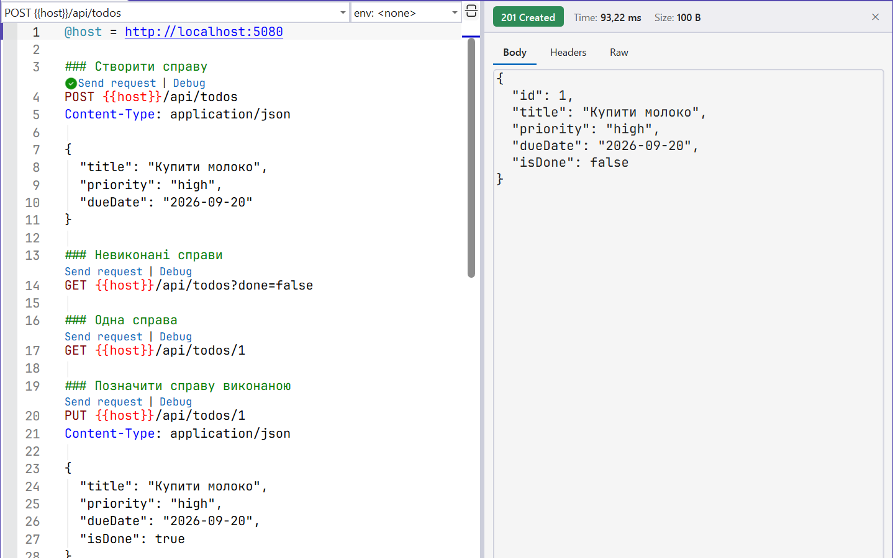

# Документування та база даних

## Документування і тестування

### Документ OpenAPI

**OpenAPI** – стандартний машиночитаний опис HTTP API: адреси, методи, параметри, схеми JSON і коди відповідей. За ним інструменти генерують клієнтів, документацію і тести. Пакет `Microsoft.AspNetCore.OpenApi` будує документ автоматично з кінцевих точок (<https://learn.microsoft.com/aspnet/core/fundamentals/openapi/overview>): `AddOpenApi()` реєструє генератор, а `MapOpenApi()` публікує документ за адресою `/openapi/v1.json`. У .NET 10 документ відповідає OpenAPI 3.1. Шаблон публікує його лише в середовищі Development, щоб не розкривати структуру API на робочому сервері.

Опис доповнюють методи кінцевих точок: `WithSummary("…")`, `WithDescription("…")`, `WithTags("…")`, `WithName("…")` (ім’я операції), `Produces<T>(statusCode)` для результатів, які не видно з типу обробника. Атрибути валідації теж потрапляють у схему: `[Range(1, 50)]` перетворюється на `minimum` і `maximum`.

### Файли `.http` у Visual Studio

Надіслати запит з Visual Studio 2026 можна без сторонніх програм: редактор файлів **`.http`** показує над кожним запитом посилання *Send request*, а відповідь – код стану, заголовки і відформатований JSON – у панелі праворуч (рис. 10.6, <https://learn.microsoft.com/aspnet/core/test/http-files>). Синтаксис файлу:

- `@host = http://localhost:5080` – змінна, використання – <code v-pre>&#123;&#123;host}}</code>;
- рядок `###` розділяє запити, текст після `###` або `#` – коментар;
- перший рядок запиту – метод і адреса, далі без порожніх рядків – заголовки;
- після порожнього рядка – тіло запиту.

Фрагмент файлу `TodoApi.http` (повний файл містить також запити `GET`, `PUT` і `DELETE` до однієї справи та помилковий `POST`):

```
@host = http://localhost:5080

### Створити справу
POST {{host}}/api/todos
Content-Type: application/json

{
  "title": "Купити молоко",
  "priority": "high",
  "dueDate": "2026-09-20"
}

### Невиконані справи
GET {{host}}/api/todos?done=false
```



Рис. 10.6. Запити з файлу `TodoApi.http` і панель відповіді {.caption}

Вікно *View → Other Windows → Endpoints Explorer* показує всі кінцеві точки проєкту з методами HTTP. Команда контекстного меню *Generate Request* додає до файлу `.http` шаблон запиту до вибраної точки. Змінні для різних середовищ (локальний комп’ютер, тестовий сервер) виносять у файл `http-client.env.json`, а секрети – у файл `http-client.env.json.user`, який не додають до Git.

::: tip Інтерактивна документація
Пакет `Microsoft.AspNetCore.OpenApi` не має вбудованої вебсторінки для перегляду документа. Її дають сторонні пакети, наприклад `Scalar.AspNetCore` (<https://www.nuget.org/packages/Scalar.AspNetCore>): після виклику `app.MapScalarApiReference()` поруч із `MapOpenApi()` сторінка `/scalar` показує опис усіх кінцевих точок і дозволяє надсилати запити з браузера. У цьому курсі основним засобом тестування залишаються файли `.http`.
:::

## Підключення бази даних через EF Core

Дані в пам’яті зникають після перезапуску, тому робочий сервіс зберігає їх у базі даних. Сховище на EF Core (тема 8) з PostgreSQL реалізує той самий інтерфейс `ITodoRepository`. До проєкту додають пакети `Npgsql.EntityFrameworkCore.PostgreSQL` (<https://www.npgsql.org/efcore/>) і `Microsoft.EntityFrameworkCore.Design` (інструменти міграцій). Контекст бази даних (файл `TodoDbContext.cs`) описує таблицю справ; пріоритет зберігається рядком:

```cs
using Microsoft.EntityFrameworkCore;

namespace TodoApi;

public class TodoDbContext(DbContextOptions<TodoDbContext> options)
    : DbContext(options)
{
    public DbSet<TodoItem> Todos => Set<TodoItem>();

    protected override void OnModelCreating(ModelBuilder model) =>
        model.Entity<TodoItem>(todo =>
        {
            todo.Property(t => t.Title).HasMaxLength(100);
            todo.Property(t => t.Priority).HasConversion<string>();
        });
}
```

Сховище перекладає операції на запити LINQ to Entities. Фільтр, `Skip` і `Take` виконуються в базі даних (SQL `WHERE`, `OFFSET`, `LIMIT`), а не в пам’яті сервера, а запити лише на читання не відстежуються (`AsNoTracking`):

```cs
using Microsoft.EntityFrameworkCore;

namespace TodoApi;

// Та сама абстракція ITodoRepository, але дані – у PostgreSQL.
public class EfTodoRepository(TodoDbContext db) : ITodoRepository
{
    public async Task<PagedResult<TodoItem>> GetPageAsync(
        bool? done, int page, int pageSize)
    {
        IQueryable<TodoItem> query = db.Todos.AsNoTracking();
        if (done != null)
            query = query.Where(t => t.IsDone == done);
        int total = await query.CountAsync();
        List<TodoItem> items = await query
            .OrderBy(t => t.Id)
            .Skip((page - 1) * pageSize)
            .Take(pageSize)
            .ToListAsync();
        return new PagedResult<TodoItem>(
            items, page, pageSize, total);
    }

    public Task<TodoItem?> FindAsync(int id) =>
        db.Todos.AsNoTracking().FirstOrDefaultAsync(t => t.Id == id);

    public async Task<TodoItem> AddAsync(TodoItem item)
    {
        db.Todos.Add(item);
        await db.SaveChangesAsync();     // INSERT, Id від бази
        return item;
    }
```

Методи `UpdateAsync` і `DeleteAsync` змінюють і видаляють рядок одним SQL-запитом без попереднього читання: `db.Todos.Where(t => t.Id == item.Id).ExecuteUpdateAsync(s => s .SetProperty(t => t.Title, item.Title)…)` і `…ExecuteDeleteAsync()`; обидва повертають кількість змінених рядків, тож 0 означає «не знайдено».

У `Program.cs` змінюються лише реєстрації сервісів. Контекст `DbContext` не є потокобезпечним, тому `AddDbContext` реєструє його з часом життя **Scoped** – окремий об’єкт на кожен запит; сховище, яке його використовує, теж має бути Scoped:

```cs
builder.Services.AddDbContext<TodoDbContext>(options =>
    options.UseNpgsql(
        builder.Configuration.GetConnectionString("Todos")));
builder.Services.AddScoped<ITodoRepository, EfTodoRepository>();
```

Рядок підключення не записують у код. Для розробки його зберігають у секретах користувача (<https://learn.microsoft.com/aspnet/core/security/app-secrets>), на сервері – у змінній середовища `ConnectionStrings__Todos`. Потім (після `dotnet user-secrets init` і встановлення інструмента `dotnet tool install --global dotnet-ef`) створюють і застосовують міграцію:

```powershell
$cs = "Host=localhost;Port=5432;Database=todos;" +
      "Username=postgres;Password=<пароль>"
dotnet user-secrets set "ConnectionStrings:Todos" $cs
dotnet ef migrations add InitialCreate
dotnet ef database update
```

Міграція створює таблицю `Todos` зі стовпцями `Id` (`integer`, автоінкремент), `Title` (`character varying(100)`), `Priority` (`text`), `DueDate` (`date`) і `IsDone` (`boolean`). Після `dotnet ef database update` запити з файлу `TodoApi.http` повертають ті самі відповіді, що й раніше, але дані зберігаються після перезапуску сервісу.
