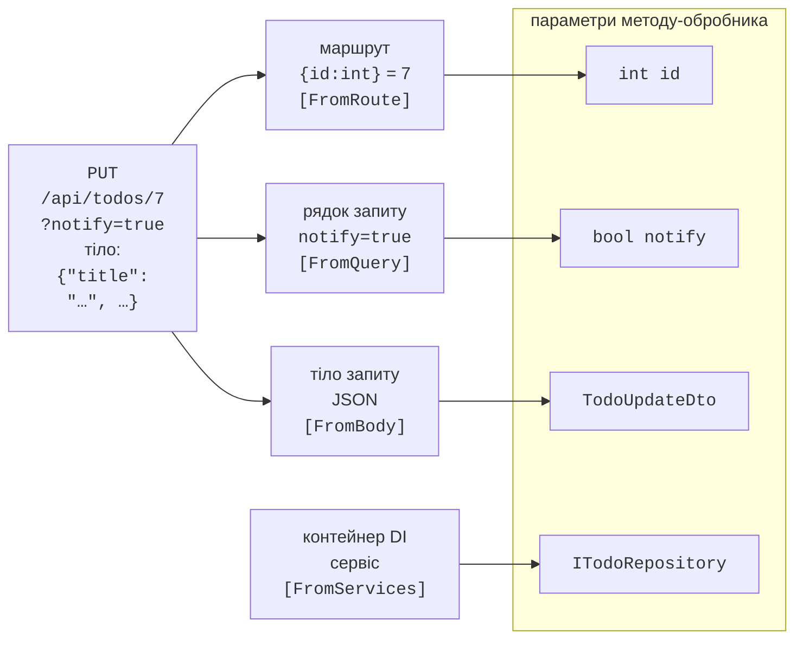

# Маршрути, результати та валідація

## Кінцеві точки та маршрути

**Кінцева точка** (*endpoint*) – поєднання методу HTTP, **шаблону маршруту** і **обробника** – делегата або методу, який виконується для запиту (<https://learn.microsoft.com/aspnet/core/fundamentals/minimal-apis/route-handlers>):

```cs
app.MapGet("/api/hello/{name}", (string name) => $"Привіт, {name}!");
```

Методи `MapGet`, `MapPost`, `MapPut`, `MapPatch`, `MapDelete` реєструють кінцеві точки для відповідних методів HTTP. У шаблоні маршруту фігурні дужки позначають **параметр**, а після двокрапки – **обмеження** (*constraint*):

- `{id:int}` – лише ціле число; для `/api/todos/abc` маршрут не збігається, і клієнт отримує 404, а не помилку перетворення;
- `{id:int:min(1)}`, `{code:length(3)}`, `{date:datetime}`, `{slug:regex(^[a-z-]+$)}` – інші обмеження; кілька обмежень записують через двокрапку;
- `{page?}` – необов’язковий параметр, `{**path}` – решта адреси.

### Групи маршрутів

Кінцеві точки одного ресурсу мають спільний префікс і часто спільні налаштування. Метод **`MapGroup`** створює **групу маршрутів**: її префікс додається до всіх точок групи, а виклики `WithTags` (розділ документації), `RequireAuthorization` або `AddEndpointFilter` застосовуються до кожної з них (див. метод `MapTodoEndpoints` у прикладі «Список справ»).

### Прив’язка параметрів

Параметри обробника ASP.NET Core заповнює автоматично: це **прив’язка параметрів** (*parameter binding*) (рис. 10.5, <https://learn.microsoft.com/aspnet/core/fundamentals/minimal-apis/parameter-binding>). Якщо ім’я збігається з параметром маршруту, значення береться з маршруту; простий тип (`int`, `bool`, `string`, `DateOnly`, перелічення) – з рядка запиту; тип, зареєстрований у контейнері DI, – із сервісів; складний тип (клас, запис) – з тіла JSON (тіло в запиті лише одне); `HttpContext`, `CancellationToken` – спеціальні об’єкти поточного запиту. Джерело можна вказати явно атрибутами `[FromRoute]`, `[FromQuery]`, `[FromHeader]`, `[FromBody]`, `[FromServices]`. Параметр із типом, що допускає `null`, або зі значенням за замовчуванням є необов’язковим; якщо обов’язкового параметра немає, сервіс повертає 400.



Рис. 10.5. Джерела значень параметрів обробника {.caption}

## Результати, валідація та помилки

### `Results` і `TypedResults`

Обробник може повернути будь-який об’єкт – його буде серіалізовано в JSON з кодом 200. Щоб керувати кодом стану, повертають **результат** `IResult` (<https://learn.microsoft.com/aspnet/core/fundamentals/minimal-apis/responses>). Фабрики `Results` і `TypedResults` мають однакові методи: `Ok(value)`, `Created(uri, value)`, `NoContent()`, `BadRequest()`, `NotFound()`, `Conflict()`, `ValidationProblem(errors)`, `Problem(detail, statusCode: …)`.

Різниця в типі: `Results.Ok(x)` повертає `IResult`, а `TypedResults.Ok(x)` – конкретний тип `Ok<TodoItem>`. Конкретні типи перевіряє компілятор, і їх бачить генератор OpenAPI, тому документ описує всі можливі відповіді без додаткових атрибутів. Якщо обробник повертає результати різних типів, тип повернення записують як об’єднання **`Results<…>`**, наприклад `Results<Ok<TodoItem>, NotFound>` (метод `GetById` у прикладі).

### Валідація

До .NET 10 перевірку вхідних даних у Minimal API писали вручну або бібліотеками. Тепер вона вбудована (<https://learn.microsoft.com/aspnet/core/release-notes/aspnetcore-10.0>): достатньо викликати `builder.Services.AddValidation()` і позначити властивості DTO та параметри атрибутами з простору імен `System.ComponentModel.DataAnnotations`: `[Required]`, `[StringLength]`, `[MaxLength]`, `[Range]`, `[EmailAddress]`, `[RegularExpression]`. Перевірка виконується **до** обробника для параметрів із маршруту, рядка запиту, заголовків і тіла; у разі помилки обробник не викликається, а клієнт отримує 400 зі списком помилок. Складні правила задають власним атрибутом-нащадком `ValidationAttribute` або інтерфейсом `IValidatableObject`, а метод `DisableValidation()` вимикає перевірку для окремої кінцевої точки.

**DTO** (*Data Transfer Object*) – окремий тип для даних, якими сервіс обмінюється з клієнтом. Клієнт не повинен надсилати `Id` чи службові поля сутності, тому для створення використовують `TodoCreateDto`, а не `TodoItem`. DTO також захищає від зміни формату API, коли змінюється модель бази даних.

### `ProblemDetails` і обробка винятків

Помилки вебсервіс повертає в стандартному форматі **Problem Details** (RFC 9457, <https://www.rfc-editor.org/rfc/rfc9457>): JSON із полями `type`, `title`, `status`, `detail` і, для валідації, `errors`; тип вмісту `application/problem+json`. Щоб сервіс завжди відповідав у цьому форматі, потрібні три виклики (<https://learn.microsoft.com/aspnet/core/fundamentals/error-handling-api>):

- `builder.Services.AddProblemDetails()` – реєструє службу, яка створює тіло помилки;
- `app.UseExceptionHandler()` – перехоплює необроблений виняток, записує його в журнал і повертає 500 без стека викликів (деталі реалізації не потрапляють до клієнта);
- `app.UseStatusCodePages()` – додає тіло до порожніх відповідей 404, 405.

У середовищі Development некоректний JSON у тілі запиту спричиняє виняток `BadHttpRequestException`, і без додаткового налаштування клієнт отримав би 500. Властивість `StatusCodeSelector` обробника винятків повертає для нього код 400 з самого винятку (див. приклад).

### Приклад «Список справ»

Вебсервіс зберігає справи в пам’яті й реалізує кінцеві точки з табл. 10.3. Список підтримує фільтр виконаних справ і сторінки. Проєкт створено шаблоном *ASP.NET Core Web API*; файл `Todo.cs` містить сутність і DTO:

```cs
using System.ComponentModel.DataAnnotations;

namespace TodoApi;

public enum Priority { Low, Normal, High }

// Сутність, яку зберігає сховище.
public class TodoItem
{
    public int Id { get; set; }
    public string Title { get; set; } = "";
    public Priority Priority { get; set; }
    public DateOnly? DueDate { get; set; }
    public bool IsDone { get; set; }
}

// DTO: що клієнт надсилає під час створення справи.
public record TodoCreateDto(
    [Required, StringLength(100, MinimumLength = 3,
        ErrorMessage = "Назва має містити від 3 до 100 символів.")]
    string Title,
    Priority Priority = Priority.Normal,
    DateOnly? DueDate = null);

// DTO для повної заміни справи (PUT).
public record TodoUpdateDto(
    [Required, StringLength(100, MinimumLength = 3,
        ErrorMessage = "Назва має містити від 3 до 100 символів.")]
    string Title,
    Priority Priority,
    DateOnly? DueDate,
    bool IsDone);

public record PagedResult<T>(IReadOnlyList<T> Items,
    int Page, int PageSize, int TotalCount);
```

Сховище описано інтерфейсом `ITodoRepository` (файл `TodoRepository.cs`). Кінцеві точки залежать лише від інтерфейсу, тому реалізацію в пам’яті пізніше замінено на EF Core без змін в обробниках. Методи асинхронні, бо робота з базою даних асинхронна:

```cs
namespace TodoApi;

public interface ITodoRepository
{
    Task<PagedResult<TodoItem>> GetPageAsync(bool? done,
        int page, int pageSize);
    Task<TodoItem?> FindAsync(int id);
    Task<TodoItem> AddAsync(TodoItem item);
    Task<bool> UpdateAsync(TodoItem item);
    Task<bool> DeleteAsync(int id);
}
```

Сховище в пам’яті реєструється як **Singleton** (один об’єкт на весь застосунок), а Kestrel обробляє запити паралельно в різних потоках. Тому кожен доступ до списку захищено блокуванням `lock` об’єкта типу `Lock` (тема 5):

```cs
// Дані в пам’яті процесу: зникають після перезапуску.
public class InMemoryTodoRepository : ITodoRepository
{
    private readonly List<TodoItem> items = [];
    private readonly Lock sync = new();   // запити паралельні
    private int nextId = 1;

    public Task<PagedResult<TodoItem>> GetPageAsync(bool? done,
        int page, int pageSize)
    {
        lock (sync)
        {
            var filtered = items
                .Where(t => done == null || t.IsDone == done)
                .ToList();
            var slice = filtered.Skip((page - 1) * pageSize)
                .Take(pageSize).ToList();
            return Task.FromResult(new PagedResult<TodoItem>(
                slice, page, pageSize, filtered.Count));
        }
    }

    public Task<TodoItem?> FindAsync(int id)
    {
        lock (sync)
            return Task.FromResult(items.Find(t => t.Id == id));
    }

    public Task<TodoItem> AddAsync(TodoItem item)
    {
        lock (sync) { item.Id = nextId++; items.Add(item); }
        return Task.FromResult(item);
    }

    public Task<bool> UpdateAsync(TodoItem item)
    {
        lock (sync)
        {
            int i = items.FindIndex(t => t.Id == item.Id);
            if (i >= 0) items[i] = item;
            return Task.FromResult(i >= 0);
        }
    }

    public Task<bool> DeleteAsync(int id)
    {
        lock (sync)
            return Task.FromResult(
                items.RemoveAll(t => t.Id == id) > 0);
    }
}
```

Кінцеві точки зібрано в методі розширення `MapTodoEndpoints` (файл `TodoEndpoints.cs`). Параметри сторінки перевіряються атрибутами `[Range]` прямо в сигнатурі обробника:

```cs
using System.ComponentModel.DataAnnotations;
using Microsoft.AspNetCore.Http.HttpResults;

namespace TodoApi;

public static class TodoEndpoints
{
    public static RouteGroupBuilder MapTodoEndpoints(
        this IEndpointRouteBuilder app)
    {
        var group = app.MapGroup("/api/todos").WithTags("Todos");
        group.MapGet("/", GetAll);
        group.MapGet("/{id:int}", GetById).WithName("GetTodo");
        group.MapPost("/", Create);
        group.MapPut("/{id:int}", Update);
        group.MapDelete("/{id:int}", Delete);
        return group;
    }

    // GET /api/todos?done=false&page=1&pageSize=10
    static async Task<Ok<PagedResult<TodoItem>>> GetAll(
        ITodoRepository repo, bool? done = null,
        [Range(1, 1000)] int page = 1,
        [Range(1, 50)] int pageSize = 10) =>
        TypedResults.Ok(
            await repo.GetPageAsync(done, page, pageSize));

    static async Task<Results<Ok<TodoItem>, NotFound>> GetById(
        int id, ITodoRepository repo) =>
        await repo.FindAsync(id) is { } item
            ? TypedResults.Ok(item)
            : TypedResults.NotFound();

    static async Task<Created<TodoItem>> Create(
        TodoCreateDto dto, ITodoRepository repo)
    {
        var item = await repo.AddAsync(new TodoItem
        {
            Title = dto.Title.Trim(),
            Priority = dto.Priority,
            DueDate = dto.DueDate
        });
        return TypedResults.Created($"/api/todos/{item.Id}", item);
    }

    static async Task<Results<NoContent, NotFound>> Update(
        int id, TodoUpdateDto dto, ITodoRepository repo)
    {
        var item = new TodoItem
        {
            Id = id, Title = dto.Title.Trim(),
            Priority = dto.Priority, DueDate = dto.DueDate,
            IsDone = dto.IsDone
        };
        return await repo.UpdateAsync(item)
            ? TypedResults.NoContent()
            : TypedResults.NotFound();
    }

    static async Task<Results<NoContent, NotFound>> Delete(
        int id, ITodoRepository repo) =>
        await repo.DeleteAsync(id)
            ? TypedResults.NoContent()
            : TypedResults.NotFound();
}
```

`TypedResults.Created` повертає код 201, заголовок `Location` з адресою нової справи і саму справу в тілі. Файл `Program.cs` реєструє сервіси й налаштовує конвеєр:

```cs
using System.Text.Json;
using System.Text.Json.Serialization;
using TodoApi;

var builder = WebApplication.CreateBuilder(args);

builder.Services.AddOpenApi();
builder.Services.AddProblemDetails();   // помилки за RFC 9457
builder.Services.AddValidation();       // перевірка DTO (.NET 10)
builder.Services.ConfigureHttpJsonOptions(options =>
    options.SerializerOptions.Converters.Add(   // "high", а не 2
        new JsonStringEnumConverter(JsonNamingPolicy.CamelCase)));
builder.Services.AddSingleton<ITodoRepository,
    InMemoryTodoRepository>();

var app = builder.Build();

app.UseExceptionHandler(new ExceptionHandlerOptions
{
    // Некоректний JSON у тілі – 400, решта винятків – 500.
    StatusCodeSelector = ex => ex is BadHttpRequestException bad
        ? bad.StatusCode : StatusCodes.Status500InternalServerError
});
app.UseStatusCodePages();     // порожні 404, 405 -> ProblemDetails
if (app.Environment.IsDevelopment())
{
    app.MapOpenApi();         // документ /openapi/v1.json
}
app.UseHttpsRedirection();

app.MapTodoEndpoints();
app.Run();
```

Після запуску (**Ctrl+F5** або `dotnet run`) сервіс слухає адресу з `launchSettings.json`. Відповіді на запити з файлу `TodoApi.http` (наступний розділ) наведено нижче; тіла JSON відформатовано для читання, сервіс записує їх одним рядком.

```
POST /api/todos  {"title":"Купити молоко","priority":"high",
                  "dueDate":"2026-09-20"}

HTTP/1.1 201 Created
Content-Type: application/json; charset=utf-8
Location: /api/todos/1

{
  "id": 1,
  "title": "Купити молоко",
  "priority": "high",
  "dueDate": "2026-09-20",
  "isDone": false
}
```

```
POST /api/todos  { "title": "Ок" }

HTTP/1.1 400 Bad Request
Content-Type: application/problem+json

{
  "type": "https://tools.ietf.org/html/rfc9110#section-15.5.1",
  "title": "One or more validation errors occurred.",
  "status": 400,
  "errors": {
    "Title": [
      "Назва має містити від 3 до 100 символів."
    ]
  },
  "traceId": "00-4eea5e7d413a9f7a81ebc71892a13548-ebd2ed03168fca2f-00"
}
```

Після створення другої справи і `PUT`, який позначив першу виконаною, запит `GET /api/todos?done=false` повертає сторінку з однією справою (`"id": 2`) і `"totalCount": 1`. Запит до неіснуючої справи повертає 404 з тілом `ProblemDetails`, `PATCH /api/todos/1` – 405 із заголовком `Allow: DELETE, GET, PUT`, а `GET /api/todos?pageSize=100` – 400 з помилкою `"pageSize"`. Поле `traceId` пов’язує відповідь із записом у журналі сервера.
