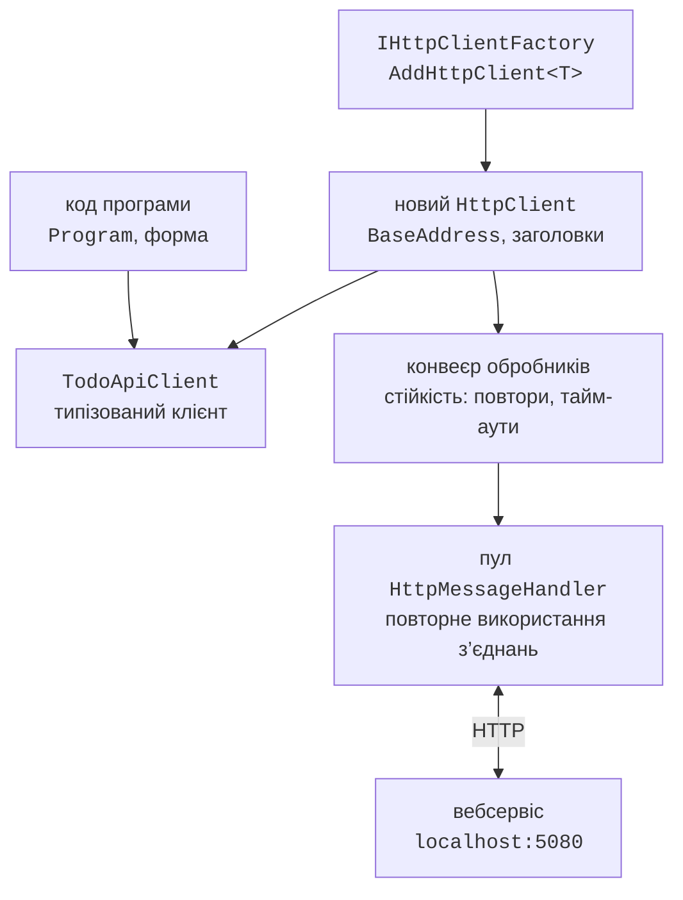

# Клієнт HttpClient і безпека

## Клієнт `HttpClient`

Програма на C# звертається до вебсервісу класом **`HttpClient`** (<https://learn.microsoft.com/dotnet/fundamentals/networking/http/httpclient>). Його основні члени:

- `BaseAddress` – базова адреса; відносні адреси запитів доповнюються нею (адреса має закінчуватися «/»);
- `GetAsync`, `PostAsync`, `PutAsync`, `PatchAsync`, `DeleteAsync`, `SendAsync` – надсилають запит і повертають `HttpResponseMessage` з `StatusCode`, `Headers` і `Content`;
- `Timeout` – тайм-аут запиту (за замовчуванням 100 с); після нього виникає `TaskCanceledException`;
- `DefaultRequestHeaders` – заголовки для всіх запитів.

Методи розширення з простору імен `System.Net.Http.Json` поєднують запит і JSON (<https://learn.microsoft.com/dotnet/api/system.net.http.json.httpclientjsonextensions>): `GetFromJsonAsync<T>` надсилає `GET` і десеріалізує тіло, `PostAsJsonAsync` і `PutAsJsonAsync` серіалізують об’єкт у тіло, а `response.Content.ReadFromJsonAsync<T>` читає тіло відповіді. Вони використовують веб-налаштування JSON (camelCase).

### Обробка помилок

Мережевий виклик може завершитися невдало на кількох рівнях. Якщо сервер недоступний, виникає `HttpRequestException`; тайм-аут спричиняє `TaskCanceledException`, а скасування маркером `CancellationToken` – `OperationCanceledException`. Якщо ж сервер відповів кодом 4xx або 5xx, виняток **не** виникає: потрібно перевірити `response.IsSuccessStatusCode` або викликати `EnsureSuccessStatusCode()` (`GetFromJsonAsync` викликає його сам). Код 404 часто є очікуваним результатом «не знайдено», а для 400 варто прочитати тіло `ProblemDetails` і показати користувачу список помилок. У застосунку з інтерфейсом методи викликають через `await` (тема 5), щоб вікно не «зависало».

### `IHttpClientFactory` і типізовані клієнти

`HttpClient` призначений для **багаторазового** використання. Якщо створювати і звільняти його на кожен запит, операційна система не встигає закривати з’єднання, і під навантаженням вичерпуються сокети. Один статичний `HttpClient` на всю програму розв’язує цю проблему, але не помічає зміни DNS. Рекомендований спосіб у застосунках із DI – **фабрика** `IHttpClientFactory` (<https://learn.microsoft.com/dotnet/core/extensions/httpclient-factory>): вона видає нові легкі об’єкти `HttpClient`, а дорогі обробники з’єднань `HttpMessageHandler` зберігає в пулі й періодично оновлює (рис. 10.7).



Рис. 10.7. Типізований клієнт і `IHttpClientFactory` {.caption}

**Типізований клієнт** (*typed client*) – звичайний клас, який отримує `HttpClient` у конструкторі та надає методи предметної області (`CreateAsync`, `GetPageAsync`) замість адрес і JSON. Його реєструють методом `AddHttpClient<TodoApiClient>(…)` пакета `Microsoft.Extensions.Http`. До реєстрації можна додати **стійкість** (*resilience*): метод `AddStandardResilienceHandler()` пакета `Microsoft.Extensions.Http.Resilience` повторює запити після тимчасових збоїв (5xx, 408, 429, розрив з’єднання) з наростаючою затримкою, обмежує час спроби і тимчасово припиняє запити до сервісу, що постійно відмовляє (<https://learn.microsoft.com/dotnet/core/resilience/http-resilience>). Повтор неідемпотентного `POST` може створити дублікат, тому для таких методів повтори вимикають.

### Приклад «Консольний клієнт»

Консольний застосунок працює з сервісом «Список справ»: створює справи, показує помилки валідації, виводить список і шукає неіснуючу справу. До проєкту додано пакети `Microsoft.Extensions.Hosting` (тема 6) і `Microsoft.Extensions.Http.Resilience`. Файл `Models.cs` повторює формат JSON сервісу; клієнт не посилається на проєкт сервера:

```cs
namespace TodoClient;

public enum Priority { Low, Normal, High }

public record TodoItem(int Id, string Title, Priority Priority,
    DateOnly? DueDate, bool IsDone);

public record TodoCreateDto(string Title,
    Priority Priority = Priority.Normal, DateOnly? DueDate = null);

public record PagedResult<T>(List<T> Items, int Page,
    int PageSize, int TotalCount);

// Тіло відповіді з помилкою у форматі ProblemDetails.
public record ApiProblem(string? Title,
    Dictionary<string, string[]>? Errors);
```

Типізований клієнт (файл `TodoApiClient.cs`) має власні налаштування JSON: веб-налаштування плюс перелічення рядками в camelCase, як на сервері. Відповідь 404 для `FindAsync` – не помилка, а результат `null`. Метод `EnsureSuccessStatusCode()` генерує виняток без тіла відповіді, тому власний метод `EnsureSuccessAsync` додає до повідомлення текст `ProblemDetails` і передає код стану у властивість `StatusCode` винятку `HttpRequestException`:

```cs
using System.Net;
using System.Net.Http.Json;
using System.Text.Json;
using System.Text.Json.Serialization;

namespace TodoClient;

// Типізований клієнт: HttpClient приходить від IHttpClientFactory.
public class TodoApiClient(HttpClient http)
{
    private static readonly JsonSerializerOptions Json =
        new(JsonSerializerOptions.Web)
        {
            Converters = { new JsonStringEnumConverter(
                JsonNamingPolicy.CamelCase) }
        };

    public async Task<PagedResult<TodoItem>> GetPageAsync(
        bool? done = null, int page = 1, int pageSize = 10,
        CancellationToken ct = default)
    {
        string url = $"api/todos?page={page}&pageSize={pageSize}";
        if (done != null)
            url += done.Value ? "&done=true" : "&done=false";
        return (await http.GetFromJsonAsync<PagedResult<TodoItem>>(
            url, Json, ct))!;
    }

    public async Task<TodoItem?> FindAsync(int id,
        CancellationToken ct = default)
    {
        using var response =
            await http.GetAsync($"api/todos/{id}", ct);
        if (response.StatusCode == HttpStatusCode.NotFound)
            return null;                         // 404 – не помилка
        await EnsureSuccessAsync(response, ct);
        return await response.Content.ReadFromJsonAsync<TodoItem>(
            Json, ct);
    }

    public async Task<TodoItem> CreateAsync(TodoCreateDto dto,
        CancellationToken ct = default)
    {
        using var response = await http.PostAsJsonAsync(
            "api/todos", dto, Json, ct);
        await EnsureSuccessAsync(response, ct);
        return (await response.Content.ReadFromJsonAsync<TodoItem>(
            Json, ct))!;
    }

    // Як EnsureSuccessStatusCode, але з текстом ProblemDetails.
    private static async Task EnsureSuccessAsync(
        HttpResponseMessage response, CancellationToken ct)
    {
        if (response.IsSuccessStatusCode) return;
        string message = $"HTTP {(int)response.StatusCode}";
        if (response.Content.Headers.ContentType?.MediaType
            == "application/problem+json")
        {
            var problem = await response.Content
                .ReadFromJsonAsync<ApiProblem>(Json, ct);
            message += $": {problem?.Title}";
            foreach (string error in problem?.Errors?.Values
                         .SelectMany(e => e) ?? [])
                message += $"{Environment.NewLine}  {error}";
        }
        throw new HttpRequestException(message, null,
            response.StatusCode);
    }
}
```

Файл `Program.cs` реєструє типізований клієнт у контейнері. Базову адресу можна змінити в конфігурації (`appsettings.json` або аргумент `--TodoApi:BaseAddress=…`):

```cs
using System.Net;
using Microsoft.Extensions.DependencyInjection;
using Microsoft.Extensions.Hosting;
using Microsoft.Extensions.Http.Resilience;
using Microsoft.Extensions.Logging;
using TodoClient;

Console.OutputEncoding = System.Text.Encoding.UTF8;

var builder = Host.CreateApplicationBuilder(args);
builder.Logging.SetMinimumLevel(LogLevel.Warning);
builder.Services.AddHttpClient<TodoApiClient>(client =>
    {
        client.BaseAddress = new Uri(
            builder.Configuration["TodoApi:BaseAddress"]
            ?? "http://localhost:5080/");
    })
    .AddStandardResilienceHandler(options =>
        options.Retry.DisableForUnsafeHttpMethods());

using IHost host = builder.Build();
var api = host.Services.GetRequiredService<TodoApiClient>();
```

Помилку валідації програма перехоплює за кодом стану, а виняток без коду стану означає, що сервер недоступний:

```cs
try
{
    var milk = await api.CreateAsync(new("Купити молоко",
        Priority.High, new DateOnly(2026, 9, 20)));
    Console.WriteLine($"Створено: #{milk.Id} {milk.Title}");
    await api.CreateAsync(new("Підготувати звіт"));

    try
    {
        await api.CreateAsync(new("Ок"));
    }
    catch (HttpRequestException ex)
        when (ex.StatusCode == HttpStatusCode.BadRequest)
    {
        Console.WriteLine(ex.Message);
    }

    var page = await api.GetPageAsync(pageSize: 5);
    Console.WriteLine($"Усього справ: {page.TotalCount}");
    foreach (var t in page.Items)
    {
        string mark = t.IsDone ? "x" : " ";
        Console.WriteLine($"  [{mark}] #{t.Id} {t.Title,-20} " +
            $"{t.Priority,-6} {t.DueDate:dd.MM.yyyy}");
    }
    var missing = await api.FindAsync(99);
    Console.WriteLine(
        $"Справа #99: {missing?.Title ?? "не знайдено"}");
}
catch (HttpRequestException ex)
{
    Console.Error.WriteLine(ex.StatusCode is null
        ? $"Сервер недоступний ({ex.HttpRequestError})."
        : ex.Message);
    return 1;
}
return 0;
```

Результат для щойно запущеного сервісу:

```
Створено: #1 Купити молоко
HTTP 400: One or more validation errors occurred.
  Назва має містити від 3 до 100 символів.
Усього справ: 2
  [ ] #1 Купити молоко        High   20.09.2026
  [ ] #2 Підготувати звіт     Normal 
Справа #99: не знайдено
```

Якщо сервіс не запущено, програма виводить у потік помилок рядок «`Сервер недоступний (ConnectionError).`» і завершується з кодом 1.

Той самий клас `TodoApiClient` без змін використовують у застосунку Windows Forms або WPF: форма отримує його через конструктор (тема 6), а обробники кнопок викликають методи з `await`.

## CORS і автентифікація (огляд)

Браузер дозволяє JavaScript-коду сторінки звертатися лише до сервера, з якого завантажено цю сторінку (**політика того самого походження**, *same-origin policy*). Якщо фронтенд працює на `http://localhost:5173`, а API – на `http://localhost:5080`, це різні **походження** (*origins*), і браузер заблокує відповідь, поки сервіс не дозволить доступ механізмом **CORS** (*Cross-Origin Resource Sharing*) (<https://learn.microsoft.com/aspnet/core/security/cors>): іменовану політику реєструють методом `builder.Services.AddCors`, указуючи дозволені походження `policy.WithOrigins("http://localhost:5173")`, методи й заголовки, і вмикають у конвеєрі викликом `app.UseCors("Frontend")`.

CORS стосується лише браузерів: консольний клієнт, Windows Forms і файли `.http` працюють без нього.

### Автентифікація за токеном

Більшість вебсервісів дозволяють змінювати дані лише відомим користувачам. Поширений спосіб – **токен доступу** (*bearer token*) у форматі **JWT** (*JSON Web Token*): клієнт отримує підписаний токен від служби входу (наприклад, Microsoft Entra ID) і надсилає його в кожному запиті заголовком `Authorization: Bearer <токен>`. Сервіс перевіряє підпис і термін дії, не звертаючись до бази користувачів. Підключення (пакет `Microsoft.AspNetCore.Authentication.JwtBearer`) займає три рядки: `builder.Services.AddAuthentication().AddJwtBearer()`, `builder.Services.AddAuthorization()` і `.RequireAuthorization()` для групи кінцевих точок. Запит без токена отримує 401 і заголовок `WWW-Authenticate: Bearer`, а користувач без потрібних прав – 403; `AllowAnonymous()` відкриває окрему точку для всіх. Налаштування видавця, ключів і тестові токени (`dotnet user-jwts`) описано в документації (<https://learn.microsoft.com/aspnet/core/security/authentication/configure-jwt-bearer-authentication>).
