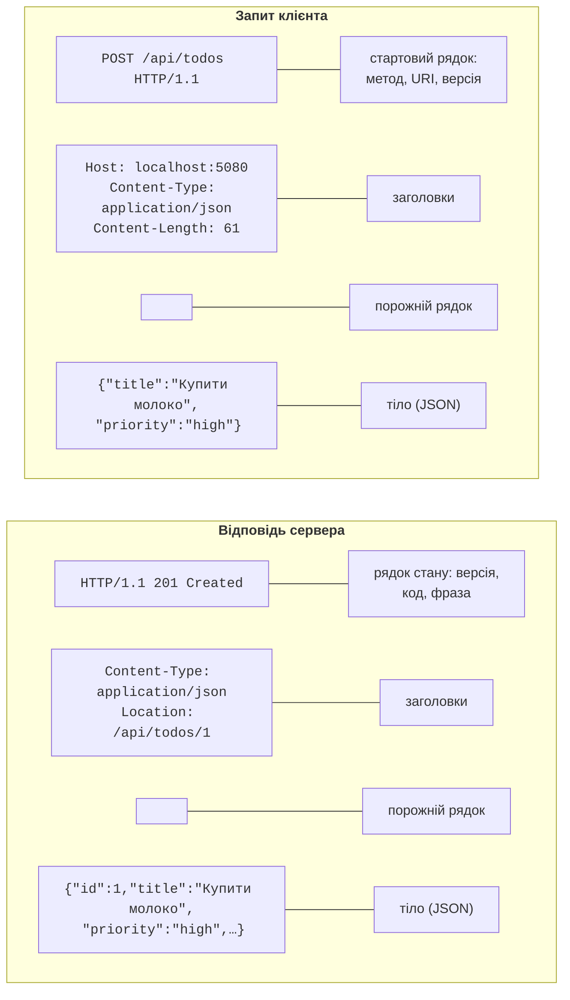
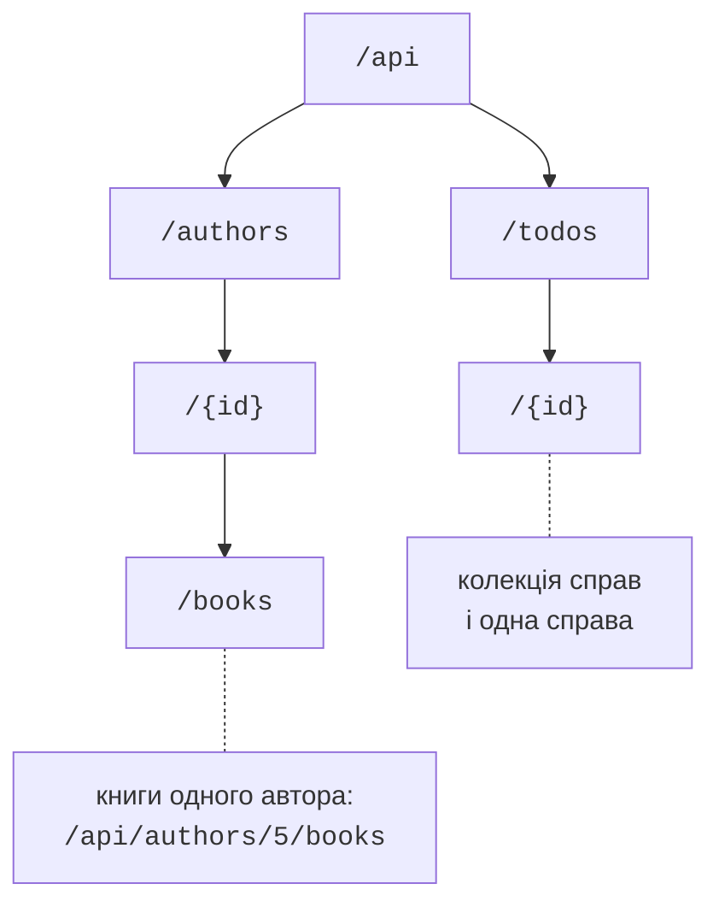
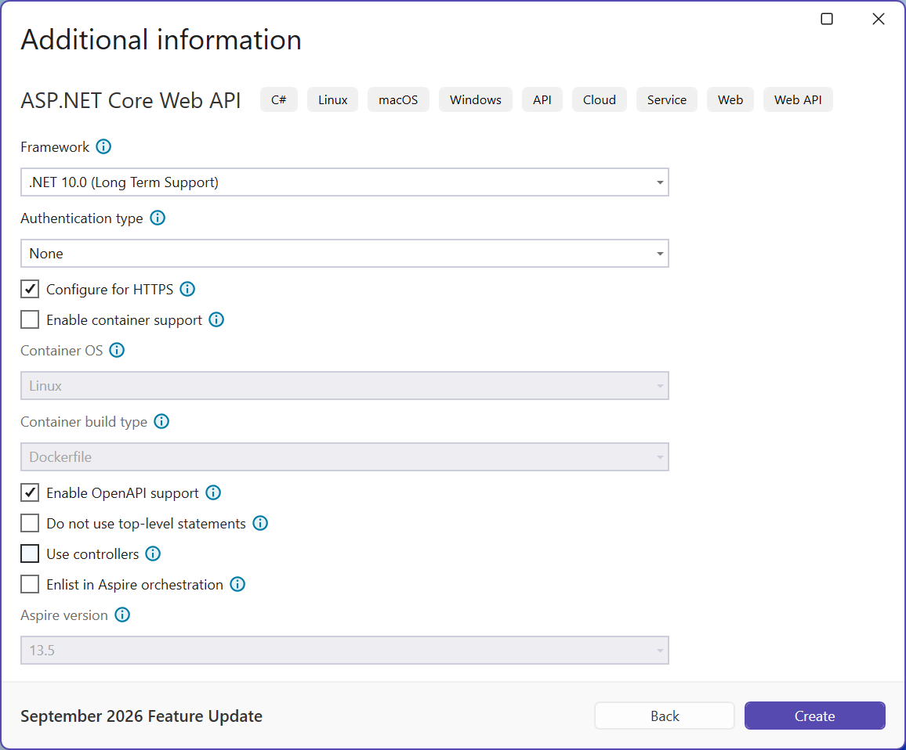
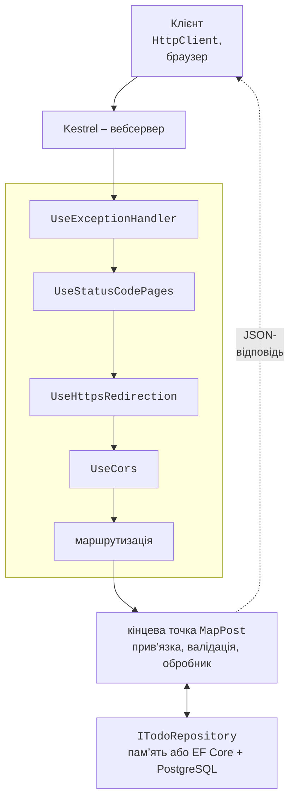

# HTTP, REST, JSON і Minimal API

## Протокол HTTP

**Вебсервіс** (*web service*) – програма, яка надає дані та операції іншим програмам через мережу за протоколом **HTTP** (*Hypertext Transfer Protocol*). На відміну від сокетів (тема 9), де формат повідомлень придумує сам програміст, HTTP уже визначає, як виглядає запит і відповідь, тому клієнт на C#, JavaScript чи Python працює з сервісом однаково. Сучасну семантику HTTP описує стандарт RFC 9110 (<https://www.rfc-editor.org/rfc/rfc9110>).

Обмін завжди починає **клієнт**: він надсилає **запит** (*request*), а **сервер** повертає одну **відповідь** (*response*). Обидва повідомлення мають однакову будову (рис. 10.1): стартовий рядок, заголовки, порожній рядок і необов’язкове **тіло** (*body*). Заголовок `Content-Type` повідомляє формат тіла (для вебсервісів – `application/json`), `Accept` – який формат очікує клієнт, `Location` – адресу щойно створеного ресурсу.



Рис. 10.1. Структура HTTP-запиту та відповіді {.caption}

### Методи HTTP

**Метод** (*method*, або «дієслово») показує, що клієнт хоче зробити з ресурсом (табл. 10.1). Метод **безпечний** (*safe*), якщо не змінює даних на сервері, і **ідемпотентний** (*idempotent*), якщо кілька однакових запитів дають той самий результат, що й один. Ідемпотентні запити клієнт може безпечно повторити після збою мережі; повтор `POST` створить дублікат.

Таблиця 10.1. Основні методи HTTP {.caption}

| **Метод** | **Призначення** | **Безпечний** | **Ідемпотентний** |
| --- | --- | --- | --- |
| `GET` | отримати ресурс або колекцію | так | так |
| `POST` | створити ресурс у колекції | ні | ні |
| `PUT` | повністю замінити ресурс | ні | так |
| `PATCH` | змінити частину ресурсу | ні | ні |
| `DELETE` | видалити ресурс | ні | так |
| `HEAD` | як `GET`, але без тіла відповіді | так | так |

### Коди стану

Відповідь починається з **коду стану** (*status code*) – тризначного числа, за яким клієнт вирішує, що робити далі. Перша цифра задає клас: 2xx – успіх, 3xx – перенаправлення, 4xx – помилка клієнта (неправильний запит), 5xx – помилка сервера (табл. 10.2).

Таблиця 10.2. Коди стану HTTP, які найчастіше повертає вебсервіс {.caption}

| **Код** | **Коли повертається** |
| --- | --- |
| `200 OK` | успішний `GET` або інша операція з тілом відповіді |
| `201 Created` | `POST` створив ресурс; заголовок `Location` містить його адресу |
| `204 No Content` | успішні `PUT`, `PATCH`, `DELETE` без тіла відповіді |
| `400 Bad Request` | некоректний JSON або помилки валідації |
| `401 Unauthorized` | немає або недійсні облікові дані (токен) |
| `404 Not Found` | ресурсу з такою адресою немає |
| `405 Method Not Allowed` | маршрут є, але не для цього методу |
| `500 Internal Server Error` | необроблений виняток на сервері |

## Архітектурний стиль REST

**REST** (*Representational State Transfer*) – архітектурний стиль вебсервісів, запропонований Роєм Філдінгом. Він не є окремим протоколом чи бібліотекою, а набором правил використання HTTP:

- дані подаються як **ресурси** (*resources*) – справи, книги, користувачі; кожен ресурс має свій **URI**: `/api/todos/7`;
- клієнт отримує не сам об’єкт сервера, а його **представлення** (*representation*), найчастіше JSON;
- дію над ресурсом задає метод HTTP, а не назва в адресі: `DELETE /api/todos/7`, а не `POST /api/deleteTodo?id=7`;
- сервер **не зберігає стану** клієнта між запитами (*stateless*): кожен запит містить усе потрібне, тому сервіс легко масштабувати на кілька серверів.

Ресурси утворюють ієрархію (рис. 10.2). Колекцію позначають іменником у множині (`/api/todos`), елемент – ідентифікатором у колекції (`/api/todos/7`), а залежні ресурси – вкладеною колекцією (`/api/authors/5/books`). Фільтрація, сортування та сторінки задаються **рядком запиту** (*query string*): `/api/todos?done=false&page=2`. Адреси пишуть малими літерами, слова розділяють дефісом, у кінці не ставлять «/».



Рис. 10.2. Ієрархія ресурсів REST {.caption}

Типовий набір операцій CRUD (*Create, Read, Update, Delete*) для колекції справ наведено в табл. 10.3. Саме такий сервіс створюється далі.

Таблиця 10.3. Кінцеві точки сервісу «Список справ» {.caption}

| **Запит** | **Дія** | **Коди** |
| --- | --- | --- |
| `GET /api/todos` | список справ (сторінка) | 200, 400 |
| `GET /api/todos/{id}` | одна справа | 200, 404 |
| `POST /api/todos` | створити справу | 201, 400 |
| `PUT /api/todos/{id}` | замінити справу | 204, 400, 404 |
| `DELETE /api/todos/{id}` | видалити справу | 204, 404 |

## Формат JSON і `System.Text.Json`

**JSON** (*JavaScript Object Notation*) – текстовий формат даних з об’єктами `{ }`, масивами `[ ]`, рядками, числами, `true`, `false` і `null`. У .NET за перетворення об’єктів у JSON (**серіалізацію**) і назад (**десеріалізацію**) відповідає бібліотека `System.Text.Json`, вбудована в платформу (<https://learn.microsoft.com/dotnet/standard/serialization/system-text-json/overview>).

Налаштування задає клас `JsonSerializerOptions`. За замовчуванням імена властивостей записуються як у C# (`Title`), а вебсервіси зазвичай використовують **camelCase** (`title`). Готовий набір **веб-налаштувань** `JsonSerializerOptions.Web` вмикає camelCase, читання імен без урахування регістру і читання чисел із рядків; ASP.NET Core і методи `HttpClient` для JSON використовують саме ці налаштування. Приклад:

```cs
using System.Text.Encodings.Web;
using System.Text.Json;
using System.Text.Json.Serialization;

Console.OutputEncoding = System.Text.Encoding.UTF8;

var book = new Book(7, "Мова", Genre.Poetry, null);

Console.WriteLine(JsonSerializer.Serialize(book));
Console.WriteLine(JsonSerializer.Serialize(book,
    JsonSerializerOptions.Web));

var options = new JsonSerializerOptions(JsonSerializerOptions.Web)
{
    WriteIndented = true,
    DefaultIgnoreCondition = JsonIgnoreCondition.WhenWritingNull,
    Encoder = JavaScriptEncoder.UnsafeRelaxedJsonEscaping,
    Converters = { new JsonStringEnumConverter() }
};
Console.WriteLine(JsonSerializer.Serialize(book, options));

Book? copy = JsonSerializer.Deserialize<Book>(
    """{"ID":"7","title":"Мова","genre":"Poetry"}""", options);
Console.WriteLine(copy);

enum Genre { Novel, Poetry }

record Book(int Id, string Title, Genre Genre,
    [property: JsonPropertyName("isbn")] string? Isbn13);
```

Результат виконання:

```
{"Id":7,"Title":"Мова","Genre":1,"isbn":null}
{"id":7,"title":"Мова","genre":1,"isbn":null}
{
  "id": 7,
  "title": "Мова",
  "genre": "Poetry"
}
Book { Id = 7, Title = Мова, Genre = Poetry, Isbn13 =  }
```

Атрибут `[JsonPropertyName]` задає ім’я в JSON незалежно від політики імен. Перелічення за замовчуванням записуються числами (`"genre":1`), а конвертер `JsonStringEnumConverter` – назвами, які зрозуміліші клієнтам. `JsonSerializer` за замовчуванням екранує кирилицю (`М…`) – це коректний, але незручний для читання JSON; ASP.NET Core записує кирилицю без екранування. `WhenWritingNull` пропускає властивості зі значенням `null`. Під час читання `"ID"` знайдено без урахування регістру, а число `7` прочитано з рядка `"7"`.

У вебсервісі ці ж налаштування задаються для всіх кінцевих точок методом `ConfigureHttpJsonOptions` (див. приклад «Список справ»).

## Проєкт ASP.NET Core Minimal API

**ASP.NET Core** – кросплатформний фреймворк .NET для вебзастосунків і вебсервісів. Кінцеві точки сервісу можна описати двома способами: класами-**контролерами** або **Minimal API** – викликами `MapGet`, `MapPost` тощо без контролерів (<https://learn.microsoft.com/aspnet/core/fundamentals/minimal-apis>). Minimal API має менше коду й швидше запускається; у .NET 10 він підтримує все, що потрібно типовому сервісу: групи маршрутів, валідацію, OpenAPI, фільтри.

### Створення проєкту

У Visual Studio 2026 (робоче навантаження *ASP.NET and web development*) виконують *File → New → Project…*, вибирають шаблон *ASP.NET Core Web API* і у вікні *Additional information* (рис. 10.3) задають *.NET 10.0 (Long Term Support)*, прапорці *Configure for HTTPS* і *Enable OpenAPI support*, а прапорець *Use controllers* **знімають**. Той самий проєкт створює команда

```powershell
dotnet new webapi -n TodoApi
```



Рис. 10.3. Параметри нового проєкту *ASP.NET Core Web API* {.caption}

Шаблон створює файл проєкту з SDK `Microsoft.NET.Sdk.Web` і пакетом `Microsoft.AspNetCore.OpenApi`, файли `Program.cs`, `appsettings.json`, `Properties/launchSettings.json` і `TodoApi.http`. Весь сервіс починається в `Program.cs` з двох етапів:

1. `WebApplication.CreateBuilder(args)` створює **будівельник**: конфігурацію, журналювання та контейнер залежностей `builder.Services` (тема 6). Тут реєструють сервіси: `AddOpenApi()`, `AddProblemDetails()`, власні класи;
2. `builder.Build()` створює застосунок `app`. Далі налаштовують **конвеєр** проміжного ПЗ (`app.Use…`) і кінцеві точки (`app.Map…`), а `app.Run()` запускає сервер і блокує виконання до зупинки.

### Kestrel, профілі запуску та HTTPS

Запити приймає вбудований вебсервер **Kestrel** (<https://learn.microsoft.com/aspnet/core/fundamentals/servers/kestrel>). Адреси та середовище задає файл `Properties/launchSettings.json`: профіль `http` слухає, наприклад, `http://localhost:5080`, профіль `https` – ще й `https://localhost:7080` (порти шаблон вибирає випадково), а змінна `ASPNETCORE_ENVIRONMENT=Development` вмикає середовище розробки (тема 6). Запуск із терміналу – `dotnet run --launch-profile https`. Для HTTPS на комп’ютері розробника потрібен довірений сертифікат, який створює команда `dotnet dev-certs https --trust` (<https://learn.microsoft.com/aspnet/core/security/enforcing-ssl>).

### Конвеєр обробки запиту

Кожен запит проходить **конвеєр проміжного програмного забезпечення** (*middleware pipeline*): ланцюжок компонентів, які викликаються в порядку реєстрації `app.Use…` і можуть обробити запит, змінити відповідь або передати запит далі (<https://learn.microsoft.com/aspnet/core/fundamentals/middleware/>). Наприкінці маршрутизація вибирає кінцеву точку, яка й формує відповідь (рис. 10.4). Порядок важливий: обробник винятків реєструють першим, щоб він перехоплював помилки всіх наступних компонентів.



Рис. 10.4. Обробка запиту в ASP.NET Core; пунктиром обведено проміжне ПЗ {.caption}
