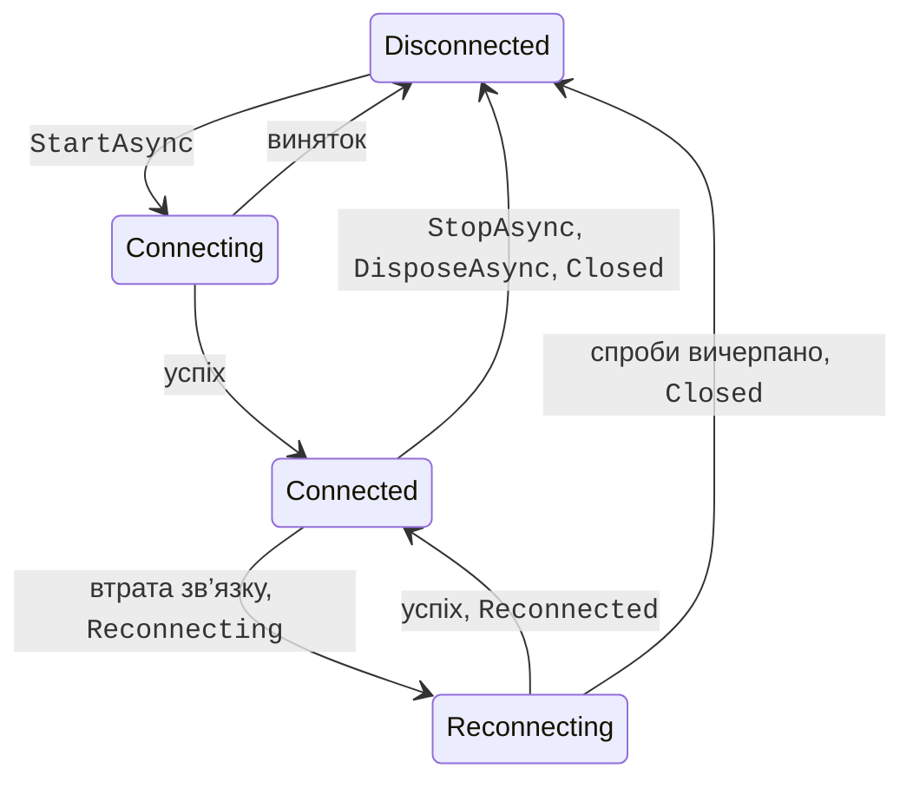
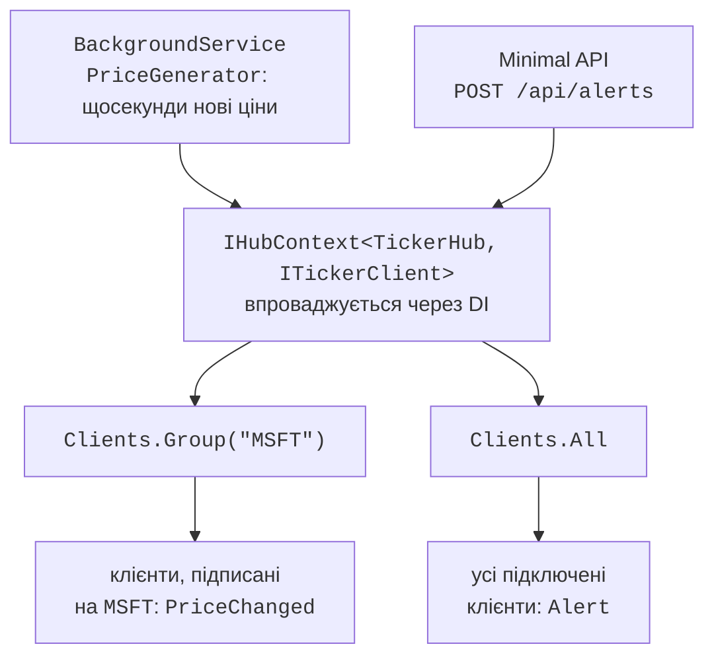

# Перепідключення та надсилання

## Життєвий цикл підключення та перепідключення

Підключення `HubConnection` перебуває в одному зі станів перелічення `HubConnectionState` (рис. 11.6), поточний стан повертає властивість `State`. Без додаткових налаштувань втрата зв’язку (перезапуск сервера, збій мережі) переводить підключення в стан `Disconnected` і генерує подію `Closed`.



Рис. 11.6. Стани підключення `HubConnection` з автоматичним перепідключенням {.caption}

Метод будівника `WithAutomaticReconnect()` вмикає автоматичне перепідключення: після втрати зв’язку клієнт переходить у стан `Reconnecting`, генерує подію `Reconnecting` і робить спроби через 0, 2, 10 і 30 секунд. Після вдалої спроби підключення знову `Connected` і генерується подія `Reconnected` з **новим** `ConnectionId`; якщо всі чотири спроби невдалі – `Disconnected` і подія `Closed`. Інтервали можна задати масивом `TimeSpan[]` або власною реалізацією інтерфейсу `IRetryPolicy`. Події підключення мають тип делегатів, що повертають `Task`, тому синхронний обробник повертає `Task.CompletedTask`. Щоб побачити перепідключення, до консольного клієнта чату додано `WithAutomaticReconnect()` і обробники подій (метод `Log` виводить рядок із часом):

```cs
connection.Reconnecting += error =>
{
    Log($"Reconnecting: {error?.Message}");
    return Task.CompletedTask;
};
connection.Reconnected += connectionId =>
{
    Log($"Reconnected: {connectionId}");
    return Task.CompletedTask;
};
// Обробник Closed аналогічний: Log($"Closed: {error?.Message}").
```

Процес сервера примусово завершено (як під час збою), а через кілька секунд запущено знову. Вивід клієнта:

```
Name: Olena
[11:14:47] Connected: PYtBvbvJqGtiklrTxycHnw
[11:14:50] Reconnecting: The remote party closed the WebSocket
connection without completing the close handshake.
[11:14:57] Reconnected: 99z3WZOoCGK7aHZY8mBnAw
I am back
[11:15:26] Olena: I am back
[11:15:28] Closed:
```

Під час перепідключення SignalR не зберігає повідомлень, надісланих у цей час, а нове підключення не входить до жодної групи. Тому клієнт у події `Reconnected` повторно викликає методи на кшталт `JoinRoom`, а інтерфейс у стані `Reconnecting` блокує кнопки надсилання. Для короткочасних збоїв ASP.NET Core 8+ має також **відновлення зі збереженням стану** (*stateful reconnect*, `WithStatefulReconnect()` на клієнті й `AllowStatefulReconnects` на сервері), яке буферизує й повторно надсилає повідомлення.

::: tip Увага
`WithAutomaticReconnect` не повторює **першого** підключення. Якщо сервер не запущено, `StartAsync` одразу генерує виняток `HttpRequestException` (*No connection could be made because the target machine actively refused it. (localhost:5110)*), і без `try`/`catch` програма аварійно завершується. Початкове підключення обгортають у цикл із затримкою або повідомляють користувача про недоступність сервера.
:::

## Надсилання повідомлень поза хабом

Часто повідомлення ініціює не клієнт, а сам сервер: таймер, фонова служба, кінцева точка REST, зміна в базі даних. Хаб не можна створити вручну, тому для надсилання з інших частин застосунку використовують службу `IHubContext<THub>` (для строго типізованого хабу – `IHubContext<THub, T>`), яку отримують через впровадження залежностей (<https://learn.microsoft.com/aspnet/core/signalr/hubcontext>). Вона має властивості `Clients` і `Groups`, але не має `Caller` та `Others`: поза хабом немає підключення, яке викликало метод.

Типове джерело подій – **фонова служба** (тема 6): клас, похідний від `BackgroundService`, метод `ExecuteAsync` якого працює весь час роботи сервера (<https://learn.microsoft.com/aspnet/core/fundamentals/host/hosted-services>). Службу реєструють методом `AddHostedService<T>()`. Кінцева точка Minimal API (тема 10) теж отримує `IHubContext` параметром обробника (рис. 11.7).



Рис. 11.7. Надсилання повідомлень із фонової служби та кінцевої точки REST {.caption}

### Приклад «Біржовий тікер»

Сервер `TickerServer` щосекунди змінює умовні ціни трьох акцій і надсилає їх клієнтам, підписаним на відповідний символ (група з назвою символу). Кінцева точка `POST /api/alerts` надсилає оголошення всім клієнтам. Файл `Program.cs` сервера:

```cs
using Microsoft.AspNetCore.SignalR;

var builder = WebApplication.CreateBuilder(args);
builder.Services.AddSignalR();
builder.Services.AddHostedService<PriceGenerator>();

var app = builder.Build();
app.MapHub<TickerHub>("/hubs/ticker");
app.MapHub<JobHub>("/hubs/jobs");        // потокове передавання

// Кінцева точка REST також надсилає повідомлення клієнтам хабу.
app.MapPost("/api/alerts", async (Alert alert,
    IHubContext<TickerHub, ITickerClient> hub) =>
{
    await hub.Clients.All.Alert(alert.Text);
    return Results.Accepted();
});

app.Run("http://localhost:5111");

public record Alert(string Text);
```

Файл `TickerHub.cs`:

```cs
using Microsoft.AspNetCore.SignalR;

public record Quote(string Symbol, decimal Price, decimal Change);

public interface ITickerClient
{
    Task PriceChanged(Quote quote);
    Task Alert(string text);
}

public class TickerHub : Hub<ITickerClient>
{
    public static readonly string[] Symbols =
        ["MSFT", "AAPL", "NVDA"];

    // Група з назвою символу – усі підписники цього символу.
    public async Task Subscribe(string symbol)
    {
        symbol = symbol.ToUpperInvariant();
        if (!Symbols.Contains(symbol))
        {
            throw new HubException($"Unknown symbol: {symbol}");
        }
        await Groups.AddToGroupAsync(Context.ConnectionId, symbol);
    }

    public Task Unsubscribe(string symbol) =>
        Groups.RemoveFromGroupAsync(Context.ConnectionId,
            symbol.ToUpperInvariant());
}
```

Фонова служба `PriceGenerator.cs` використовує `PeriodicTimer`, який не накопичує пропущених тактів і завершується разом із сервером через маркер скасування:

```cs
using Microsoft.AspNetCore.SignalR;

// Фонова служба, яка щосекунди змінює ціни й розсилає їх групам.
public class PriceGenerator(
    IHubContext<TickerHub, ITickerClient> hub,
    ILogger<PriceGenerator> logger) : BackgroundService
{
    private readonly Dictionary<string, decimal> prices = new()
    {
        ["MSFT"] = 512.40m, ["AAPL"] = 231.75m, ["NVDA"] = 178.20m
    };

    protected override async Task ExecuteAsync(
        CancellationToken token)
    {
        logger.LogInformation("Price generator started");
        using var timer = new PeriodicTimer(TimeSpan.FromSeconds(1));
        while (await timer.WaitForNextTickAsync(token))
        {
            foreach (string symbol in TickerHub.Symbols)
            {
                double delta = Random.Shared.NextDouble() - 0.5;
                decimal change = Math.Round((decimal)delta * 3, 2);
                decimal price = prices[symbol] += change;
                await hub.Clients.Group(symbol)
                    .PriceChanged(new Quote(symbol, price, change));
            }
        }
    }
}
```

Консольний клієнт отримує символи з аргументів командного рядка. Об’єкт `Quote` десеріалізується в запис із такими самими властивостями, оголошений у клієнті:

```cs
using Microsoft.AspNetCore.SignalR;
using Microsoft.AspNetCore.SignalR.Client;

string[] symbols = args.Length > 0 ? args : ["MSFT"];

await using HubConnection connection = new HubConnectionBuilder()
    .WithUrl("http://localhost:5111/hubs/ticker")
    .WithAutomaticReconnect()
    .Build();

connection.On<Quote>("PriceChanged", q => Console.WriteLine(
    $"{DateTime.Now:HH:mm:ss} {q.Symbol,-5}{q.Price,9:F2}" +
    $"{q.Change,8:+0.00;-0.00;0.00}"));
connection.On<string>("Alert", text =>
    Console.WriteLine($"ALERT: {text}"));

await connection.StartAsync();
foreach (string symbol in symbols)
{
    try
    {
        await connection.InvokeAsync("Subscribe", symbol);
        Console.WriteLine($"Subscribed: {symbol}");
    }
    catch (HubException ex)
    {
        Console.Error.WriteLine(ex.Message);
    }
}
Console.ReadLine();                  // Enter – вихід

// Тип повідомлення має ті самі властивості, що й на сервері.
record Quote(string Symbol, decimal Price, decimal Change);
```

Клієнт запущено командою `dotnet run -- MSFT nvda IBM`, а через кілька секунд в іншому терміналі надіслано оголошення: `curl.exe -X POST http://localhost:5111/api/alerts -H "Content-Type: application/json" -d '{"text":"Market closes in 5 minutes"}'` (відповідь `202 Accepted`). Початок виводу клієнта:

```
Subscribed: MSFT
Subscribed: nvda
An unexpected error occurred invoking 'Subscribe' on the server.
HubException: Unknown symbol: IBM
11:18:48 MSFT    519,36   +1,46
11:18:48 NVDA    175,63   +0,73
11:18:49 MSFT    520,76   +1,40
11:18:49 NVDA    177,09   +1,46
11:18:50 MSFT    522,14   +1,38
11:18:50 NVDA    177,00   -0,09
ALERT: Market closes in 5 minutes
```

Клієнт отримує лише ціни символів, на які підписався; ціни AAPL розсилаються групі, у якій немає учасників. Числа виведено з українськими регіональними налаштуваннями.
