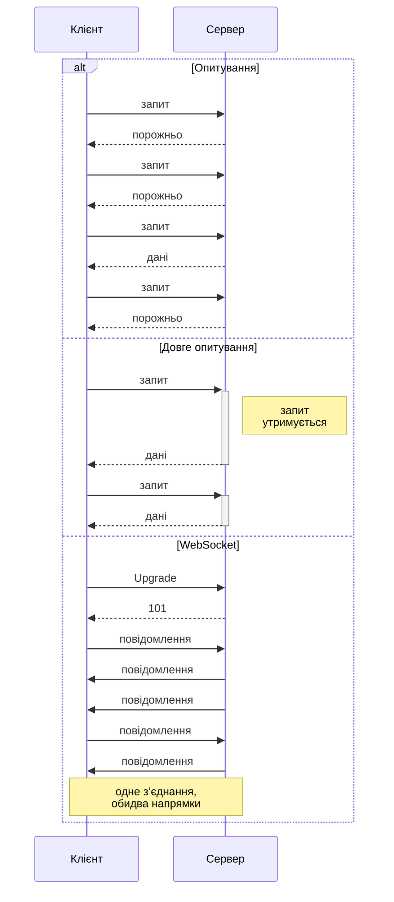
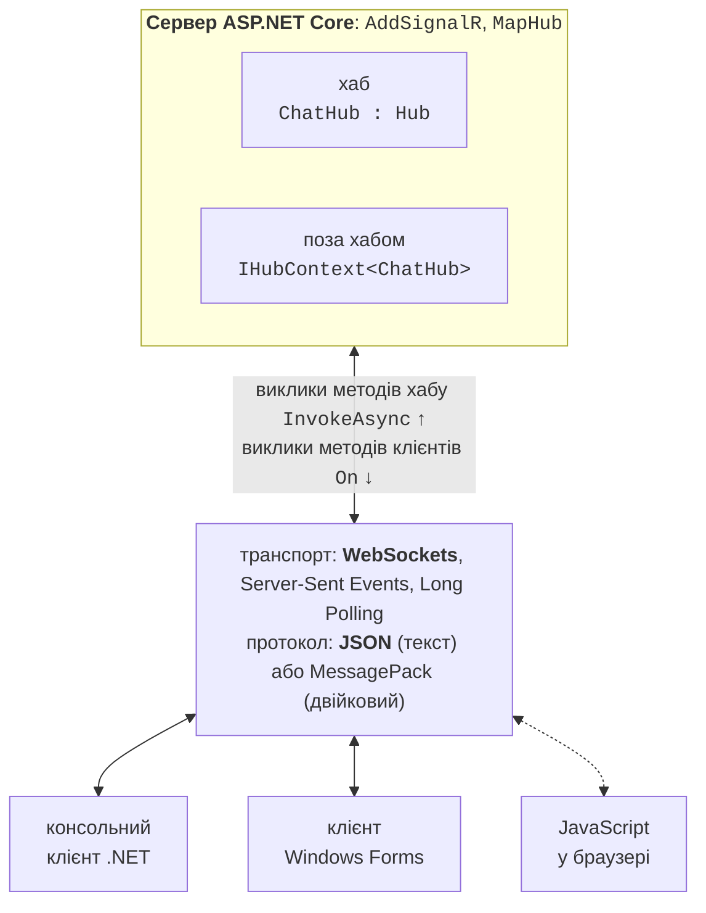
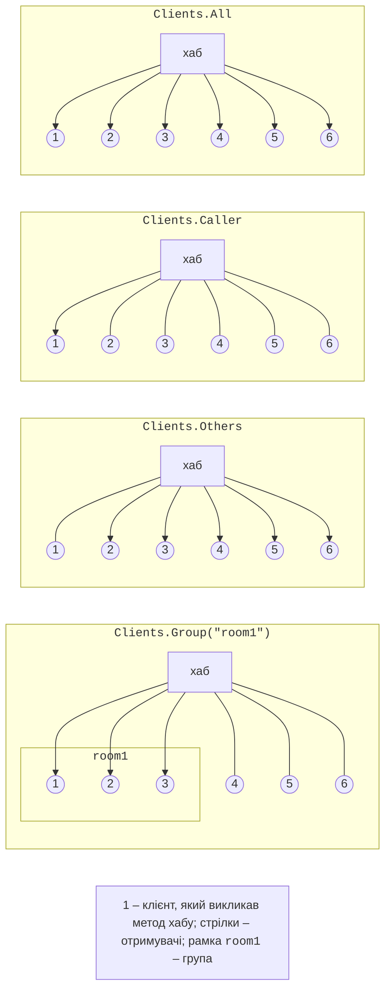

# Архітектура, хаб і клієнт .NET

## Обмін даними в реальному часі

Вебсервіс REST (тема 10) працює за схемою «запит – відповідь»: клієнт надсилає HTTP-запит, сервер відповідає, і на цьому обмін завершується. Сервер не може сам повідомити клієнта про подію: нове повідомлення в чаті, зміну ціни, готовність замовлення. Застосунки **реального часу** (*real-time*) доставляють такі події одразу, як вони відбулися. Є кілька способів цього досягти (рис. 11.1):

- **опитування** (*polling*) – клієнт періодично (наприклад, щосекунди) надсилає запит «чи є щось нове?». Спосіб простий, але більшість відповідей порожні, а затримка дорівнює періоду опитування;
- **довге опитування** (*long polling*) – сервер не відповідає одразу, а утримує запит, доки не з’являться дані або не мине тайм-аут; після відповіді клієнт одразу надсилає новий запит. Затримка мала, але кожне повідомлення коштує окремого HTTP-запиту;
- **Server-Sent Events** (SSE) – клієнт відкриває один HTTP-запит, а сервер надсилає в його відповідь текстові події, не закриваючи з’єднання (<https://html.spec.whatwg.org/multipage/server-sent-events.html>). Канал односпрямований: дані від клієнта передаються звичайними запитами;
- **WebSocket** – клієнт надсилає HTTP-запит із заголовком `Upgrade: websocket`, сервер відповідає кодом `101 Switching Protocols`, і те саме TCP-з’єднання стає двоспрямованим каналом повідомлень (<https://www.rfc-editor.org/rfc/rfc6455>).



Рис. 11.1. Опитування, довге опитування та WebSocket {.caption}

Сокети (тема 9) теж дають двоспрямований канал, але програміст сам визначає формат повідомлень, межі між ними, перепідключення та відстеження клієнтів. WebSocket працює через стандартні порти HTTP і HTTPS, тож проходить крізь проксі-сервери та брандмауери, але формат повідомлень і керування підключеннями все одно залишаються на програмістові.

## Архітектура ASP.NET Core SignalR

**ASP.NET Core SignalR** – бібліотека з відкритим кодом, яка додає до застосунку функції реального часу: сервер може в будь-який момент викликати методи на підключених клієнтах, а клієнти – методи на сервері. Цей механізм є **віддаленим викликом процедур** (*remote procedure call*, RPC) (<https://learn.microsoft.com/aspnet/core/signalr/introduction>). SignalR сам керує підключеннями, розсилає повідомлення всім клієнтам, окремим клієнтам або групам і відновлює зв’язок після збою.

Центральне поняття SignalR – **хаб** (*hub*): клас на сервері, відкриті методи якого викликають клієнти (рис. 11.2). Клієнт реєструє обробники за іменами методів, а сервер надсилає повідомлення з іменем методу й аргументами. Серверна частина SignalR входить до ASP.NET Core, тому окремий пакет серверу не потрібен. Клієнтські бібліотеки є для .NET, JavaScript/TypeScript, Java і Swift (<https://learn.microsoft.com/aspnet/core/signalr/supported-platforms>).



Рис. 11.2. Архітектура застосунку на ASP.NET Core SignalR {.caption}

### Транспорти та узгодження

SignalR підтримує три **транспорти** (*transports*) у порядку зниження пріоритету: **WebSockets**, **Server-Sent Events** і **Long Polling**. Транспорт обирається автоматично: спочатку клієнт надсилає POST-запит **узгодження** (*negotiation*) на адресу `<хаб>/negotiate`, сервер повертає ідентифікатор підключення та перелік доступних транспортів, і клієнт пробує їх по черзі. Якщо WebSocket недоступний (старий проксі-сервер, заборона в мережі), зв’язок усе одно працює через SSE або довге опитування, а код застосунку не змінюється. Наприклад, сервер прикладу «Загальний чат» на запит `POST /hubs/chat/negotiate?negotiateVersion=1` повертає JSON-об’єкт із полями `connectionId`, `connectionToken` і `availableTransports`, у якому перелічено `WebSockets` (формати `Text`, `Binary`), `ServerSentEvents` (`Text`) і `LongPolling` (`Text`, `Binary`).

### Протоколи хабу

Повідомлення між клієнтом і хабом кодуються **протоколом хабу** (*hub protocol*). За замовчуванням використовується текстовий протокол **JSON**: кожне повідомлення – JSON-об’єкт із типом, іменем методу та аргументами, який завершується службовим символом-роздільником `0x1E` (<https://github.com/dotnet/aspnetcore/blob/main/src/SignalR/docs/specs/HubProtocol.md>). Двійковий протокол **MessagePack** дає менші повідомлення (розділ «MessagePack, JavaScript-клієнт, масштабування»). Сервер підтримує підключення з обома протоколами одночасно.

Сервер кожні 15 с надсилає клієнту службове повідомлення *ping* і вважає клієнта відключеним, якщо від нього нічого не надходило 30 с (<https://learn.microsoft.com/aspnet/core/signalr/configuration>).

## Сервер: хаб і його методи

Для сервера SignalR достатньо порожнього вебпроєкту ASP.NET Core (`dotnet new web` або шаблон *ASP.NET Core Empty* у Visual Studio 2026). Налаштування займає два рядки в `Program.cs` (<https://learn.microsoft.com/aspnet/core/signalr/hubs>):

- `builder.Services.AddSignalR()` реєструє служби SignalR у контейнері залежностей (тема 6);
- `app.MapHub<ChatHub>("/hubs/chat")` зв’язує хаб з адресою, до якої підключаються клієнти.

Хаб – клас, похідний від `Hub` (простір імен `Microsoft.AspNetCore.SignalR`). Кожен відкритий метод хабу клієнт може викликати за іменем. Метод може бути асинхронним, приймати параметри будь-яких серіалізованих типів і повертати результат. Властивість `Clients` хабу визначає, кому надіслати повідомлення, а метод `SendAsync(ім’я, аргументи…)` викликає метод із цим іменем на клієнтах. Сервер прикладу «Загальний чат» повністю міститься у файлі `Program.cs`:

```cs
using Microsoft.AspNetCore.SignalR;

var builder = WebApplication.CreateBuilder(args);
builder.Services.AddSignalR();

var app = builder.Build();
app.MapHub<ChatHub>("/hubs/chat");
app.Run("http://localhost:5110");

public class ChatHub : Hub
{
    // Метод хабу, який викликають клієнти.
    public async Task SendMessage(string user, string text)
    {
        // Виклик методу ReceiveMessage на всіх клієнтах.
        await Clients.All.SendAsync("ReceiveMessage", user, text);
    }
}
```

Адресу `http://localhost:5110` задано в `app.Run`, щоб сервер і клієнти прикладів використовували той самий порт незалежно від файлу `launchSettings.json`.

Адресатів повідомлення обирають властивостями й методами `Clients` (табл. 11.1, рис. 11.3). Кожен із них повертає об’єкт з методом `SendAsync`.

Таблиця 11.1. Адресати повідомлень хабу {.caption}

| **Член `Clients`** | **Кому надсилається повідомлення** |
| --- | --- |
| `All` | усім підключеним клієнтам |
| `Caller` | клієнту, який викликав метод хабу |
| `Others` | усім, крім того, хто викликав метод |
| `Client(id)`, `Clients(ids)` | підключенню з ідентифікатором `id` або списку підключень |
| `Group(name)`, `Groups(names)` | усім підключенням групи або кількох груп |
| `OthersInGroup(name)` | групі, крім того, хто викликав метод |
| `User(userId)`, `Users(ids)` | усім підключенням автентифікованого користувача |



Рис. 11.3. Отримувачі повідомлень для різних членів `Clients` {.caption}

::: tip Увага
Хаб є **короткоживучим** (*transient*) об’єктом: для кожного виклику методу SignalR створює новий екземпляр хабу й знищує його після завершення методу. Тому стан (список користувачів, історію повідомлень) не можна зберігати в полях хабу – для нього реєструють окрему службу-одинак (*singleton*). З тієї ж причини асинхронні виклики `SendAsync` усередині хабу завжди очікують за допомогою `await`.
:::

## Клієнт .NET

Клієнтська бібліотека для .NET міститься в пакеті NuGet з назвою `Microsoft.AspNetCore.SignalR.Client` (версія 10.0.12 на вересень 2026 р.). Пакет підходить для консольних застосунків, Windows Forms, WPF і .NET MAUI (<https://www.nuget.org/packages/Microsoft.AspNetCore.SignalR.Client>). Його додають у Visual Studio (контекстне меню проєкту → *Manage NuGet Packages…* → вкладка *Browse*, рис. 11.4) або командою в папці проєкту:

```powershell
dotnet add package Microsoft.AspNetCore.SignalR.Client
```


Рис. 11.4. Встановлення пакета `Microsoft.AspNetCore.SignalR.Client` {.caption}

Підключення до хабу описує клас `HubConnection`, який створює будівник `HubConnectionBuilder`: `WithUrl(адреса)` задає адресу хабу, `WithAutomaticReconnect()` вмикає перепідключення, `Build()` створює об’єкт. Підключення відкриває метод `StartAsync`, закривають – `StopAsync` або `DisposeAsync` (<https://learn.microsoft.com/aspnet/core/signalr/dotnet-client>).

Методи, які викликає сервер, клієнт реєструє методом `On` **до** виклику `StartAsync`: `connection.On<string, string>("ReceiveMessage", (user, text) => …)`. Параметри типу задають типи аргументів; ім’я має точно збігатися з іменем у `SendAsync` на сервері. Для виклику методу хабу є два методи:

- `InvokeAsync("SendMessage", аргументи…)` – завершується, коли метод хабу **виконано**; повертає результат (`InvokeAsync<T>`), а виняток на сервері перетворюється на виняток у клієнті;
- `SendAsync("SendMessage", аргументи…)` – завершується, щойно повідомлення **надіслано**, не чекаючи виконання методу на сервері, і не повідомляє про помилки хабу.

### Приклад «Загальний чат»

Консольний клієнт запитує ім’я користувача, підключається до хабу `ChatHub` і надсилає кожен введений рядок. Повідомлення всіх учасників (і власні теж, бо сервер використовує `Clients.All`) виводяться з часом отримання:

```cs
using Microsoft.AspNetCore.SignalR.Client;

Console.Write("Name: ");
string name = Console.ReadLine() ?? "Guest";

await using HubConnection connection = new HubConnectionBuilder()
    .WithUrl("http://localhost:5110/hubs/chat")
    .Build();

// Метод клієнта ReceiveMessage, який викликає сервер.
connection.On<string, string>("ReceiveMessage", (user, text) =>
    Console.WriteLine($"[{DateTime.Now:HH:mm:ss}] {user}: {text}"));

await connection.StartAsync();
Console.WriteLine($"Connected: {connection.ConnectionId}");
Console.WriteLine("Type messages, an empty line to exit.");

while (Console.ReadLine() is { Length: > 0 } text)
{
    // Виклик методу хабу SendMessage на сервері.
    await connection.InvokeAsync("SendMessage", name, text);
}
```

Сервер і клієнти запускають в окремих вікнах терміналу: `dotnet run` у папці `ChatServer`, потім `dotnet run` у папці `ChatClient` двічі. Вікно першого клієнта (Olena) після розмови з Taras:

```
Name: Olena
Connected: P-eELqGYp-ZqdRSnO_po8Q
Type messages, an empty line to exit.
Hello, everyone!
[11:13:39] Olena: Hello, everyone!
[11:13:42] Taras: Hi, Olena
See you at 15:00
[11:13:45] Olena: See you at 15:00
```

Рядки без часу ввів користувач, решту вивела програма. Другий клієнт показує ті самі три повідомлення з тим самим часом. Ідентифікатор підключення (`ConnectionId`) кожен клієнт отримує свій. Порожній рядок завершує цикл, а `await using` закриває підключення.
