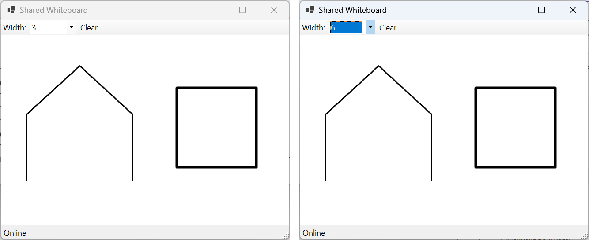

# Практика

Кожен приклад складається з двох проєктів: сервера (`dotnet new web`) і клієнта (`dotnet new console` або `dotnet new winforms`) з пакетом `Microsoft.AspNetCore.SignalR.Client`. Спочатку в окремому терміналі запускають сервер (`dotnet run`), потім один або кілька клієнтів.

## Приклад 1. Опитування аудиторії

Створити сервер SignalR, який проводить опитування з чотирма варіантами відповіді, і консольний клієнт, який запитує ім’я учасника, показує питання й поточні результати, приймає номер варіанта та після кожного голосу всіх учасників перемальовує результати текстовою діаграмою. Кожен учасник має один голос: повторне голосування змінює вибір. Номер поза діапазоном відхиляється сервером з повідомленням.

Сервер (`PollServer/Program.cs`) зберігає голоси в службі-одинаку `Poll` за іменем учасника, тому голос не втрачається після перепідключення клієнта:

```cs
using System.Collections.Concurrent;
using Microsoft.AspNetCore.SignalR;

var builder = WebApplication.CreateBuilder(args);
builder.Services.AddSignalR();
builder.Services.AddSingleton<Poll>();

var app = builder.Build();
app.MapHub<PollHub>("/hubs/poll");
app.Run("http://localhost:5112");

// Стан опитування живе весь час роботи сервера.
public class Poll
{
    // Голоси: ім’я учасника → номер варіанта (повторний замінює).
    private readonly ConcurrentDictionary<string, int> votes = new();

    public string Question => "Which language do you like most?";
    public string[] Options { get; } =
        ["C#", "Python", "Kotlin", "C++"];

    public void Vote(string voter, int option) =>
        votes[voter] = option;

    public int[] Results() => [.. Options.Select(
        (_, i) => votes.Values.Count(option => option == i))];
}

public interface IPollClient
{
    Task ShowPoll(string question, string[] options);
    Task ResultsChanged(int[] counts);
}

public class PollHub(Poll poll) : Hub<IPollClient>
{
    public override async Task OnConnectedAsync()
    {
        await Clients.Caller.ShowPoll(poll.Question, poll.Options);
        await Clients.Caller.ResultsChanged(poll.Results());
    }

    public async Task Vote(int option)
    {
        if (option < 0 || option >= poll.Options.Length)
        {
            throw new HubException(
                $"Choose an option from 1 to {poll.Options.Length}");
        }
        string voter = Context.GetHttpContext()!
            .Request.Query["voter"].ToString().ToLowerInvariant();
        poll.Vote(voter, option);
        await Clients.All.ResultsChanged(poll.Results());
    }
}
```

Клієнт (`PollClient/Program.cs`) передає ім’я в рядку запиту. Обробник `ResultsChanged` викликається в потоці пулу одночасно з головним циклом, тому таблиця результатів збирається в `StringBuilder` і виводиться одним викликом `Console.Write`: інакше її рядки могли б перемішатися з іншим виводом.

```cs
using System.Text;
using Microsoft.AspNetCore.SignalR;
using Microsoft.AspNetCore.SignalR.Client;

Console.Write("Your name: ");
string name = Console.ReadLine()?.Trim() ?? "";
if (name.Length == 0)
{
    Console.Error.WriteLine("The name is required");
    return 1;
}

string[] options = [];
await using HubConnection connection = new HubConnectionBuilder()
    .WithUrl("http://localhost:5112/hubs/poll?voter="
        + Uri.EscapeDataString(name))
    .WithAutomaticReconnect()
    .Build();

connection.On<string, string[]>("ShowPoll", (question, list) =>
{
    options = list;
    Console.WriteLine(question);
    for (int i = 0; i < list.Length; i++)
    {
        Console.WriteLine($"  {i + 1}. {list[i]}");
    }
});
connection.On<int[]>("ResultsChanged", PrintResults);

await connection.StartAsync();
Console.WriteLine("Enter an option number, an empty line to exit.");
while (Console.ReadLine() is { Length: > 0 } line)
{
    if (!int.TryParse(line, out int number))
    {
        Console.WriteLine("Enter a number");
        continue;
    }
    try
    {
        await connection.InvokeAsync("Vote", number - 1);
    }
    catch (HubException ex)
    {
        Console.WriteLine(ex.Message);
    }
}
return 0;

void PrintResults(int[] counts)
{
    int total = counts.Sum();
    var text = new StringBuilder($"Results, votes: {total}\n");
    for (int i = 0; i < counts.Length; i++)
    {
        int percent = total == 0 ? 0 : counts[i] * 100 / total;
        string bar = new('#', percent / 5);   // 20 символів = 100 %
        text.AppendLine(
            $"  {options[i],-7}{bar,-20}{counts[i],3}{percent,5}%");
    }
    Console.Write(text);   // одним викликом: рядки не перемішаються
}
```

Запущено два клієнти. Учасник Taras бачить питання, порожні результати й результати після голосу Olena за C#, а потім вводить 7 (помилка), 3 (Kotlin) і змінює вибір на 1 (C#). Кінець виводу його клієнта (рядки 7, 3 і 1 введено з клавіатури):

```
7
An unexpected error occurred invoking 'Vote' on the server.
HubException: Choose an option from 1 to 4
3
Results, votes: 2
  C#     ##########            1   50%
  Python                       0    0%
  Kotlin ##########            1   50%
  C++                          0    0%
1
Results, votes: 2
  C#     ####################  2  100%
  Python                       0    0%
  Kotlin                       0    0%
  C++                          0    0%
```

Повідомлення про помилку виводиться одним рядком; тут його перенесено. Клієнт Olena одночасно показує ті самі таблиці результатів.

## Приклад 2. Спільна дошка для малювання

Створити застосунок Windows Forms «Спільна дошка», у якому кілька користувачів малюють мишею на одній дошці: кожен завершений штрих з’являється в усіх учасників, новий учасник бачить уже намальоване, кнопка *Clear* очищає дошку в усіх, а товщина лінії обирається зі списку.

Сервер (`BoardServer/Program.cs`) зберігає штрихи в службі-одинаку й розсилає новий штрих усім, **крім автора** (`Clients.Others`): автор уже намалював його у себе. Координати передаються масивом структур `System.Drawing.Point`, які протокол JSON серіалізує як звичайні об’єкти:

```cs
using System.Drawing;
using Microsoft.AspNetCore.SignalR;

var builder = WebApplication.CreateBuilder(args);
builder.Services.AddSignalR();
builder.Services.AddSingleton<Board>();

var app = builder.Build();
app.MapHub<BoardHub>("/hubs/board");
app.Run("http://localhost:5113");

public record Stroke(int Width, Point[] Points);

// Усі штрихи дошки: новий учасник отримує їх під час підключення.
public class Board
{
    private readonly List<Stroke> strokes = [];
    private readonly Lock sync = new();

    public void Add(Stroke stroke)
    {
        lock (sync) { strokes.Add(stroke); }
    }

    public void Clear()
    {
        lock (sync) { strokes.Clear(); }
    }

    public Stroke[] Snapshot()
    {
        lock (sync) { return [.. strokes]; }
    }
}

public interface IBoardClient
{
    Task Load(Stroke[] strokes);
    Task StrokeDrawn(Stroke stroke);
    Task Cleared();
}

public class BoardHub(Board board) : Hub<IBoardClient>
{
    public override Task OnConnectedAsync() =>
        Clients.Caller.Load(board.Snapshot());

    public async Task Draw(Stroke stroke)
    {
        if (stroke.Points.Length < 2 || stroke.Width is < 1 or > 20)
        {
            throw new HubException("Invalid stroke");
        }
        board.Add(stroke);
        await Clients.Others.StrokeDrawn(stroke);  // крім автора
    }

    public async Task Clear()
    {
        board.Clear();
        await Clients.All.Cleared();
    }
}
```

Форма клієнта `MainForm` (*Shared Whiteboard*) містить панель `ToolStrip` з написом *Width:*, списком `widthComboBox` (`ToolStripComboBox`, `DropDownList`) і кнопкою `clearButton` (*Clear*), полотно `canvas` (`PictureBox`, `Dock = Fill`, білий фон; `PictureBox` має подвійну буферизацію, тема 4) і рядок стану з написом `statusLabel`. У конструкторі форм підписано події `Load` форми, `MouseDown`, `MouseMove`, `MouseUp`, `Paint` полотна та `Click` кнопки:

```cs
using System.Drawing.Drawing2D;
using Microsoft.AspNetCore.SignalR;
using Microsoft.AspNetCore.SignalR.Client;

namespace BoardClient;

public record Stroke(int Width, Point[] Points);

public partial class MainForm : Form
{
    private readonly List<Stroke> strokes = [];
    private readonly HubConnection connection;
    private List<Point>? current;     // штрих, який малюють зараз

    public MainForm()
    {
        InitializeComponent();
        widthComboBox.Items.AddRange("1", "3", "6");
        widthComboBox.SelectedIndex = 1;
        connection = new HubConnectionBuilder()
            .WithUrl("http://localhost:5113/hubs/board")
            .WithAutomaticReconnect()
            .Build();
        connection.On<Stroke[]>("Load", all => InvokeAsync(() =>
        {
            strokes.Clear();
            strokes.AddRange(all);
            canvas.Invalidate();
        }));
        connection.On<Stroke>("StrokeDrawn", s => InvokeAsync(() =>
        {
            strokes.Add(s);
            canvas.Invalidate();
        }));
        connection.On("Cleared", () => InvokeAsync(() =>
        {
            strokes.Clear();
            canvas.Invalidate();
        }));
    }

    private async void MainForm_Load(object sender, EventArgs e)
    {
        try
        {
            await connection.StartAsync();
            statusLabel.Text = "Online";
        }
        catch (HttpRequestException ex)
        {
            statusLabel.Text = $"Offline: {ex.Message}";
        }
    }

    private void canvas_MouseDown(object sender, MouseEventArgs e)
    {
        if (e.Button == MouseButtons.Left)
        {
            current = [e.Location];
        }
    }

    private void canvas_MouseMove(object sender, MouseEventArgs e)
    {
        if (current is not null)
        {
            current.Add(e.Location);
            canvas.Invalidate();
        }
    }

    private async void canvas_MouseUp(object sender, MouseEventArgs e)
    {
        if (current is not { Count: > 1 })
        {
            current = null;
            return;
        }
        int width = int.Parse((string)widthComboBox.SelectedItem!);
        var stroke = new Stroke(width, [.. current]);
        current = null;
        strokes.Add(stroke);            // свій штрих – одразу
        canvas.Invalidate();
        try
        {
            await connection.InvokeAsync("Draw", stroke);
        }
        catch (Exception ex) when (ex is HubException
            or InvalidOperationException)   // хаб відхилив або офлайн
        {
            statusLabel.Text = ex.Message;
        }
    }

    private async void clearButton_Click(object sender, EventArgs e)
    {
        if (connection.State == HubConnectionState.Connected)
        {
            await connection.InvokeAsync("Clear");
        }
    }

    private void canvas_Paint(object sender, PaintEventArgs e)
    {
        e.Graphics.SmoothingMode = SmoothingMode.AntiAlias;
        foreach (Stroke stroke in strokes)
        {
            DrawStroke(e.Graphics, stroke.Width, stroke.Points);
        }
        if (current is { Count: > 1 })
        {
            int width =
                int.Parse((string)widthComboBox.SelectedItem!);
            DrawStroke(e.Graphics, width, [.. current]);
        }
    }

    private static void DrawStroke(Graphics g, int width,
        Point[] points)
    {
        using var pen = new Pen(Color.Black, width)
        {
            StartCap = LineCap.Round,
            EndCap = LineCap.Round,
            LineJoin = LineJoin.Round
        };
        g.DrawLines(pen, points);
    }
}
```

Штрих надсилається лише після відпускання кнопки миші, а не на кожен рух. Якщо сервер недоступний, `InvokeAsync` генерує `InvalidOperationException`, текст якого з’являється в рядку стану. Під час перевірки перший клієнт намалював ламану товщиною 3, другий – квадрат товщиною 6, після чого підключився третій: усі три вікна показують обидві фігури (рис. 11.8), третій клієнт отримав їх повідомленням `Load`, а *Clear* у третьому вікні очистив дошки всіх клієнтів.



Рис. 11.8. Застосунок «Спільна дошка» у двох вікнах {.caption}

## Приклад 3. Замовлення в ресторані

Створити сервер ресторану з кінцевою точкою REST `POST /api/orders`, яка приймає номер столика (1–20) і перелік страв та надсилає нове замовлення кухні, і хабом SignalR, у якому кухарі позначають замовлення готовим, а офіціанти отримують сповіщення. Консольний клієнт отримує роль (`kitchen` або `waiters`) аргументом командного рядка; кухар, який підключився пізніше, бачить невиконані замовлення.

Сервер (`RestaurantServer/Program.cs`) використовує дві групи. Кінцева точка отримує `IHubContext<RestaurantHub, IStaffClient>` параметром, а замовлення зберігає служба `OrderBook`:

```cs
using Microsoft.AspNetCore.SignalR;

var builder = WebApplication.CreateBuilder(args);
builder.Services.AddSignalR();
builder.Services.AddSingleton<OrderBook>();

var app = builder.Build();
app.MapHub<RestaurantHub>("/hubs/restaurant");

// Нове замовлення надходить через REST і розсилається кухні.
app.MapPost("/api/orders", async (NewOrder request, OrderBook book,
    IHubContext<RestaurantHub, IStaffClient> hub) =>
{
    if (request.Table is < 1 or > 20 || request.Dishes.Length == 0)
    {
        return Results.BadRequest(
            "Table 1-20 and dishes are required");
    }
    Order order = book.Add(request.Table, request.Dishes);
    await hub.Clients.Group(RestaurantHub.Kitchen).NewOrder(order);
    return Results.Created($"/api/orders/{order.Id}", order);
});

app.Run("http://localhost:5114");

public record NewOrder(int Table, string[] Dishes);
public record Order(int Id, int Table, string[] Dishes, bool Ready);

public class OrderBook
{
    private readonly List<Order> orders = [];
    private readonly Lock sync = new();

    public Order Add(int table, string[] dishes)
    {
        lock (sync)
        {
            var order =
                new Order(orders.Count + 1, table, dishes, false);
            orders.Add(order);
            return order;
        }
    }

    public Order? MarkReady(int id)
    {
        lock (sync)
        {
            int i = orders.FindIndex(o => o.Id == id && !o.Ready);
            if (i < 0)
            {
                return null;
            }
            orders[i] = orders[i] with { Ready = true };
            return orders[i];
        }
    }

    public Order[] Pending()
    {
        lock (sync) { return [.. orders.Where(o => !o.Ready)]; }
    }
}

public interface IStaffClient
{
    Task NewOrder(Order order);
    Task OrderReady(Order order);
}

public class RestaurantHub(OrderBook book) : Hub<IStaffClient>
{
    public const string Kitchen = "kitchen", Waiters = "waiters";

    public async Task JoinAs(string role)
    {
        if (role is not (Kitchen or Waiters))
        {
            throw new HubException("Role must be kitchen or waiters");
        }
        await Groups.AddToGroupAsync(Context.ConnectionId, role);
        if (role == Kitchen)
        {
            // Кухар, який підключився пізніше, бачить невиконані.
            foreach (Order order in book.Pending())
            {
                await Clients.Caller.NewOrder(order);
            }
        }
    }

    public async Task MarkReady(int id)
    {
        Order order = book.MarkReady(id)
            ?? throw new HubException($"No pending order {id}");
        await Clients.Group(Waiters).OrderReady(order);
    }
}
```

Клієнт (`RestaurantClient/Program.cs`) перевіряє аргумент шаблоном списку й після перепідключення повторно приєднується до групи своєї ролі:

```cs
using Microsoft.AspNetCore.SignalR;
using Microsoft.AspNetCore.SignalR.Client;

if (args is not ["kitchen" or "waiters"])
{
    Console.Error.WriteLine(
        "Usage: RestaurantClient kitchen|waiters");
    return 1;
}
string role = args[0];

await using HubConnection connection = new HubConnectionBuilder()
    .WithUrl("http://localhost:5114/hubs/restaurant")
    .WithAutomaticReconnect()
    .Build();

connection.On<Order>("NewOrder", o => Console.WriteLine(
    $"{DateTime.Now:HH:mm:ss} NEW   #{o.Id} table {o.Table}: " +
    string.Join(", ", o.Dishes)));
connection.On<Order>("OrderReady", o => Console.WriteLine(
    $"{DateTime.Now:HH:mm:ss} READY #{o.Id} -> table {o.Table}"));
// Після перепідключення групу потрібно відновити.
connection.Reconnected += id =>
    connection.InvokeAsync("JoinAs", role);

await connection.StartAsync();
await connection.InvokeAsync("JoinAs", role);
Console.WriteLine($"Joined as {role}. " + (role == "kitchen"
    ? "Enter an order number when it is ready."
    : "Waiting for ready orders."));

while (Console.ReadLine() is { Length: > 0 } line)
{
    if (role != "kitchen" || !int.TryParse(line, out int id))
    {
        continue;
    }
    try
    {
        await connection.InvokeAsync("MarkReady", id);
    }
    catch (HubException ex)
    {
        Console.Error.WriteLine(ex.Message);
    }
}
return 0;

record Order(int Id, int Table, string[] Dishes, bool Ready);
```

Перше замовлення створено ще до запуску клієнтів командами PowerShell 7:

```powershell
$body = @{ table = 5; dishes = @("Borscht", "Varenyky") } |
    ConvertTo-Json
Invoke-RestMethod -Method Post -ContentType application/json `
    -Uri http://localhost:5114/api/orders -Body $body
```

Команда виводить таблицю з рядком `1 5 {Borscht, Varenyky} False` (стовпці `id`, `table`, `dishes`, `ready`). Потім запущено кухню (`dotnet run -- kitchen`) і офіціантів (`dotnet run -- waiters`), створено замовлення № 2 (столик 12, *Deruny*), а в терміналі кухні введено 1 і 7. Вивід кухні:

```
Joined as kitchen. Enter an order number when it is ready.
14:26:28 NEW   #1 table 5: Borscht, Varenyky
14:26:35 NEW   #2 table 12: Deruny
1
7
An unexpected error occurred invoking 'MarkReady' on the server.
HubException: No pending order 7
```

Офіціанти після рядка `Joined as waiters. Waiting for ready orders.` отримують `14:26:40 READY #1 -> table 5`.

Замовлення зі столиком 25 і порожнім переліком страв сервер відхиляє з кодом 400 і текстом `"Table 1-20 and dishes are required"`, а запуск клієнта з аргументом `cook` виводить у потік помилок `Usage: RestaurantClient kitchen|waiters` і завершується з кодом 1.
