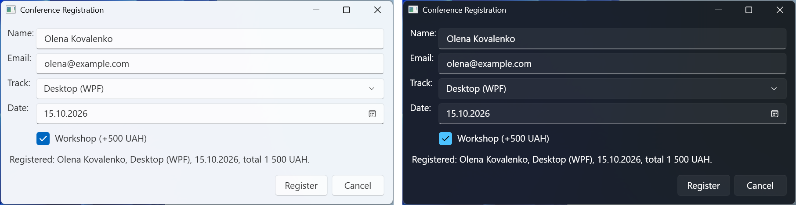

# Команди, вікна та тема Fluent

## Команди, ресурси та прив’язка

### Вбудовані команди

Одна дія («Зберегти») часто доступна з меню, панелі інструментів і клавіатури, а коли зберігати нічого, усі три мають бути вимкнені. **Команди** (*commands*) відокремлюють дію від елементів, що її викликають (<https://learn.microsoft.com/dotnet/desktop/wpf/advanced/commanding-overview>). WPF має набори готових команд `ApplicationCommands` (`New`, `Open`, `Save`, `Copy`, `Paste`, `Undo`), `EditingCommands`, `NavigationCommands`, `MediaCommands`. Команда має назву й стандартні клавіші (`Save` – **Ctrl+S**), а `CommandBinding` пов’язує її з обробниками `Executed` (виконати) і `CanExecute` (чи доступна). Елементи з властивістю `Command` (`Button`, `MenuItem`) самі вимикаються, коли `CanExecute` повертає `false`, а `MenuItem` бере з команди текст і підпис клавіш. Команди `Cut`, `Copy` і `Paste` поле `TextBox` обробляє саме.

Фрагмент вікна простого редактора нотаток:

```xml
<Window.CommandBindings>
    <CommandBinding Command="Open" Executed="Open_Executed"/>
    <CommandBinding Command="Save" Executed="Save_Executed"
                    CanExecute="Save_CanExecute"/>
</Window.CommandBindings>
<Window.InputBindings>
    <KeyBinding Key="F2" Command="Save"/>
</Window.InputBindings>
<DockPanel>
    <Menu DockPanel.Dock="Top">
        <MenuItem Header="_File">
            <MenuItem Command="Open"/>
            <MenuItem Command="Save"/>
        </MenuItem>
    </Menu>
    <ToolBar DockPanel.Dock="Top">
        <Button Command="Save" Content="Save"/>
    </ToolBar>
    <StatusBar DockPanel.Dock="Bottom">
        <StatusBarItem x:Name="statusItem"/>
    </StatusBar>
    <TextBox x:Name="editor" AcceptsReturn="True"
             TextChanged="Editor_TextChanged"/>
</DockPanel>
```

Обробник `CanExecute` лише повідомляє, чи доступна команда, а `Executed` зберігає файл (через `SaveFileDialog`, якщо ім’я ще невідоме) і скидає ознаку `isModified`:

```cs
// Команда Save доступна лише тоді, коли є незбережені зміни.
private void Save_CanExecute(object sender,
    CanExecuteRoutedEventArgs e) => e.CanExecute = isModified;
```

Пункти меню показують назви *Open* і *Save* з підписами **Ctrl+O** і **Ctrl+S**, хоча `Header` у розмітці не задано. Одразу після запуску кнопка й пункт *Save* вимкнені; після введення тексту вони вмикаються, а рядок стану показує `Untitled* Characters: 22`. Зберегти можна кнопкою, пунктом меню, **Ctrl+S** або **F2**. `CanExecute` викликається автоматично після дій користувача; у складніших випадках команди з параметрами пишуть власним класом `ICommand` (тема 13).

### Ресурси

**Ресурси** (*resources*) – іменовані об’єкти (пензлі, числа, стилі, шаблони), оголошені у властивості `Resources` елемента, вікна або застосунку (`App.xaml`) з ключем `x:Key` (<https://learn.microsoft.com/dotnet/desktop/wpf/systems/xaml-resources-overview>). Розширення `{StaticResource}` шукає ресурс від елемента вгору логічним деревом до ресурсів застосунку й теми; `{DynamicResource}` оновлює значення, якщо ресурс замінили під час роботи (тема 13).

```xml
<Window.Resources>
    <SolidColorBrush x:Key="AccentBrush" Color="SteelBlue"/>
    <sys:Double x:Key="HeaderSize">20</sys:Double>
</Window.Resources>
<StackPanel Margin="10">
    <TextBlock Text="Photo Viewer"
               FontSize="{StaticResource HeaderSize}"
               Foreground="{StaticResource AccentBrush}"/>
    <Image x:Name="logoImage" Source="Images/logo.png"
           Height="48" HorizontalAlignment="Left"/>
</StackPanel>
```

Префікс `sys` оголошують у корені вікна атрибутом `xmlns:sys` для простору імен `System` збірки `System.Runtime`, а атрибут `Icon` задає іконку вікна. У коді ресурс отримують методом `FindResource("AccentBrush")`.

Файли зображень, іконок і шрифтів вбудовують у збірку з дією збирання *Resource* (вікно *Properties* файлу → *Build Action*), що додає до файлу проєкту елемент `<Resource Include="Images\logo.png" />`. Без цього запуск завершується винятком `XamlParseException` з повідомленням `Cannot locate resource 'images/logo.png'`. Відносний шлях `Images/logo.png` у XAML відраховується від збірки, у якій лежить розмітка. У коді використовують **pack URI** (<https://learn.microsoft.com/dotnet/desktop/wpf/app-development/pack-uris-in-wpf>); для ресурсу з іншої збірки шлях має вигляд `/Snippets;component/Images/logo.png`:

```cs
var uri = new Uri("pack://application:,,,/Images/logo.png");
logoImage.Source = new BitmapImage(uri);
```

## Вікна та діалоги

Вікно – об’єкт класу `Window` (*Project → Add Window (WPF)…*). Його показують (<https://learn.microsoft.com/dotnet/desktop/wpf/windows/>):

- `Show()` – немодально, метод повертає керування одразу;
- `ShowDialog()` – модально; метод повертає `bool?`: `true`, якщо в діалозі присвоїли `DialogResult = true`, і `false` після скасування чи закриття.

Властивість `Owner` задає вікно-власника: діалог з’являється над ним (значення `CenterOwner` властивості `WindowStartupLocation`) і згортається разом із ним. Присвоювання `DialogResult` закриває модальне вікно, а кнопка з `IsCancel` закриває його з результатом `false` без коду.

Діалог введення імені `InputDialog` має розмір за вмістом (`SizeToContent`), незмінний розмір (`ResizeMode`), не показується на панелі завдань (`ShowInTaskbar`) і містить напис `promptLabel`, поле `answerBox` та кнопки *OK* (`IsDefault`, обробник `Ok_Click`) і *Cancel* (`IsCancel`). Код діалогу:

```cs
public partial class InputDialog : Window
{
    public InputDialog(string prompt, string answer)
    {
        InitializeComponent();
        promptLabel.Content = prompt;
        answerBox.Text = answer;
        answerBox.SelectAll();
    }

    public string Answer => answerBox.Text.Trim();

    private void Ok_Click(object sender, RoutedEventArgs e)
    {
        if (Answer.Length > 0)
        {
            DialogResult = true;       // закриває модальне вікно
        }
    }
}
```

Головне вікно створює діалог `new InputDialog("_New name:", "notes.txt") { Owner = this }` і перевіряє `dialog.ShowDialog() == true`, після чого читає `dialog.Answer`. Якщо ввести `report.txt` і натиснути *OK*, `ShowDialog` повертає `True`, а `Answer` – `report.txt`. Для порожнього поля *OK* не закриває діалог, а *Cancel* чи **Esc** повертає `False`.

**Стандартні діалоги** WPF розташовано в просторі імен `Microsoft.Win32`: `OpenFileDialog`, `SaveFileDialog` і, починаючи з .NET 8, `OpenFolderDialog` (вибір папки, властивість `FolderName`) (<https://learn.microsoft.com/dotnet/api/microsoft.win32.openfolderdialog>). Їхній метод `ShowDialog(this)` теж повертає `bool?`, а вибраний шлях містять властивості `FileName` і `FolderName`; фільтр файлів задають так само, як у Windows Forms: `Filter = "Text files (*.txt)|*.txt|All files (*.*)|*.*"`.

`MessageBox.Show(text, caption, MessageBoxButton.YesNo, MessageBoxImage.Question)` показує повідомлення й повертає `MessageBoxResult`. У .NET 10 додано кнопки `RetryCancel`, `AbortRetryIgnore` і `CancelTryContinue`. Головне меню будують з `Menu` і `MenuItem`, контекстне – властивістю `ContextMenu`, панель інструментів – `ToolBar` у `ToolBarTray`, рядок стану – `StatusBar` (приклад вище).

## Тема Fluent

За замовчуванням елементи WPF мають класичний вигляд Windows (тема Aero2), і в прикладах лекції використано саме його. У .NET 9 до WPF додано тему **Fluent** у стилі Windows 11 зі світлим і темним режимами та системним кольором акценту (<https://learn.microsoft.com/dotnet/desktop/wpf/whats-new/net90>). Її вмикають властивістю `ThemeMode` застосунку або окремого вікна зі значеннями `None` (класична тема), `Light`, `Dark` і `System` (як у налаштуваннях Windows):

`<Application … StartupUri="MainWindow.xaml" ThemeMode="System">` у файлі `App.xaml`.

У .NET 10 тему Fluent доповнено стилями для `DatePicker`, `GridSplitter`, `GroupBox`, `Label`, `TextBox` та інших елементів, але властивість `ThemeMode` досі позначено як **експериментальну** (атрибут `Experimental("WPF0001")`). Атрибут у XAML збирається без попереджень, а звернення до `ThemeMode` в коді C# дає помилку компіляції WPF0001 (*ThemeMode is for evaluation purposes only and is subject to change or removal in future updates*). Щоб перемикати тему з коду, діагностику вимикають директивою `#pragma` або в файлі проєкту (`<NoWarn>$(NoWarn);WPF0001</NoWarn>`):

```cs
#pragma warning disable WPF0001   // ThemeMode – експериментальний API
    private void DarkTheme_Click(object sender, RoutedEventArgs e) =>
        Application.Current.ThemeMode = darkThemeBox.IsChecked == true
            ? ThemeMode.Dark : ThemeMode.Light;
#pragma warning restore WPF0001
```

Елементи теми Fluent вищі й мають більші відступи, ніж класичні (рис. 12.10), тому вікно з фіксованою висотою може обрізати вміст: використовуйте `SizeToContent`, `MinHeight` і рядки `Auto`. API може змінитися в наступних версіях, тому для навчальних і корпоративних застосунків на .NET 10 класична тема залишається безпечним вибором.



Рис. 12.10. Форма реєстрації в темі Fluent: світлий і темний режими {.caption}
