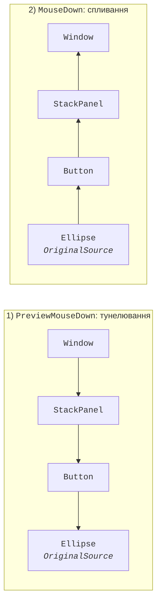
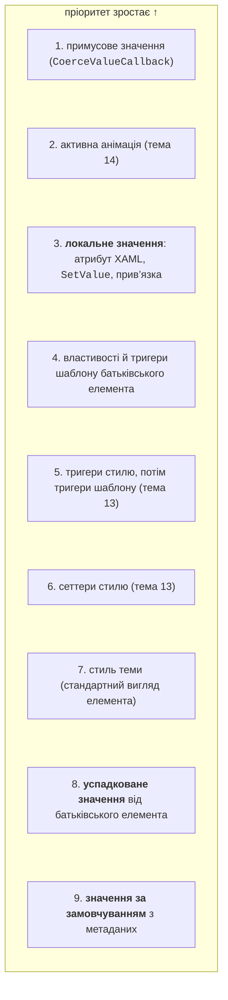

# Події та властивості залежностей

## Маршрутизовані події

### Стратегії маршрутизації

У Windows Forms подія генерується лише на елементі, з яким працює користувач. У WPF кнопка може містити коло й текст, і клацання по колу має бути клацанням по кнопці. Тому більшість подій WPF – **маршрутизовані** (*routed events*): вони проходять деревом елементів і викликають обробники на кількох елементах (<https://learn.microsoft.com/dotnet/desktop/wpf/events/routed-events-overview>). Є три стратегії:

- **спливання** (*bubbling*): від елемента-джерела вгору до кореня (`Click`, `MouseDown`, `KeyDown`, `TextChanged`);
- **тунелювання** (*tunneling*): від кореня вниз до джерела; такі події мають префікс `Preview` (`PreviewMouseDown`, `PreviewKeyDown`, `PreviewTextInput`);
- **пряма** (*direct*): лише на самому елементі, як у Windows Forms (`MouseEnter`, `MouseLeave`).

Події введення йдуть парами (рис. 12.8): одна дія користувача спочатку генерує тунельну подію, яка проходить весь маршрут униз, а потім спливаючу з **тими самими даними події**.



Рис. 12.8. Тунелювання та спливання подій миші {.caption}

Обробник маршрутизованої події отримує `sender` – елемент, до якого **підключено** обробник, і нащадка `RoutedEventArgs` з властивостями:

- `Source` – елемент, що згенерував подію (з урахуванням логічного дерева);
- `OriginalSource` – найглибший елемент візуального дерева, на якому сталася подія (наприклад, `TextBlock` усередині кнопки);
- `Handled` – позначка «оброблено»: обробники далі за маршрутом, підключені звичайним способом, уже не викликаються;
- `RoutedEvent` – ідентифікатор події.

Обробник для події дочірніх елементів підключають до батьківського елемента з кваліфікованим іменем події: `<StackPanel Button.Click="Buttons_Click">`. У коді використовують `element.AddHandler(ButtonBase.ClickEvent, handler)`. Третій аргумент `handledEventsToo: true` викликає обробник навіть для вже обробленої події.

Деякі елементи самі позначають події обробленими. `Button` обробляє `MouseLeftButtonDown` і замість нього генерує `Click`, тому обробник `MouseDown`, підключений до панелі з кнопкою у XAML, не спрацює після клацання по кнопці. Рішення: обробляти `Click`, тунельну `PreviewMouseDown` або підключити обробник через `AddHandler` з `handledEventsToo: true` (<https://learn.microsoft.com/dotnet/desktop/wpf/events/preview-events>).

Тунельні події використовують для **фільтрації**: батьківський елемент бачить введення раніше за дочірній і може його скасувати. Наприклад, обробник `PreviewTextInput` поля введення з `e.Handled = true` для нецифрових символів не пропускає їх у `TextBox`.

### Приклад «Калькулятор»

Калькулятор має 16 кнопок у `UniformGrid` і **один** обробник `Keys_Click`, підключений до панелі: подія `Click` кожної кнопки спливає до `UniformGrid`, а `e.Source` повідомляє, яку кнопку натиснуто. Неявний стиль у ресурсах панелі (детально – тема 13) задає однаковий шрифт, відступ і `Focusable="False"` для всіх кнопок, щоб фокус не залишався на кнопці. `MainWindow.xaml`:

```xml
<Window x:Class="Calculator.MainWindow"
    xmlns="http://schemas.microsoft.com/winfx/2006/xaml/presentation"
    xmlns:x="http://schemas.microsoft.com/winfx/2006/xaml"
    Title="Calculator" Width="280" Height="360">
    <DockPanel Margin="6">
        <TextBox x:Name="display" DockPanel.Dock="Top" Text="0"
                 IsReadOnly="True" Focusable="False" FontSize="28"
                 TextAlignment="Right" Margin="2,2,2,6"/>
        <UniformGrid x:Name="keys" Rows="4" Columns="4"
                     ButtonBase.Click="Keys_Click">
            <UniformGrid.Resources>
                <Style TargetType="Button">
                    <Setter Property="FontSize" Value="20"/>
                    <Setter Property="Margin" Value="2"/>
                    <Setter Property="Focusable" Value="False"/>
                </Style>
            </UniformGrid.Resources>
            <Button Content="7"/> <Button Content="8"/>
            <Button Content="9"/> <Button Content="÷"/>
            <Button Content="4"/> <Button Content="5"/>
            <Button Content="6"/> <Button Content="×"/>
            <Button Content="1"/> <Button Content="2"/>
            <Button Content="3"/> <Button Content="−"/>
            <Button Content="C"/> <Button Content="0"/>
            <Button Content="="/> <Button Content="+"/>
        </UniformGrid>
    </DockPanel>
</Window>
```

`MainWindow.xaml.cs`:

```cs
using System.Windows;
using System.Windows.Controls;

namespace Calculator;

public partial class MainWindow : Window
{
    private decimal left;          // перший операнд
    private string operation = ""; // операція, що очікує
    private bool startNew = true;  // наступна цифра – нове число

    public MainWindow()
    {
        InitializeComponent();
    }

    // Click кожної кнопки «спливає» до UniformGrid.
    private void Keys_Click(object sender, RoutedEventArgs e)
    {
        if (e.Source is not Button button)
        {
            return;
        }
        string key = (string)button.Content;
        switch (key)
        {
            case "C":
                left = 0;
                operation = "";
                display.Text = "0";
                startNew = true;
                break;
            case "+" or "−" or "×" or "÷" or "=":
                Calculate();
                operation = key == "=" ? "" : key;
                startNew = true;
                break;
            default:                          // цифра
                display.Text = startNew || display.Text == "0"
                    ? key : display.Text + key;
                startNew = false;
                break;
        }
        e.Handled = true;
    }

    private void Calculate()
    {
        if (!decimal.TryParse(display.Text, out decimal right))
        {
            return;                           // на екрані помилка
        }
        try
        {
            left = operation switch
            {
                "+" => left + right,
                "−" => left - right,
                "×" => left * right,
                "÷" => left / right,
                _ => right
            };
            display.Text = Math.Round(left, 10)
                .ToString("0.##########");
        }
        catch (Exception ex) when (ex is DivideByZeroException
            or OverflowException)
        {
            display.Text = "Error";
            left = 0;
            operation = "";
        }
    }
}
```

Калькулятор виконує дії послідовно, без пріоритету операцій. Послідовність `12 + 30 =` показує `42`, далі `× 2 =` – `84`, `C 1 ÷ 3 =` – `0,3333333333`, `C 7 ÷ 0 =` – `Error`, `C 2 + 3 × 4 =` – `20`.

## Властивості залежностей

### Навіщо потрібні властивості залежностей

Значення властивості `Background` кнопки може прийти з атрибута XAML, зі стилю, з анімації, з прив’язки даних або від теми Windows, а `FontSize` вікна **успадковується** всіма вкладеними елементами. Звичайна властивість C# з полем такого не вміє, тому більшість властивостей елементів WPF – **властивості залежностей** (*dependency properties*) (<https://learn.microsoft.com/dotnet/desktop/wpf/properties/dependency-properties-overview>).

Властивість залежності реєструє клас, похідний від `DependencyObject`, статичним методом `DependencyProperty.Register`. Значення зберігає система властивостей, а звичайна властивість C# лише викликає `GetValue` і `SetValue`. Під час реєстрації в **метаданих** задають значення за замовчуванням, прапорці (`AffectsMeasure`, `Inherits`, `BindsTwoWayByDefault`) і методи зворотного виклику: `PropertyChangedCallback` після зміни та `CoerceValueCallback` для примусового обмеження значення.

Якщо значення задано кількома способами, діє джерело з найвищим пріоритетом (рис. 12.9, <https://learn.microsoft.com/dotnet/desktop/wpf/properties/dependency-property-value-precedence>). Локальне значення (атрибут у XAML, присвоювання в коді) перекриває стиль, тому кнопка з `Background="Red"` не змінює колір навіть від тригера стилю. Метод `ClearValue` прибирає лише локальне значення, і тоді діє наступне джерело. Метод `DependencyPropertyHelper.GetValueSource` повідомляє, звідки взято поточне значення.



Рис. 12.9. Пріоритет джерел значення властивості залежності (спрощено) {.caption}

**Приєднана властивість** (*attached property*) – властивість залежності, яку реєструє один клас (`DependencyProperty.RegisterAttached`), а значення зберігається на будь-якому іншому елементі. Так панель дізнається, де розмістити дочірній елемент. У XAML пишуть `Grid.Row="1"` або `Canvas.Left="40"`, а в коді викликають статичні методи `Set…` і `Get…`: `Canvas.SetLeft(marker, 40)`, `Grid.SetRow(folderList, 1)`, `Grid.GetRow(folderList)`.

### Приклад «Рейтинг зірками»

Власний **користувацький елемент керування** (*user control*) складається з інших елементів: його створюють командою *Project → Add User Control (WPF)…*. Елемент `StarRatingControl` показує п’ять зірок, має властивість залежності `Value` (0–5) і змінює її після клацання по зірці. Зірки – елементи `TextBlock`, створені в конструкторі; `FontSize` вони успадковують від самого елемента. `StarRatingControl.xaml`:

```xml
<UserControl x:Class="StarRating.StarRatingControl"
    xmlns="http://schemas.microsoft.com/winfx/2006/xaml/presentation"
    xmlns:x="http://schemas.microsoft.com/winfx/2006/xaml">
    <StackPanel x:Name="starsPanel" Orientation="Horizontal"
                Background="Transparent" Cursor="Hand"
                MouseDown="Stars_MouseDown"/>
</UserControl>
```

`StarRatingControl.xaml.cs`:

```cs
using System.Windows;
using System.Windows.Controls;
using System.Windows.Input;

namespace StarRating;

public partial class StarRatingControl : UserControl
{
    public const int MaxStars = 5;

    // Реєстрація властивості залежності Value.
    public static readonly DependencyProperty ValueProperty =
        DependencyProperty.Register(
            nameof(Value), typeof(int), typeof(StarRatingControl),
            new FrameworkPropertyMetadata(
                0,                              // за замовчуванням
                FrameworkPropertyMetadataOptions.BindsTwoWayByDefault,
                OnValueChanged,
                CoerceValue));

    // Звичайна властивість-обгортка.
    public int Value
    {
        get => (int)GetValue(ValueProperty);
        set => SetValue(ValueProperty, value);
    }

    public StarRatingControl()
    {
        InitializeComponent();
        for (int i = 1; i <= MaxStars; i++)
        {
            starsPanel.Children.Add(new TextBlock { Tag = i });
        }
        UpdateStars();
    }

    private static object CoerceValue(DependencyObject d,
        object baseValue) =>
        Math.Clamp((int)baseValue, 0, MaxStars);

    private static void OnValueChanged(DependencyObject d,
        DependencyPropertyChangedEventArgs e) =>
        ((StarRatingControl)d).UpdateStars();

    private void UpdateStars()
    {
        foreach (TextBlock star in starsPanel.Children)
        {
            star.Text = (int)star.Tag <= Value ? "★" : "☆";
        }
    }

    // Подія MouseDown спливає від зірки (TextBlock) до панелі.
    private void Stars_MouseDown(object sender,
        MouseButtonEventArgs e)
    {
        if (e.ChangedButton == MouseButton.Left
            && e.OriginalSource is TextBlock { Tag: int number })
        {
            Value = number;
            e.Handled = true;
        }
    }
}
```

Ім’я поля-ідентифікатора має закінчуватися на `Property`, а обгортка не повинна містити іншої логіки: XAML і прив’язка даних звертаються до `GetValue` і `SetValue` напряму, оминаючи обгортку. Тому реакцію на зміну пишуть у `PropertyChangedCallback`, а перевірку – у `CoerceValueCallback`. Прозоре тло панелі (`Transparent`) потрібне, щоб миша «влучала» і в проміжки між зірками.

Головне вікно використовує елемент через простір імен `local` і прив’язує до його властивості `Value` повзунок і напис. Це **прив’язка між елементами** (`ElementName`): коли змінюється одна властивість, WPF оновлює іншу без коду (детально – тема 13):

```xml
<Window x:Class="StarRating.MainWindow"
    xmlns="http://schemas.microsoft.com/winfx/2006/xaml/presentation"
    xmlns:x="http://schemas.microsoft.com/winfx/2006/xaml"
    xmlns:local="clr-namespace:StarRating"
    Title="Book Rating" Width="300" Height="250">
    <StackPanel Margin="12">
        <TextBlock Text="Clean Code" FontWeight="Bold"/>
        <local:StarRatingControl x:Name="bookRating" Value="4"
                                 FontSize="32"/>
        <Slider Maximum="5" TickPlacement="BottomRight"
                IsSnapToTickEnabled="True" Margin="0,6"
                Value="{Binding Value, ElementName=bookRating}"/>
        <TextBlock Text="{Binding Value, ElementName=bookRating,
                          StringFormat='Rating: {0} of 5'}"/>
        <Button Content="_Clear rating" Margin="0,8"
                HorizontalAlignment="Left" Padding="8,2"
                Click="Clear_Click"/>
    </StackPanel>
</Window>
```

Обробник кнопки викликає метод `ClearValue` з аргументом `StarRatingControl.ValueProperty`, тобто прибирає локальне значення.

Після запуску видно `★★★★☆` і напис `Rating: 4 of 5` (джерело значення – `Local`). Переміщення повзунка на 2 змінює зірки й напис на `Rating: 2 of 5`, клацання по п’ятій зірці пересуває повзунок на 5. Присвоювання `bookRating.Value = 9` дає 5 завдяки `CoerceValue`. Кнопка *Clear rating* показує `☆☆☆☆☆` і `Rating: 0 of 5`: діє значення з метаданих (джерело `Default`).
