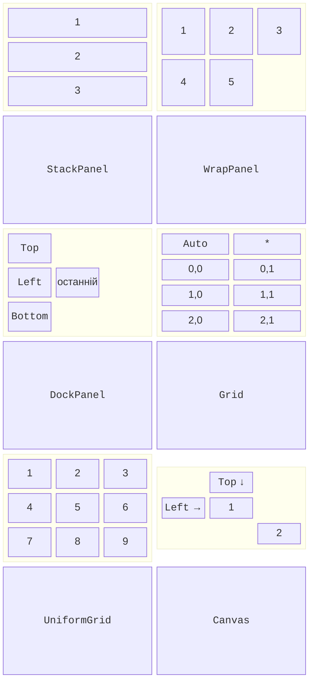

# Компонування та елементи керування

## Система компонування

### Вимірювання й розміщення

WPF розміщує елементи за два проходи (<https://learn.microsoft.com/dotnet/desktop/wpf/advanced/layout>). Під час **вимірювання** (*Measure*) батьківський елемент питає в кожного дочірнього, скільки місця йому потрібно (`DesiredSize`). Під час **розміщення** (*Arrange*) він виділяє кожному дочірньому елементу прямокутник (**комірку**, *layout slot*). Тому кнопка за замовчуванням має розмір свого тексту, а після перекладу інтерфейсу чи збільшення шрифту розміри перераховуються самі.

Положення елемента в комірці задають властивості класу `FrameworkElement`:

- `Margin` – зовнішній відступ: одне число для всіх сторін, `"10,5"` (ліворуч-праворуч, зверху-знизу) або `"5,0,0,0"` (ліворуч, зверху, праворуч, знизу);
- `Padding` – внутрішній відступ від рамки до вмісту (у `Control`, `Border`, `TextBlock`);
- `HorizontalAlignment` і `VerticalAlignment` – `Left`, `Center`, `Right`, `Top`, `Bottom` або `Stretch` (розтягнути на всю комірку, значення за замовчуванням);
- `Width`, `Height` – явний розмір (за замовчуванням `Auto`, тобто `double.NaN`), `MinWidth`, `MaxWidth` – обмеження; фактичний розмір після компонування – `ActualWidth`, `ActualHeight`.

Вікно з `SizeToContent="WidthAndHeight"` саме підганяє розмір під вміст, що зручно для діалогів.

### Панелі компонування

**Панель** (*panel*) – елемент, похідний від `Panel`, який розміщує колекцію `Children` за своїм правилом (рис. 12.6, <https://learn.microsoft.com/dotnet/desktop/wpf/controls/panels-overview>):

- `StackPanel` – елементи один за одним вертикально або горизонтально (`Orientation`);
- `WrapPanel` – у рядок із перенесенням, коли не вистачає місця (картки, мініатюри);
- `DockPanel` – біля країв: `DockPanel.Dock="Top"`, `Bottom`, `Left`, `Right`; останній елемент заповнює решту простору (`LastChildFill="True"`). Порядок елементів важливий: спочатку меню, панель інструментів і рядок стану, наприкінці головний вміст;
- `Grid` – таблиця рядків і стовпців, головна панель для форм;
- `UniformGrid` – таблиця з однаковими клітинками (`Rows`, `Columns`): клавіатура, ігрове поле;
- `Canvas` – абсолютні координати `Canvas.Left`, `Canvas.Top` для графіки й діаграм.



Рис. 12.6. Панелі компонування WPF {.caption}

Панелі вкладають одна в одну: `DockPanel` для вікна, `Grid` для форми, `StackPanel` для кнопок. Крім панелей, часто використовують `Border` (рамка й тло навколо одного елемента), `ScrollViewer` (прокручування вмісту, більшого за вікно) і `Viewbox` (масштабує вміст під доступний розмір).

### Панель `Grid`

Рядки `Grid` описують колекцією `RowDefinitions`, стовпці – `ColumnDefinitions`. Висоту рядка (ширину стовпця) задають трьома способами:

- `Auto` – за найбільшим елементом рядка;
- число – фіксований розмір у незалежних одиницях;
- `*` – частка залишку простору: стовпці `2*` і `3*` ділять залишок у пропорції 2 : 3.

Елемент розміщують приєднаними властивостями `Grid.Row`, `Grid.Column` (нумерація з 0, за замовчуванням 0) і `Grid.RowSpan`, `Grid.ColumnSpan`. Класичний синтаксис визначень – властивості-елементи `<Grid.ColumnDefinitions>` з вкладеними `<ColumnDefinition Width="Auto"/>`; у .NET 10 з’явився короткий запис одним атрибутом `ColumnDefinitions="Auto, *"` (<https://learn.microsoft.com/dotnet/desktop/wpf/whats-new/net100>). `GridSplitter` дає змогу користувачу змінювати ширину стовпців мишею; його розміщують в окремому стовпці `Auto`:

```xml
<Grid ColumnDefinitions="2*, Auto, 3*" RowDefinitions="Auto, *">
    <TextBlock Text="Folders" Margin="4"/>
    <TextBlock Grid.Column="2" Text="Preview" Margin="4"/>
    <ListBox x:Name="folderList" Grid.Row="1"/>
    <GridSplitter Grid.Row="1" Grid.Column="1" Width="5"
                  HorizontalAlignment="Stretch"/>
    <Image Grid.Row="1" Grid.Column="2" Stretch="Uniform"/>
</Grid>
```

Для вікна шириною 484 одиниці стовпці отримують 192, 5 і 287 одиниць: роздільник займає 5, а залишок ділиться у пропорції 2 : 3.

### Приклад «Реєстрація учасника»

Вікно реєстрації на конференцію містить поля імені та електронної пошти, випадний список секції, дату й прапорець майстер-класу. Написи займають стовпець `Auto`, поля – стовпець `*`, тому вони розтягуються разом із вікном; рядок повідомлення має висоту `*` і забирає вільне місце, а кнопки притиснуто до правого краю. Символ `_` у `Content` написів задає клавішу доступу, а властивість `Target` передає фокус полю: **Alt+E** переводить курсор у поле пошти. `IsDefault="True"` натискає кнопку *Register* клавішею **Enter**. `MainWindow.xaml`:

```xml
<Window x:Class="Registration.MainWindow"
    xmlns="http://schemas.microsoft.com/winfx/2006/xaml/presentation"
    xmlns:x="http://schemas.microsoft.com/winfx/2006/xaml"
    Title="Conference Registration" Width="420" Height="320"
    MinWidth="360" MinHeight="300"
    WindowStartupLocation="CenterScreen"
    FocusManager.FocusedElement="{Binding ElementName=nameBox}">
    <Grid Margin="10" ColumnDefinitions="Auto, *"
          RowDefinitions="Auto, Auto, Auto, Auto, Auto, *, Auto">
        <Label Content="_Name:"
               Target="{Binding ElementName=nameBox}"/>
        <TextBox x:Name="nameBox" Grid.Column="1" Margin="3"/>
        <Label Grid.Row="1" Content="_Email:"
               Target="{Binding ElementName=emailBox}"/>
        <TextBox x:Name="emailBox" Grid.Row="1" Grid.Column="1"
                 Margin="3"/>
        <Label Grid.Row="2" Content="_Track:"
               Target="{Binding ElementName=trackBox}"/>
        <ComboBox x:Name="trackBox" Grid.Row="2" Grid.Column="1"
                  Margin="3" SelectedIndex="0">
            <ComboBoxItem Content="Desktop (WPF)"/>
            <ComboBoxItem Content="Web (ASP.NET Core)"/>
            <ComboBoxItem Content="Mobile (.NET MAUI)"/>
        </ComboBox>
        <Label Grid.Row="3" Content="_Date:"
               Target="{Binding ElementName=datePicker}"/>
        <DatePicker x:Name="datePicker" Grid.Row="3" Grid.Column="1"
                    Margin="3"/>
        <CheckBox x:Name="workshopBox" Grid.Row="4" Grid.Column="1"
                  Margin="3" Content="_Workshop (+500 UAH)"/>
        <TextBlock x:Name="messageText" Grid.Row="5"
                   Grid.ColumnSpan="2" Margin="3"
                   TextWrapping="Wrap"/>
        <StackPanel Grid.Row="6" Grid.ColumnSpan="2"
                    Orientation="Horizontal"
                    HorizontalAlignment="Right">
            <Button Content="_Register" IsDefault="True"
                    MinWidth="80" Margin="3" Click="Register_Click"/>
            <Button Content="_Cancel" IsCancel="True" MinWidth="80"
                    Margin="3" Click="Cancel_Click"/>
        </StackPanel>
    </Grid>
</Window>
```

Code-behind перевіряє введення, показує помилки в `messageText` і обчислює вартість участі. Обробники подій WPF мають другий параметр типу `RoutedEventArgs` (розділ «Маршрутизовані події»):

```cs
using System.Windows;
using System.Windows.Controls;

namespace Registration;

public partial class MainWindow : Window
{
    private const decimal BasePrice = 1000m, WorkshopPrice = 500m;

    public MainWindow()
    {
        InitializeComponent();
        datePicker.DisplayDateStart = DateTime.Today;
    }

    private void Register_Click(object sender, RoutedEventArgs e)
    {
        var errors = new List<string>();
        string name = nameBox.Text.Trim();
        string email = emailBox.Text.Trim();
        if (name.Length < 2)
        {
            errors.Add("Enter your name (at least 2 letters).");
        }
        if (!email.Contains('@') || email.EndsWith('@'))
        {
            errors.Add("Enter a valid email.");
        }
        if (datePicker.SelectedDate is not DateTime date
            || date < DateTime.Today)
        {
            errors.Add("Choose a date from today on.");
            date = default;
        }
        if (errors.Count > 0)
        {
            messageText.Text = string.Join("\n", errors);
            return;
        }

        var track = (ComboBoxItem)trackBox.SelectedItem;
        decimal price = BasePrice
            + (workshopBox.IsChecked == true ? WorkshopPrice : 0);
        messageText.Text = $"Registered: {name}, {track.Content}, "
            + $"{date:d}, total {price:N0} UAH.";
    }

    private void Cancel_Click(object sender, RoutedEventArgs e) =>
        Close();
}
```

Властивість `IsChecked` має тип `bool?` (прапорець може мати третій, невизначений стан), тому її порівнюють з `true`. Для змінної `date` у гілці помилки присвоєно `default`: після `is not` компілятор вважає її непризначеною. Після натискання *Register* у порожній формі повідомлення має три рядки: `Enter your name (at least 2 letters).`, `Enter a valid email.` і `Choose a date from today on.`

Для імені Olena Kovalenko, пошти `olena@example.com`, секції *Desktop (WPF)*, дати 15.10.2026 і майстер-класу з’являється рядок `Registered: Olena Kovalenko, Desktop (WPF), 15.10.2026, total 1 500 UAH.`, а кнопка *Cancel* (`IsCancel="True"`, клавіша **Esc**) закриває вікно. Якщо розширити вікно, поля розтягуються, а кнопки залишаються біля правого краю (рис. 12.7).


Рис. 12.7. Форма реєстрації на панелі `Grid` {.caption}

## Елементи керування та модель вмісту

Елементи керування WPF поділяють за **моделлю вмісту** (*content model*) – тим, що і скільки вони можуть містити (<https://learn.microsoft.com/dotnet/desktop/wpf/controls/>):

- `ContentControl` має один об’єкт у властивості `Content`: `Button`, `CheckBox`, `RadioButton`, `Label`, `ToolTip`, `Window`. Рядок відображається як текст, елемент (`StackPanel`, `Image`) – як є, а інший об’єкт – результатом `ToString()` (або шаблоном даних, тема 13);
- `HeaderedContentControl` додає заголовок `Header`: `GroupBox`, `Expander`, `TabItem`;
- `ItemsControl` показує колекцію `Items` або `ItemsSource`: `ListBox`, `ComboBox`, `ListView`, `TreeView`, `TabControl`, `Menu`;
- решта мають власні властивості: `TextBox.Text`, `PasswordBox.Password`, `Slider.Value`, `Image.Source`.

Найуживаніші елементи наведено в табл. 12.2.

Таблиця 12.2. Основні елементи керування WPF {.caption}

| **Елемент** | **Призначення та властивості** | **Подія** |
| --- | --- | --- |
| `TextBlock`, `Label` | текст: `Text` (`TextBlock`, легкий); `Content` і `Target` (`Label`, клавіша доступу) | – |
| `TextBox` | поле введення: `Text`, `AcceptsReturn`, `IsReadOnly`, `MaxLength` | `TextChanged` |
| `Button` | кнопка: `Content`, `IsDefault`, `IsCancel`, `Command` | `Click` |
| `CheckBox`, `RadioButton` | `IsChecked` (`bool?`); перемикачі групуються `GroupName` або спільним батьківським елементом | `Checked`, `Click` |
| `ComboBox`, `ListBox` | `Items`, `ItemsSource`, `SelectedItem`, `SelectedIndex` | `SelectionChanged` |
| `Slider` | `Minimum`, `Maximum`, `Value` (`double`), `IsSnapToTickEnabled` | `ValueChanged` |
| `TabControl`, `Expander` | вкладки `TabItem`; розгортання `IsExpanded` | `SelectionChanged`, `Expanded` |
| `ListView`, `TreeView` | таблиця `GridView`; ієрархія `TreeViewItem` | `SelectionChanged`, `SelectedItemChanged` |

Клавішу доступу в WPF позначає символ `_`, а не `&`: `Content="_Save"`.
