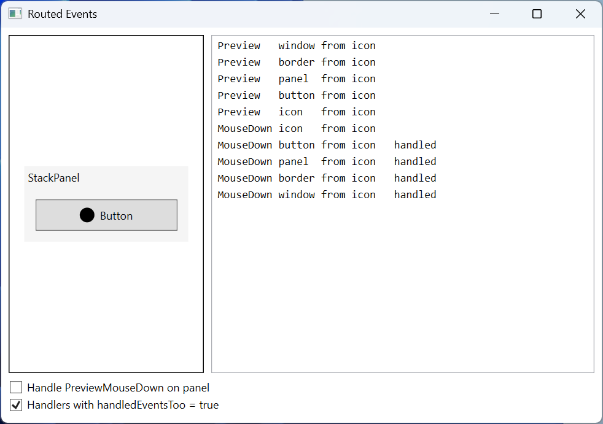
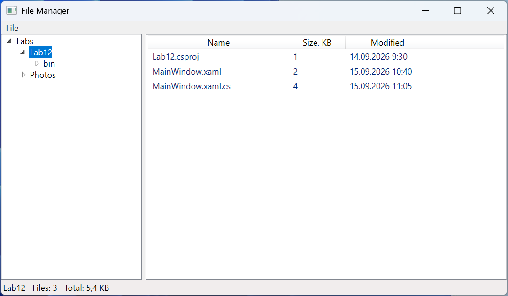

# Практика

## Приклад 1. Конвертер одиниць

Створити застосунок WPF, який перетворює значення між одиницями довжини, маси й температури. Кожна категорія розміщується на окремій вкладці `TabControl`. Значення вводять у поле або задають повзунком `Slider`, одиниці обирають у двох списках `ComboBox`, кнопка *Swap* міняє їх місцями, а результат оновлюється після кожної зміни.

Одиниці описано записами: лінійну одиницю задає множник до базової (метр, кілограм), а для температури перетворення нелінійне, тому запис зберігає дві функції. Файл `Units.cs`:

```cs
namespace UnitConverter;

// Одиниця вимірювання: перетворення в базову одиницю та назад.
public record Unit(string Symbol, Func<double, double> ToBase,
    Func<double, double> FromBase)
{
    public static Unit Linear(string symbol, double factor) =>
        new(symbol, v => v * factor, v => v / factor);

    public override string ToString() => Symbol;   // для ComboBox
}

public record Category(string Name, double Min, double Max,
    Unit[] Units)
{
    public static readonly Category[] All =
    [
        new("Length", 0, 1000,
        [
            Unit.Linear("m", 1), Unit.Linear("km", 1000),
            Unit.Linear("cm", 0.01), Unit.Linear("mi", 1609.344),
            Unit.Linear("ft", 0.3048), Unit.Linear("in", 0.0254)
        ]),
        new("Mass", 0, 1000,
        [
            Unit.Linear("kg", 1), Unit.Linear("g", 0.001),
            Unit.Linear("t", 1000), Unit.Linear("lb", 0.45359237),
            Unit.Linear("oz", 0.028349523125)
        ]),
        new("Temperature", -100, 200,
        [
            Unit.Linear("°C", 1),
            new("°F", f => (f - 32) * 5 / 9, c => c * 9 / 5 + 32),
            new("K", k => k - 273.15, c => c + 273.15)
        ])
    ];
}
```

Вкладки однакові, тому їхній вміст винесено в користувацький елемент `ConverterPanel`, який отримує категорію в конструкторі. `ConverterPanel.xaml`:

```xml
<UserControl x:Class="UnitConverter.ConverterPanel"
    xmlns="http://schemas.microsoft.com/winfx/2006/xaml/presentation"
    xmlns:x="http://schemas.microsoft.com/winfx/2006/xaml">
    <Grid Margin="8" ColumnDefinitions="Auto, *, Auto"
          RowDefinitions="Auto, Auto, Auto, Auto">
        <Label Content="_Value:"
               Target="{Binding ElementName=valueBox}"/>
        <TextBox x:Name="valueBox" Grid.Column="1" Margin="3"
                 TextChanged="ValueBox_TextChanged"/>
        <ComboBox x:Name="fromBox" Grid.Column="2" Margin="3"
                  MinWidth="60"
                  SelectionChanged="Unit_SelectionChanged"/>

        <Slider x:Name="valueSlider" Grid.Row="1" Grid.Column="1"
                Margin="3" ValueChanged="Slider_ValueChanged"/>

        <Label Grid.Row="2" Content="_To:"
               Target="{Binding ElementName=toBox}"/>
        <Button Grid.Row="2" Grid.Column="1" Content="_Swap"
                HorizontalAlignment="Right" Margin="3" Padding="8,0"
                Click="Swap_Click"/>
        <ComboBox x:Name="toBox" Grid.Row="2" Grid.Column="2"
                  Margin="3"
                  SelectionChanged="Unit_SelectionChanged"/>

        <TextBlock x:Name="resultText" Grid.Row="3"
                   Grid.ColumnSpan="3" Margin="3,8"
                   FontSize="16" FontWeight="Bold"/>
    </Grid>
</UserControl>
```

`ConverterPanel.xaml.cs`:

```cs
using System.Windows;
using System.Windows.Controls;

namespace UnitConverter;

public partial class ConverterPanel : UserControl
{
    private bool updating;   // захист від взаємних викликів подій

    public ConverterPanel(Category category)
    {
        InitializeComponent();
        valueSlider.Minimum = category.Min;
        valueSlider.Maximum = category.Max;
        fromBox.ItemsSource = category.Units;
        toBox.ItemsSource = category.Units;
        fromBox.SelectedIndex = 0;
        toBox.SelectedIndex = 1;
        valueBox.Text = "1";
    }

    private void Slider_ValueChanged(object sender,
        RoutedPropertyChangedEventArgs<double> e)
    {
        if (updating)
        {
            return;
        }
        updating = true;
        valueBox.Text = $"{e.NewValue:0.#}";
        updating = false;
        Convert();
    }

    private void ValueBox_TextChanged(object sender,
        TextChangedEventArgs e)
    {
        if (!updating && double.TryParse(valueBox.Text, out double v))
        {
            updating = true;
            valueSlider.Value = v;   // Slider обмежує значення сам
            updating = false;
        }
        Convert();
    }

    private void Unit_SelectionChanged(object sender,
        SelectionChangedEventArgs e) => Convert();

    private void Swap_Click(object sender, RoutedEventArgs e) =>
        (fromBox.SelectedIndex, toBox.SelectedIndex) =
            (toBox.SelectedIndex, fromBox.SelectedIndex);

    private void Convert()
    {
        if (fromBox.SelectedItem is not Unit from
            || toBox.SelectedItem is not Unit to)
        {
            return;
        }
        if (!double.TryParse(valueBox.Text, out double value))
        {
            resultText.Text = "Enter a number";
            return;
        }
        double result = to.FromBase(from.ToBase(value));
        resultText.Text =
            $"{value:0.###} {from} = {result:0.###} {to}";
    }
}
```

Головне вікно містить лише `<TabControl x:Name="categoryTabs" Margin="6"/>` і створює вкладки в коді (`MainWindow.xaml.cs`):

```cs
using System.Windows;
using System.Windows.Controls;

namespace UnitConverter;

public partial class MainWindow : Window
{
    public MainWindow()
    {
        InitializeComponent();
        foreach (Category category in Category.All)
        {
            categoryTabs.Items.Add(new TabItem
            {
                Header = category.Name,
                Content = new ConverterPanel(category)
            });
        }
        categoryTabs.SelectedIndex = 0;
    }
}
```

Повзунок і поле змінюють одне одного: присвоювання `valueBox.Text` генерує `TextChanged`, а зміна `valueSlider.Value` – `ValueChanged`. Прапорець `updating` розриває це коло, інакше під час введення `12,` повзунок переписав би текст на `12` і стер кому. `ComboBox` показує записи `Unit` через перевизначений `ToString()`.

Після запуску вкладка *Length* показує `1 m = 0,001 km`. Для `42,195` з одиницями *km* і *mi* – `42,195 km = 26,219 mi`, а після *Swap* – `42,195 mi = 67,906 km`. Значення 5000 більше за максимум повзунка (1000): повзунок зупиняється на краю, а результат обчислюється з тексту (`5000 m = 3,107 mi`). Для `abc` напис показує `Enter a number`. На вкладці *Mass*: `70 kg = 154,324 lb`, на вкладці *Temperature*: `36,6 °C = 97,88 °F`, `-40 °F = -40 °C`, `0 K = -273,15 °C` (рис. 12.11).


Рис. 12.11. Застосунок «Конвертер одиниць» {.caption}

## Приклад 2. Демонстратор маршрутизованих подій

Створити застосунок WPF, який показує маршрут подій `PreviewMouseDown` і `MouseDown` через вкладені елементи `Window`, `Border`, `StackPanel`, `Button` і `Ellipse`. Кожен обробник дописує у список рядок з назвою події, елементом-слухачем, джерелом `OriginalSource` і позначкою `handled`. Прапорці дають змогу позначити тунельну подію обробленою на панелі та підключити обробники з параметром `handledEventsToo`. `MainWindow.xaml`:

```xml
<Window x:Class="EventDemo.MainWindow"
    xmlns="http://schemas.microsoft.com/winfx/2006/xaml/presentation"
    xmlns:x="http://schemas.microsoft.com/winfx/2006/xaml"
    x:Name="window" Title="Routed Events" Width="600" Height="330">
    <Grid Margin="8" ColumnDefinitions="220, *"
          RowDefinitions="*, Auto">
        <Border x:Name="border" BorderBrush="Black"
                BorderThickness="1" Padding="16" Margin="0,0,8,0">
            <StackPanel x:Name="panel" Background="WhiteSmoke"
                        VerticalAlignment="Center">
                <TextBlock Text="StackPanel" Margin="4"/>
                <Button x:Name="button" Margin="12" Padding="8">
                    <StackPanel Orientation="Horizontal">
                        <Ellipse x:Name="icon" Width="16" Height="16"
                                 Fill="Black" Margin="0,0,6,0"/>
                        <TextBlock Text="Button"/>
                    </StackPanel>
                </Button>
            </StackPanel>
        </Border>
        <ListBox x:Name="logList" Grid.Column="1"
                 FontFamily="Consolas"/>
        <StackPanel Grid.Row="1" Grid.ColumnSpan="2" Margin="0,8,0,0">
            <CheckBox x:Name="stopBox"
                      Content="Handle PreviewMouseDown on panel"/>
            <CheckBox x:Name="handledTooBox" Margin="0,4"
                      Content="Handlers with handledEventsToo = true"
                      Click="HandledTooBox_Click"/>
        </StackPanel>
    </Grid>
</Window>
```

`MainWindow.xaml.cs`:

```cs
using System.Windows;
using System.Windows.Input;

namespace EventDemo;

public partial class MainWindow : Window
{
    private readonly FrameworkElement[] elements;
    private readonly MouseButtonEventHandler previewHandler;
    private readonly MouseButtonEventHandler bubbleHandler;

    public MainWindow()
    {
        InitializeComponent();
        elements = [this, border, panel, button, icon];
        previewHandler = OnPreviewMouseDown;
        bubbleHandler = OnMouseDown;
        Subscribe(handledEventsToo: false);
    }

    private void Subscribe(bool handledEventsToo)
    {
        foreach (FrameworkElement element in elements)
        {
            element.RemoveHandler(PreviewMouseDownEvent,
                previewHandler);
            element.RemoveHandler(MouseDownEvent, bubbleHandler);
            element.AddHandler(PreviewMouseDownEvent, previewHandler,
                handledEventsToo);
            element.AddHandler(MouseDownEvent, bubbleHandler,
                handledEventsToo);
        }
    }

    private void OnPreviewMouseDown(object sender,
        MouseButtonEventArgs e)
    {
        if (!IsInDemo(e))
        {
            return;
        }
        if (sender == this && logList.Items.Count > 0)
        {
            logList.Items.Add("");          // нове натискання
        }
        Log("Preview", sender, e);
        if (sender == panel && stopBox.IsChecked == true)
        {
            e.Handled = true;
        }
    }

    private void OnMouseDown(object sender, MouseButtonEventArgs e)
    {
        if (IsInDemo(e))
        {
            Log("MouseDown", sender, e);
        }
    }

    // Лише натискання в рамці border, а не на прапорцях чи списку.
    private bool IsInDemo(RoutedEventArgs e) =>
        e.OriginalSource is DependencyObject source
        && (source == border || border.IsAncestorOf(source));

    private void Log(string name, object sender, RoutedEventArgs e)
    {
        string element = ((FrameworkElement)sender).Name;
        string source = (e.OriginalSource as FrameworkElement)?.Name
            ?? e.OriginalSource.GetType().Name;
        string handled = e.Handled ? "handled" : "";
        logList.Items.Add(
            $"{name,-9} {element,-6} from {source,-6} {handled}");
    }

    private void HandledTooBox_Click(object sender,
        RoutedEventArgs e) =>
        Subscribe(handledTooBox.IsChecked == true);
}
```

Обробники підключаються методом `AddHandler`: тільки так можна задати `handledEventsToo`, а для зміни параметра обробник видаляють (`RemoveHandler`) і підключають знову. Імена елементів (`x:Name`) доступні через `FrameworkElement.Name`; для елемента без імені виводиться назва типу, наприклад `TextBlock` після клацання по написі кнопки.

Клацання по чорному колу на кнопці за замовчуванням дає п’ять рядків `Preview` (`window`, `border`, `panel`, `button`, `icon`, усі `from icon`) і лише один рядок `MouseDown icon from icon`. Тунельна подія пройшла від вікна до кола, а спливаюча зупинилася на колі: кнопка позначила `MouseLeftButtonDown` (а отже, і спільні дані `MouseDown`) обробленими й згенерувала `Click`. Клацання по панелі поза кнопкою дає повний маршрут: `MouseDown` на `panel`, `border`, `window`. Якщо увімкнути *Handlers with handledEventsToo = true*, після `MouseDown icon` з’являються рядки `MouseDown button from icon handled`, а далі `panel`, `border` і `window` з тією самою позначкою. Якщо ж позначити `PreviewMouseDown` обробленим на панелі без `handledEventsToo`, журнал закінчується рядком `Preview panel from icon`: звичайні обробники кнопки й кола вже не викликаються (рис. 12.12).



Рис. 12.12. Застосунок «Демонстратор маршрутизованих подій» {.caption}

## Приклад 3. Файловий менеджер

Створити застосунок WPF для перегляду файлів: ліворуч дерево папок `TreeView`, праворуч таблиця файлів `ListView` зі стовпцями *Name*, *Size, KB* і *Modified*, між ними `GridSplitter`. Команда меню *File → Open Folder…* (**Ctrl+O**) обирає кореневу папку діалогом `OpenFolderDialog`. Вкладені папки завантажуються лише під час розгортання вузла, а рядок стану показує кількість і загальний розмір файлів вибраної папки. Помилки доступу виводяться в рядок стану. `MainWindow.xaml`:

```xml
<Window x:Class="FileManager.MainWindow"
    xmlns="http://schemas.microsoft.com/winfx/2006/xaml/presentation"
    xmlns:x="http://schemas.microsoft.com/winfx/2006/xaml"
    Title="File Manager" Width="640" Height="380">
    <Window.CommandBindings>
        <CommandBinding Command="Open" Executed="Open_Executed"/>
    </Window.CommandBindings>
    <DockPanel>
        <Menu DockPanel.Dock="Top">
            <MenuItem Header="_File">
                <MenuItem Header="_Open Folder..." Command="Open"/>
                <Separator/>
                <MenuItem Header="E_xit" Click="Exit_Click"/>
            </MenuItem>
        </Menu>
        <StatusBar DockPanel.Dock="Bottom">
            <StatusBarItem x:Name="statusItem"/>
        </StatusBar>
        <Grid ColumnDefinitions="200, Auto, *">
            <TreeView x:Name="folderTree"
                TreeViewItem.Expanded="Folder_Expanded"
                SelectedItemChanged="Folder_SelectedItemChanged"/>
            <GridSplitter Grid.Column="1" Width="5"
                          HorizontalAlignment="Stretch"/>
            <ListView x:Name="fileList" Grid.Column="2">
                <ListView.View>
                    <GridView>
                        <GridViewColumn Header="Name" Width="200"
                          DisplayMemberBinding="{Binding Name}"/>
                        <GridViewColumn Header="Size, KB" Width="80"
                          DisplayMemberBinding="{Binding Size}"/>
                        <GridViewColumn Header="Modified" Width="120"
                          DisplayMemberBinding="{Binding Modified}"/>
                    </GridView>
                </ListView.View>
            </ListView>
        </Grid>
    </DockPanel>
</Window>
```

`MainWindow.xaml.cs`:

```cs
using System.IO;
using System.Windows;
using System.Windows.Controls;
using System.Windows.Input;
using Microsoft.Win32;

namespace FileManager;

// Рядок таблиці файлів: значення вже відформатовано.
public record FileRow(string Name, string Size, string Modified);

public partial class MainWindow : Window
{
    private const string Placeholder = "...";  // «ще не завантажено»

    public MainWindow()
    {
        InitializeComponent();
        OpenFolder(Environment.GetFolderPath(
            Environment.SpecialFolder.MyDocuments));
    }

    public void OpenFolder(string path)
    {
        folderTree.Items.Clear();
        var root = CreateItem(new DirectoryInfo(path));
        folderTree.Items.Add(root);
        root.IsExpanded = true;       // генерує подію Expanded
        root.IsSelected = true;
    }

    private static TreeViewItem CreateItem(DirectoryInfo dir)
    {
        var item = new TreeViewItem { Header = dir.Name, Tag = dir };
        item.Items.Add(Placeholder);   // з’явиться стрілка
        return item;
    }

    // Подія Expanded спливає від вузла TreeViewItem до TreeView.
    private void Folder_Expanded(object sender, RoutedEventArgs e)
    {
        if (e.OriginalSource is not TreeViewItem
            { Tag: DirectoryInfo dir } item
            || item.Items.Count != 1
            || item.Items[0] as string != Placeholder)
        {
            return;                   // уже завантажено
        }
        item.Items.Clear();
        try
        {
            foreach (DirectoryInfo sub in dir.EnumerateDirectories())
            {
                item.Items.Add(CreateItem(sub));
            }
        }
        catch (Exception ex) when (ex is UnauthorizedAccessException
            or IOException)
        {
            statusItem.Content = ex.Message;
        }
    }

    private void Folder_SelectedItemChanged(object sender,
        RoutedPropertyChangedEventArgs<object> e)
    {
        if (e.NewValue is not TreeViewItem { Tag: DirectoryInfo dir })
        {
            return;
        }
        try
        {
            FileInfo[] files = dir.GetFiles();
            fileList.ItemsSource = files
                .OrderBy(f => f.Name)
                .Select(f => new FileRow(f.Name,
                    $"{Math.Ceiling(f.Length / 1024.0):N0}",
                    $"{f.LastWriteTime:g}"))
                .ToList();
            long total = files.Sum(f => f.Length);
            statusItem.Content = $"{dir.Name}   Files: {files.Length}"
                + $"   Total: {total / 1024.0:N1} KB";
        }
        catch (Exception ex) when (ex is UnauthorizedAccessException
            or IOException)
        {
            fileList.ItemsSource = null;
            statusItem.Content = ex.Message;
        }
    }

    private void Open_Executed(object sender,
        ExecutedRoutedEventArgs e)
    {
        var dialog = new OpenFolderDialog
        {
            Title = "Choose a folder"
        };
        if (dialog.ShowDialog(this) == true)
        {
            OpenFolder(dialog.FolderName);
        }
    }

    private void Exit_Click(object sender, RoutedEventArgs e) =>
        Close();
}
```

Кожен новий вузол отримує «заповнювач» `...`, завдяки якому `TreeView` показує стрілку. Подія `Expanded` вузла `TreeViewItem` спливає, тому один обробник, підключений до `TreeView` атрибутом `TreeViewItem.Expanded`, обслуговує всі вузли: `e.OriginalSource` – вузол, який розгорнули. `ListView` з поданням `GridView` показує властивості об’єктів `FileRow` через `DisplayMemberBinding` (прив’язка даних, тема 13). Значення форматуються в коді з регіональними налаштуваннями користувача: прив’язка з `StringFormat` за замовчуванням використовує мову en-US.

Для папки `Labs` із файлом `readme.txt` і папками `Lab12` та `Photos` рядок стану показує `Labs Files: 1 Total: 0,1 KB`. Після вибору `Lab12` таблиця містить рядки `Lab12.csproj` (1 KB, `14.09.2026 9:30`), `MainWindow.xaml` (2 KB) і `MainWindow.xaml.cs` (4 KB, `15.09.2026 11:05`), а рядок стану – `Lab12 Files: 3 Total: 5,4 KB`. Для папки `Photos\2026` з фото розміром 2 457 600 байтів – `2026 Files: 1 Total: 2 400,0 KB` (рис. 12.13).



Рис. 12.13. Застосунок «Файловий менеджер» {.caption}
