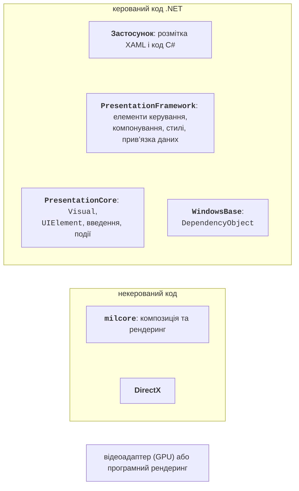
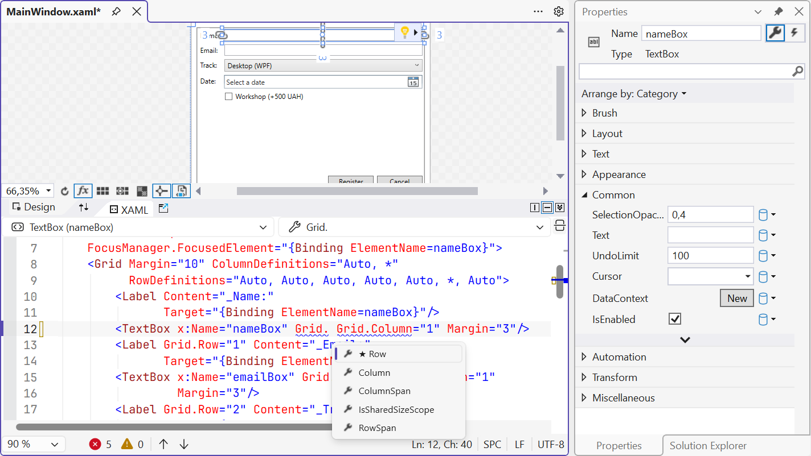
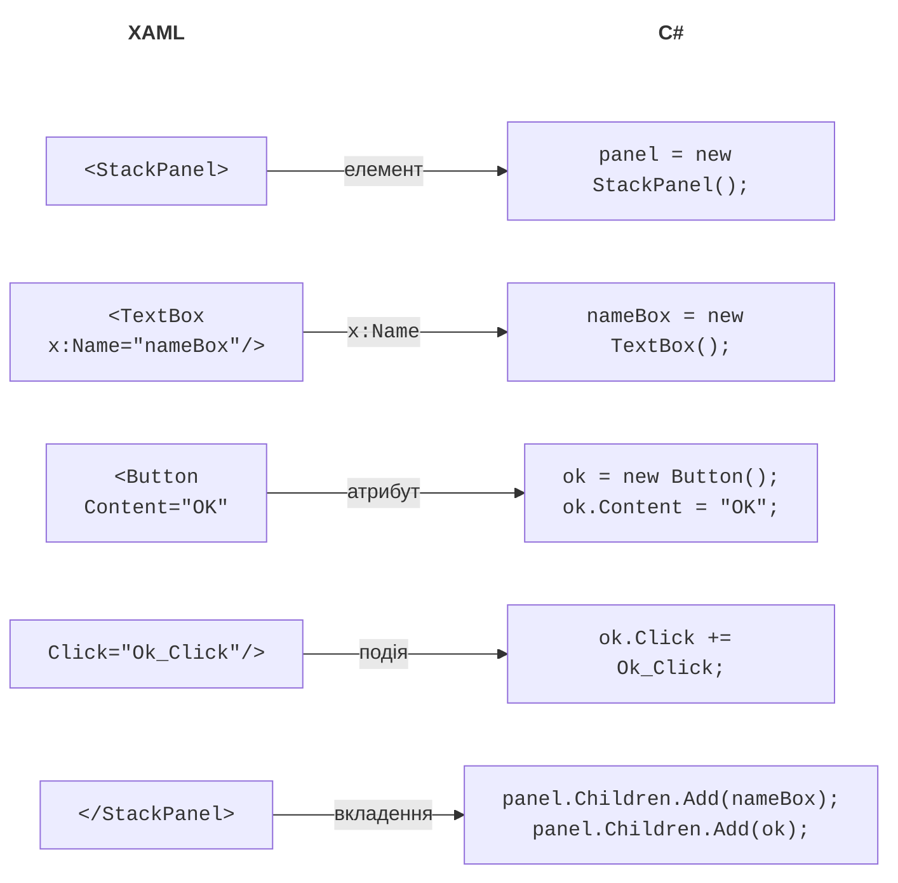
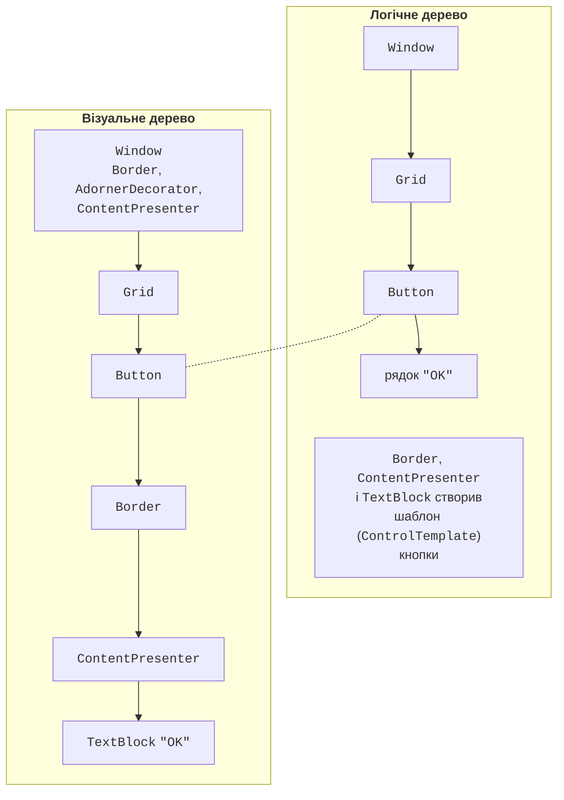

# WPF, XAML і дерева елементів

## Технологія WPF та її архітектура

**Windows Presentation Foundation** (WPF) – технологія створення настільних застосунків для Windows, у якій інтерфейс описують декларативною мовою розмітки **XAML**, а поведінку програмують мовою C#. WPF з’явилася 2006 року в .NET Framework 3.0; сучасна версія входить до .NET, має відкритий код і працює лише у Windows (<https://learn.microsoft.com/dotnet/desktop/wpf/overview/>).

Головні відмінності WPF від Windows Forms (тема 3) наведено в табл. 12.1. Windows Forms «обгортає» стандартні вікна Windows і малює їх засобами GDI/GDI+, а WPF малює весь інтерфейс сама через DirectX. Тому кнопка WPF може містити зображення, таблицю чи іншу кнопку, будь-який елемент можна повернути, масштабувати або анімувати, а вигляд елементів повністю змінюється стилями й шаблонами.

Таблиця 12.1. Порівняння Windows Forms і WPF {.caption}

| **Ознака** | **Windows Forms** | **WPF** |
| --- | --- | --- |
| опис інтерфейсу | код C# у `*.Designer.cs` | розмітка XAML (`*.xaml`) |
| рендеринг | GDI/GDI+, вікна Windows | DirectX, векторна графіка |
| одиниці розміру | пікселі екрана | незалежні від пристрою одиниці (1/96 дюйма) |
| розміщення | координати, `Anchor`, `Dock` | панелі компонування, розмір за вмістом |
| вигляд | властивості кольору й шрифту | стилі, шаблони, теми |

Основна одиниця розміру WPF – **незалежний від пристрою піксель** (*device-independent pixel*), що дорівнює 1/96 дюйма. `Width="96"` на екрані з масштабом 100 % займає 96 фізичних пікселів, а з масштабом 150 % – 144, тому інтерфейс однаково чіткий на звичайних моніторах і моніторах високої роздільності. Координати й розміри мають тип `double`.

Архітектуру WPF показано на рис. 12.1 (<https://learn.microsoft.com/dotnet/desktop/wpf/advanced/wpf-architecture>). Застосунок працює з керованими збірками: **PresentationFramework** (вікна, елементи керування, панелі, стилі, прив’язка даних), **PresentationCore** (візуальні об’єкти, введення, маршрутизовані події) і **WindowsBase** (властивості залежностей, диспетчер потоку). Нижче лежить некерований компонент **milcore**, написаний для тісної інтеграції з DirectX: він компонує зображення й передає його відеоадаптеру.



Рис. 12.1. Архітектура WPF {.caption}

WPF використовує **збережений режим** рендерингу (*retained mode*). У Windows Forms програма сама малює в обробнику `Paint` щоразу, коли вікно треба оновити (тема 4). У WPF програма створює дерево об’єктів (`Button`, `Ellipse`, `TextBlock`), а система зберігає їхні інструкції малювання й перемальовує вікно без участі коду користувача. Щоб змінити зображення, досить змінити властивість об’єкта, наприклад `ellipse.Width = 50`.

## Проєкт WPF

### Створення проєкту

Для роботи потрібне робоче навантаження *.NET desktop development* у Visual Studio 2026. Проєкт створюють так (<https://learn.microsoft.com/dotnet/desktop/wpf/get-started/create-app-visual-studio>):

1. *File → New → Project…* або *Create a new project* у стартовому вікні.
2. У полі *Search for templates* ввести `wpf`, обрати мову C# і шаблон *WPF Application* (не *WPF Application (.NET Framework)*).
3. Задати *Project name* і *Location*, натиснути *Next*.
4. У вікні *Additional information* обрати *Framework*: *.NET 10.0 (Long Term Support)* і натиснути *Create*.

Той самий проєкт створює команда `dotnet new wpf -n Registration`. Файл проєкту відрізняється від Windows Forms лише властивістю `<UseWPF>true</UseWPF>` замість `UseWindowsForms` (цільовий фреймворк так само `net10.0-windows`, тип виходу `WinExe`). Неявні директиви `using` для WPF не додають просторів імен `System.Windows…`, тому шаблон записує їх на початку файлів коду явно.

### Файли проєкту

Шаблон створює такі файли:

- `App.xaml` і `App.xaml.cs` – клас застосунку `App`, похідний від `Application`. Атрибут `StartupUri="MainWindow.xaml"` задає вікно, яке відкривається під час запуску, а розділ `Application.Resources` – ресурси всього застосунку. Метод `Main` генерує компілятор;
- `MainWindow.xaml` – розмітка головного вікна;
- `MainWindow.xaml.cs` – **код програмної логіки** (*code-behind*) вікна: конструктор і обробники подій;
- `AssemblyInfo.cs` – атрибут `ThemeInfo`, потрібний для власних елементів керування з темами.

Шаблон `MainWindow.xaml` містить кореневий елемент `Window` з атрибутом `x:Class`, просторами імен `xmlns` і порожньою панеллю `Grid` усередині.

Атрибут `x:Class` пов’язує розмітку з класом `Registration.MainWindow`. Під час збирання компілятор XAML перетворює розмітку на двійковий формат BAML (вбудовується у збірку) і генерує файл `MainWindow.g.cs` з другою частиною класу: полями для іменованих елементів і методом `InitializeComponent`. Тому клас у `MainWindow.xaml.cs` оголошено з модифікатором `partial`, а його конструктор викликає `InitializeComponent()`, який завантажує розмітку, створює об’єкти та підписує обробники подій:

```cs
public partial class MainWindow : Window
{
    public MainWindow()
    {
        InitializeComponent();
    }
}
```

На відміну від `*.Designer.cs` у Windows Forms, розмітку XAML зазвичай пишуть і редагують вручну: редактор XAML підказує елементи, атрибути й значення (IntelliSense), а конструктор (*XAML designer*) одразу показує результат (рис. 12.2). Елементи можна перетягувати з *Toolbox*, але конструктор тоді додає фіксовані `Margin`, `Width` і `Height`, які заважають компонуванню.



Рис. 12.2. Конструктор і редактор XAML у Visual Studio 2026 {.caption}

## Мова розмітки XAML

**XAML** (*Extensible Application Markup Language*) – мова на основі XML, у якій кожен **елемент** створює об’єкт класу, а кожен **атрибут** задає властивість або підписує обробник події (<https://learn.microsoft.com/dotnet/desktop/wpf/xaml/>). Розмітка з рис. 12.3 під час виконання дає той самий результат, що й наведений праворуч код C#.



Рис. 12.3. Відповідність розмітки XAML і коду C# {.caption}

Правила синтаксису:

- XAML чутлива до регістру: `<Button>`, а не `<button>`; кожен елемент закривається (`<TextBox/>` або `<Button>…</Button>`);
- **простори імен** XML: `xmlns` без префікса відповідає елементам WPF, `xmlns:x` – мовним конструкціям XAML (`x:Class`, `x:Name`, `x:Key`, `x:Static`), а `xmlns:local="clr-namespace:…"` – класам власного проєкту (`<local:StarRatingControl/>`);
- `x:Name` дає елементу ім’я: у класі вікна з’являється поле, доступне в code-behind;
- **конвертери типів** (*type converters*) перетворюють рядок атрибута на потрібний тип: `Margin="5,0,0,0"` – на `Thickness`, `Background="LightGray"` – на `SolidColorBrush`, `Width="Auto"` – на `double.NaN`;
- **синтаксис властивості-елемента** (*property element*) `<Тип.Властивість>` задає складне значення, яке не записати рядком;
- **властивість вмісту** (*content property*): вкладений елемент без обгортки потрапляє у властивість, позначену атрибутом `ContentProperty`, наприклад у `Content` кнопки або `Children` панелі;
- **приєднані властивості** (*attached properties*) `Grid.Row="1"`, `DockPanel.Dock="Top"` оголошено в іншому класі (батьківській панелі), а задають на дочірньому елементі.

Наприклад, `<Button.ToolTip><ToolTip Content="Save"/></Button.ToolTip>` усередині `<Button>` – властивість-елемент, а вкладена `<StackPanel>` з колом `Ellipse` і написом `TextBlock` – вміст кнопки: у WPF кнопка може містити будь-яке дерево елементів.

**Розширення розмітки** (*markup extensions*) записують у фігурних дужках. Вони обчислюють значення під час завантаження розмітки або пізніше:

- `{StaticResource AccentBrush}` – ресурс за ключем (розділ «Ресурси»);
- `{x:Static SystemColors.GrayTextBrush}` – значення статичного члена класу;
- `{Binding Value, ElementName=bookRating}` – прив’язка даних (детально – тема 13);
- `{x:Null}` – значення `null`.

Щоб записати в атрибуті текст, який починається з `{`, перед ним ставлять `{}`: `Text="{}{0}"`.

## Логічне та візуальне дерева

Елементи інтерфейсу WPF утворюють дерево (рис. 12.4) (<https://learn.microsoft.com/dotnet/desktop/wpf/advanced/trees-in-wpf>). **Логічне дерево** відповідає розмітці: вікно містить `Grid`, `Grid` – кнопку, кнопка – рядок «OK». Логічне дерево визначає успадкування значень властивостей (наприклад, `FontSize`) і пошук ресурсів. **Візуальне дерево** містить усе, що фактично малюється: шаблон кнопки (`ControlTemplate`) створює `Border`, `ContentPresenter` і `TextBlock`. Візуальне дерево визначає маршрут подій і перевірку влучання миші. Обходять дерева класи `LogicalTreeHelper` і `VisualTreeHelper`.



Рис. 12.4. Логічне та візуальне дерева вікна з кнопкою (пунктир – той самий об’єкт `Button`) {.caption}

### Інструменти налагодження XAML

Під час налагодження (**F5**, конфігурація *Debug*) Visual Studio 2026 показує над вікном застосунку **панель інструментів у застосунку** (*in-app toolbar*) і дає доступ до таких інструментів (<https://learn.microsoft.com/visualstudio/xaml-tools/inspect-xaml-properties-while-debugging>):

- *Live Visual Tree* (*Debug → Windows → Live Visual Tree*) – візуальне дерево запущеного вікна. Кнопка *Show Just My XAML* перемикає між елементами з вашої розмітки та повним деревом із шаблонами. Режим *Select Element in the Running Application* знаходить у дереві елемент, на якому клацнули у вікні застосунку, а *Display Layout Adorners* показує його межі й відступи;
- *Live Property Explorer* – фактичні значення властивостей виділеного елемента з джерелом значення (локальне, стиль, успадковане, за замовчуванням); значення можна змінити просто під час роботи (рис. 12.5);
- **XAML Hot Reload** – зміни розмітки застосовуються до запущеного застосунку після збереження файлу без перезапуску, зі збереженням стану вікна (<https://learn.microsoft.com/visualstudio/xaml-tools/xaml-hot-reload>). Зміни коду C# застосовує .NET Hot Reload (кнопка з полум’ям на панелі Visual Studio), але деякі зміни (новий клас, зміна сигнатури) потребують перезапуску.


Рис. 12.5. *Live Visual Tree* і *Live Property Explorer* {.caption}
