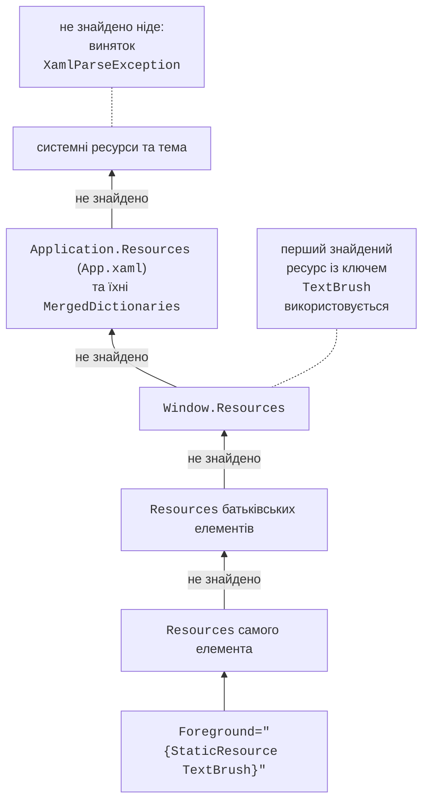
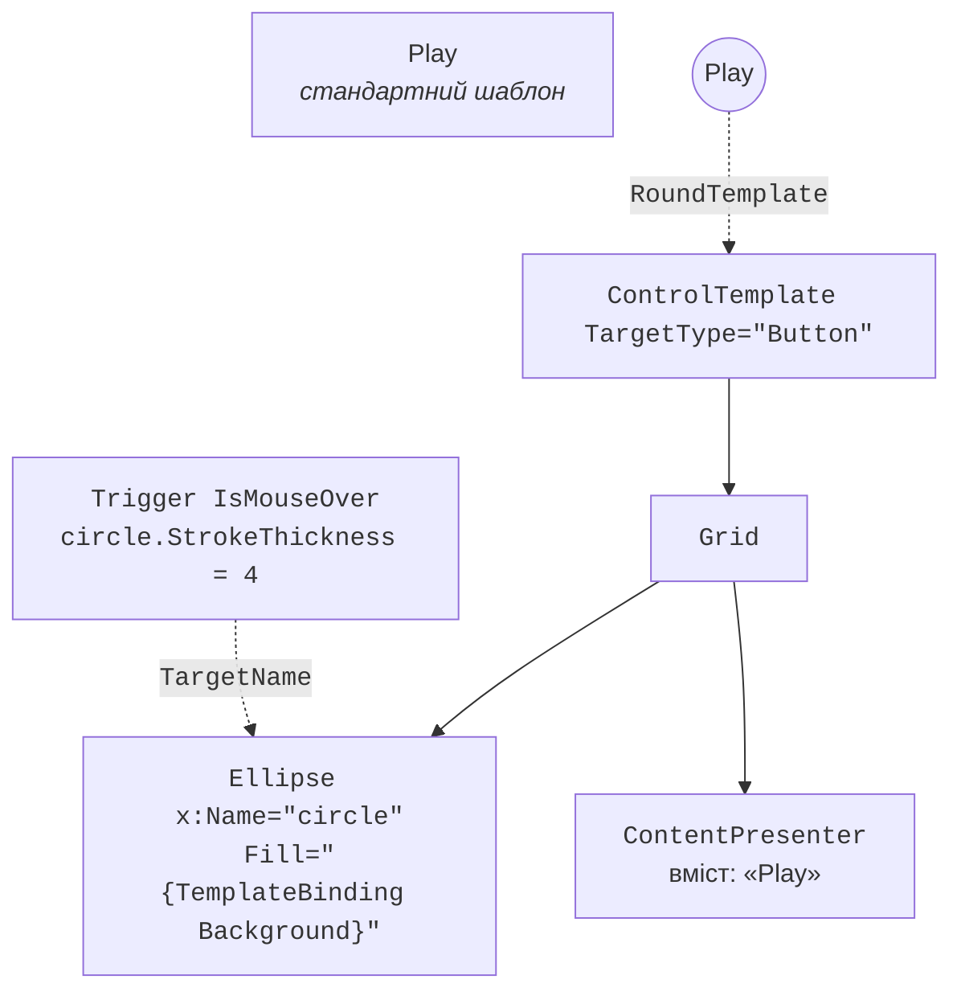
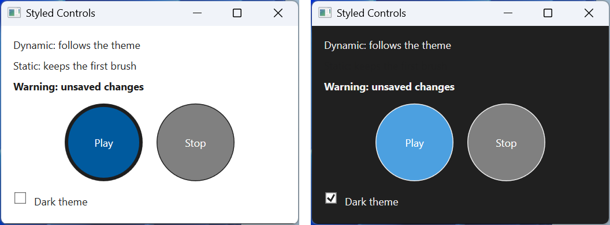

# Колекції, стилі й шаблони

## Колекції та шаблони даних

### Колекції з повідомленнями

Елементи-списки (`ListBox`, `ComboBox`, `ListView`, `DataGrid`) походять від `ItemsControl` і отримують дані через властивість `ItemsSource`. Щоб список на екрані оновлювався після `Add` і `Remove`, колекція має реалізувати інтерфейс `INotifyCollectionChanged`. Готова реалізація – `ObservableCollection<T>` (простір імен `System.Collections.ObjectModel`); звичайний `List<T>` показується лише один раз. Властивість `Count` цієї колекції теж повідомляє про зміни, тому `{Binding Items.Count}` оновлюється автоматично. Зміни властивостей самих елементів видно лише тоді, коли клас елемента реалізує `INotifyPropertyChanged`.

Властивість `DisplayMemberPath` показує одну властивість кожного елемента, `SelectedItem` (прив’язка `TwoWay`) – вибраний елемент. Вигляд елемента повністю визначає **шаблон даних** `DataTemplate`, призначений властивості `ItemTemplate` (<https://learn.microsoft.com/dotnet/desktop/wpf/data/data-templating-overview>). Усередині шаблону контекстом даних є сам елемент колекції. Шаблон з атрибутом `DataType` без ключа в ресурсах застосовується автоматично до всіх об’єктів цього типу (так будують навігацію між сторінками, див. далі).

### Представлення колекції

Між колекцією та елементом-списком WPF створює **представлення** (*collection view*) – об’єкт з інтерфейсом `ICollectionView`, який сортує, фільтрує й групує елементи без зміни самої колекції (<https://learn.microsoft.com/dotnet/api/system.componentmodel.icollectionview>). Типове представлення повертає `CollectionViewSource.GetDefaultView(collection)`:

- `Filter` – делегат `Predicate<object>`, який вирішує, чи показувати елемент; після зміни умови викликають `Refresh()`;
- `SortDescriptions` – список `SortDescription(property, direction)`;
- `GroupDescriptions` – `PropertyGroupDescription(property)`; заголовки груп описує `GroupStyle` елемента-списку.

Ті самі налаштування можна задати в XAML через ресурс `CollectionViewSource` (<https://learn.microsoft.com/dotnet/desktop/wpf/data/how-to-sort-and-group-data-using-a-view-in-xaml>). Для табличних даних є `DataGrid`: він сам створює стовпці за властивостями (`AutoGenerateColumns`) або використовує оголошені `DataGridTextColumn`, `DataGridCheckBoxColumn`.

### Приклад «Каталог товарів»

Каталог показує товари, згруповані за категоріями й відсортовані за назвою, фільтрує їх за текстом пошуку та показує ціну вибраного товару.

```cs
using System.Collections.ObjectModel;
using System.ComponentModel;
using System.Windows.Data;

namespace Catalog;

public record Product(string Name, string Category,
    decimal Price, int Stock);

public class CatalogViewModel : ObservableObject
{
    public CatalogViewModel()
    {
        Products =
        [
            new("Laptop 14\"", "Computers", 32999m, 4),
            new("Mouse", "Accessories", 649.5m, 25),
            new("Monitor 27\"", "Computers", 11499m, 0),
            new("Keyboard", "Accessories", 1299m, 12),
            new("USB-C Hub", "Accessories", 899m, 7)
        ];
        ProductsView = CollectionViewSource.GetDefaultView(Products);
        ProductsView.Filter = Matches;
        ProductsView.GroupDescriptions.Add(
            new PropertyGroupDescription(nameof(Product.Category)));
        ProductsView.SortDescriptions.Add(new SortDescription(
            nameof(Product.Name), ListSortDirection.Ascending));
    }

    public ObservableCollection<Product> Products { get; }

    public ICollectionView ProductsView { get; }

    public string SearchText
    {
        get;
        set
        {
            if (SetProperty(ref field, value))
            {
                ProductsView.Refresh();   // застосувати фільтр
            }
        }
    } = "";

    public Product? SelectedProduct
    {
        get;
        set => SetProperty(ref field, value);
    }

    private bool Matches(object item) =>
        item is Product p && p.Name.Contains(SearchText,
            StringComparison.CurrentCultureIgnoreCase);
}
```

Розмітка вікна (клас `ObservableObject` – той самий, що й у профілі; `App.xaml.cs` перевизначає `Language`, як показано вище):

```xml
<Window x:Class="Catalog.MainWindow"
    xmlns="http://schemas.microsoft.com/winfx/2006/xaml/presentation"
    xmlns:x="http://schemas.microsoft.com/winfx/2006/xaml"
    xmlns:local="clr-namespace:Catalog"
    Title="Product Catalog" Width="420" Height="360">
    <Window.DataContext>
        <local:CatalogViewModel/>
    </Window.DataContext>
    <DockPanel Margin="10">
        <TextBox DockPanel.Dock="Top" Text="{Binding SearchText,
                 UpdateSourceTrigger=PropertyChanged, Delay=300}"/>
        <StackPanel DockPanel.Dock="Bottom" Margin="0,6,0,0"
                    DataContext="{Binding SelectedProduct}">
            <TextBlock Text="{Binding Name,
                       FallbackValue=Select a product}"/>
            <TextBlock Text="{Binding Price,
                       StringFormat=Price: {0:C}}"/>
        </StackPanel>
        <ListBox ItemsSource="{Binding ProductsView}"
                 SelectedItem="{Binding SelectedProduct}">
            <ListBox.GroupStyle>
                <GroupStyle>
                    <GroupStyle.HeaderTemplate>
                        <DataTemplate>
                            <TextBlock FontWeight="Bold"
                                       Text="{Binding Name}"/>
                        </DataTemplate>
                    </GroupStyle.HeaderTemplate>
                </GroupStyle>
            </ListBox.GroupStyle>
            <ListBox.ItemTemplate>
                <DataTemplate DataType="{x:Type local:Product}">
                    <StackPanel Orientation="Horizontal">
                        <TextBlock Text="{Binding Name}" Width="150"/>
                        <TextBlock Text="{Binding Price,
                                   StringFormat={}{0:N2}}"
                                   Width="80" TextAlignment="Right"/>
                        <TextBlock Text="{Binding Stock,
                                   StringFormat={}{0} pcs}"
                                   Margin="12,0,0,0"/>
                    </StackPanel>
                </DataTemplate>
            </ListBox.ItemTemplate>
        </ListBox>
    </DockPanel>
</Window>
```

Список містить групи *Accessories* (Keyboard `1 299,00`, Mouse `649,50`, USB-C Hub `899,00`) і *Computers*. Поки товар не вибрано, прив’язка нижньої панелі неможлива й показується `FallbackValue` *Select a product*, а після вибору мишки – `Mouse` і `Price: 649,50 ₴`. Пошук `o` залишає чотири товари з п’яти (рис. 13.4).


Рис. 13.4. Каталог товарів із фільтрацією та групуванням {.caption}

## Ресурси

**Ресурси** (тема 12) зберігаються в словниках `ResourceDictionary` властивостей `Resources` елемента, вікна та застосунку. Розширення `{StaticResource Key}` шукає ресурс від елемента вгору деревом до ресурсів застосунку й системних ресурсів (рис. 13.5) один раз під час завантаження розмітки. `{DynamicResource Key}` зберігає посилання на ключ і оновлює значення, якщо ресурс з цим ключем замінили під час роботи; воно трохи повільніше й працює лише для властивостей залежності (<https://learn.microsoft.com/dotnet/desktop/wpf/systems/xaml-resources-overview>).



Рис. 13.5. Пошук ресурсу за ключем {.caption}

Великі набори ресурсів виносять в окремі файли *Resource Dictionary (WPF)* і об’єднують у `App.xaml` властивістю `MergedDictionaries`. Якщо ключ повторюється, перемагає останній доданий словник (<https://learn.microsoft.com/dotnet/desktop/wpf/systems/xaml-resources-merged-dictionaries>). Так реалізують **теми оформлення**: файли `Themes/Light.xaml` і `Themes/Dark.xaml` містять пензлі з однаковими ключами, а застосунок замінює один словник іншим:

```xml
<ResourceDictionary
    xmlns="http://schemas.microsoft.com/winfx/2006/xaml/presentation"
    xmlns:x="http://schemas.microsoft.com/winfx/2006/xaml">
    <SolidColorBrush x:Key="WindowBrush" Color="White"/>
    <SolidColorBrush x:Key="TextBrush" Color="#1E1E1E"/>
    <SolidColorBrush x:Key="AccentBrush" Color="#005A9E"/>
</ResourceDictionary>
```

Файл `Dark.xaml` відрізняється лише кольорами (`#202020`, `#F0F0F0`, `#4CA0E0`). Елементи, які мають змінювати вигляд разом із темою, використовують `DynamicResource`.

## Стилі та тригери

**Стиль** (`Style`) – іменований набір значень властивостей (`Setter`) для елементів одного типу `TargetType` (<https://learn.microsoft.com/dotnet/desktop/wpf/controls/styles-templates-overview>):

- стиль з ключем `x:Key` застосовують явно: `Style="{StaticResource WarningText}"`;
- стиль без ключа є **неявним**: він застосовується до всіх елементів `TargetType` в області дії ресурсу;
- `BasedOn` успадковує інший стиль; неявний стиль має ключ-тип, тому на нього посилаються так: `BasedOn="{StaticResource {x:Type TextBlock}}"`;
- локальне значення атрибута елемента має пріоритет над сеттером стилю (тема 12).

**Тригери** змінюють властивості за умовою і скасовують зміну, коли умова перестає виконуватися: `Trigger` перевіряє властивість самого елемента, `MultiTrigger` – кілька властивостей одночасно, `DataTrigger` і `MultiDataTrigger` – значення прив’язки (властивість ViewModel або елемента даних). Анімацію в тригерах (`EventTrigger`, `BeginStoryboard`) розглянуто в темі 14.

```xml
<Style x:Key="WarningText" TargetType="TextBlock"
       BasedOn="{StaticResource {x:Type TextBlock}}">
    <Setter Property="FontWeight" Value="Bold"/>
    <Style.Triggers>
        <Trigger Property="IsMouseOver" Value="True">
            <Setter Property="TextDecorations"
                    Value="Underline"/>
        </Trigger>
    </Style.Triggers>
</Style>
```

Стиль `WarningText` успадковує неявний стиль текстових блоків вікна (у прикладі нижче він задає `Foreground="{DynamicResource TextBrush}"` і `Margin="4"`) і додає жирний шрифт і підкреслення під курсором миші. Тригер даних у шаблоні даних (`DataTemplate.Triggers`) може, наприклад, закреслити назву товару з нульовим залишком: `<DataTrigger Binding="{Binding Stock}" Value="0">` із сеттером, властивість `TargetName` якого вказує іменований елемент усередині шаблону.

## Шаблони елементів керування

### `ControlTemplate`

Логіка й вигляд елемента керування WPF розділені: клас `Button` визначає поведінку (подія `Click`, властивості `IsPressed`, `IsMouseOver`), а візуальне дерево створює **шаблон елемента керування** `ControlTemplate` (тема 12). Замінивши властивість `Template`, можна повністю змінити вигляд, зберігши поведінку (рис. 13.6) (<https://learn.microsoft.com/dotnet/desktop/wpf/controls/how-to-create-apply-template>):

- `TemplateBinding` – прив’язка властивості елемента шаблону до властивості елемента керування: `Fill="{TemplateBinding Background}"`, тож колір кнопки задають, як і раніше, властивістю `Background`;
- `ContentPresenter` – місце, куди виводиться вміст `Content`; `RecognizesAccessKey="True"` обробляє мнемоніку `_Play`;
- `ControlTemplate.Triggers` – тригери шаблону, які змінюють його елементи за `TargetName`.



Рис. 13.6. Шаблон круглої кнопки {.caption}

Лише стилем вигляд не змінити повністю: стандартний шаблон кнопки під курсором миші замінює фон системним кольором, ігноруючи `Background`.

Шаблони даних також можна обирати програмно: клас, похідний від `DataTemplateSelector`, перевизначає метод `SelectTemplate(item, container)` і призначається властивості `ItemTemplateSelector`. Панель, яка розміщує елементи списку, задає `ItemsPanelTemplate` (властивість `ItemsPanel`, наприклад `WrapPanel` замість типової `VirtualizingStackPanel`) (<https://learn.microsoft.com/dotnet/api/system.windows.controls.datatemplateselector>).

### Приклад «Стильна кнопка»

Застосунок має дві круглі кнопки та перемикач темної теми. У `App.xaml` об’єднано словник світлої теми й оголошено шаблон і стиль кнопки:

```xml
<Application x:Class="Styles.App"
    xmlns="http://schemas.microsoft.com/winfx/2006/xaml/presentation"
    xmlns:x="http://schemas.microsoft.com/winfx/2006/xaml"
    StartupUri="MainWindow.xaml">
    <Application.Resources>
        <ResourceDictionary>
            <ResourceDictionary.MergedDictionaries>
                <ResourceDictionary Source="Themes/Light.xaml"/>
            </ResourceDictionary.MergedDictionaries>

            <ControlTemplate x:Key="RoundTemplate"
                             TargetType="Button">
                <Grid>
                    <Ellipse x:Name="circle"
                             Fill="{TemplateBinding Background}"
                             Stroke="{DynamicResource TextBrush}"/>
                    <ContentPresenter RecognizesAccessKey="True"
                                      HorizontalAlignment="Center"
                                      VerticalAlignment="Center"/>
                </Grid>
                <ControlTemplate.Triggers>
                    <Trigger Property="IsMouseOver" Value="True">
                        <Setter TargetName="circle"
                                Property="StrokeThickness" Value="4"/>
                    </Trigger>
                    <Trigger Property="IsPressed" Value="True">
                        <Setter TargetName="circle"
                                Property="Opacity" Value="0.6"/>
                    </Trigger>
                </ControlTemplate.Triggers>
            </ControlTemplate>

            <Style x:Key="RoundButton" TargetType="Button">
                <Setter Property="Width" Value="90"/>
                <Setter Property="Height" Value="90"/>
                <Setter Property="Margin" Value="8"/>
                <Setter Property="Foreground" Value="White"/>
                <Setter Property="Background"
                        Value="{DynamicResource AccentBrush}"/>
                <Setter Property="Template"
                        Value="{StaticResource RoundTemplate}"/>
            </Style>
        </ResourceDictionary>
    </Application.Resources>
</Application>
```

Вікно `MainWindow.xaml` має `Background="{DynamicResource WindowBrush}"`, а в його ресурсах – неявний стиль `TextBlock` і стиль `WarningText` з попереднього розділу. Воно містить три текстові блоки (один з `Foreground="{StaticResource TextBrush}"`), кнопки `<Button Content="_Play" Style="{StaticResource RoundButton}"/>` і *Stop* з `Background="Gray"` та прапорець `darkThemeBox` (*Dark theme*) з обробником `Click`.

Перемикання теми – суто візуальна дія, тому її обробник може бути в code-behind. Він замінює словник теми, і всі `DynamicResource` оновлюються:

```cs
private void DarkThemeBox_Click(object sender, RoutedEventArgs e)
{
    string name =
        darkThemeBox.IsChecked == true ? "Dark" : "Light";
    var theme = new ResourceDictionary
    {
        Source = new Uri($"Themes/{name}.xaml", UriKind.Relative)
    };
    Application.Current.Resources.MergedDictionaries[0] = theme;
}
```

У світлій темі кнопка *Play* має колір `#005A9E`, а *Stop* – сірий: локальний `Background` перекриває сеттер стилю, і шаблон бере його через `TemplateBinding`. Після ввімкнення *Dark theme* тло стає `#202020`, текст і обведення – `#F0F0F0`, а текст *Static: keeps the first brush* залишається темним і зникає на темному тлі: `StaticResource` не відстежує заміну словника (рис. 13.7).



Рис. 13.7. Стилізовані елементи керування у світлій і темній темах {.caption}
