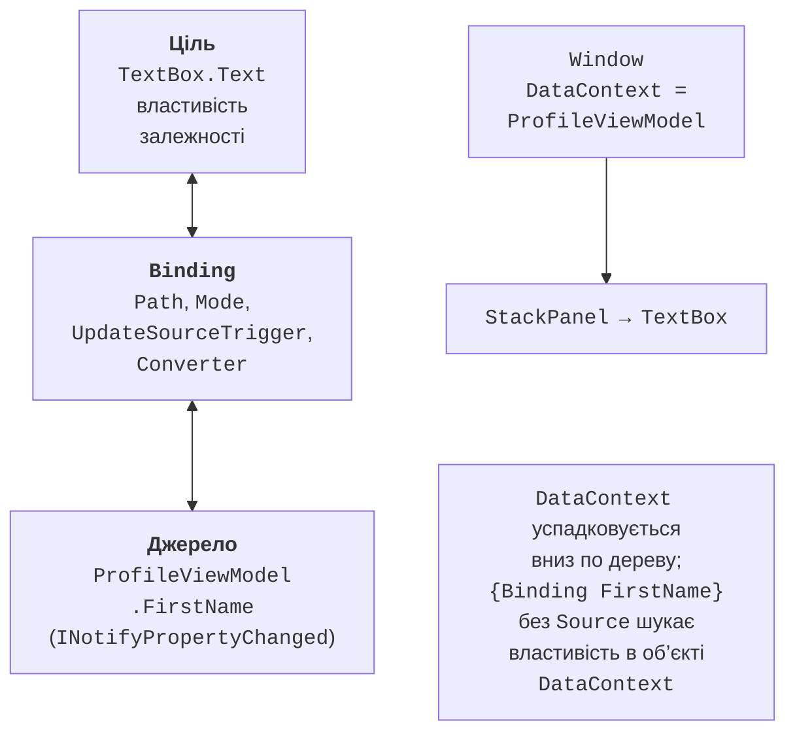
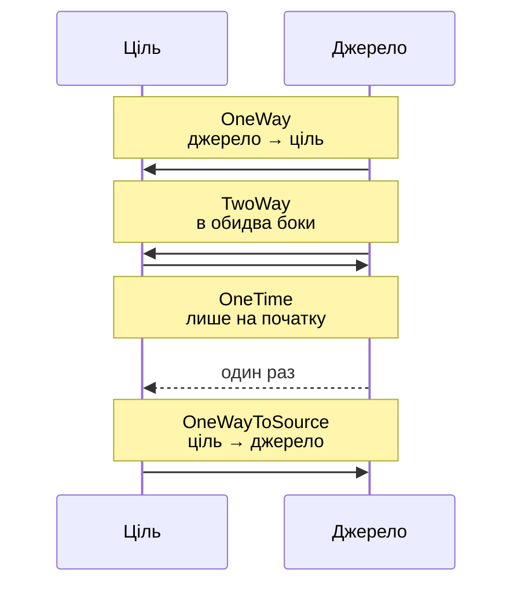
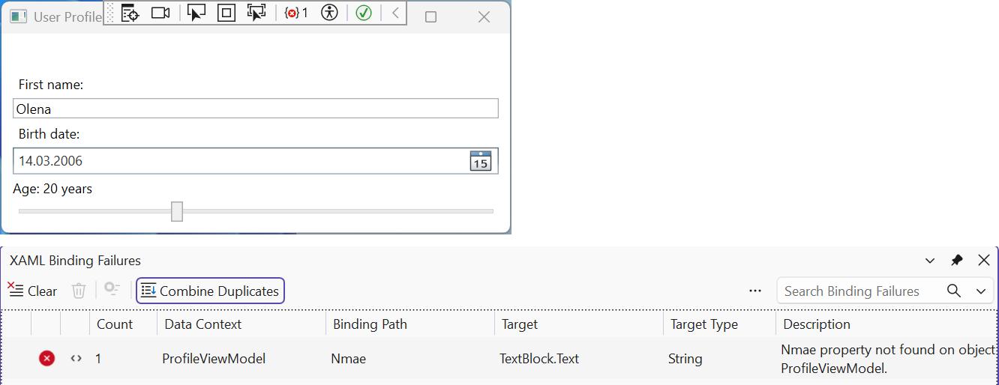

# Прив’язка та перетворення значень

## Прив’язка даних

### Ціль, джерело і контекст даних

У темі 12 значення елементів керування читали й змінювали в обробниках подій: `nameBox.Text = person.Name`, а після редагування – навпаки. Такий код швидко розростається й дублюється. **Прив’язка даних** (*data binding*) автоматично синхронізує дві властивості: **ціль** (*target*) – властивість залежності елемента керування (`TextBox.Text`, `ListBox.ItemsSource`) і **джерело** (*source*) – властивість звичайного об’єкта C# (рис. 13.1) (<https://learn.microsoft.com/dotnet/desktop/wpf/data/>).



Рис. 13.1. Складові прив’язки даних {.caption}

Прив’язку описує об’єкт `Binding`, який у XAML створює розширення розмітки `{Binding}`. Його основні властивості:

- `Path` – шлях до властивості джерела: `{Binding FirstName}` (перший позиційний аргумент – це `Path`), `{Binding SelectedProduct.Price}`, `{Binding Items.Count}`;
- `ElementName` – джерелом є інший елемент за `x:Name`: `{Binding Value, ElementName=sizeSlider}`;
- `RelativeSource` – джерело відносно цілі: сам елемент (`Self`) або предок певного типу (`{RelativeSource AncestorType=ListBox}`);
- `Source` – явний об’єкт, наприклад ресурс: `{Binding Source={StaticResource SortedContacts}}`.

Якщо жодне з трьох останніх не задано, джерелом є **контекст даних** – значення властивості `DataContext`. Вона успадковується вниз деревом елементів: достатньо присвоїти об’єкт `DataContext` вікна, і всі вкладені елементи прив’язуються до його властивостей. Прив’язка працює лише з відкритими **властивостями**, а не з полями.

### Режими та момент оновлення

Властивість `Mode` визначає напрямок передавання значення (рис. 13.2): `OneWay` (типово для `TextBlock.Text`, `ItemsSource`), `TwoWay` (типово для властивостей, які редагує користувач: `TextBox.Text`, `CheckBox.IsChecked`, `Slider.Value`, `SelectedItem`), `OneTime` (один раз під час створення прив’язки) і `OneWayToSource` (лише з цілі в джерело).

Режим за замовчуванням задають метадані властивості, тому явно пишуть лише інший: `{Binding Total, Mode=OneWay}` (<https://learn.microsoft.com/dotnet/desktop/wpf/data/how-to-specify-the-direction-of-the-binding>).



Рис. 13.2. Режими прив’язки даних {.caption}

Для прив’язок `TwoWay` і `OneWayToSource` властивість `UpdateSourceTrigger` визначає, **коли** значення записується в джерело: `PropertyChanged` – після кожної зміни, `LostFocus` – коли елемент втрачає фокус (типово для `TextBox.Text`), `Explicit` – лише після виклику `UpdateSource()` у коді. Щоб текст оновлювався під час введення, пишуть `{Binding FirstName, UpdateSourceTrigger=PropertyChanged}`; параметр `Delay=300` відкладає запис на 300 мс після останнього натискання клавіші.

## Сповіщення про зміни

### Інтерфейс `INotifyPropertyChanged`

Властивості звичайного класу не повідомляють про свої зміни, тому елемент керування не знає, що значення в джерелі стало іншим. Для цього клас джерела реалізує інтерфейс `INotifyPropertyChanged` (простір імен `System.ComponentModel`) з єдиною подією `PropertyChanged`: прив’язка підписується на неї й перечитує властивість, ім’я якої передано в `PropertyChangedEventArgs` (<https://learn.microsoft.com/dotnet/desktop/wpf/data/how-to-implement-property-change-notification>).

Щоб не повторювати однаковий код у кожному класі, створюють базовий клас. Атрибут `[CallerMemberName]` підставляє ім’я властивості, з якої викликано метод, а `SetProperty` змінює поле й генерує подію лише тоді, коли значення справді змінилося:

```cs
using System.ComponentModel;
using System.Runtime.CompilerServices;

namespace Profile;

public abstract class ObservableObject : INotifyPropertyChanged
{
    public event PropertyChangedEventHandler? PropertyChanged;

    protected void OnPropertyChanged(
        [CallerMemberName] string? propertyName = null) =>
        PropertyChanged?.Invoke(this,
            new PropertyChangedEventArgs(propertyName));

    // Змінює поле й сповіщає, лише якщо значення інше.
    protected bool SetProperty<T>(ref T field, T value,
        [CallerMemberName] string? propertyName = null)
    {
        if (EqualityComparer<T>.Default.Equals(field, value))
        {
            return false;
        }
        field = value;
        OnPropertyChanged(propertyName);
        return true;
    }
}
```

У C# 14 ключове слово `field` звертається до автоматично створеного поля властивості, тому окреме поле оголошувати не треба: `set => SetProperty(ref field, value);`. Обчислювана властивість (`Greeting`) не має власного сеттера, тому про її зміну повідомляють із сеттерів властивостей, від яких вона залежить: `OnPropertyChanged(nameof(Greeting))`.

### Діагностика прив’язок

Помилку в шляху прив’язки компілятор не помічає: розмітка `{Binding Nmae}` збирається без попереджень, а текстовий блок під час роботи залишається порожнім. Під час налагодження (**F5**) WPF записує у вікно *Output* повідомлення `System.Windows.Data Error: 40 : BindingExpression path error: 'Nmae' property not found on 'object' ''ProfileViewModel'…` з описом цілі (`target element is 'TextBlock'`, `target property is 'Text'`).

У великому журналі такі рядки легко пропустити, тому Visual Studio 2026 збирає їх у вікні *XAML Binding Failures* (*Debug → Windows → XAML Binding Failures*) зі стовпцями *Data Context*, *Binding Path*, *Target*, *Target Type*, *Description*, а також *File* і *Line* (рис. 13.3). Кнопка *Binding failures* на панелі інструментів усередині запущеного застосунку показує кількість помилок, а подвійне клацання рядка відкриває прив’язку в редакторі XAML (<https://learn.microsoft.com/visualstudio/xaml-tools/xaml-data-binding-diagnostics>).



Рис. 13.3. Вікно *XAML Binding Failures* {.caption}

## Перетворення значень

### Форматування

Найпростіше перетворення – рядок формату `StringFormat`, який працює, коли ціль має тип `string`: `{Binding Price, StringFormat={}{0:N2}}` (порожні дужки `{}` на початку потрібні, якщо формат починається з `{`), `{Binding Price, StringFormat=Price: {0:C}}`. Властивість `FallbackValue` задає значення, коли прив’язку неможливо виконати (немає джерела або властивості), а `TargetNullValue` – коли значення джерела дорівнює `null`. Кілька значень в одному рядку об’єднує `MultiBinding` з `StringFormat="{}{0} {1}"`.

::: tip Увага
WPF форматує значення прив’язок не за регіональними налаштуваннями Windows, а за властивістю `Language` елемента, яка за замовчуванням дорівнює `en-US`. Тому `{0:C}` без додаткових налаштувань показує `$649.50` навіть в українській Windows. Щоб прив’язки використовували поточну культуру, у `App.xaml.cs` один раз перевизначають метадані властивості:
:::

```cs
protected override void OnStartup(StartupEventArgs e)
{
    // Формат чисел і дат у прив’язках – за регіоном Windows.
    FrameworkElement.LanguageProperty.OverrideMetadata(
        typeof(FrameworkElement),
        new FrameworkPropertyMetadata(XmlLanguage.GetLanguage(
            CultureInfo.CurrentCulture.IetfLanguageTag)));
    base.OnStartup(e);
}
```

Після цього той самий формат дає `649,50 ₴`, а `{0:N2}` – `1 299,00`.

### Конвертери значень

Якщо значення треба не лише відформатувати, а перетворити (дату народження на вік, `bool` на `Visibility`, число на колір), створюють **конвертер** – клас з інтерфейсом `IValueConverter` (простір імен `System.Windows.Data`). Метод `Convert` перетворює значення джерела для цілі, а `ConvertBack` – у зворотному напрямку для прив’язок `TwoWay`. WPF вже має конвертер `BooleanToVisibilityConverter`. Конвертер оголошують як ресурс і вказують у прив’язці: `Converter={StaticResource AgeConverter}`. Для `MultiBinding` призначений інтерфейс `IMultiValueConverter`, метод `Convert` якого отримує масив значень.

### Приклад «Профіль користувача»

Вікно показує привітання, яке оновлюється під час введення імені, вік за датою народження та дозволяє змінювати розмір шрифту заголовка повзунком. Проєкт створено командою `dotnet new wpf -n Profile`, клас `ObservableObject` наведено вище. ViewModel профілю й конвертер, який повертає `null` для порожньої дати (тоді прив’язка показує `TargetNullValue`):

```cs
namespace Profile;

public class ProfileViewModel : ObservableObject
{
    public string FirstName
    {
        get;
        set
        {
            if (SetProperty(ref field, value))
            {
                OnPropertyChanged(nameof(Greeting));
            }
        }
    } = "Olena";

    public DateTime? BirthDate
    {
        get;
        set => SetProperty(ref field, value);
    } = new DateTime(2006, 3, 14);

    public string Greeting => $"Hello, {FirstName}!";
}

// Файл AgeConverter.cs
using System.Globalization;
using System.Windows.Data;

namespace Profile;

// DateTime? (дата народження) → рядок «19 years».
public class AgeConverter : IValueConverter
{
    public object? Convert(object? value, Type targetType,
        object? parameter, CultureInfo culture)
    {
        if (value is not DateTime birth)
        {
            return null;   // → TargetNullValue
        }
        DateTime today = DateTime.Today;
        int age = today.Year - birth.Year;
        if (birth.Date > today.AddYears(-age))
        {
            age--;
        }
        return $"{age} years";
    }

    public object? ConvertBack(object? value, Type targetType,
        object? parameter, CultureInfo culture) =>
        throw new NotSupportedException();
}
```

Розмітка `MainWindow.xaml` створює ViewModel як контекст даних вікна (code-behind містить лише виклик `InitializeComponent()`):

```xml
<Window x:Class="Profile.MainWindow"
    xmlns="http://schemas.microsoft.com/winfx/2006/xaml/presentation"
    xmlns:x="http://schemas.microsoft.com/winfx/2006/xaml"
    xmlns:local="clr-namespace:Profile"
    Title="User Profile" Width="360" SizeToContent="Height">
    <Window.Resources>
        <local:AgeConverter x:Key="AgeConverter"/>
    </Window.Resources>
    <Window.DataContext>
        <local:ProfileViewModel/>
    </Window.DataContext>
    <StackPanel Margin="10">
        <TextBlock Text="{Binding Greeting}" FontWeight="Bold"
                   FontSize="{Binding Value,
                   ElementName=sizeSlider}"/>
        <Label Content="_First name:" Target="{Binding
               ElementName=firstNameBox}"/>
        <TextBox x:Name="firstNameBox" Text="{Binding FirstName,
                 UpdateSourceTrigger=PropertyChanged}"/>
        <Label Content="_Birth date:"/>
        <DatePicker SelectedDate="{Binding BirthDate}"/>
        <TextBlock Margin="0,4" Text="{Binding BirthDate,
                   Converter={StaticResource AgeConverter},
                   StringFormat=Age: {0},
                   TargetNullValue=Age: unknown}"/>
        <Slider x:Name="sizeSlider" Minimum="12" Maximum="24"
                Value="16"/>
    </StackPanel>
</Window>
```

Після запуску заголовок показує `Hello, Olena!`, а напис під датою – `Age: 20 years` (на 17 вересня 2026 року). Введення `Ivan` у поле імені одразу змінює заголовок на `Hello, Ivan!`, бо прив’язка має `UpdateSourceTrigger=PropertyChanged` (без нього значення потрапило б у ViewModel лише після переходу фокуса в інший елемент). Очищення дати показує `Age: unknown`, а повзунок змінює розмір шрифту заголовка прив’язкою між елементами без жодного рядка коду.
