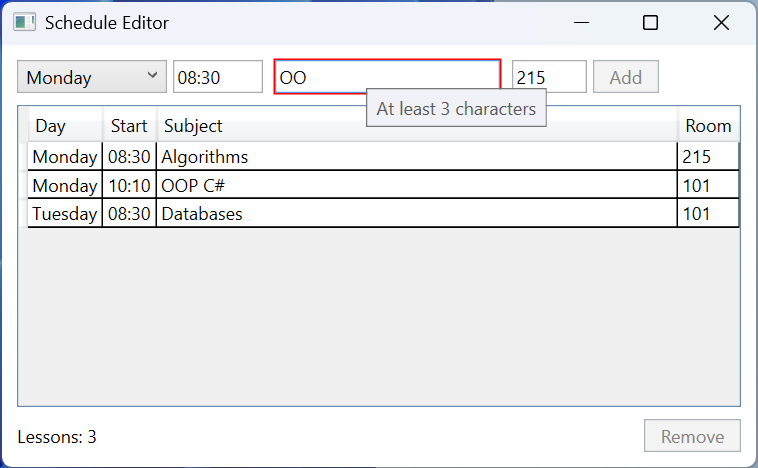

# Практика

## Приклад 1. Редактор розкладу

Створити застосунок WPF за патерном MVVM для складання розкладу занять. Користувач обирає день тижня, вводить час початку у форматі `HH:mm`, назву предмета (не менше 3 символів) і номер аудиторії (1–999). Некоректні поля позначаються рамкою з підказкою, кнопка *Add* доступна лише за коректних даних, зайнятий час не приймається, заняття показуються в таблиці, впорядкованій за днем і часом, а вибране заняття видаляє кнопка *Remove*.

ViewModel успадковує `ObservableValidator` з бібліотеки CommunityToolkit.Mvvm (пакет додано командою `dotnet add package CommunityToolkit.Mvvm`): атрибути перевірки з простору імен `System.ComponentModel.DataAnnotations` разом з `[NotifyDataErrorInfo]` перевіряють властивість після кожної зміни, а `INotifyDataErrorInfo` реалізовано в базовому класі.

```cs
using System.Collections.ObjectModel;
using System.ComponentModel.DataAnnotations;
using System.Globalization;
using CommunityToolkit.Mvvm.ComponentModel;
using CommunityToolkit.Mvvm.Input;

namespace Schedule;

public record Lesson(DayOfWeek Day, TimeOnly Start,
    string Subject, int Room);

public partial class ScheduleViewModel : ObservableValidator
{
    public DayOfWeek[] Days { get; } =
    [
        DayOfWeek.Monday, DayOfWeek.Tuesday, DayOfWeek.Wednesday,
        DayOfWeek.Thursday, DayOfWeek.Friday
    ];

    public ObservableCollection<Lesson> Lessons { get; } = [];

    [ObservableProperty]
    public partial DayOfWeek Day { get; set; } = DayOfWeek.Monday;

    [ObservableProperty]
    [NotifyDataErrorInfo]
    [NotifyCanExecuteChangedFor(nameof(AddCommand))]
    [RegularExpression(@"^([01]\d|2[0-3]):[0-5]\d$",
        ErrorMessage = "Use the HH:mm format, e.g. 08:30")]
    public partial string Start { get; set; } = "08:30";

    [ObservableProperty]
    [NotifyDataErrorInfo]
    [NotifyCanExecuteChangedFor(nameof(AddCommand))]
    [Required(ErrorMessage = "Enter a subject")]
    [MinLength(3, ErrorMessage = "At least 3 characters")]
    public partial string Subject { get; set; } = "";

    [ObservableProperty]
    [NotifyDataErrorInfo]
    [NotifyCanExecuteChangedFor(nameof(AddCommand))]
    [Range(1, 999, ErrorMessage = "Room must be from 1 to 999")]
    public partial int Room { get; set; } = 101;

    [ObservableProperty]
    [NotifyCanExecuteChangedFor(nameof(RemoveCommand))]
    public partial Lesson? SelectedLesson { get; set; }

    [ObservableProperty]
    public partial string Message { get; set; } = "";

    [RelayCommand(CanExecute = nameof(CanAdd))]
    private void Add()
    {
        ValidateAllProperties();   // перевірити всі властивості
        if (HasErrors)
        {
            return;
        }
        var start = TimeOnly.ParseExact(Start, "HH:mm",
            CultureInfo.InvariantCulture);
        if (Lessons.Any(l => l.Day == Day && l.Start == start))
        {
            Message = $"{Day} {Start} is already taken";
            return;
        }
        var lesson = new Lesson(Day, start, Subject.Trim(), Room);
        // Вставити так, щоб розклад лишався впорядкованим.
        int index = Lessons.TakeWhile(l => l.Day < Day
            || l.Day == Day && l.Start < start).Count();
        Lessons.Insert(index, lesson);
        Message = $"Lessons: {Lessons.Count}";
        Subject = "";
        ClearErrors(nameof(Subject));   // порожнє поле без рамки
    }

    private bool CanAdd() =>
        !HasErrors && !string.IsNullOrWhiteSpace(Subject);

    [RelayCommand(CanExecute = nameof(CanRemove))]
    private void Remove()
    {
        Lessons.Remove(SelectedLesson!);
        Message = $"Lessons: {Lessons.Count}";
    }

    private bool CanRemove() => SelectedLesson is not null;
}
```

Вікно `MainWindow.xaml` (`Title="Schedule Editor"`) створює ViewModel у `<Window.DataContext>`, а в ресурсах має неявний стиль `TextBox` з підказкою першої помилки, як у лекції. Угорі `DockPanel` розміщено горизонтальну панель з `ComboBox` (`ItemsSource="{Binding Days}"`, `SelectedItem="{Binding Day}"`), трьома полями, прив’язаними до `Start`, `Subject` і `Room` з `UpdateSourceTrigger=PropertyChanged`, і кнопкою *Add* (`Command="{Binding AddCommand}"`, `IsDefault="True"`), унизу – напис `{Binding Message}` і кнопку *Remove* (`RemoveCommand`), а решту займає таблиця:

```xml
<DataGrid ItemsSource="{Binding Lessons}" IsReadOnly="True"
          AutoGenerateColumns="False"
          SelectedItem="{Binding SelectedLesson}">
    <DataGrid.Columns>
        <DataGridTextColumn Header="Day"
            Binding="{Binding Day}"/>
        <DataGridTextColumn Header="Start"
            Binding="{Binding Start, StringFormat=HH:mm}"/>
        <DataGridTextColumn Header="Subject" Width="*"
            Binding="{Binding Subject}"/>
        <DataGridTextColumn Header="Room"
            Binding="{Binding Room}"/>
    </DataGrid.Columns>
</DataGrid>
```

Метод `CanAdd` залежить від `HasErrors` і назви предмета, тому кожна властивість форми має `[NotifyCanExecuteChangedFor(nameof(AddCommand))]`. Після додавання назва очищується, а `ClearErrors` прибирає помилку `[Required]`, щоб порожнє поле не світилося рамкою. Стовпці `DataGrid` оголошено явно: так задано заголовки й формат часу `StringFormat=HH:mm` для `TimeOnly`.

На початку кнопка *Add* недоступна. Назва `OO` дає підказку `At least 3 characters`, час `8:3` – `Use the HH:mm format, e.g. 08:30`, аудиторія `1200` – `Room must be from 1 to 999`. Після додавання *Monday 10:10 OOP C# 101*, *Tuesday 08:30 Databases 101* і *Monday 08:30 Algorithms 215* таблиця показує рядки в порядку Monday 08:30, Monday 10:10, Tuesday 08:30, а напис – `Lessons: 3`. Спроба додати ще одне заняття на Monday 08:30 виводить `Monday 08:30 is already taken`. Кнопка *Remove* вмикається після вибору рядка (рис. 13.13).



Рис. 13.13. Застосунок «Редактор розкладу» {.caption}

## Приклад 2. Картки контактів

Створити застосунок WPF, який показує контакти картками, розташованими рядками з перенесенням. Контакти відсортовано за іменем. Картка особистого контакту має тонку рамку, ім’я та телефон, а картка робочого контакту (з назвою компанії) – товсту рамку, сірий фон, назву компанії, ім’я курсивом і телефон. Вибір вигляду виконує `DataTemplateSelector`, сортування – `CollectionViewSource` у XAML.

```cs
using System.Windows;
using System.Windows.Controls;

namespace Cards;

public record Contact(string Name, string Phone, string? Company);

// Обирає шаблон картки за даними, а не за типом.
public class ContactTemplateSelector : DataTemplateSelector
{
    public DataTemplate? PersonTemplate { get; set; }

    public DataTemplate? CompanyTemplate { get; set; }

    public override DataTemplate? SelectTemplate(object item,
        DependencyObject container) =>
        item is Contact { Company: not null }
            ? CompanyTemplate : PersonTemplate;
}
```

Конструктор вікна після `InitializeComponent()` присвоює `DataContext` список `List<Contact>` з п’яти контактів, наприклад `new("Petro Bondar", "+380 67 111 2233", null)` і `new("Iryna Melnyk", "+380 50 444 5566", "Kryvbas Soft")`. Розмітка вікна:

```xml
<Window x:Class="Cards.MainWindow"
    xmlns="http://schemas.microsoft.com/winfx/2006/xaml/presentation"
    xmlns:x="http://schemas.microsoft.com/winfx/2006/xaml"
    xmlns:scm=
        "clr-namespace:System.ComponentModel;assembly=WindowsBase"
    xmlns:local="clr-namespace:Cards"
    Title="Contact Cards" Width="480" Height="300">
    <Window.Resources>
        <CollectionViewSource x:Key="SortedContacts"
                              Source="{Binding}">
            <CollectionViewSource.SortDescriptions>
                <scm:SortDescription PropertyName="Name"/>
            </CollectionViewSource.SortDescriptions>
        </CollectionViewSource>
        <Style x:Key="Card" TargetType="Border">
            <Setter Property="Width" Value="140"/>
            <Setter Property="Padding" Value="6"/>
            <Setter Property="BorderBrush" Value="Black"/>
            <Setter Property="CornerRadius" Value="4"/>
        </Style>
        <DataTemplate x:Key="PersonTemplate">
            <Border Style="{StaticResource Card}"
                    BorderThickness="1">
                <StackPanel>
                    <TextBlock Text="{Binding Name}"
                               FontWeight="Bold"/>
                    <TextBlock Text="{Binding Phone}"/>
                </StackPanel>
            </Border>
        </DataTemplate>
        <DataTemplate x:Key="CompanyTemplate">
            <Border Style="{StaticResource Card}"
                    BorderThickness="3" Background="#EEEEEE">
                <StackPanel>
                    <TextBlock Text="{Binding Company}"
                               FontWeight="Bold"/>
                    <TextBlock Text="{Binding Name}"
                               FontStyle="Italic"/>
                    <TextBlock Text="{Binding Phone}"/>
                </StackPanel>
            </Border>
        </DataTemplate>
        <local:ContactTemplateSelector x:Key="CardSelector"
            PersonTemplate="{StaticResource PersonTemplate}"
            CompanyTemplate="{StaticResource CompanyTemplate}"/>
    </Window.Resources>
    <ListBox ItemsSource="{Binding Source={StaticResource
             SortedContacts}}"
             ItemTemplateSelector="{StaticResource CardSelector}"
             ScrollViewer.HorizontalScrollBarVisibility="Disabled"
             Margin="10">
        <ListBox.ItemsPanel>
            <ItemsPanelTemplate>
                <WrapPanel/>
            </ItemsPanelTemplate>
        </ListBox.ItemsPanel>
    </ListBox>
</Window>
```

Ресурси оголошено в порядку використання: `StaticResource` не бачить ресурсів, оголошених нижче в тому самому словнику. `SortDescription` належить збірці `WindowsBase`, тому для неї оголошено простір імен `scm`; довге значення атрибута перенесено після знака `=`, що допускає XML. Вимкнена горизонтальна прокрутка змушує `WrapPanel` переносити картки на новий рядок. Шаблон обирається під час створення контейнера елемента: якщо в контакту змінити компанію, вигляд картки не зміниться, доки список не оновиться.

Вікно показує картки в порядку Andrii Koval, Denys Shevchuk, Iryna Melnyk (*Kryvbas Soft*), Oksana Lysenko (*Rudna Trans*), Petro Bondar: дві робочі картки мають товсту рамку й сірий фон (рис. 13.14). Після зменшення ширини вікна картки переносяться в нові рядки.


Рис. 13.14. Застосунок «Картки контактів» {.caption}

## Приклад 3. Пошук книг у вебсервісі

Створити клієнт WPF для вебсервісу книг, який шукає книги за частиною назви. Пошук виконується асинхронно: під час запиту видно індикатор виконання, кнопка *Search* недоступна, а кнопка *Cancel* скасовує запит. Результати показуються в таблиці, а рядок стану повідомляє кількість знайдених книг, скасування або помилку з’єднання. `HttpClient` і ViewModel створює контейнер залежностей.

Для перевірки створено простий вебсервіс ASP.NET Core Minimal API (тема 10) командою `dotnet new web -o BookService`. Затримка 2 с імітує повільну мережу:

```cs
var app = WebApplication.Create(args);

Book[] books =
[
    new(1, "Kobzar", "Taras Shevchenko", 1840),
    new(2, "Clean Code", "Robert C. Martin", 2008),
    new(3, "The Pragmatic Programmer", "D. Thomas, A. Hunt", 2019),
    new(4, "C# 12 in a Nutshell", "Joseph Albahari", 2023),
    new(5, "Code Complete", "Steve McConnell", 2004)
];

app.MapGet("/api/books", async (string? search,
    CancellationToken token) =>
{
    await Task.Delay(2000, token);   // імітація повільного сервісу
    return books.Where(b => string.IsNullOrEmpty(search)
        || b.Title.Contains(search,
            StringComparison.OrdinalIgnoreCase));
});

app.Run("http://localhost:5080");

record Book(int Id, string Title, string Author, int Year);
```

Клієнт `BookClient` (`dotnet new wpf`, пакети `CommunityToolkit.Mvvm` і `Microsoft.Extensions.DependencyInjection`). ViewModel отримує `HttpClient` у первинному конструкторі, а атрибут `IncludeCancelCommand` створює команду `SearchCancelCommand`:

```cs
using System.Collections.ObjectModel;
using System.Net.Http;
using System.Net.Http.Json;
using CommunityToolkit.Mvvm.ComponentModel;
using CommunityToolkit.Mvvm.Input;

namespace BookClient;

public record Book(int Id, string Title, string Author, int Year);

public partial class BookSearchViewModel(HttpClient http)
    : ObservableObject
{
    public ObservableCollection<Book> Books { get; } = [];

    [ObservableProperty]
    public partial string Query { get; set; } = "";

    [ObservableProperty]
    public partial string Status { get; set; } = "Ready";

    [RelayCommand(IncludeCancelCommand = true)]
    private async Task SearchAsync(CancellationToken token)
    {
        Status = "Loading...";
        try
        {
            string url = "api/books?search="
                + Uri.EscapeDataString(Query.Trim());
            List<Book> found = await http
                .GetFromJsonAsync<List<Book>>(url, token) ?? [];
            Books.Clear();
            foreach (Book book in found)
            {
                Books.Add(book);
            }
            Status = $"Found: {found.Count}";
        }
        catch (OperationCanceledException)
        {
            Status = "Cancelled";
        }
        catch (HttpRequestException ex)
        {
            Status = $"Error: {ex.Message}";
        }
    }
}

// Файл App.xaml.cs (з App.xaml видалено StartupUri)
using System.Net.Http;
using System.Windows;
using Microsoft.Extensions.DependencyInjection;

namespace BookClient;

public partial class App : Application
{
    protected override void OnStartup(StartupEventArgs e)
    {
        base.OnStartup(e);
        var services = new ServiceCollection();
        services.AddSingleton(new HttpClient
        {
            BaseAddress = new Uri("http://localhost:5080/"),
            Timeout = TimeSpan.FromSeconds(10)
        });
        services.AddTransient<BookSearchViewModel>();
        services.AddTransient<MainWindow>();
        services.BuildServiceProvider()
            .GetRequiredService<MainWindow>().Show();
    }
}
```

Конструктор `MainWindow(BookSearchViewModel viewModel)` присвоює ViewModel властивості `DataContext`. Розмітка вікна (`Title="Book Search"`, у ресурсах – `BooleanToVisibilityConverter` з ключем `BoolToVisibility`):

```xml
<DockPanel Margin="10">
    <DockPanel DockPanel.Dock="Top">
        <Button DockPanel.Dock="Right" Content="_Cancel"
                Command="{Binding SearchCancelCommand}"
                Padding="10,2" Margin="6,0,0,0"/>
        <Button DockPanel.Dock="Right" Content="_Search"
                Command="{Binding SearchCommand}"
                IsDefault="True" Padding="10,2"/>
        <TextBox Text="{Binding Query,
                 UpdateSourceTrigger=PropertyChanged}"
                 Margin="0,0,6,0"/>
    </DockPanel>
    <DockPanel DockPanel.Dock="Bottom" Margin="0,6,0,0">
        <ProgressBar DockPanel.Dock="Right" Width="120"
            IsIndeterminate="True"
            Visibility="{Binding SearchCommand.IsRunning,
            Converter={StaticResource BoolToVisibility}}"/>
        <TextBlock Text="{Binding Status}"/>
    </DockPanel>
    <ListView ItemsSource="{Binding Books}" Margin="0,6,0,0">
        <ListView.View>
            <GridView>
                <GridViewColumn Header="Title" Width="190"
                    DisplayMemberBinding="{Binding Title}"/>
                <GridViewColumn Header="Author" Width="130"
                    DisplayMemberBinding="{Binding Author}"/>
                <GridViewColumn Header="Year" Width="50"
                    DisplayMemberBinding="{Binding Year}"/>
            </GridView>
        </ListView.View>
    </ListView>
</DockPanel>
```

Асинхронна команда сама вимикає кнопку *Search* на час виконання (`AllowConcurrentExecutions` за замовчуванням `false`), а її властивість `IsRunning` керує індикатором. Команда скасування доступна лише під час виконання й передає сигнал у `CancellationToken`, який отримує `GetFromJsonAsync`. Продовження після `await` виконуються в потоці інтерфейсу, тому `ObservableCollection<T>` можна змінювати без `Dispatcher`.

Спочатку запускають сервіс (`dotnet run` у папці `BookService`), потім клієнт. Під час пошуку `code` рядок стану показує `Loading...`, *Search* недоступна, *Cancel* і індикатор видимі; через 2 с таблиця містить Clean Code і Code Complete, а стан – `Found: 2` (рис. 13.15). Натискання *Cancel* під час нового запиту дає `Cancelled`, а попередні результати залишаються. Якщо сервіс не запущено, рядок стану показує повідомлення `HttpRequestException`: *Error: No connection could be made because the target machine actively refused it. (localhost:5080)*.


Рис. 13.15. Застосунок «Пошук книг» під час виконання запиту {.caption}
