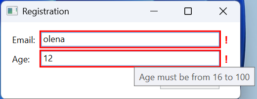
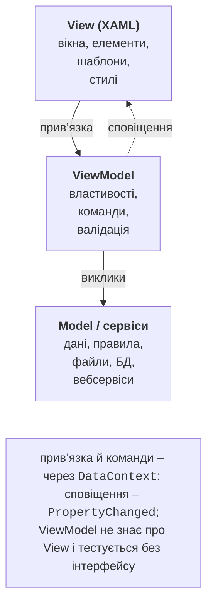
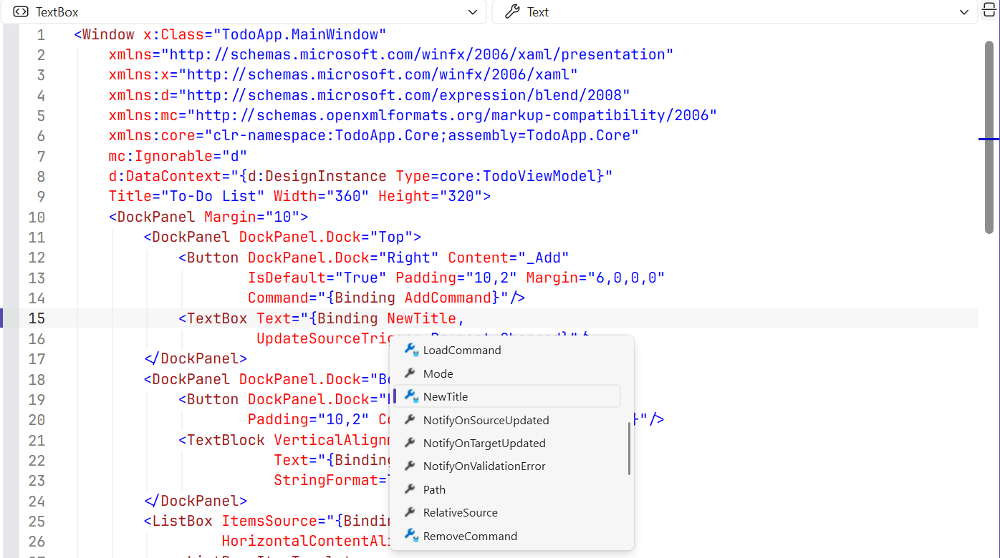
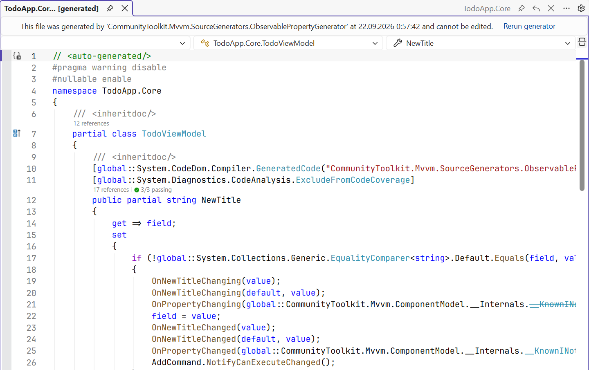

# Валідація, MVVM і CommunityToolkit

## Валідація введених даних

Прив’язка перевіряє дані на трьох рівнях: **помилки перетворення** (текст `abc` для властивості `int` не записується в джерело), **правила** `ValidationRule` у колекції `Binding.ValidationRules` і **інтерфейс `INotifyDataErrorInfo`**, який реалізує саме джерело: властивість `HasErrors`, метод `GetErrors(propertyName)` і подія `ErrorsChanged`. Останній спосіб підходить для MVVM, бо правила живуть у ViewModel і тестуються без інтерфейсу (<https://learn.microsoft.com/dotnet/api/system.componentmodel.inotifydataerrorinfo>).

Елемент з помилкою отримує приєднані властивості `Validation.HasError` і `Validation.Errors`, а навколо нього малюється шаблон `Validation.ErrorTemplate` (за замовчуванням – червона рамка). ViewModel форми реєстрації перевіряє вік (властивість `Email` з перевіркою символу `@` влаштована так само):

```cs
using System.Collections;
using System.ComponentModel;

namespace Registration;

public class RegistrationViewModel : ObservableObject,
    INotifyDataErrorInfo
{
    private readonly Dictionary<string, string> errors = [];

    public int Age
    {
        get;
        set
        {
            SetProperty(ref field, value);
            SetError(nameof(Age), value is >= 16 and <= 100
                ? null : "Age must be from 16 to 100");
        }
    } = 18;

    public bool HasErrors => errors.Count > 0;

    public event EventHandler<DataErrorsChangedEventArgs>?
        ErrorsChanged;

    public IEnumerable GetErrors(string? propertyName) =>
        propertyName is not null
        && errors.TryGetValue(propertyName, out string? error)
            ? new[] { error } : Array.Empty<string>();

    private void SetError(string property, string? error)
    {
        if (error is null)
        {
            errors.Remove(property);
        }
        else
        {
            errors[property] = error;
        }
        ErrorsChanged?.Invoke(this,
            new DataErrorsChangedEventArgs(property));
        OnPropertyChanged(nameof(HasErrors));
    }
}
```

Неявний стиль полів у ресурсах вікна показує текст першої помилки в підказці. Власний вигляд помилки (у прикладі – рамка зі знаком «!») задає сеттер `Validation.ErrorTemplate` з `ControlTemplate`, у якому елемент `AdornedElementPlaceholder` позначає місце поля:

```xml
<Style TargetType="TextBox">
    <Style.Triggers>
        <Trigger Property="Validation.HasError" Value="True">
            <Setter Property="ToolTip" Value="{Binding
                RelativeSource={RelativeSource Self},
                Path=(Validation.Errors)[0].ErrorContent}"/>
        </Trigger>
    </Style.Triggers>
</Style>
```

Кнопку *Save* вимикає тригер даних її стилю: `DataTrigger` з прив’язкою `{Binding HasErrors}`, значенням `True` і сеттером властивості `IsEnabled`.

Після введення `olena` в поле *Email* і `12` в поле *Age* обидва поля отримують рамку, підказки *Email must contain @* і *Age must be from 16 to 100*, а *Save* стає недоступною (рис. 13.8). Текст `x` у полі віку дає помилку перетворення *Value 'x' could not be converted.*, про яку ViewModel не знає (`HasErrors` не змінюється), тому таке значення перевіряють ще й перед збереженням.



Рис. 13.8. Відображення помилок валідації {.caption}

## Патерн MVVM і команди

### Ролі складових

**Model–View–ViewModel** (MVVM) – архітектурний патерн, який відокремлює інтерфейс від логіки (рис. 13.9) (<https://learn.microsoft.com/dotnet/communitytoolkit/mvvm/>):

- **Model** – дані та бізнес-правила, сервіси доступу до файлів, бази даних (теми 7–8), вебсервісів (тема 10); не знає про інтерфейс;
- **View** – розмітка XAML: елементи, стилі, шаблони; code-behind містить лише суто візуальний код;
- **ViewModel** – клас, який готує дані для View у зручному вигляді (властивості зі сповіщенням, колекції), тримає стан інтерфейсу (вибраний елемент, текст пошуку) і виконує дії (команди). ViewModel не посилається на елементи керування.



Рис. 13.9. Структура патерну MVVM {.caption}

Порівняно з обробниками подій у code-behind MVVM дає тестованість і повторне використання ViewModel, але додає класи, тому для вікна з двома кнопками патерн надмірний.

Щоб редактор XAML підказував властивості ViewModel у `{Binding}`, задають **контекст даних часу розробки**: атрибути з префіксом `d:` (простори імен `xmlns:d` і `xmlns:mc` вже є в шаблоні вікна, `mc:Ignorable="d"`) використовує лише конструктор, у скомпільованому застосунку їх немає (<https://learn.microsoft.com/visualstudio/xaml-tools/xaml-designtime-data>). Для вікна списку справ це атрибут кореневого елемента `d:DataContext="{d:DesignInstance Type=core:TodoViewModel}"`, де `xmlns:core="clr-namespace:TodoApp.Core;assembly=TodoApp.Core"`. Тепер IntelliSense усередині `{Binding }` пропонує `NewTitle`, `Items`, `AddCommand` (рис. 13.10), а помилка в імені підкреслюється.



Рис. 13.10. Підказки прив’язки з `d:DataContext` {.caption}

### Команди

Кнопки й пункти меню у MVVM не мають обробників `Click`: їхня властивість `Command` прив’язується до **команди** ViewModel – об’єкта з інтерфейсом `ICommand` (простір імен `System.Windows.Input`) (<https://learn.microsoft.com/dotnet/api/system.windows.input.icommand>):

- `Execute(parameter)` – виконує дію; параметр передає `CommandParameter`;
- `CanExecute(parameter)` – чи можна виконати дію зараз; елемент з командою автоматично стає недоступним, коли метод повертає `false`;
- подія `CanExecuteChanged` – сигнал елементу, що треба знову викликати `CanExecute`.

Вбудовані команди WPF (`RoutedCommand`, тема 12) шукають обробники в дереві елементів, тому для ViewModel пишуть власну команду, яка «передає» виклики делегатам:

```cs
using System.Windows.Input;

namespace Manual;

public class RelayCommand(Action<object?> execute,
    Func<object?, bool>? canExecute = null) : ICommand
{
    public event EventHandler? CanExecuteChanged;

    public bool CanExecute(object? parameter) =>
        canExecute?.Invoke(parameter) ?? true;

    public void Execute(object? parameter) => execute(parameter);

    // ViewModel повідомляє, що умова CanExecute могла змінитися.
    public void RaiseCanExecuteChanged() =>
        CanExecuteChanged?.Invoke(this, EventArgs.Empty);
}
```

ViewModel створює команду в конструкторі й викликає `RaiseCanExecuteChanged` із сеттера властивості, від якої залежить умова:

```cs
AddCommand = new RelayCommand(_ => Add(),
    _ => !string.IsNullOrWhiteSpace(NewTitle));
// у сеттері NewTitle:
if (SetProperty(ref field, value))
{
    AddCommand.RaiseCanExecuteChanged();
}
```

Кнопка `<Button Content="_Add" Command="{Binding AddCommand}"/>` недоступна, поки поле назви порожнє, і вмикається після введення першого символу. Параметр команди задають прив’язкою, наприклад `CommandParameter="{Binding SelectedItem, ElementName=itemsList}"`; зміна параметра теж змушує кнопку знову викликати `CanExecute`.

## Бібліотека CommunityToolkit.Mvvm

Базовий клас, команди й сповіщення доводиться писати в кожному проєкті, тому Microsoft підтримує бібліотеку **CommunityToolkit.Mvvm** (MVVM Toolkit, пакет NuGet `CommunityToolkit.Mvvm`, актуальна версія – 8.4.2). Вона не залежить від WPF і працює також у WinUI та .NET MAUI (тема 15) (<https://www.nuget.org/packages/CommunityToolkit.Mvvm>). Базовий клас `ObservableObject` містить `SetProperty` і `OnPropertyChanged`; атрибут `[ObservableProperty]` генерує властивість зі сповіщенням, `[NotifyPropertyChangedFor]` – сповіщення про залежну властивість, `[RelayCommand]` – команду з методу (`Add()` → `AddCommand`, `SaveAsync()` → `SaveCommand`), `[NotifyCanExecuteChangedFor]` – повторну перевірку `CanExecute` після зміни властивості. Клас `ObservableValidator` реалізує `INotifyDataErrorInfo` для атрибутів перевірки `[Required]`, `[Range]` (атрибут `[NotifyDataErrorInfo]`), а `WeakReferenceMessenger` передає повідомлення між ViewModel.

Класи з атрибутами мають бути `partial`, бо **генератори джерел** (*source generators*) дописують другу частину класу під час компіляції (<https://learn.microsoft.com/dotnet/communitytoolkit/mvvm/generators/overview>). Документація показує атрибут `[ObservableProperty]` на полях (`private string name;` → властивість `Name`), але починаючи з версії 8.4 рекомендовано **часткові властивості**: з C# 14 вони не потребують попередньої версії мови, а аналізатор MVVMTK0042 пропонує перетворити поле на властивість. Згенеровану властивість бачать інші генератори та IntelliSense.

Метод з атрибутом `[RelayCommand]`, який повертає `Task`, стає асинхронною командою `IAsyncRelayCommand`: поки вона виконується, властивість `IsRunning` дорівнює `true`, а повторний запуск заборонено. Параметр `CancellationToken` методу пов’язує команду зі скасуванням, а `[RelayCommand(IncludeCancelCommand = true)]` створює ще й команду `…CancelCommand` (<https://learn.microsoft.com/dotnet/communitytoolkit/mvvm/generators/relaycommand>). Згенерований код можна переглянути в *Solution Explorer*: *Dependencies → Analyzers → CommunityToolkit.Mvvm.SourceGenerators* (рис. 13.11).



Рис. 13.11. Код, згенерований CommunityToolkit.Mvvm {.caption}

**Месенджер** передає повідомлення між частинами застосунку, які не мають посилань одна на одну (наприклад, список справ і рядок стану). `WeakReferenceMessenger` зберігає отримувачів через слабкі посилання, тому забута відписка не спричиняє витоку пам’яті (<https://learn.microsoft.com/dotnet/communitytoolkit/mvvm/messenger>). Методи `Send` і `Register` є методами розширення з простору імен `CommunityToolkit.Mvvm.Messaging`:

```cs
public record TodoAddedMessage(string Title);
// Отримувач (у конструкторі StatusViewModel):
WeakReferenceMessenger.Default
    .Register<StatusViewModel, TodoAddedMessage>(this,
        (recipient, message) =>
            recipient.LastAdded = message.Title);
// Відправник:
WeakReferenceMessenger.Default.Send(new TodoAddedMessage("Walk"));
```
