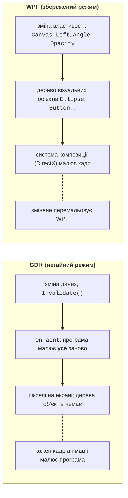
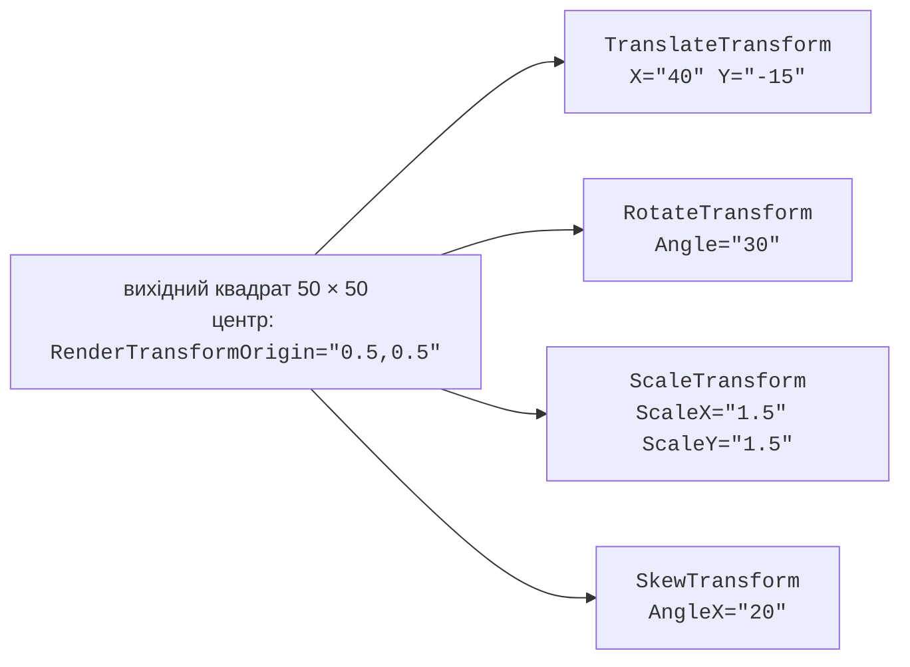
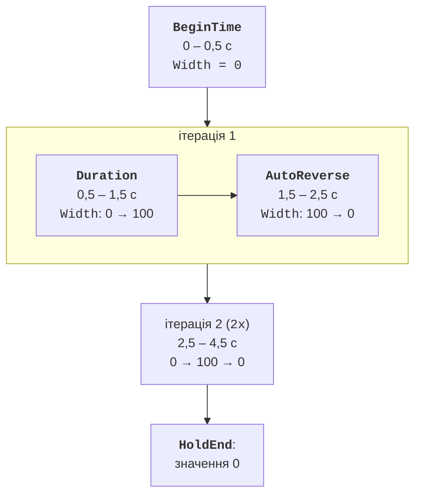

# Графіка та анімація властивостей

## Графіка WPF: збережений режим

У темі 4 графіка Windows Forms малювалася засобами GDI+ у **негайному режимі** (*immediate mode*): вікно не пам’ятає, що на ньому намальовано, тому після кожної зміни програма викликає `Invalidate()` і малює все заново в `OnPaint`. WPF працює в **збереженому режимі** (*retained mode*): кнопка, еліпс чи лінія – це об’єкти дерева візуальних елементів, які WPF пам’ятає й сам перемальовує через DirectX (рис. 14.1) (<https://learn.microsoft.com/dotnet/desktop/wpf/graphics-multimedia/wpf-graphics-rendering-overview>). Щоб перемістити фігуру, достатньо змінити її властивість, наприклад `Canvas.Left`; метод малювання писати не потрібно.



Рис. 14.1. Негайний режим GDI+ і збережений режим WPF {.caption}

Саме тому анімація у WPF – це **зміна значень властивостей у часі**: система анімації кожен кадр обчислює нове значення (ширини, кута повороту, прозорості), а система композиції показує результат.

### Фігури та пензлі

Прості фігури з простору імен `System.Windows.Shapes` – `Rectangle`, `Ellipse`, `Line`, `Polyline`, `Polygon` і `Path` – є повноцінними елементами: мають розмір, події миші, розміщуються на панелях і мають властивості `Fill` (пензель заливки), `Stroke` (пензель контуру), `StrokeThickness` і `StrokeDashArray` (штрихи) (<https://learn.microsoft.com/dotnet/desktop/wpf/graphics-multimedia/shapes-and-basic-drawing-in-wpf-overview>). Фігуру `Path` задають **міні-мовою розмітки шляхів**: `M x,y` – перейти в точку, `L x,y` – відрізок, `C` – крива Безьє, `A` – дуга еліпса, `Z` – замкнути фігуру; наприклад, `<Path Stroke="Black" Data="M 10,50 L 60,10 L 110,50 Z"/>` малює трикутник (<https://learn.microsoft.com/dotnet/desktop/wpf/graphics-multimedia/geometry-overview>). Координати задаються в незалежних від пристрою одиницях (1/96 дюйма), як у темі 12.

Пензель (`Brush`) зафарбовує фігуру, фон або текст: `SolidColorBrush` – суцільний колір, `LinearGradientBrush` і `RadialGradientBrush` – градієнти з точками `GradientStop`, `ImageBrush` – зображення. Пензлі, перетворення й геометрії не є елементами інтерфейсу: вони походять від класу `Freezable`, що важливо для анімації та продуктивності.

## Перетворення

**Перетворення** (*transform*) змінює вигляд елемента без зміни його властивостей `Width`, `Height` чи `Margin` (рис. 14.2) (<https://learn.microsoft.com/dotnet/desktop/wpf/graphics-multimedia/transforms-overview>):

- `TranslateTransform` – зсув на `X`, `Y`;
- `RotateTransform` – поворот на кут `Angle` у градусах за годинниковою стрілкою;
- `ScaleTransform` – масштаб `ScaleX`, `ScaleY` (від’ємне значення віддзеркалює);
- `SkewTransform` – нахил `AngleX`, `AngleY`;
- `TransformGroup` – кілька перетворень, які застосовуються в порядку запису.



Рис. 14.2. Види перетворень: пунктир – вихідний квадрат, точка – центр перетворення {.caption}

Центр повороту й масштабування за замовчуванням – лівий верхній кут елемента. Властивість `RenderTransformOrigin="0.5,0.5"` переносить його в центр: координати задаються частками ширини та висоти елемента (0 – лівий/верхній край, 1 – правий/нижній).

### `RenderTransform` і `LayoutTransform`

Перетворення призначають одній із двох властивостей:

- `RenderTransform` застосовується **після** компонування: сусідні елементи не рухаються, а повернутий елемент може їх перекривати. Це швидко, тому для анімації використовують саме його;
- `LayoutTransform` застосовується **до** компонування: панель відводить місце під повернутий елемент. Під час перевірки `StackPanel` із трьох кнопок, у якій середню повернуто на 45°, мала висоту 59,9 одиниці з `RenderTransform` і 110,6 з `LayoutTransform`.

Анімація `LayoutTransform` змушує панель перераховувати компонування в кожному кадрі, тому вона значно повільніша.

## Система анімації властивостей

Анімацію у WPF застосовують до окремої властивості. Властивість можна анімувати, якщо виконуються три умови (<https://learn.microsoft.com/dotnet/desktop/wpf/graphics-multimedia/animation-overview>):

1. це **властивість залежності** (*dependency property*, тема 12);
2. вона належить класу, похідному від `DependencyObject`, що реалізує інтерфейс `IAnimatable` (усі елементи, фігури, пензлі, перетворення);
3. існує клас анімації для її типу.

Класи анімацій з простору імен `System.Windows.Media.Animation` названо за типом значення (табл. 14.1). Звичайну властивість C# або поле анімувати не можна: у них немає механізму, через який система анімації подає значення.

Таблиця 14.1. Основні класи анімацій {.caption}

| **Тип** | **Анімація** | **Приклад властивості** |
| --- | --- | --- |
| `double` | `DoubleAnimation` | `Width`, `Opacity`, `Canvas.Left`, `RotateTransform.Angle` |
| `Color` | `ColorAnimation` | `SolidColorBrush.Color`, `GradientStop.Color` |
| `Thickness` | `ThicknessAnimation` | `Margin`, `Padding`, `BorderThickness` |
| `Point` | `PointAnimation` | `EllipseGeometry.Center`, `LineGeometry.StartPoint` |

Крім цих **базових** анімацій, для кожного типу є анімація за ключовими кадрами (`DoubleAnimationUsingKeyFrames`), а для `double`, `Point` і `Matrix` – анімація вздовж шляху (`DoubleAnimationUsingPath`).

### `From`, `To` і `By`

Базова анімація переходить від початкового значення до кінцевого (<https://learn.microsoft.com/dotnet/desktop/wpf/graphics-multimedia/from-to-by-animations-overview>):

- `From` і `To` – від `From` до `To`;
- лише `To` – від поточного значення до `To` (найзручніше: анімація продовжується з того місця, де зупинилася попередня);
- лише `By` – від поточного значення на `By` більше;
- жодного – до **базового** значення властивості, тобто до значення без анімацій. Так кнопку повертають до звичайного розміру після наведення курсора.

### Анімація з коду: `BeginAnimation`

Найкоротший спосіб запустити анімацію з коду – метод `BeginAnimation(властивість, анімація)`, який мають усі елементи, пензлі та перетворення:

```cs
var grow = new DoubleAnimation
{
    To = 250,                                  // від поточного
    Duration = TimeSpan.FromSeconds(0.3)
};
box.BeginAnimation(WidthProperty, grow);       // Rectangle box
```

Так само `PointAnimation`, запущена для властивості `EllipseGeometry.CenterProperty`, переміщує центр кола: під час перевірки він опинився в точці (200; 60). Прямокутник із шириною 100 після анімації з `By = 50` мав ширину 150.

## Часові параметри анімації

Усі анімації походять від класу `Timeline` («часова шкала») і мають однакові параметри часу (рис. 14.3) (<https://learn.microsoft.com/dotnet/desktop/wpf/graphics-multimedia/timing-behaviors-overview>):

- `Duration` – тривалість однієї ітерації, у XAML `"години:хвилини:секунди"`, наприклад `"0:0:1.5"`; за замовчуванням 1 с;
- `BeginTime` – затримка перед початком;
- `AutoReverse="True"` – після досягнення кінця програти анімацію у зворотному напрямку; одна ітерація триває вдвічі довше;
- `RepeatBehavior` – кількість повторів `"3x"`, загальний час `"0:0:10"` або `"Forever"`;
- `SpeedRatio` – швидкість плину часу: `2` означає вдвічі швидше;
- `FillBehavior` – що відбувається після завершення: `HoldEnd` (за замовчуванням) утримує кінцеве значення, `Stop` повертає властивості її базове значення.



Рис. 14.3. Параметри часу анімації ширини від 0 до 100 {.caption}

На рисунку показано анімацію `From="0" To="100" Duration="0:0:1" BeginTime="0:0:0.5" AutoReverse="True" RepeatBehavior="2x"`. Її значення отримано з WPF кожні 0,5 с: 0; 0; 50; 100; 50; 0; 50; 100; 50; 0; 0. Анімація завершується через 4,5 с (0,5 + 2 · 2 с) і утримує останнє значення 0.

::: tip Увага
Поки анімація з `FillBehavior="HoldEnd"` утримує значення, присвоєння властивості в коді «не працює». Під час перевірки після анімації до 250 рядок `box.Width = 40` залишив ширину 250: анімація має вищий пріоритет, ніж локальне значення (тема 12). Щоб повернути керування коду, анімацію знімають викликом `box.BeginAnimation(WidthProperty, null)` – після цього ширина стала 40 – або від початку задають `FillBehavior = FillBehavior.Stop`.
:::
