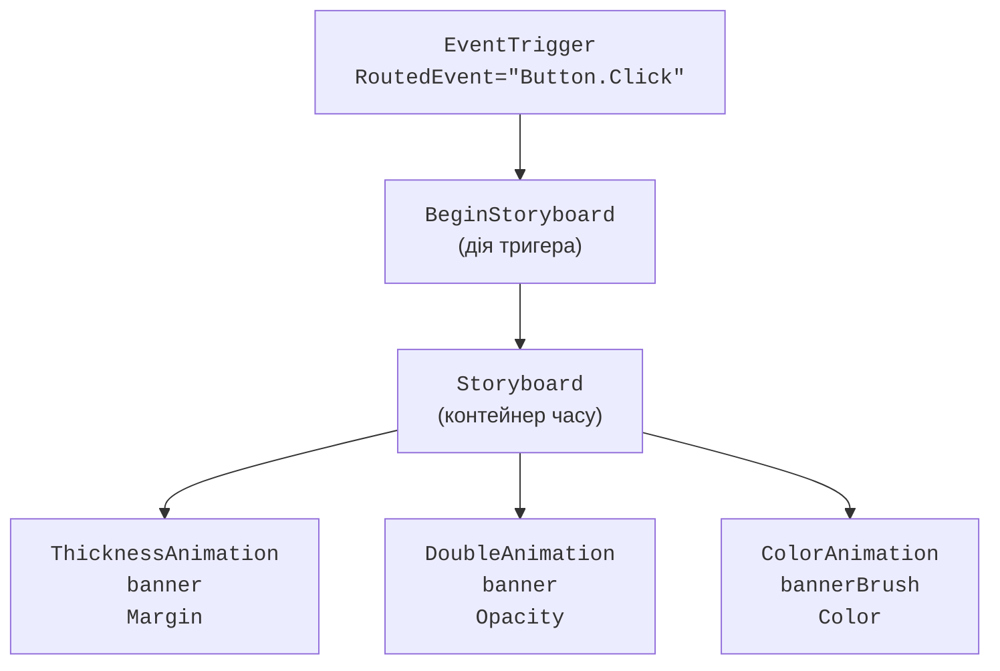
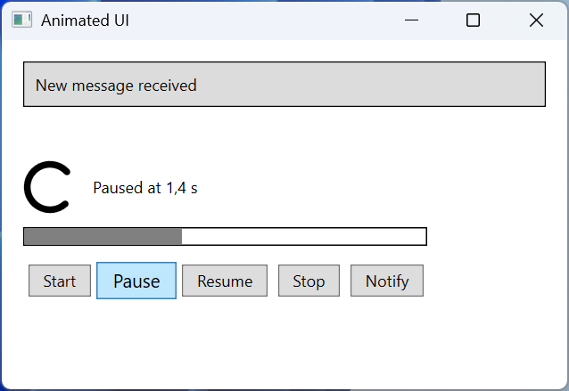
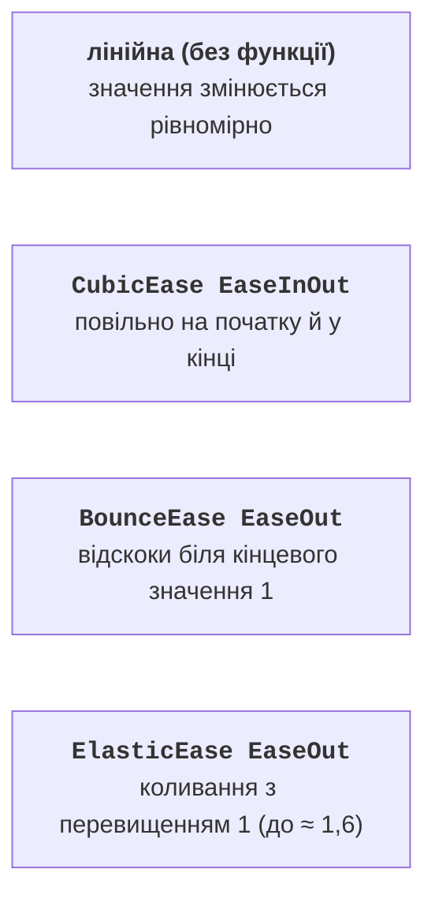

# Розкадрування та ключові кадри

## Розкадрування `Storyboard` і тригери

**Розкадрування** (*storyboard*) – часова шкала-контейнер, яка запускає кілька анімацій разом і вказує, що саме анімувати, приєднаними властивостями (<https://learn.microsoft.com/dotnet/desktop/wpf/graphics-multimedia/storyboards-overview>):

- `Storyboard.TargetName` – ім’я (`x:Name`) елемента або `Freezable`-об’єкта (пензля, перетворення);
- `Storyboard.TargetProperty` – шлях до властивості. Простий шлях: `"Width"`, `"Opacity"`. Шлях через вкладені об’єкти записують через крапку (`"RenderTransform.Angle"`) або в повній формі з типами в дужках: `"(UIElement.RenderTransform).(RotateTransform.Angle)"`.

Повна форма потрібна, коли тип об’єкта неочевидний (наприклад, у стилі) і в коді. Якщо перетворення не має імені, анімація знайде його за шляхом від елемента, але саме перетворення має бути задане заздалегідь: за замовчуванням `RenderTransform` містить незмінне тотожне перетворення, і анімація кута не матиме жодного ефекту. Якщо перетворення задано в стилі, воно заморожене; розкадрування автоматично анімує його копію, а виклик `BeginAnimation` для такого об’єкта генерує виняток.

### Запуск у XAML: `EventTrigger` і `BeginStoryboard`

У XAML розкадрування запускає **тригер події** `EventTrigger`, дія якого `BeginStoryboard` починає розкадрування (рис. 14.4). Тригери подій записують у колекцію `Triggers` елемента або стилю; `RoutedEvent` задає маршрутизовану подію, наприклад `Button.Click` чи `FrameworkElement.Loaded`. Для тригера за властивістю (`Trigger` у стилі) розкадрування запускають у `Trigger.EnterActions` (умова стала істинною) і `Trigger.ExitActions` (умова стала хибною).



Рис. 14.4. Структура тригера з розкадруванням прикладу «Анімовані елементи інтерфейсу» {.caption}

У власних шаблонах елементів керування (тема 13) розкадрування також описують для станів `VisualStateManager` (`MouseOver`, `Pressed`).

### Керування з коду

Розкадрування, описане в ресурсах, отримують методом `FindResource` і керують ним методами `Begin`, `Pause`, `Resume`, `Stop`, `Seek` і `SetSpeedRatio`. Щоб методи керування працювали, розкадрування запускають з параметром `isControllable: true`, а в кожен метод передають той самий елемент, для якого його запущено. Подія `Completed` виникає після завершення всіх дочірніх анімацій; `Stop` зупиняє анімації і повертає властивостям базові значення. Розкадрування можна створити і в коді:

```cs
var spin = new DoubleAnimation(0, 360, TimeSpan.FromSeconds(1));
Storyboard.SetTargetProperty(spin, new PropertyPath(
    "(UIElement.RenderTransform).(RotateTransform.Angle)"));
var storyboard = new Storyboard();
storyboard.Children.Add(spin);
storyboard.Begin(logo);   // у logo задано RotateTransform
```

### Приклад «Анімовані елементи інтерфейсу»

Вікно містить обертовий індикатор завантаження, смугу прогресу, кнопки керування розкадруванням і кнопку *Notify*, яка показує повідомлення (рис. 14.5). Кожна кнопка плавно збільшується на 15 %, коли над нею курсор, і повертається до звичайного розміру, коли курсор її залишає. Проєкт – *WPF Application* (.NET 10), файл `MainWindow.xaml`:

```xml
<Window x:Class="AnimatedUi.MainWindow"
    xmlns="http://schemas.microsoft.com/winfx/2006/xaml/presentation"
    xmlns:x="http://schemas.microsoft.com/winfx/2006/xaml"
    Title="Animated UI" Width="440" Height="300">
    <Window.Resources>
        <!-- Кнопка збільшується, коли над нею курсор. -->
        <Style TargetType="Button">
            <Setter Property="Margin" Value="4"/>
            <Setter Property="Padding" Value="10,3"/>
            <Setter Property="RenderTransformOrigin" Value="0.5,0.5"/>
            <Setter Property="RenderTransform">
                <Setter.Value>
                    <ScaleTransform/>
                </Setter.Value>
            </Setter>
            <Style.Triggers>
                <Trigger Property="IsMouseOver" Value="True">
                    <Trigger.EnterActions>
                        <BeginStoryboard>
                            <Storyboard>
                                <DoubleAnimation To="1.15"
                                    Duration="0:0:0.15"
                                    Storyboard.TargetProperty=
                                    "RenderTransform.ScaleX"/>
                                <DoubleAnimation To="1.15"
                                    Duration="0:0:0.15"
                                    Storyboard.TargetProperty=
                                    "RenderTransform.ScaleY"/>
                            </Storyboard>
                        </BeginStoryboard>
                    </Trigger.EnterActions>
```

Під час виходу курсора анімації не мають ні `From`, ні `To`, тому масштаб повертається до базового значення 1:

```xml
            <Trigger.ExitActions>
                <BeginStoryboard>
                    <Storyboard>
                        <DoubleAnimation Duration="0:0:0.15"
                            Storyboard.TargetProperty=
                            "RenderTransform.ScaleX"/>
                        <DoubleAnimation Duration="0:0:0.15"
                            Storyboard.TargetProperty=
                            "RenderTransform.ScaleY"/>
                    </Storyboard>
                </BeginStoryboard>
            </Trigger.ExitActions>
        </Trigger>
    </Style.Triggers>
</Style>
```

Два розкадрування з ключами описано в ресурсах вікна. `LoadingStoryboard` за 3 с розтягує смугу від 0 до 300 одиниць з плавним розгоном і гальмуванням (`CubicEase`) і тричі повертає індикатор на 360°. `NotifyStoryboard` опускає повідомлення згори з двома відскоками (`BounceEase`), за 0,3 с робить його непрозорим, а потім двічі змінює яскравість фону від світло-сірого до білого й назад:

```xml
    <!-- Завантаження: смуга росте, індикатор обертається. -->
    <Storyboard x:Key="LoadingStoryboard">
        <DoubleAnimation Storyboard.TargetName="bar"
            Storyboard.TargetProperty="Width"
            From="0" To="300" Duration="0:0:3">
            <DoubleAnimation.EasingFunction>
                <CubicEase EasingMode="EaseInOut"/>
            </DoubleAnimation.EasingFunction>
        </DoubleAnimation>
        <DoubleAnimation Storyboard.TargetName="spinnerRotation"
            Storyboard.TargetProperty="Angle"
            From="0" To="360" Duration="0:0:1"
            RepeatBehavior="3x"/>
    </Storyboard>

    <!-- Повідомлення «падає» згори з відскоком і блимає. -->
    <Storyboard x:Key="NotifyStoryboard">
        <ThicknessAnimation Storyboard.TargetName="banner"
            Storyboard.TargetProperty="Margin"
            From="0,-40,0,80" To="0,0,0,40" Duration="0:0:0.6">
            <ThicknessAnimation.EasingFunction>
                <BounceEase EasingMode="EaseOut" Bounces="2"/>
            </ThicknessAnimation.EasingFunction>
        </ThicknessAnimation>
        <DoubleAnimation Storyboard.TargetName="banner"
            Storyboard.TargetProperty="Opacity"
            From="0" To="1" Duration="0:0:0.3"/>
        <ColorAnimation Storyboard.TargetName="bannerBrush"
            Storyboard.TargetProperty="Color"
            From="Gainsboro" To="White" BeginTime="0:0:0.6"
            Duration="0:0:0.5" AutoReverse="True"
            RepeatBehavior="2x"/>
    </Storyboard>
</Window.Resources>
```

Індикатор – товста дуга на три чверті кола (`Path` з командою `A`), повернута перетворенням `spinnerRotation`. Пензель фону повідомлення має ім’я `bannerBrush`, щоб `ColorAnimation` могла його знайти. Кнопка *Notify* запускає розкадрування тригером події без жодного рядка C#:

```xml
    <StackPanel Margin="16">
        <Border x:Name="banner" BorderBrush="Black"
                BorderThickness="1" Padding="8" Margin="0,0,0,40"
                Opacity="0">
            <Border.Background>
                <SolidColorBrush x:Name="bannerBrush" Color="White"/>
            </Border.Background>
            <TextBlock Text="New message received"/>
        </Border>

        <StackPanel Orientation="Horizontal">
            <Path Width="40" Height="40" Stroke="Black"
                  StrokeThickness="5" StrokeStartLineCap="Round"
                  StrokeEndLineCap="Round"
                  Data="M 20,3 A 17,17 0 1 1 3,20"
                  RenderTransformOrigin="0.5,0.5">
                <Path.RenderTransform>
                    <RotateTransform x:Name="spinnerRotation"/>
                </Path.RenderTransform>
            </Path>
            <TextBlock x:Name="status" Text="Ready" Margin="12,0"
                       VerticalAlignment="Center"/>
        </StackPanel>
        <Border BorderBrush="Black" BorderThickness="1" Width="302"
                Height="14" Margin="0,10" HorizontalAlignment="Left">
            <Rectangle x:Name="bar" Fill="Gray" Width="0"
                       HorizontalAlignment="Left"/>
        </Border>

        <WrapPanel>
            <Button Content="Start" Click="Start_Click"/>
            <Button Content="Pause" Click="Pause_Click"/>
            <Button Content="Resume" Click="Resume_Click"/>
            <Button Content="Stop" Click="Stop_Click"/>
            <Button x:Name="notifyButton" Content="Notify">
                <Button.Triggers>
                    <EventTrigger RoutedEvent="Button.Click">
                        <BeginStoryboard Storyboard=
                            "{StaticResource NotifyStoryboard}"/>
                    </EventTrigger>
                </Button.Triggers>
            </Button>
        </WrapPanel>
    </StackPanel>
</Window>
```

Файл `MainWindow.xaml.cs` керує розкадруванням завантаження:

```cs
using System.Windows;
using System.Windows.Media.Animation;

namespace AnimatedUi;

public partial class MainWindow : Window
{
    private readonly Storyboard loading;

    public MainWindow()
    {
        InitializeComponent();
        loading = (Storyboard)FindResource("LoadingStoryboard");
        loading.Completed += (s, e) => status.Text = "Done";
    }

    private void Start_Click(object sender, RoutedEventArgs e)
    {
        status.Text = "Loading...";
        loading.Begin(this, isControllable: true);
    }

    private void Pause_Click(object sender, RoutedEventArgs e)
    {
        loading.Pause(this);
        TimeSpan? time = loading.GetCurrentTime(this);
        status.Text = $"Paused at {time?.TotalSeconds:F1} s";
    }

    private void Resume_Click(object sender, RoutedEventArgs e)
    {
        loading.Resume(this);
        status.Text = "Loading...";
    }

    private void Stop_Click(object sender, RoutedEventArgs e)
    {
        loading.Stop(this);           // значення повертаються
        status.Text = "Stopped";
    }
}
```

Під час перевірки кадрів (розкадрування переміщувалося методом `SeekAlignedToLastTick`) смуга через 0,75 с мала ширину 18,8, через 1,5 с – 150, через 2,25 с – 281,2: через `CubicEase` вона за першу чверть часу проходить лише 6 % шляху, у середині рухається найшвидше, а наприкінці гальмує. Кут індикатора в ці моменти – 270°, 180° і 90°. Після паузи на 1,35 с рядок стану показує «Paused at 1,4 s», після завершення – «Done», після *Stop* смуга знову має ширину 0.



Рис. 14.5. Застосунок «Анімовані елементи інтерфейсу» {.caption}

## Функції пом’якшення та ключові кадри

### Функції пом’якшення

Лінійна анімація змінює значення рівномірно і виглядає механічно. **Функція пом’якшення** (*easing function*) змінює характер руху: розгін, гальмування, відскок, пружні коливання (рис. 14.6) (<https://learn.microsoft.com/dotnet/desktop/wpf/graphics-multimedia/easing-functions>). Її призначають властивості `EasingFunction` анімації. Властивість `EasingMode` визначає, до якої частини руху застосовується ефект: `EaseIn` – на початку, `EaseOut` (за замовчуванням) – наприкінці, `EaseInOut` – на обох кінцях.



Рис. 14.6. Функції пом’якшення: значення `IEasingFunction.Ease` з WPF {.caption}

Найуживаніші функції: `QuadraticEase`, `CubicEase`, `QuarticEase`, `QuinticEase` (розгін і гальмування різної сили), `SineEase`, `CircleEase`, `ExponentialEase`, `BackEase` (невеликий відхід назад), `BounceEase` (відскоки; `Bounces` за замовчуванням 3), `ElasticEase` (пружні коливання довкола кінцевого значення; `Oscillations` – 3). Функція `ElasticEase` виходить за межі кінцевого значення (до 1,62 на рисунку), тому для прозорості, яка не може бути більшою за 1, її не використовують.

### Анімація за ключовими кадрами

Базова анімація має лише два значення. **Анімація за ключовими кадрами** (*key-frame animation*) проходить через довільну кількість значень у заданий час `KeyTime`; спосіб переходу до кожного кадру визначає клас кадру (<https://learn.microsoft.com/dotnet/desktop/wpf/graphics-multimedia/key-frame-animations-overview>):

- `LinearDoubleKeyFrame` – рівномірний перехід;
- `DiscreteDoubleKeyFrame` – стрибок у момент `KeyTime`;
- `SplineDoubleKeyFrame` – перехід за кривою Безьє `KeySpline`;
- `EasingDoubleKeyFrame` – перехід із функцією пом’якшення.

```xml
<DoubleAnimationUsingKeyFrames Storyboard.TargetName="box"
                               Storyboard.TargetProperty="Width">
    <LinearDoubleKeyFrame Value="100" KeyTime="0:0:1"/>
    <DiscreteDoubleKeyFrame Value="50" KeyTime="0:0:2"/>
    <SplineDoubleKeyFrame Value="150" KeyTime="0:0:3"
                          KeySpline="0.5,0 1,1"/>
    <EasingDoubleKeyFrame Value="0" KeyTime="0:0:4">
        <EasingDoubleKeyFrame.EasingFunction>
            <BounceEase EasingMode="EaseOut"/>
        </EasingDoubleKeyFrame.EasingFunction>
    </EasingDoubleKeyFrame>
</DoubleAnimationUsingKeyFrames>
```

Для прямокутника з початковою шириною 0 WPF дав значення: 50 через 0,5 с, 100 через 1 с і 1,99 с, 50 через 2 с, 77,8 через 2,5 с, 150 через 3 с, 0 через 4 с. Між 1 і 2 с ширина не змінюється і стрибком стає 50 лише в момент 2 с (дискретний кадр), а між 2 і 3 с зростає спершу повільно, потім швидко (сплайн). Дискретні кадри – єдиний спосіб анімувати властивості без інтерполяції, наприклад `StringAnimationUsingKeyFrames` для тексту або `ObjectAnimationUsingKeyFrames` для `Visibility`.

**Анімація вздовж шляху** (`DoubleAnimationUsingPath`, `MatrixAnimationUsingPath`) бере значення з геометрії `PathGeometry`: об’єкт рухається вздовж кривої, а з `DoesRotateWithTangent="True"` ще й повертається за напрямком руху (<https://learn.microsoft.com/dotnet/desktop/wpf/graphics-multimedia/path-animations-overview>).

Складні розкадрування зручно створювати візуально в **Blend for Visual Studio** – компоненті робочого навантаження *.NET desktop development* Visual Studio 2026: команда *View → Design in Blend…* відкриває проєкт, а вікно *Objects and Timeline* показує часову шкалу з ключовими кадрами (<https://learn.microsoft.com/visualstudio/xaml-tools/creating-a-ui-by-using-blend-for-visual-studio>). Результат усе одно записується в XAML як `Storyboard`.
