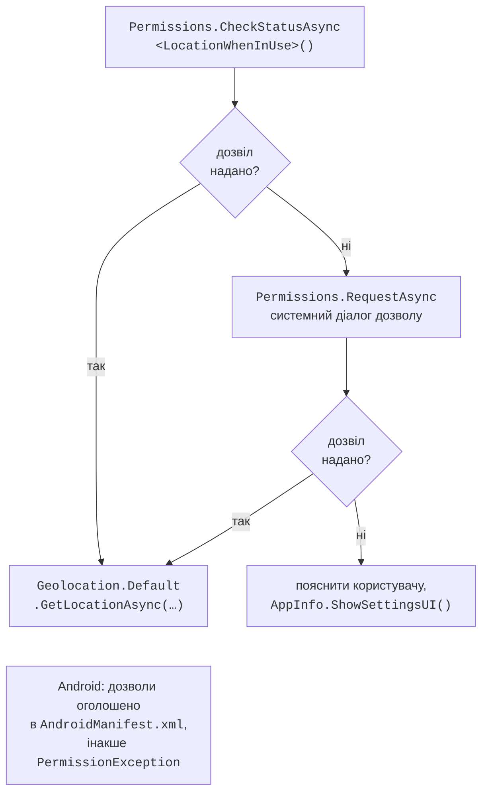
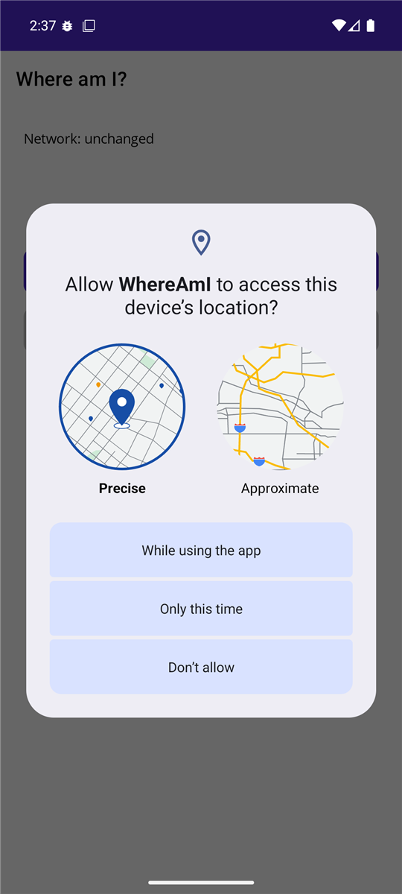

# Сервіси пристрою, дані й публікація

## Сервіси пристрою та дозволи

### API платформ

MAUI надає кросплатформні класи для можливостей пристрою (табл. 15.4). Кожен клас має статичну властивість `Default` або `Current` з реалізацією для поточної платформи та інтерфейс для DI (<https://learn.microsoft.com/dotnet/maui/platform-integration/>).

Таблиця 15.4. Сервіси пристрою .NET MAUI {.caption}

| **Клас** | **Призначення та основні члени** |
| --- | --- |
| `Preferences` | прості налаштування «ключ – значення» (`bool`, числа, `string`, `DateTime`): `Set`, `Get(key, default)`, `Remove` |
| `SecureStorage` | зашифроване сховище токенів і паролів: `SetAsync`, `GetAsync`, `Remove` |
| `FileSystem` | `AppDataDirectory` – дані застосунку, `CacheDirectory` – кеш, `OpenAppPackageFileAsync` – файли з `Resources/Raw` |
| `Connectivity` | `NetworkAccess` (`Internet`, `Local`, `None`), подія `ConnectivityChanged` |
| `Geolocation` | `GetLocationAsync`, `GetLastKnownLocationAsync`, `IsEnabled` (.NET 10) |
| `MediaPicker` | `PickPhotosAsync` (`SelectionLimit`), `CapturePhotoAsync`, `IsCaptureSupported` |
| `Share` | системне вікно «Поділитися»: `ShareTextRequest`, `ShareFileRequest` |
| `DeviceInfo`, `AppInfo` | платформа, тип пристрою, версії; `AppInfo.ShowSettingsUI()` |
| `PhoneDialer`, `Email`, `Launcher` | дзвінок, лист, відкриття адреси в іншому застосунку |
| `HapticFeedback`, `Vibration` | тактильний відгук і вібрація; `IsSupported` (.NET 10) |
| `Accelerometer`, `Compass` | датчики: `IsSupported`, `Start(SensorSpeed)`, подія `ReadingChanged`, `Stop` |

Не кожна платформа має кожну можливість: у комп’ютера з Windows зазвичай немає компаса й акселерометра, тому перед використанням перевіряють `IsSupported` або перехоплюють `FeatureNotSupportedException`. Метод `MediaPicker.PickPhotoAsync` у .NET 10 застарів: замість нього використовують `PickPhotosAsync`, який повертає список (порожній, якщо користувач скасував вибір).

**Головний потік.** Змінювати елементи інтерфейсу можна лише в головному потоці. Події `Connectivity` і датчиків зі швидкістю `SensorSpeed.Game` чи `Fastest` можуть надходити з іншого потоку, тому оновлення виконують через `MainThread.BeginInvokeOnMainThread(() => …)`. Події датчиків зі швидкістю `SensorSpeed.UI` надходять у головному потоці.

### Дозволи

Доступ до геолокації, камери, контактів потребує **дозволу** (*permission*) користувача. Клас `Permissions` перевіряє стан дозволу методом `CheckStatusAsync<T>` і показує системний запит методом `RequestAsync<T>`, де `T` – тип дозволу, наприклад `Permissions.LocationWhenInUse` або `Permissions.Camera` (рис. 15.11). Результат має тип `PermissionStatus`: `Granted`, `Denied`, `Disabled`, `Restricted`, `Limited`, `Unknown`. Запитувати дозвіл слід, коли вже з’явилася перша сторінка і користувач виконує дію, для якої дозвіл потрібен; на iOS після відмови повторний запит не показується, і користувача скеровують у налаштування (<https://learn.microsoft.com/dotnet/maui/platform-integration/appmodel/permissions>).



Рис. 15.11. Запит дозволу на використання геолокації {.caption}

Дозволи, які запитує застосунок, треба оголосити на кожній платформі. У Windows для цих API окремих дозволів не потрібно (`CheckStatusAsync` повертає `Granted`), на iOS у `Info.plist` додають ключ `NSLocationWhenInUseUsageDescription` з поясненням для користувача, а на Android – елементи `<uses-permission android:name="android.permission.ACCESS_FINE_LOCATION" />` (і так само `ACCESS_COARSE_LOCATION`) у файлі `Platforms/Android/AndroidManifest.xml`. Якщо дозвіл не оголошено, `RequestAsync` генерує `PermissionException`. Ці рядки можна позначити у візуальному редакторі маніфесту (подвійне клацання на `AndroidManifest.xml`, розділ *Required permissions*).

### Приклад «Де я?»

Сторінка показує зміни стану мережі, визначає координати пристрою, відстань до Києва й ділиться посиланням на карту. Розмітка складається з `VerticalStackLayout` з написами `networkLabel`, `coordinatesLabel`, `distanceLabel`, кнопками *Find my location* (подія `OnLocateClicked`), `shareButton` (*Share*, `IsEnabled="False"`, подія `OnShareClicked`) та індикатором `busyIndicator` (`ActivityIndicator`). Код сторінки:

```cs
using System.Globalization;

namespace WhereAmI;

public partial class MainPage : ContentPage
{
    private static readonly Location Kyiv = new(50.4501, 30.5234);
    private Location? current;

    public MainPage() => InitializeComponent();

    protected override void OnAppearing()
    {
        base.OnAppearing();
        Connectivity.Current.ConnectivityChanged += OnConnectivity;
    }

    protected override void OnDisappearing()
    {
        base.OnDisappearing();
        Connectivity.Current.ConnectivityChanged -= OnConnectivity;
    }

    // Подія може надійти не з головного потоку.
    private void OnConnectivity(object? sender,
        ConnectivityChangedEventArgs e) =>
        MainThread.BeginInvokeOnMainThread(() =>
            networkLabel.Text = $"Network: {e.NetworkAccess}");

    private async void OnLocateClicked(object? sender, EventArgs e)
    {
        PermissionStatus status = await Permissions
            .CheckStatusAsync<Permissions.LocationWhenInUse>();
        if (status != PermissionStatus.Granted)
        {
            status = await Permissions
                .RequestAsync<Permissions.LocationWhenInUse>();
        }
        if (status != PermissionStatus.Granted)
        {
            await DisplayAlertAsync("Location",
                "Allow location access in the app settings.", "OK");
            return;
        }
        busyIndicator.IsRunning = true;
        try
        {
            current = await Geolocation.Default.GetLocationAsync(
                new GeolocationRequest(GeolocationAccuracy.Medium,
                    TimeSpan.FromSeconds(10)));
            if (current is null)
            {
                coordinatesLabel.Text = "Location is unavailable";
                return;
            }
            coordinatesLabel.Text =
                $"{current.Latitude:F5}; {current.Longitude:F5}";
            double km = Location.CalculateDistance(
                current, Kyiv, DistanceUnits.Kilometers);
            distanceLabel.Text = $"Distance to Kyiv: {km:F1} km";
            shareButton.IsEnabled = true;
        }
        catch (FeatureNotEnabledException)
        {
            coordinatesLabel.Text = "Turn on location services";
        }
        finally
        {
            busyIndicator.IsRunning = false;
        }
    }

    private async void OnShareClicked(object? sender, EventArgs e)
    {
        // Крапка в координатах за будь-яких регіональних налаштувань.
        var inv = CultureInfo.InvariantCulture;
        string lat = current!.Latitude.ToString("F5", inv);
        string lon = current.Longitude.ToString("F5", inv);
        await Share.Default.RequestAsync(new ShareTextRequest
        {
            Title = "My location",
            Uri = $"https://www.openstreetmap.org/?mlat={lat}"
                + $"&mlon={lon}"
        });
    }
}
```

Під час першого натискання *Find my location* на Android з’являється системний запит дозволу (рис. 15.12). Координати в емуляторі задають у *Extended controls* (кнопка «…» на панелі емулятора → *Location*) (рис. 15.13). Для точки 47,9105; 33,3918 (Кривий Ріг) напис показує `47,91050; 33,39180` і `Distance to Kyiv: 351,0 km` – це відстань по поверхні Землі, яку обчислює `Location.CalculateDistance`. Число з комою в посиланні зламало б адресу карти, тому для URL координати форматуються з `CultureInfo.InvariantCulture` (`47.91050`). Якщо в дозволі відмовлено, повідомлення радить увімкнути його в налаштуваннях (їх відкриває `AppInfo.Current.ShowSettingsUI()`).



Рис. 15.12. Системний запит дозволу на геолокацію {.caption}

::: info Знімок екрана
Emulator Extended controls → Location with point 47.9105, 33.3918 set; the app shows coordinates and «Distance to Kyiv: 351,0 km»
:::

Рис. 15.13. Імітація координат у розширених налаштуваннях емулятора {.caption}

## Локальні дані та вебсервіси

### База даних SQLite

Для невеликих налаштувань достатньо `Preferences`, для документів – файлів у `AppDataDirectory`, а для таблиць з пошуком і сортуванням – локальної бази SQLite. Документація MAUI використовує пакет **sqlite-net-pcl** (власник `praeclarum`; схожі назви мають інші пакети, тому перевіряйте ідентифікатор) (<https://learn.microsoft.com/dotnet/maui/data-cloud/database-sqlite>). Він надає просте ORM: атрибути `[PrimaryKey, AutoIncrement]`, асинхронне з’єднання `SQLiteAsyncConnection`, методи `CreateTableAsync<T>`, `InsertAsync`, `UpdateAsync`, `DeleteAsync` і запити LINQ `Table<T>().Where(…).ToListAsync()`. Файл бази розміщують в `AppDataDirectory`, а з’єднання відкривають під час першого звернення (приклад – у лабораторній роботі). Альтернативи – пакет Microsoft.Data.Sqlite (ADO.NET, тема 7) та EF Core з провайдером SQLite (тема 8).

### Клієнт REST-сервісу «Каталог книг»

Застосунок отримує список книг з вебсервісу ASP.NET Core, запущеного на тому ж комп’ютері (тема 10), і оновлює його жестом «потягнути вниз». Емулятор Android працює за віртуальним маршрутизатором, тому `localhost` у ньому – сам емулятор, а комп’ютер доступний за адресою `10.0.2.2`. Android за замовчуванням забороняє незашифрований HTTP, тому на час розробки в `Platforms/Android/MainApplication.cs` задають `[Application(UsesCleartextTraffic = true)]` усередині `#if DEBUG` (<https://learn.microsoft.com/dotnet/maui/data-cloud/local-web-services>).

`BooksViewModel` отримує `HttpClient` у конструкторі. Його команда `LoadCommand` викликає `http.GetFromJsonAsync<List<Book>>("api/books")`, заповнює `ObservableCollection<Book> Books`, записує в `Status` кількість книг або текст `HttpRequestException` і в блоці `finally` скидає властивість `IsRefreshing`. Адреса сервісу залежить від платформи й задається під час реєстрації `HttpClient` у `MauiProgram`: `BaseAddress` дорівнює `http://10.0.2.2:5080/`, якщо `DeviceInfo.Platform == DevicePlatform.Android`, і `http://localhost:5080/` на інших платформах. Сторінка обгортає `CollectionView` у `RefreshView` з прив’язками `Command="{Binding LoadCommand}"` і `IsRefreshing="{Binding IsRefreshing}"`.

Жест оновлення встановлює `IsRefreshing = true` і виконує `LoadCommand`, а ViewModel після завантаження скидає властивість, і індикатор зникає. Якщо сервіс не запущено, напис `Status` показує `Server is unavailable: …`, а список залишається попереднім. Властивість `Page.IsBusy` у .NET 10 застаріла: для індикації тривалих операцій використовують `ActivityIndicator` або `RefreshView`.

### CommunityToolkit.Maui

Пакет **CommunityToolkit.Maui** (версія 15 для .NET 10, підключається викликом `.UseMauiCommunityToolkit()`) додає спливаючі повідомлення `Toast` і `Snackbar`, вікна `Popup`, поведінки й перетворювачі, а окремий пакет CommunityToolkit.Maui.MediaElement відтворює аудіо й відео (<https://learn.microsoft.com/dotnet/communitytoolkit/maui/>). Для лабораторної роботи він не обов’язковий.

## Публікація застосунку

Команда `dotnet publish` збирає застосунок для однієї платформи, тому параметр `-f` обов’язковий (<https://learn.microsoft.com/dotnet/maui/deployment/>):

```powershell
# Windows: папка з .exe без пакета MSIX
dotnet publish -f net10.0-windows10.0.19041.0 -c Release `
    -p:WindowsPackageType=None -p:WindowsAppSDKSelfContained=true
# Android: файли .aab (Google Play) і .apk
dotnet publish -f net10.0-android -c Release
```

Для Windows параметр `WindowsAppSDKSelfContained=true` додає бібліотеки Windows App SDK до папки застосунку, а пакет MSIX для Microsoft Store підписують сертифікатом. Для Android збирання Release створює пакет `.aab` для Google Play і `.apk`, який можна встановити на телефон напряму. Для публікації в магазині пакет підписують власним ключем, створеним утилітою `keytool` з JDK (параметри `AndroidKeyStore`, `AndroidSigningKeyStore`, `AndroidSigningKeyAlias`), і зберігають цей ключ: без нього неможливо випустити оновлення. Публікація для iOS потребує Mac і платного облікового запису Apple Developer Program.
