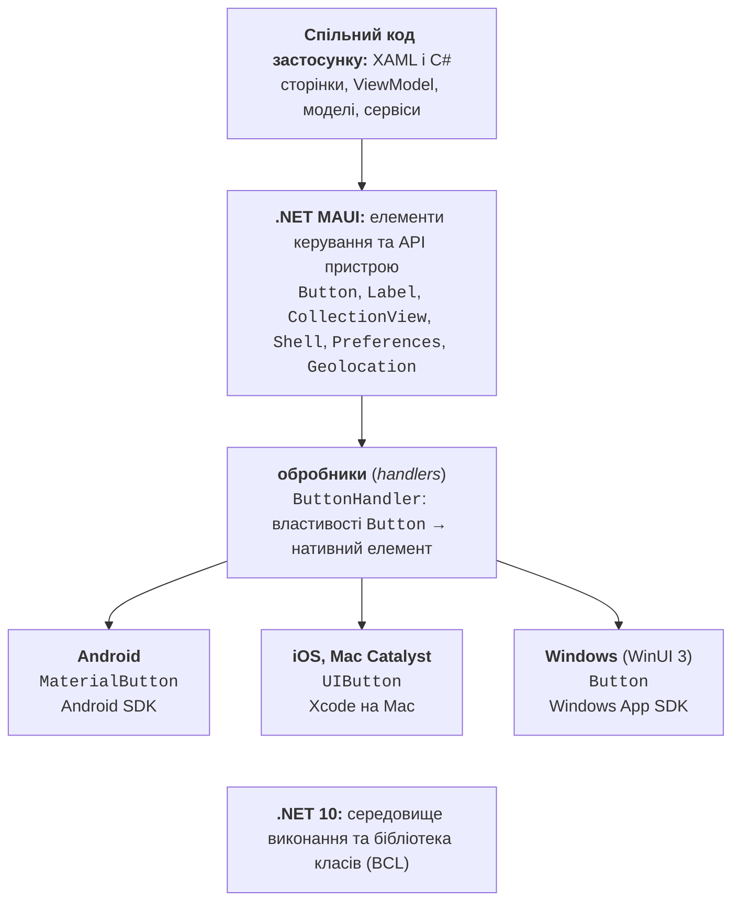
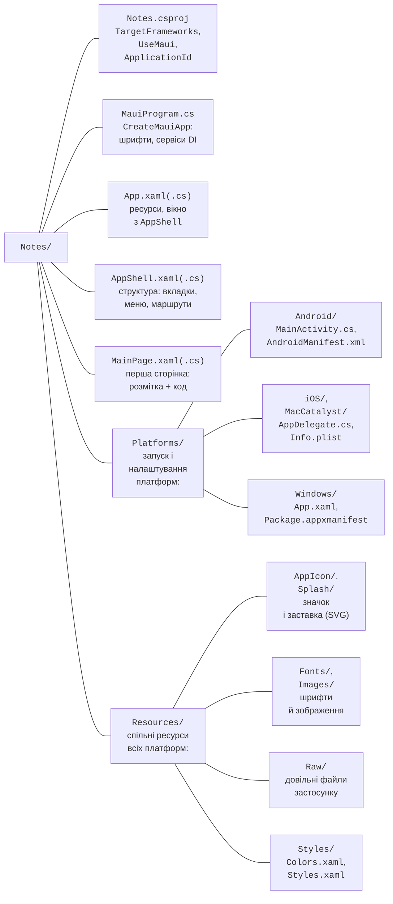
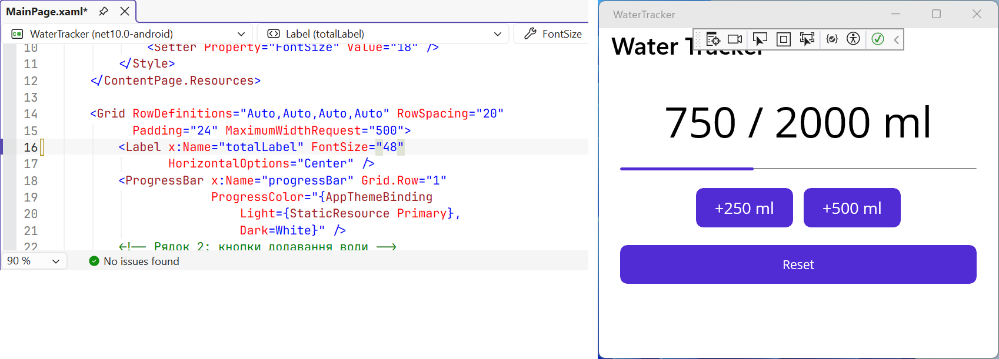

# Платформа та єдиний проєкт

## Платформа .NET MAUI

**.NET MAUI** (*.NET Multi-platform App UI*) – фреймворк для створення застосунків з одним кодом мовою C# і розміткою XAML, які працюють на Android, iOS, macOS і Windows (<https://learn.microsoft.com/dotnet/maui/what-is-maui>). Він є наступником **Xamarin.Forms**: підтримка всіх SDK Xamarin завершилася 1 травня 2024 року, і нові мобільні застосунки .NET створюють на MAUI. На відміну від WPF (теми 12–14), яка працює лише у Windows, MAUI-застосунок з одного проєкту збирається для кожної платформи окремо й використовує її **нативні** (*native*) елементи інтерфейсу: кнопка на Android виглядає як кнопка Android, а у Windows – як кнопка Windows.

Мінімальні версії платформ для .NET MAUI 10 наведено в табл. 15.1 (<https://learn.microsoft.com/dotnet/maui/supported-platforms>). Офіційної підтримки Linux як цільової платформи немає: на Linux можна лише розробляти застосунки для Android.

Таблиця 15.1. Цільові платформи .NET MAUI 10 {.caption}

| **Платформа** | **Мінімальна версія** | **Де збирати й запускати** |
| --- | --- | --- |
| Android | 5.0 (API 21) | Windows, macOS, Linux; емулятор або телефон |
| iOS | 12.2 | потрібен Mac з Xcode; з Windows – через підключений Mac |
| macOS (Mac Catalyst) | macOS 12 | лише на Mac |
| Windows (WinUI 3) | Windows 10 1809, Windows 11 | лише у Windows |

### Архітектура та обробники

Застосунок працює з кросплатформними класами MAUI: `Button`, `Label`, `CollectionView`. Кожен такий елемент має **обробник** (*handler*) – клас, який створює нативний елемент платформи й переносить на нього значення властивостей (рис. 15.1). Наприклад, `ButtonHandler` створює `MaterialButton` на Android, `UIButton` на iOS і `Button` бібліотеки WinUI у Windows. Під усіма платформами працює те саме середовище .NET 10 і бібліотека класів, тому класи моделей, `HttpClient`, LINQ і `System.Text.Json` використовуються так само, як у консольних програмах (<https://learn.microsoft.com/dotnet/maui/user-interface/handlers/>).



Рис. 15.1. Архітектура застосунку .NET MAUI {.caption}

**Підтримка.** .NET MAUI 10 вийшла 11 листопада 2025 року разом із .NET 10, але правила підтримки MAUI відрізняються від LTS-підтримки .NET: кожна версія MAUI підтримується ще 6 місяців після виходу наступної. Для MAUI 10 кінець підтримки – 11 травня 2027 року, тому проєкти варто вчасно переводити на нові версії (<https://dotnet.microsoft.com/platform/support/policy/maui>).

### Встановлення

У Visual Studio 2026 потрібне робоче навантаження *.NET Multi-platform App UI development* (*Tools → Get Tools and Features…*, рис. 15.2). Воно встановлює MAUI SDK, Android SDK, OpenJDK та емулятор Android. Без Visual Studio MAUI встановлюють командою dotnet CLI, а перевіряють списком навантажень (<https://learn.microsoft.com/dotnet/maui/get-started/installation>):

```powershell
dotnet workload install maui
dotnet workload list
```


Рис. 15.2. Робоче навантаження *.NET Multi-platform App UI development* {.caption}

## Єдиний проєкт і запуск застосунку

### Структура проєкту

Проєкт створюють шаблоном *.NET MAUI App* (*File → New → Project…*, пошук `maui`) або командою `dotnet new maui -n Notes`. Параметр `--sample-content` додає до шаблону демонстраційний застосунок із MVVM і базою даних. MAUI використовує **єдиний проєкт** (*single project*): один файл `.csproj` містить спільний код для всіх платформ, а платформний код лежить у папці `Platforms` (рис. 15.3) (<https://learn.microsoft.com/dotnet/maui/fundamentals/single-project>).



Рис. 15.3. Структура єдиного проєкту .NET MAUI {.caption}

Файл проєкту містить властивість `UseMaui` і перелічує цільові фреймворки платформ у `TargetFrameworks`: `net10.0-android`, `net10.0-ios`, `net10.0-maccatalyst` і (лише у Windows) `net10.0-windows10.0.19041.0`. Під час збирання для Android компілюються тільки файли з `Platforms/Android`, а зображення з `Resources/Images` масштабуються під потрібні роздільності. Шаблон .NET 10 також задає `MauiXamlInflator = SourceGen` (XAML перетворюється на C# під час компіляції), `WindowsPackageType = None` (Windows-версія запускається як звичайний `.exe` без пакета MSIX), назву `ApplicationTitle` та унікальний ідентифікатор `ApplicationId`.

### Точка входу

Код запуску кожної платформи (`MainActivity` на Android, `App` у `Platforms/Windows`) викликає спільний метод `MauiProgram.CreateMauiApp`. Він налаштовує **будівельник застосунку** (`MauiAppBuilder`) так само, як `Host` у темі 6: `MauiApp.CreateBuilder()`, реєстрація класу застосунку `UseMauiApp<App>()`, шрифтів `ConfigureFonts`, сервісів `builder.Services` і журналювання `builder.Logging.AddDebug()` (лише в конфігурації *Debug*), а наприкінці `builder.Build()`.

Клас `App` (файли `App.xaml` і `App.xaml.cs`) підключає словники ресурсів і створює вікно з оболонкою `AppShell`. Властивість `Application.MainPage` застаріла з .NET 9, тому вікно повертає перевизначений метод `protected override Window CreateWindow(IActivationState? activationState)` виразом `new Window(new AppShell())`.

### Запуск на Windows і Android

Цільову платформу обирають у випадному списку кнопки запуску Visual Studio (рис. 15.4): *Windows Machine* запускає застосунок як програму Windows, розділ *Android Emulators* – в емуляторі, *Android Local Devices* – на підключеному телефоні. Найшвидший цикл розробки дає *Windows Machine*: вона не потребує додаткового налаштування й працює на будь-якому комп’ютері з Windows 10/11.


Рис. 15.4. Вибір цільової платформи запуску {.caption}

**Емулятор Android** створюють у *Tools → Android → Android Device Manager* кнопкою *New*: обирають профіль пристрою (наприклад, Pixel), образ системи x86\_64 і натискають *Create* (рис. 15.5). Без **апаратної віртуалізації** емулятор працює дуже повільно. У Windows рекомендовано Hyper-V з *Windows Hypervisor Platform* (WHPX): їх вмикають у *Turn Windows features on or off*, а в BIOS має бути ввімкнено Intel VT-x або AMD-V (SVM). Команда `systeminfo` показує, чи підтримує комп’ютер Hyper-V. Якщо Hyper-V недоступний, використовують драйвер AEHD (*Android Emulator hypervisor driver*). На комп’ютерах з процесорами ARM (Windows on Arm) емулятор Android не працює (<https://learn.microsoft.com/dotnet/maui/android/emulator/hardware-acceleration>).


Рис. 15.5. Створення емулятора в *Android Device Manager* {.caption}

**Власний телефон** часто зручніший за емулятор (<https://learn.microsoft.com/dotnet/maui/android/device/setup>):

1. У налаштуваннях телефону *About phone* сім разів торкнутися *Build number*, доки не з’явиться повідомлення *You are now a developer!* (на різних телефонах пункт може бути в іншому місці).
2. У *Developer options* увімкнути *USB debugging*.
3. Підключити телефон кабелем USB і дозволити налагодження з цього комп’ютера (*Always allow from this computer*).
4. Обрати телефон у списку *Android Local Devices* і запустити застосунок (**F5**).

Android 11 і новіші підтримують також налагодження через Wi-Fi (*Wireless debugging*). У .NET 10 Android-версію можна запустити й з командного рядка командою `dotnet run` з параметрами `-f net10.0-android` і `-p:AdbTarget=-d` (телефон) або `-p:AdbTarget=-e` (емулятор). Збирати й налагоджувати застосунки для iOS і macOS можна лише з Mac, на якому встановлено Xcode.

### Hot Reload

Під час налагодження (**F5**, конфігурація *Debug*) **XAML Hot Reload** застосовує зміни розмітки до запущеного застосунку одразу під час введення, без перезапуску і зі збереженням стану сторінки (рис. 15.6). **.NET Hot Reload** переносить зміни коду C# після натискання кнопки *Hot Reload* на панелі інструментів. Hot Reload не застосовує додавання файлів і пакетів NuGet, а також частину змін C# (наприклад, нові поля класу) – після них застосунок перезапускають (<https://learn.microsoft.com/dotnet/maui/xaml/hot-reload>).



Рис. 15.6. XAML Hot Reload під час роботи застосунку {.caption}
