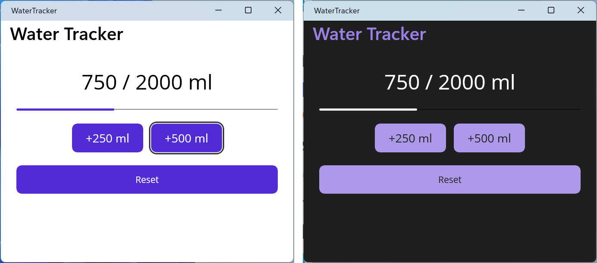
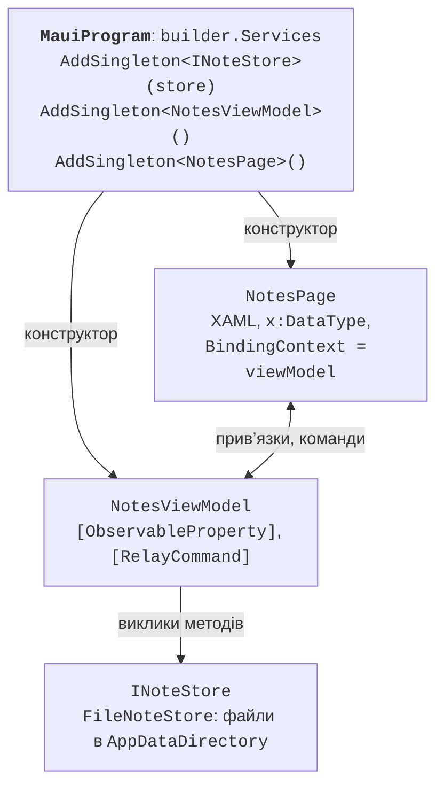

# Сторінки, стилі та MVVM

## XAML-сторінки та компонування

### Порівняння з WPF

XAML у MAUI має ту саму мову розмітки, що й у WPF, але інший набір класів (табл. 15.2). Простір імен за замовчуванням – `http://schemas.microsoft.com/dotnet/2021/maui`. Розміри задаються в **незалежних від пристрою одиницях** (*device-independent units*), а властивості `WidthRequest` і `HeightRequest` лише **просять** розмір: остаточний визначає контейнер компонування (<https://learn.microsoft.com/dotnet/maui/user-interface/layouts/>).

Таблиця 15.2. Відповідність класів WPF і .NET MAUI {.caption}

| **WPF** | **.NET MAUI** |
| --- | --- |
| `Window` з вмістом | `ContentPage` у `Window`, `Shell` |
| `StackPanel` | `VerticalStackLayout`, `HorizontalStackLayout` |
| `Grid` з `RowDefinition` | `Grid`, скорочено `RowDefinitions="Auto,*"` |
| `WrapPanel`, `Canvas` | `FlexLayout`, `AbsoluteLayout` |
| `TextBlock`, `TextBox` | `Label`, `Entry` (рядок), `Editor` (багато рядків) |
| `ListBox`, `ListView` | `CollectionView` |
| `Border`, `ScrollViewer` | `Border`, `ScrollView` |
| `Width`, `Visibility` | `WidthRequest`, `IsVisible` |
| подія `Button.Click` | подія `Button.Clicked` |

Контейнери компонування: `VerticalStackLayout` і `HorizontalStackLayout` (елементи один за одним з відступом `Spacing`), `Grid` (рядки й стовпці `Auto`, `*`, `2*`), `FlexLayout` (перенесення в кілька рядків), `AbsoluteLayout` (положення в одиницях або частках контейнера), `ScrollView` (прокручування) і `Border` (рамка із заокругленням `StrokeShape="RoundRectangle 8"`).

Основні елементи керування наведено в табл. 15.3 (<https://learn.microsoft.com/dotnet/maui/user-interface/controls/>).

Таблиця 15.3. Основні елементи керування .NET MAUI {.caption}

| **Елемент** | **Призначення та основні члени** |
| --- | --- |
| `Label` | текст: `Text`, `FontSize`, `MaxLines`, `LineBreakMode` |
| `Entry`, `Editor` | введення: `Text`, `Placeholder`, `Keyboard="Numeric"`, `IsPassword`, подія `Completed` |
| `Button`, `ImageButton` | кнопка: `Text` або `Source`, подія `Clicked`, `Command` |
| `Switch`, `CheckBox` | перемикач і прапорець: `IsToggled`, `IsChecked` |
| `Slider`, `Stepper` | число: `Value`, `Minimum`, `Maximum` |
| `Picker` | вибір зі списку: `ItemsSource`, `SelectedItem` |
| `DatePicker`, `TimePicker` | дата й час: `Date` (`DateTime?` у .NET 10), `Time` |
| `Image` | зображення: `Source`, `Aspect` |
| `ProgressBar`, `ActivityIndicator` | хід операції: `Progress` (0–1), `IsRunning` |

### Приклад «Лічильник води»

Сторінка рахує випиту за день воду кнопками *+250 ml* і *+500 ml*, показує смугу прогресу до денної мети 2000 мл і зберігає значення між запусками. Розмітка `MainPage.xaml` використовує `Grid` з чотирма рядками, вкладені стекові контейнери, явний стиль кнопок і прив’язку до теми:

```xml
<ContentPage xmlns="http://schemas.microsoft.com/dotnet/2021/maui"
             xmlns:x="http://schemas.microsoft.com/winfx/2009/xaml"
             x:Class="WaterTracker.MainPage"
             Title="Water Tracker">
    <!-- Явний стиль кнопок: Style="{StaticResource AddButton}" -->
    <ContentPage.Resources>
        <Style x:Key="AddButton" TargetType="Button">
            <Setter Property="WidthRequest" Value="110" />
            <Setter Property="FontSize" Value="18" />
        </Style>
    </ContentPage.Resources>

    <Grid RowDefinitions="Auto,Auto,Auto,Auto" RowSpacing="20"
          Padding="24" MaximumWidthRequest="500">
        <Label x:Name="totalLabel" FontSize="32"
               HorizontalOptions="Center" />
        <ProgressBar x:Name="progressBar" Grid.Row="1"
                     ProgressColor="{AppThemeBinding
                         Light={StaticResource Primary},
                         Dark=White}" />
        <!-- Рядок 2: кнопки додавання води -->
        <HorizontalStackLayout Grid.Row="2" Spacing="12"
                               HorizontalOptions="Center">
            <Button Text="+250 ml" Style="{StaticResource AddButton}"
                    Clicked="OnAdd250Clicked" />
            <Button Text="+500 ml" Style="{StaticResource AddButton}"
                    Clicked="OnAdd500Clicked" />
        </HorizontalStackLayout>
        <Button Grid.Row="3" Text="Reset" Clicked="OnResetClicked" />
    </Grid>
</ContentPage>
```

Код сторінки `MainPage.xaml.cs` зберігає суму й дату в сервісі `Preferences` – сховищі пар «ключ – значення» для простих налаштувань (детальніше – у розділі про сервіси пристрою):

```cs
namespace WaterTracker;

public partial class MainPage : ContentPage
{
    private const int Goal = 2000;              // мл на день
    private int total;

    public MainPage()
    {
        InitializeComponent();
        string today = DateTime.Today.ToString("yyyy-MM-dd");
        // Збережена сума діє лише в день, коли її записано.
        total = Preferences.Default.Get("date", "") == today
            ? Preferences.Default.Get("total", 0)
            : 0;
        Preferences.Default.Set("date", today);
        ShowTotal();
    }

    private void OnAdd250Clicked(object? sender, EventArgs e) =>
        Add(250);

    private void OnAdd500Clicked(object? sender, EventArgs e) =>
        Add(500);

    private void OnResetClicked(object? sender, EventArgs e) =>
        Add(-total);

    private void Add(int ml)
    {
        total += ml;
        Preferences.Default.Set("total", total);
        ShowTotal();
    }

    private void ShowTotal()
    {
        totalLabel.Text = $"{total} / {Goal} ml";
        progressBar.Progress = Math.Min(1.0, (double)total / Goal);
    }
}
```

Елементи з атрибутом `x:Name` стають полями класу, як у WPF, а обробники подій мають параметр `object? sender`. Після запуску напис показує `0 / 2000 ml`; після натискання *+250 ml* і *+500 ml* – `750 / 2000 ml`, а смуга заповнена на 37,5 %. Після перезапуску застосунку того самого дня сума зберігається, а наступного дня лічильник починається з нуля. У темній темі системи смуга прогресу стає білою (рис. 15.7).



Рис. 15.7. Застосунок «Лічильник води» у світлій і темній темах Windows {.caption}

## Стилі, ресурси й теми

Шаблон проєкту містить словники ресурсів `Resources/Styles/Colors.xaml` (кольори `Primary`, `Secondary`, відтінки сірого) і `Styles.xaml` (стилі всіх елементів), об’єднані в `App.xaml` через `ResourceDictionary.MergedDictionaries`. Як і у WPF (тема 13), **неявний стиль** має лише `TargetType` і застосовується до всіх елементів цього типу, а **явний стиль** має ключ `x:Key` і підключається властивістю `Style`. Розширення `StaticResource` читає ресурс один раз, а `DynamicResource` оновлює значення, коли ресурс замінено під час роботи (<https://learn.microsoft.com/dotnet/maui/user-interface/styles/xaml>).

**Світла й темна теми.** Розширення `AppThemeBinding` задає значення для світлої (`Light`) і темної (`Dark`) теми системи; застосунок оновлює його сам, коли користувач змінює тему. Тему можна задати й у коді: `Application.Current!.UserAppTheme = AppTheme.Dark` (<https://learn.microsoft.com/dotnet/maui/user-interface/system-theme-changes>).

**Платформа і тип пристрою.** Розширення `OnPlatform` задає різні значення для платформ, а `OnIdiom` – для телефону (`Phone`), планшета (`Tablet`) і комп’ютера (`Desktop`). Наприклад, `FontSize="{OnIdiom Phone=20, Desktop=24}"` збільшує шрифт на комп’ютері, `Padding="{OnPlatform Android='8,4', WinUI='16,8'}"` задає відступи для Android і Windows, а `Span="{OnIdiom Phone=1, Default=3}"` у `GridItemsLayout` показує на широкому екрані три стовпці.

## Прив’язка даних, MVVM і впровадження залежностей

### Прив’язка даних

Прив’язка даних у MAUI працює як у WPF: `BindingContext` (аналог `DataContext`) задає об’єкт-джерело, вкладені елементи його успадковують, а `{Binding Властивість}` оновлює елемент після події `PropertyChanged`. Режим за замовчуванням залежить від властивості: для `Entry.Text`, `Editor.Text`, `Switch.IsToggled`, `Slider.Value` і `CollectionView.SelectedItem` це `TwoWay`, для більшості інших – `OneWay`. Параметр прив’язки `StringFormat` форматує значення, наприклад `'{0:d}'` для дати, а перетворювач `IValueConverter` змінює тип (<https://learn.microsoft.com/dotnet/maui/fundamentals/data-binding/>).

**Скомпільовані прив’язки** (*compiled bindings*) перевіряються під час збирання: атрибут `x:DataType` повідомляє компілятору тип `BindingContext`. Помилкова назва властивості дає попередження збирання, а не тиху помилку під час роботи, і прив’язка працює швидше, бо не використовує рефлексію. Починаючи з .NET 9 компілятор попереджає про прив’язки без `x:DataType`, тому його задають на сторінці й окремо на кожному `DataTemplate`: шаблон елемента списку прив’язується не до ViewModel, а до елемента колекції (<https://learn.microsoft.com/dotnet/maui/fundamentals/data-binding/compiled-bindings>).

### MVVM з CommunityToolkit.Mvvm

Патерн MVVM і пакет **CommunityToolkit.Mvvm** (тема 13) без змін переносяться в MAUI: ViewModel успадковує `ObservableObject`, атрибут `[ObservableProperty]` на частковій властивості генерує сповіщення, `[RelayCommand]` створює команду з методу, а `[NotifyCanExecuteChangedFor]` оновлює доступність команди. Застосунок MAUI зручно розділяти на папки `Models`, `Services`, `ViewModels` і `Views`. Клас `MessagingCenter` у .NET 10 став внутрішнім: для повідомлень між ViewModel використовують `WeakReferenceMessenger` того самого пакета.

### Впровадження залежностей

`MauiProgram.CreateMauiApp` має контейнер `builder.Services` (тема 6). У ньому реєструють сервіси, ViewModel і сторінки, а конструктори отримують залежності автоматично (рис. 15.8). Shell сам створює через контейнер сторінки, зареєстровані в ньому, як для вкладок, так і для маршрутів `Routing.RegisterRoute` (<https://learn.microsoft.com/dotnet/maui/fundamentals/dependency-injection>). Час життя обирають за роллю: `AddSingleton` – один екземпляр на весь застосунок (сервіс даних, головна сторінка зі списком), `AddTransient` – новий екземпляр для кожної навігації (сторінка редагування). Метод `AddScoped` у MAUI не має природних меж області й поводиться як `AddSingleton`.



Рис. 15.8. MVVM і впровадження залежностей у .NET MAUI {.caption}

Сервіси пристрою мають інтерфейси (`IPreferences`, `IGeolocation`, `IMediaPicker`), тому їх реєструють у контейнері й передають у ViewModel: `builder.Services.AddSingleton(Preferences.Default)`. Такий ViewModel можна перевірити модульними тестами із заміною сервісу, не запускаючи емулятор.

## Списки `CollectionView`

`CollectionView` – основний елемент для списків і сіток. У .NET 10 `ListView`, `TableView` і класи комірок (`TextCell`, `ViewCell` та інші) позначено застарілими, тому в нових застосунках використовують лише `CollectionView` (<https://learn.microsoft.com/dotnet/maui/user-interface/controls/collectionview/>). Його основні властивості:

- `ItemsSource` – колекція елементів; `ObservableCollection<T>` оновлює список під час додавання й видалення;
- `ItemTemplate` – шаблон `DataTemplate` з `x:DataType` типу елемента;
- `SelectionMode` (`None`, `Single`, `Multiple`), `SelectedItem`, `SelectedItems`, подія `SelectionChanged` і команда `SelectionChangedCommand`;
- `EmptyView` – вміст для порожньої колекції;
- `ItemsLayout` – `LinearItemsLayout` (список) або `GridItemsLayout` зі `Span` стовпців;
- `IsGrouped`, `GroupHeaderTemplate` – групування: джерело є колекцією груп, кожна група – клас, похідний від `List<T>`, з назвою групи;
- `RemainingItemsThreshold` і `RemainingItemsThresholdReachedCommand` – довантаження під час прокручування.

`CollectionView` **віртуалізує** елементи: створює представлення лише для видимих рядків. Тому його не вкладають у `ScrollView` чи `VerticalStackLayout` без обмеження висоти – список втратить віртуалізацію або не прокручуватиметься. Поруч використовують ще три елементи:

- `RefreshView` – оновлення жестом «потягнути вниз»: властивості `Command` і `IsRefreshing`;
- `SwipeView` – дії жестом змахування (`LeftItems`, `RightItems` з `SwipeItem`); у Windows змахування виконують мишею або сенсорним екраном;
- `CarouselView` з `IndicatorView` – гортання елементів по одному, як карток.

Команда ViewModel недоступна всередині `DataTemplate`, бо його контекстом є елемент колекції. До неї звертаються через прив’язку до предка з явним типом: усередині `{Binding …}` задають `Source={RelativeSource AncestorType={x:Type vm:NotesViewModel}}` і `x:DataType=vm:NotesViewModel`, а елемент передають параметром `CommandParameter="{Binding .}"` (приклад – у лабораторній роботі).
