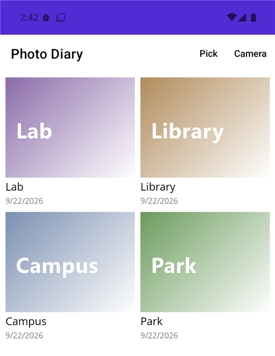

# Практика

## Приклад 1. Трекер звичок

Створити застосунок .NET MAUI «Трекер звичок». Користувач додає звичку (назва не порожня), щодня позначає її виконання кнопкою *Done* (повторне натискання *Undo* знімає позначку) і видаляє звичку змахуванням. Для кожної звички показується серія – кількість днів поспіль, що закінчується сьогодні або вчора; список відсортовано за довжиною серії. Дані зберігаються між запусками.

Модель, рядок списку та ViewModel (файл `HabitsViewModel.cs`). Звички серіалізуються в JSON і зберігаються одним рядком у `Preferences`; сервіс `IPreferences` надходить через конструктор:

```cs
using System.Collections.ObjectModel;
using System.Text.Json;
using CommunityToolkit.Mvvm.ComponentModel;
using CommunityToolkit.Mvvm.Input;

namespace Habits;

public class Habit
{
    public string Name { get; set; } = "";
    public List<DateOnly> DoneDays { get; set; } = [];

    // Дні поспіль, що закінчуються сьогодні або вчора.
    public int Streak(DateOnly today)
    {
        DateOnly day = DoneDays.Contains(today)
            ? today : today.AddDays(-1);
        int count = 0;
        while (DoneDays.Contains(day))
        {
            count++;
            day = day.AddDays(-1);
        }
        return count;
    }
}

public record HabitRow(Habit Habit, bool IsDoneToday, int Streak)
{
    public string Name => Habit.Name;
    public string StreakText => Streak switch
    {
        0 => "No streak yet",
        1 => "1 day",
        _ => $"{Streak} days in a row"
    };
    public string ButtonText => IsDoneToday ? "Undo" : "Done";
}

public partial class HabitsViewModel(IPreferences preferences)
    : ObservableObject
{
    private const string Key = "habits";
    private List<Habit> habits = [];

    public ObservableCollection<HabitRow> Rows { get; } = [];

    [ObservableProperty]
    [NotifyCanExecuteChangedFor(nameof(AddCommand))]
    public partial string NewName { get; set; } = "";

    public void Load()
    {
        string json = preferences.Get(Key, "[]");
        habits = JsonSerializer.Deserialize<List<Habit>>(json) ?? [];
        Refresh();
    }

    private bool CanAdd() => !string.IsNullOrWhiteSpace(NewName);

    [RelayCommand(CanExecute = nameof(CanAdd))]
    private void Add()
    {
        habits.Add(new Habit { Name = NewName.Trim() });
        NewName = "";
        SaveAndRefresh();
    }

    [RelayCommand]
    private void Toggle(HabitRow row)
    {
        DateOnly today = DateOnly.FromDateTime(DateTime.Today);
        if (!row.Habit.DoneDays.Remove(today))
        {
            row.Habit.DoneDays.Add(today);
        }
        SaveAndRefresh();
    }

    [RelayCommand]
    private void Delete(HabitRow row)
    {
        habits.Remove(row.Habit);
        SaveAndRefresh();
    }

    private void SaveAndRefresh()
    {
        preferences.Set(Key, JsonSerializer.Serialize(habits));
        Refresh();
    }

    private void Refresh()
    {
        DateOnly today = DateOnly.FromDateTime(DateTime.Today);
        Rows.Clear();
        foreach (Habit h in habits.OrderByDescending(
                     h => h.Streak(today)))
        {
            Rows.Add(new HabitRow(h, h.DoneDays.Contains(today),
                h.Streak(today)));
        }
    }
}
```

Сторінка `HabitsPage.xaml`: поле введення з кнопкою та список, у шаблоні якого кнопка виконання і дія змахування звертаються до команд ViewModel через `RelativeSource`:

```xml
<ContentPage xmlns="http://schemas.microsoft.com/dotnet/2021/maui"
             xmlns:x="http://schemas.microsoft.com/winfx/2009/xaml"
             xmlns:local="clr-namespace:Habits"
             x:Class="Habits.HabitsPage"
             x:DataType="local:HabitsViewModel"
             Title="Habits">
    <Grid RowDefinitions="Auto,*" ColumnDefinitions="*,Auto"
          Padding="16" RowSpacing="12" ColumnSpacing="8">
        <Entry Placeholder="New habit" Text="{Binding NewName}"
               ReturnCommand="{Binding AddCommand}" />
        <Button Grid.Column="1" Text="Add"
                Command="{Binding AddCommand}" />

        <CollectionView Grid.Row="1" Grid.ColumnSpan="2"
                        ItemsSource="{Binding Rows}">
            <CollectionView.EmptyView>
                <Label Text="Add your first habit" />
            </CollectionView.EmptyView>
            <CollectionView.ItemTemplate>
                <DataTemplate x:DataType="local:HabitRow">
                    <SwipeView>
                        <SwipeView.RightItems>
                            <SwipeItems>
                                <SwipeItem Text="Delete"
                                    BackgroundColor="LightGray"
                                  Command="{Binding DeleteCommand,
                                    Source={RelativeSource
                                    AncestorType={x:Type
                                    local:HabitsViewModel}},
                                    x:DataType=local:HabitsViewModel}"
                                    CommandParameter="{Binding .}" />
                            </SwipeItems>
                        </SwipeView.RightItems>
                        <Grid ColumnDefinitions="*,Auto" Padding="8">
                            <VerticalStackLayout>
                                <Label Text="{Binding Name}"
                                       FontSize="18" />
                                <Label Text="{Binding StreakText}"
                                       FontSize="12" />
                            </VerticalStackLayout>
                            <Button Grid.Column="1"
                                Text="{Binding ButtonText}"
                                Command="{Binding ToggleCommand,
                                    Source={RelativeSource
                                    AncestorType={x:Type
                                    local:HabitsViewModel}},
                                    x:DataType=local:HabitsViewModel}"
                                CommandParameter="{Binding .}" />
                        </Grid>
                    </SwipeView>
                </DataTemplate>
            </CollectionView.ItemTemplate>
        </CollectionView>
    </Grid>
</ContentPage>
```

Конструктор сторінки `HabitsPage(HabitsViewModel viewModel)` присвоює `BindingContext` і викликає `viewModel.Load()`. У `MauiProgram` реєструють `AddSingleton(Preferences.Default)`, `AddSingleton<HabitsViewModel>()` і `AddSingleton<HabitsPage>()`.

Рядок `HabitRow` – незмінний запис (`record`), тому після кожної зміни ViewModel перебудовує колекцію `Rows`, і `CollectionView` показує нові значення. Властивість `NewName` прив’язана до `Entry` двобічно, а атрибут `[NotifyCanExecuteChangedFor]` робить кнопку *Add* недоступною для порожнього поля; `ReturnCommand` виконує ту саму команду клавішею **Enter**. У консольній перевірці `IPreferences` замінено словником, і ViewModel працює без платформи MAUI. Для звички з позначками 14, 15 і 16 вересня метод `Streak` на 17 вересня 2026 року повертає 3, після позначки 17 вересня – 4, а для звички з єдиною позначкою 12 вересня – 0. Після додавання звичок *Drink water* і *Read* та позначки *Read* список має вигляд:

```
Read | 1 day | Undo
Drink water | No streak yet | Done
```

а в `Preferences` за ключем `habits` зберігається рядок `[{"Name":"Drink water","DoneDays":[]},{"Name":"Read","DoneDays":["2026-09-17"]}]`. У Windows дію *Delete* відкривають перетягуванням рядка мишею ліворуч (рис. 15.14).


Рис. 15.14. Застосунок «Трекер звичок» {.caption}

## Приклад 2. Фотощоденник

Створити застосунок «Фотощоденник», який додає до щоденника фото з галереї або з камери, зберігає копію фото в папці застосунку, а підпис і дату – в локальній базі SQLite. Головна сторінка показує записи сіткою у два стовпці від нового до старого, сторінка запису дає змогу змінити підпис або видалити запис разом із файлом фото.

До проєкту додано пакет `sqlite-net-pcl`. Клас доступу до бази відкриває з’єднання під час першого звернення:

```cs
using SQLite;

namespace PhotoDiary;

public class DiaryEntry
{
    [PrimaryKey, AutoIncrement]
    public int Id { get; set; }
    public string PhotoPath { get; set; } = "";
    public string Caption { get; set; } = "";
    public DateTime Date { get; set; }
}

public class DiaryDatabase(string path)
{
    private SQLiteAsyncConnection? connection;

    // Відкрити базу й створити таблицю під час першого звернення.
    private async Task<SQLiteAsyncConnection> GetConnectionAsync()
    {
        if (connection is null)
        {
            connection = new SQLiteAsyncConnection(path,
                SQLiteOpenFlags.ReadWrite | SQLiteOpenFlags.Create
                | SQLiteOpenFlags.SharedCache);
            await connection.CreateTableAsync<DiaryEntry>();
        }
        return connection;
    }

    public async Task<List<DiaryEntry>> GetAllAsync()
    {
        var db = await GetConnectionAsync();
        return await db.Table<DiaryEntry>()
            .OrderByDescending(e => e.Date).ToListAsync();
    }

    public async Task SaveAsync(DiaryEntry entry)
    {
        var db = await GetConnectionAsync();
        if (entry.Id == 0)
        {
            await db.InsertAsync(entry);   // Id заповнюється тут
        }
        else
        {
            await db.UpdateAsync(entry);
        }
    }

    // GetAsync(int id): Table<DiaryEntry>().Where(e => e.Id == id)
    //     .FirstOrDefaultAsync(); DeleteAsync(entry): db.DeleteAsync.
}
```

ViewModel головної сторінки (скорочено) отримує базу й `IMediaPicker` через конструктор. Після вибору або знімка фото копіюється в `AppDataDirectory`, запис зберігається, і застосунок переходить на сторінку запису з рядковим параметром `id`:

```cs
using System.Collections.ObjectModel;
using CommunityToolkit.Mvvm.ComponentModel;
using CommunityToolkit.Mvvm.Input;

namespace PhotoDiary;

public partial class DiaryViewModel(DiaryDatabase database,
    IMediaPicker mediaPicker) : ObservableObject
{
    public ObservableCollection<DiaryEntry> Entries { get; } = [];

    // LoadAsync заповнює Entries з database.GetAllAsync().

    [RelayCommand]
    private async Task PickAsync()
    {
        List<FileResult> photos = await mediaPicker.PickPhotosAsync(
            new MediaPickerOptions
            {
                SelectionLimit = 1,
                MaximumWidth = 1600,
                MaximumHeight = 1600
            });
        await AddAsync(photos.FirstOrDefault());
    }

    [RelayCommand]
    private async Task CaptureAsync()
    {
        if (!mediaPicker.IsCaptureSupported)
        {
            await Shell.Current.DisplayAlertAsync("Camera",
                "This device has no camera.", "OK");
            return;
        }
        await AddAsync(await mediaPicker.CapturePhotoAsync());
    }

    private async Task AddAsync(FileResult? photo)
    {
        if (photo is null)
        {
            return;                        // користувач скасував
        }
        // Копія фото в папці застосунку не залежить від галереї.
        string target = Path.Combine(FileSystem.AppDataDirectory,
            $"{Guid.NewGuid():N}{Path.GetExtension(photo.FileName)}");
        using (Stream source = await photo.OpenReadAsync())
        using (FileStream file = File.Create(target))
        {
            await source.CopyToAsync(file);
        }
        var entry = new DiaryEntry
        {
            PhotoPath = target,
            Date = DateTime.Now
        };
        await database.SaveAsync(entry);
        await Shell.Current.GoToAsync($"entry?id={entry.Id}");
    }
}
```

`EntryViewModel` реалізує `IQueryAttributable`: у методі `ApplyQueryAttributes` значення `id` надходить як рядок, тому його перетворюють `int.TryParse`, завантажують запис методом `GetAsync` і заповнюють властивості `Caption` і `PhotoPath`. Команда `SaveCommand` оновлює підпис, а `DeleteCommand` видаляє запис і файл `File.Delete(entry.PhotoPath)`; обидві повертаються `".."`. Сторінка `DiaryPage.xaml` має кнопки панелі інструментів *Pick* і *Camera* та `CollectionView` з `GridItemsLayout` (`Span="2"`); шаблон містить `Image` (`Source="{Binding PhotoPath}"`, `Aspect="AspectFill"`), підпис і дату, а `TapGestureRecognizer` виконує `OpenCommand`. У `MauiProgram` реєструються `new DiaryDatabase(dbPath)` (файл `diary.db3` в `AppDataDirectory`), `MediaPicker.Default`, обидва ViewModel і сторінки, а також маршрут `entry`. На Android для камери в маніфесті оголошують дозвіл `CAMERA`; у Windows `IsCaptureSupported` залежить від наявності камери, а `SelectionLimit` не підтримується.

Перевірка класу `DiaryDatabase` у консолі: після збереження записів *Park* (10.09.2026) і *Campus* (15.09.2026) вони отримують `Id` 1 і 2, а `GetAllAsync` повертає

```
2 Campus 15.09.2026
1 Park 10.09.2026
```

Після зміни підпису першого запису `GetAsync(1)` повертає `City park`, а після видалення другого в базі залишається один запис і `GetAsync(2)` повертає `null` (рис. 15.15).



Рис. 15.15. Застосунок «Фотощоденник» на Android {.caption}

## Приклад 3. Компас і рівень

Створити застосунок «Компас і рівень», який показує напрямок на магнітну північ у градусах і словами (N, NE, E…), повертає стрілку-покажчик, а за даними акселерометра показує нахил пристрою та рухає «бульбашку» рівня. Якщо датчика немає (наприклад, на комп’ютері з Windows), застосунок повідомляє про це, а не завершується з помилкою.

Сторінка `MainPage.xaml` містить `VerticalStackLayout` з написами `headingLabel` і `tiltLabel`, написом-стрілкою `needle` (символ ▲, `FontSize="64"`) і рамкою `Border` 200×200 зі `StrokeShape="Ellipse"`, усередині якої лежить `Ellipse` `bubble` розміром 24×24. Код сторінки (скорочено) й допоміжний клас обчислень:

```cs
namespace CompassLevel;

public static class LevelMath
{
    private static readonly string[] Directions =
        ["N", "NE", "E", "SE", "S", "SW", "W", "NW"];

    // 0° – північ, 90° – схід; сектор кожного напрямку – 45°.
    public static string ToDirection(double heading)
    {
        double normalized = (heading % 360 + 360) % 360;
        int index = (int)Math.Round(normalized / 45) % 8;
        return Directions[index];
    }

    // Нахил уздовж осей Y (pitch) і X (roll) у градусах.
    public static (double Pitch, double Roll) Tilt(
        double x, double y, double z)
    {
        double pitch = Math.Atan2(y, Math.Sqrt(x * x + z * z));
        double roll = Math.Atan2(x, Math.Sqrt(y * y + z * z));
        return (pitch * 180 / Math.PI, roll * 180 / Math.PI);
    }
}

public partial class MainPage : ContentPage
{
    private const double MaxShift = 90;   // половина ширини рамки

    public MainPage()
    {
        InitializeComponent();
    }

    protected override void OnAppearing()
    {
        base.OnAppearing();
        if (Compass.Default.IsSupported)
        {
            Compass.Default.ReadingChanged += OnCompassChanged;
            Compass.Default.Start(SensorSpeed.UI,
                applyLowPassFilter: true);
        }
        else
        {
            headingLabel.Text = "Compass is not supported";
        }
        if (Accelerometer.Default.IsSupported)
        {
            Accelerometer.Default.ReadingChanged += OnAccelerometer;
            Accelerometer.Default.Start(SensorSpeed.UI);
        }
        else
        {
            tiltLabel.Text = "Accelerometer is not supported";
        }
    }

    // OnDisappearing: Stop() і відписка від подій обох датчиків.

    private void OnCompassChanged(object? sender,
        CompassChangedEventArgs e)
    {
        double heading = e.Reading.HeadingMagneticNorth;
        headingLabel.Text =
            $"{heading:F0}° {LevelMath.ToDirection(heading)}";
        needle.Rotation = -heading;       // стрілка на північ
    }

    private void OnAccelerometer(object? sender,
        AccelerometerChangedEventArgs e)
    {
        var a = e.Reading.Acceleration;
        var (pitch, roll) = LevelMath.Tilt(a.X, a.Y, a.Z);
        bool level = Math.Abs(pitch) < 1 && Math.Abs(roll) < 1;
        tiltLabel.Text = level
            ? "Level"
            : $"Pitch {pitch:F1}°, roll {roll:F1}°";
        // Бульбашка рухається протилежно до нахилу.
        bubble.TranslationX = Math.Clamp(-roll * 3, -MaxShift,
            MaxShift);
        bubble.TranslationY = Math.Clamp(pitch * 3, -MaxShift,
            MaxShift);
    }
}
```

Датчики запускаються в `OnAppearing` і зупиняються в `OnDisappearing`, щоб не витрачати заряд батареї, коли сторінку не видно. Швидкість `SensorSpeed.UI` гарантує виклик обробників у головному потоці, тому написи змінюються без `MainThread`. Параметр `applyLowPassFilter` згладжує показання компаса лише на Android. Перевірка `LevelMath` у консолі:

```
0 N
44 NE
90 E
181 S
350 N
-30 NW
0 0 -1 -> Pitch 0,0°, roll 0,0°
0 0,5 -0,866 -> Pitch 30,0°, roll 0,0°
0,2588 0 -0,9659 -> Pitch 0,0°, roll 15,0°
0,01 -0,01 -1 -> Pitch -0,6°, roll 0,6°
```

Кожен рядок – вхідні дані (курс у градусах або складові прискорення *x*, *y*, *z* в одиницях *g*) і результат. Пристрій, що лежить горизонтально, має прискорення (0; 0; −1) і показує *Level*. У Windows без датчиків сторінка показує `Compass is not supported` і `Accelerometer is not supported` (рис. 15.16).

::: info Знімок екрана
CompassLevel on a physical Android phone via USB debugging: heading «312° NW», rotated arrow, bubble off-centre, «Pitch 4,2°, roll -2,5°»
:::

Рис. 15.16. Застосунок «Компас і рівень» на телефоні Android {.caption}
