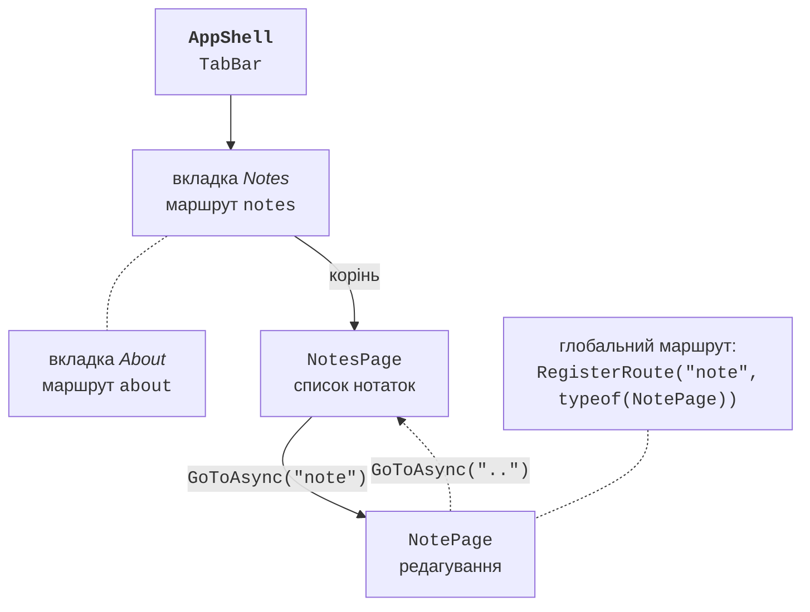
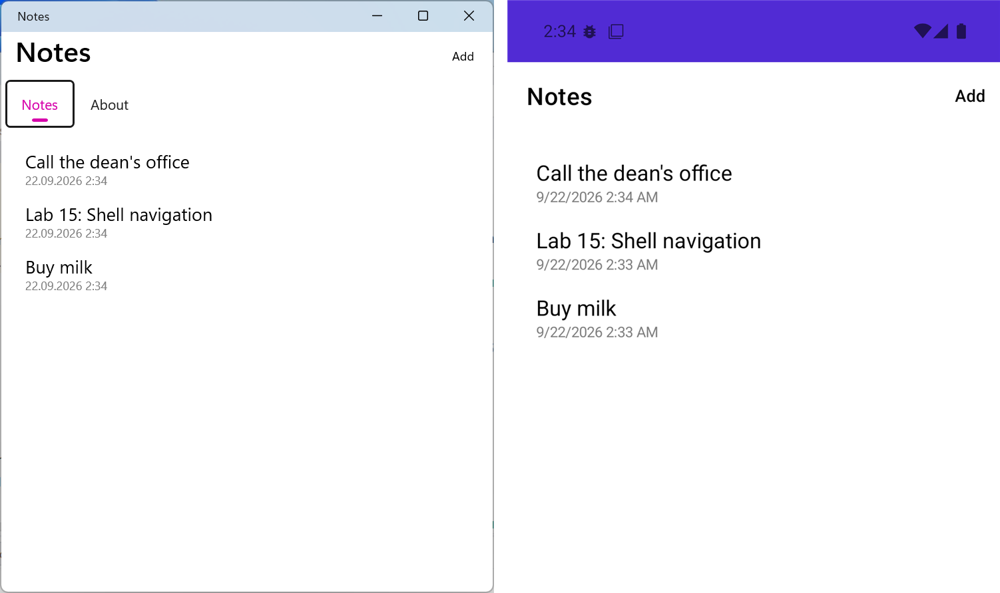

# Навігація Shell

## Навігація Shell

**Shell** – оболонка застосунку, яка описує його візуальну структуру: вкладки `TabBar`, бокове меню `FlyoutItem` і сторінки `ShellContent` (<https://learn.microsoft.com/dotnet/maui/fundamentals/shell/>). Атрибут `ContentTemplate="{DataTemplate views:NotesPage}"` створює сторінку лише під час першого переходу до неї, що прискорює запуск. Кожен елемент має **маршрут** (*route*) у властивості `Route`.

Сторінки, яких немає у структурі Shell (деталі, редагування), реєструють як **глобальні маршрути** методом `Routing.RegisterRoute` і відкривають методом `Shell.Current.GoToAsync` (рис. 15.9) (<https://learn.microsoft.com/dotnet/maui/fundamentals/shell/navigation>):

- `GoToAsync("note")` – відносний перехід: сторінка додається в стек навігації поточної вкладки;
- `GoToAsync("//about")` – абсолютний перехід до елемента структури Shell (стек очищується);
- `GoToAsync("..")` – повернення на попередню сторінку, `"../.."` – на дві назад;
- `GoToAsync("note?id=5&mode=edit")` – рядкові параметри запиту;
- `GoToAsync("note", parameters)` – передавання об’єктів: словник `Dictionary<string, object>` зберігається, доки сторінка є в стеку, а `ShellNavigationQueryParameters` очищується після переходу.



Рис. 15.9. Навігація в Shell застосунку «Нотатки» {.caption}

Сторінка або її ViewModel отримує параметри методом `ApplyQueryAttributes` інтерфейсу `IQueryAttributable` або атрибутами `[QueryProperty(nameof(Id), "id")]`. Документація рекомендує `IQueryAttributable`: атрибути `QueryProperty` використовують рефлексію й не сумісні з повним обрізанням (*trimming*) і NativeAOT. Рядкові значення атрибути `QueryProperty` декодують з URL автоматично, а `IQueryAttributable` – ні. Виклик `GoToAsync` завжди очікують `await`: без нього код після виклику виконується до завершення навігації. Модальну сторінку задають атрибутом `Shell.PresentationMode="Modal"` у її корені.

### Приклад «Нотатки»

Застосунок має вкладки *Notes* і *About*. Список нотаток відкриває сторінку редагування, а нотатки зберігаються окремими текстовими файлами в папці даних застосунку.

Модель `Note` має властивості `FileName`, `Text` і `Date`. Сервіс даних описано інтерфейсом, а його реалізація `FileNoteStore(string folder)` зберігає кожну нотатку у файлі `*.note.txt`: `LoadAllAsync` читає файли папки методом `File.ReadAllTextAsync` і сортує їх за датою зміни, `SaveAsync` для нової нотатки створює ім’я з `Guid.NewGuid()`, а `Delete` видаляє файл:

```cs
public interface INoteStore
{
    Task<List<Note>> LoadAllAsync();
    Task SaveAsync(Note note);
    void Delete(Note note);
}
```

`FileNoteStore` не залежить від MAUI, тому його перевірено в консольній програмі. ViewModel списку відкриває сторінку нотатки, коли користувач виділяє елемент, і передає об’єкт `Note` параметром навігації:

```cs
using System.Collections.ObjectModel;
using CommunityToolkit.Mvvm.ComponentModel;
using CommunityToolkit.Mvvm.Input;
using Notes.Models;
using Notes.Services;

namespace Notes.ViewModels;

public partial class NotesViewModel(INoteStore store)
    : ObservableObject
{
    public ObservableCollection<Note> Notes { get; } = [];

    [ObservableProperty]
    public partial Note? SelectedNote { get; set; }

    [RelayCommand]
    private async Task LoadAsync()
    {
        Notes.Clear();
        foreach (Note note in await store.LoadAllAsync())
        {
            Notes.Add(note);
        }
    }

    [RelayCommand]
    private Task AddAsync() => Shell.Current.GoToAsync("note");

    // Викликається згенерованою властивістю SelectedNote.
    async partial void OnSelectedNoteChanged(Note? value)
    {
        if (value is null)
        {
            return;
        }
        SelectedNote = null;      // зняти виділення в списку
        await Shell.Current.GoToAsync("note",
            new ShellNavigationQueryParameters { ["note"] = value });
    }
}
```

ViewModel сторінки нотатки отримує параметр в `ApplyQueryAttributes`. Для нової нотатки параметра немає, і редагується порожній об’єкт `Note`. Команда `Save` доступна лише для непорожнього тексту:

```cs
using CommunityToolkit.Mvvm.ComponentModel;
using CommunityToolkit.Mvvm.Input;
using Notes.Models;
using Notes.Services;

namespace Notes.ViewModels;

public partial class NoteViewModel(INoteStore store)
    : ObservableObject, IQueryAttributable
{
    private Note note = new();

    [ObservableProperty]
    [NotifyCanExecuteChangedFor(nameof(SaveCommand))]
    public partial string Text { get; set; } = "";

    // Отримує параметри навігації: нотатку, передану з NotesPage.
    public void ApplyQueryAttributes(
        IDictionary<string, object> query)
    {
        if (query.TryGetValue("note", out object? value)
            && value is Note existing)
        {
            note = existing;
            Text = existing.Text;
        }
    }

    private bool CanSave() => !string.IsNullOrWhiteSpace(Text);

    [RelayCommand(CanExecute = nameof(CanSave))]
    private async Task SaveAsync()
    {
        note.Text = Text.Trim();
        await store.SaveAsync(note);
        await Shell.Current.GoToAsync("..");
    }

    [RelayCommand]
    private async Task DeleteAsync()
    {
        store.Delete(note);
        await Shell.Current.GoToAsync("..");
    }
}
```

Сторінка списку `Views/NotesPage.xaml` має кнопку панелі інструментів і `CollectionView` зі скомпільованими прив’язками:

```xml
<ContentPage xmlns="http://schemas.microsoft.com/dotnet/2021/maui"
             xmlns:x="http://schemas.microsoft.com/winfx/2009/xaml"
             xmlns:vm="clr-namespace:Notes.ViewModels"
             xmlns:models="clr-namespace:Notes.Models"
             x:Class="Notes.Views.NotesPage"
             x:DataType="vm:NotesViewModel"
             Title="Notes">
    <ContentPage.ToolbarItems>
        <ToolbarItem Text="Add" Command="{Binding AddCommand}" />
    </ContentPage.ToolbarItems>

    <CollectionView ItemsSource="{Binding Notes}" Margin="16"
                    SelectionMode="Single"
                    SelectedItem="{Binding SelectedNote}">
        <CollectionView.EmptyView>
            <Label Text="No notes yet. Click Add."
                   HorizontalOptions="Center" Margin="0,40" />
        </CollectionView.EmptyView>
        <CollectionView.ItemTemplate>
            <DataTemplate x:DataType="models:Note">
                <VerticalStackLayout Padding="8">
                    <Label Text="{Binding Text}" FontSize="18"
                           MaxLines="1"
                           LineBreakMode="TailTruncation" />
                    <Label Text="{Binding Date, StringFormat='{0:g}'}"
                           FontSize="12" TextColor="Gray" />
                </VerticalStackLayout>
            </DataTemplate>
        </CollectionView.ItemTemplate>
    </CollectionView>
</ContentPage>
```

Сторінка `Views/NotePage.xaml` (`x:DataType="vm:NoteViewModel"`) містить `Grid` з `Editor` (`Text="{Binding Text}"`) і кнопками *Save* і *Delete*, прив’язаними до `SaveCommand` і `DeleteCommand`. Код сторінок лише отримує ViewModel у конструкторі й присвоює його `BindingContext`, а `NotesPage` у перевизначеному методі `OnAppearing` виконує `await viewModel.LoadCommand.ExecuteAsync(null)`, тому список оновлюється після повернення з редагування.

Структура Shell (`AppShell.xaml`), маршрут сторінки нотатки та реєстрація сервісів:

```xml
<Shell xmlns="http://schemas.microsoft.com/dotnet/2021/maui"
       xmlns:x="http://schemas.microsoft.com/winfx/2009/xaml"
       xmlns:views="clr-namespace:Notes.Views"
       x:Class="Notes.AppShell"
       Title="Notes">
    <TabBar>
        <ShellContent Title="Notes" Route="notes"
            ContentTemplate="{DataTemplate views:NotesPage}" />
        <ShellContent Title="About" Route="about"
            ContentTemplate="{DataTemplate views:AboutPage}" />
    </TabBar>
</Shell>
```

```cs
public partial class AppShell : Shell
{
    public AppShell()
    {
        InitializeComponent();
        // Сторінка нотатки поза TabBar: глобальний маршрут.
        Routing.RegisterRoute("note", typeof(NotePage));
    }
}
```

Сторінки, ViewModel і сервіс даних реєструються в контейнері DI:

```cs
public static class MauiProgram
{
    public static MauiApp CreateMauiApp()
    {
        var builder = MauiApp.CreateBuilder();
        builder.UseMauiApp<App>();

        builder.Services.AddSingleton<INoteStore>(
            new FileNoteStore(FileSystem.AppDataDirectory));
        builder.Services.AddSingleton<NotesViewModel>();
        builder.Services.AddSingleton<NotesPage>();
        builder.Services.AddTransient<NoteViewModel>();
        builder.Services.AddTransient<NotePage>();

        return builder.Build();
    }
}
```

Сторінка *About* показує версію застосунку `AppInfo.Current.VersionString`, платформу `DeviceInfo.Current.Platform` і шлях `FileSystem.Current.AppDataDirectory`. Після запуску список порожній і показує `EmptyView`. Кнопка *Add* відкриває сторінку *Note* з кнопкою повернення, кнопка *Save* недоступна, доки поле порожнє. Після збереження нотатка з’являється першою в списку з датою у форматі `17.09.2026 10:15`, а клацання на ній відкриває ту саму нотатку для редагування (рис. 15.10). У Windows файли лежать у локальній папці даних користувача, на Android – у приватній папці застосунку, недоступній іншим програмам.



Рис. 15.10. Застосунок «Нотатки» у Windows та емуляторі Android {.caption}
