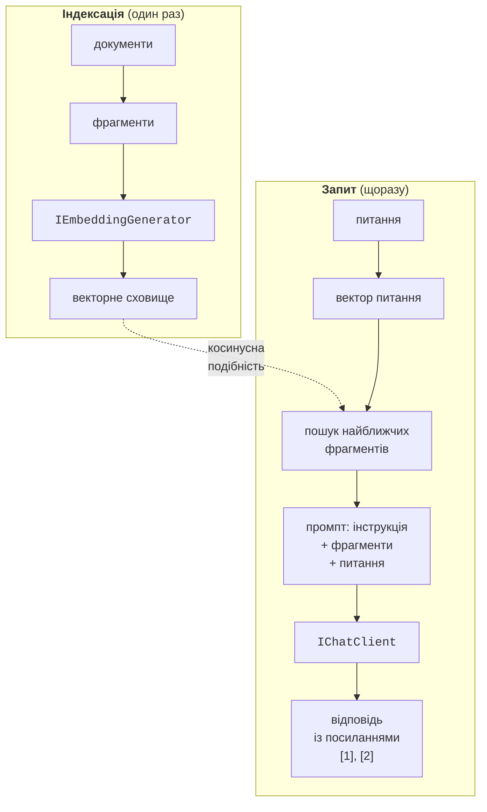

# Вектори, RAG і безпека

## Векторні подання

**Векторне подання** (*embedding*) – масив дійсних чисел, який описує **зміст** тексту: тексти зі схожим змістом мають близькі вектори, навіть якщо не мають спільних слів («забув пароль» і «відновлення доступу до кабінету»). Вектори створює спеціальна модель, наприклад `embeddinggemma` (768 чисел), через інтерфейс `IEmbeddingGenerator<string, Embedding<float>>` (<https://learn.microsoft.com/dotnet/ai/conceptual/embeddings>).

Близькість векторів вимірюють **косинусною подібністю** (*cosine similarity*) – косинусом кута між ними: скалярний добуток, поділений на добуток довжин, cos *θ* = (*a* · *b*) / (|*a*| · |*b*|). Значення 1 означає однаковий напрямок (дуже схожий зміст), 0 – відсутність зв’язку. Обчислення на умовних тривимірних векторах, де координати означають «тварини», «техніка» і «їжа»:

```cs
using System.Numerics.Tensors;

float[] cat = [0.9f, 0.1f, 0.2f];
float[] dog = [0.8f, 0.2f, 0.3f];
float[] laptop = [0.1f, 0.9f, 0.1f];

Console.WriteLine($"кіт – собака:  " +
    $"{TensorPrimitives.CosineSimilarity(cat, dog):F3}");
Console.WriteLine($"кіт – ноутбук: " +
    $"{TensorPrimitives.CosineSimilarity(cat, laptop):F3}");
```

```
кіт – собака:  0,983
кіт – ноутбук: 0,237
```

Наприклад, для першої пари скалярний добуток 0,9 · 0,8 + 0,1 · 0,2 + 0,2 · 0,3 = 0,8, а добуток довжин ≈ 0,93 · 0,87 ≈ 0,81, тож подібність ≈ 0,98. Метод `TensorPrimitives.CosineSimilarity` (простір імен `System.Numerics.Tensors`) обчислює формулу з апаратним прискоренням SIMD. Справжні вектори мають сотні вимірів, тому порівнювати їх «вручну» неможливо, але формула та сама.

Векторні подання створює метод `GenerateAsync`: для списку рядків він повертає колекцію `GeneratedEmbeddings<Embedding<float>>` (один запит до моделі), для одного рядка – `Embedding<float>`, вектор якого доступний через властивість `Vector`. Семантичний пошук у FAQ – це порівняння вектора питання з векторами всіх відомих питань:

```cs
IEmbeddingGenerator<string, Embedding<float>> generator =
    new OllamaApiClient(
        new Uri("http://localhost:11434"), "embeddinggemma");

var faq = await generator.GenerateAsync(questions);   // string[]
Embedding<float> q = await generator.GenerateAsync(query);
var best = questions
    .Select((text, i) => (Text: text,
        Score: TensorPrimitives.CosineSimilarity(
            q.Vector.Span, faq[i].Vector.Span)))
    .MaxBy(x => x.Score);
if (best.Score < 0.5f)
    Console.WriteLine("Схожих питань не знайдено.");
```

Поріг (тут 0,5) підбирають експериментально для конкретної моделі: значення подібності різних моделей між собою не порівнюються.

## Пошук із доповненою генерацією (RAG)

Модель нічого не знає про правила вашої бібліотеки чи розклад вашого факультету. **Пошук із доповненою генерацією** (*retrieval-augmented generation*, RAG) вирішує це без перенавчання моделі: застосунок знаходить у власних документах фрагменти, схожі на питання, і додає їх у промпт (рис. 16.9) (<https://learn.microsoft.com/dotnet/ai/conceptual/rag>).



Рис. 16.9. Пошук із доповненою генерацією (RAG) {.caption}

Етапи RAG:

1. **розбиття** документів на фрагменти (абзаци, розділи Markdown) розміром від кількох речень до сторінки: занадто великі фрагменти займають контекстне вікно, занадто малі втрачають зміст;
2. **індексація**: векторне подання кожного фрагмента зберігається у **векторному сховищі**;
3. **пошук**: вектор питання порівнюється з векторами фрагментів;
4. **генерація**: модель отримує інструкцію «відповідай лише за фрагментами, вказуй джерела», знайдені фрагменти з номерами і питання.

Векторні сховища в .NET мають спільні абстракції `Microsoft.Extensions.VectorData`: класи `VectorStore` і `VectorStoreCollection<TKey, TRecord>`, атрибути `[VectorStoreKey]`, `[VectorStoreData]`, `[VectorStoreVector]` (<https://learn.microsoft.com/dotnet/ai/vector-stores/overview>). Для навчання та прототипів підходить сховище в пам’яті `CommunityToolkit.VectorData.InMemory`; у робочих системах використовують базу даних, наприклад PostgreSQL із розширенням pgvector (пакет `CommunityToolkit.VectorData.PgVector`), і тоді змінюється лише створення сховища.

Якщо сховищу передати `EmbeddingGenerator`, властивість-рядок з атрибутом `[VectorStoreVector]` перетворюється на вектор автоматично і під час запису, і під час пошуку.

### Приклад «Правила бібліотеки»

Програма відповідає на питання за файлом правил бібліотеки `rules.txt`, у якому кожен рядок – окремий пункт:

```cs
using CommunityToolkit.VectorData.InMemory;
using Microsoft.Extensions.AI;
using Microsoft.Extensions.VectorData;
using OllamaSharp;

Console.OutputEncoding = System.Text.Encoding.UTF8;

var ollama = new Uri("http://localhost:11434");
IEmbeddingGenerator<string, Embedding<float>> embeddings =
    new OllamaApiClient(ollama, "embeddinggemma");
IChatClient chat = new OllamaApiClient(ollama, "qwen3:4b-instruct");

// 1. Індексація: кожен рядок файлу правил – окремий фрагмент.
var store = new InMemoryVectorStore(
    new() { EmbeddingGenerator = embeddings });
VectorStoreCollection<int, Fragment> rules =
    store.GetCollection<int, Fragment>("rules");
await rules.EnsureCollectionExistsAsync();

string[] lines = File.ReadAllLines("rules.txt")
    .Where(l => l.Trim().Length > 0).ToArray();
await rules.UpsertAsync(lines.Select((text, i) =>
    new Fragment { Id = i + 1, Text = text }));

// 2. Пошук трьох найближчих фрагментів.
string question = "Скільки книг можна взяти додому і на який строк?";
List<Fragment> found = [];
await foreach (VectorSearchResult<Fragment> hit in
    rules.SearchAsync(question, top: 3))
    found.Add(hit.Record);

// 3. Промпт: інструкція + знайдені фрагменти + питання.
string context = string.Join("\n",
    found.Select(f => $"[п. {f.Id}] {f.Text}"));
ChatResponse answer = await chat.GetResponseAsync(
[
    new(ChatRole.System,
        "Відповідай лише за фрагментами правил. Після кожного " +
        "твердження вкажи пункт у квадратних дужках. Якщо " +
        "відповіді у фрагментах немає, скажи: «У правилах немає»."),
    new(ChatRole.User,
        $"Фрагменти:\n{context}\n\nПитання: {question}")
], new ChatOptions { Temperature = 0f });
Console.WriteLine(answer.Text);

class Fragment
{
    [VectorStoreKey]
    public int Id { get; set; }

    // Рядок, з якого сховище само створює вектор (768 чисел).
    [VectorStoreVector(768)]
    public string Text { get; set; } = "";
}
```

Для файлу з п’яти пунктів правил очікуваний результат:

```
Читач може взяти додому не більше 5 книг [п. 1] на 30 днів;
строк можна один раз продовжити на 14 днів [п. 2].
```

Посилання на пункти дозволяють користувачеві перевірити відповідь, а інструкція «якщо відповіді немає – так і скажи» зменшує галюцинації. Файл `rules.txt` має бути в поточній папці програми (для `dotnet run` – у папці проєкту).

## Безпека, вартість і тестування

### Безпека та персональні дані

- **Ключі API** – лише в секретах користувача, змінних середовища або сховищі секретів; ключ, що потрапив у репозиторій, негайно відкликають у кабінеті постачальника.
- **Персональні дані** (ПІБ, телефони, номери документів, оцінки, медичні дані) не надсилають хмарній моделі без законної підстави та згоди людини. Дані, які не потрібні для відповіді, вилучають із промпту ще до запиту; локальна модель (Ollama) дані з комп’ютера не передає.
- **Ін’єкція промпту** (*prompt injection*) – текст користувача або документа, що намагається змінити інструкції: «ігноруй попередні правила і…». Системна інструкція не є захистом: права обмежують кодом (які функції доступні, що вони дозволяють), а важливі дії підтверджує людина.
- **Відповідь моделі – неперевірені дані**: її не виконують як код чи SQL і не показують як HTML без екранування; журнали рівня `Trace` з повними діалогами захищають так само, як дані.

### Вартість і обмеження

Хмарні постачальники рахують окремо **вхідні** та **вихідні** токени, причому вихідні зазвичай дорожчі. Витрати контролюють так: `MaxOutputTokens` обмежує довжину відповіді; історію діалогу обрізають; однакові запити кешують (`UseDistributedCache`); кількість токенів журналюють і обмежують власним проміжним клієнтом; для простих задач обирають меншу модель. На помилку HTTP 429 реагують повтором із затримкою, а не миттєвим повтором у циклі. Для запитів задають тайм-аут через `CancellationTokenSource`: локальна модель на слабкому комп’ютері може «думати» хвилинами.

### Тестування з фейковим клієнтом

Модульні тести не повинні звертатися до моделі: вона повільна, платна й недетермінована. Код, що залежить від `IChatClient`, тестують із **фейковим клієнтом**, який повертає задану відповідь. Тестовий проєкт xUnit.net v3 створюють так само, як у темі 2:

```cs
using Microsoft.Extensions.AI;

// Тестовий дублер моделі: однакова відповідь і лічильник викликів.
public sealed class FakeChatClient(string answer, int tokens)
    : IChatClient
{
    public int Calls { get; private set; }

    public Task<ChatResponse> GetResponseAsync(
        IEnumerable<ChatMessage> messages,
        ChatOptions? options = null,
        CancellationToken cancellationToken = default)
    {
        Calls++;
        var message = new ChatMessage(ChatRole.Assistant, answer);
        return Task.FromResult(new ChatResponse(message)
        {
            Usage = new UsageDetails { TotalTokenCount = tokens }
        });
    }

    public IAsyncEnumerable<ChatResponseUpdate>
        GetStreamingResponseAsync(
            IEnumerable<ChatMessage> messages,
            ChatOptions? options = null,
            CancellationToken cancellationToken = default) =>
        GetResponseAsync(messages, options, cancellationToken)
            .Result.ToChatResponseUpdates().ToAsyncEnumerable();

    public object? GetService(Type serviceType, object? key = null) =>
        null;

    public void Dispose() { }
}
```

Тест перевіряє ліміт токенів `TokenLimitChatClient`: два запити по 60 токенів проходять, а третій зупиняється до звернення до моделі:

```cs
using Microsoft.Extensions.AI;

public class PipelineTests
{
    [Fact]
    public async Task TokenLimit_Exceeded_Throws()
    {
        var ct = TestContext.Current.CancellationToken;
        var fake = new FakeChatClient("Відповідь", tokens: 60);
        var client = new TokenLimitChatClient(fake, limit: 100);

        await client.GetResponseAsync("Перше", cancellationToken: ct);
        await client.GetResponseAsync("Друге", cancellationToken: ct);

        Assert.Equal(120, client.UsedTokens);
        await Assert.ThrowsAsync<InvalidOperationException>(
            () => client.GetResponseAsync("Третє",
                cancellationToken: ct));
        Assert.Equal(2, fake.Calls);
    }
}
```

Результат `dotnet test`:

```
Test run summary: Passed!
  total: 1
  failed: 0
  succeeded: 1
  skipped: 0
```

Якість самих відповідей (доречність, повнота, відповідність наданому контексту) оцінюють окремо бібліотеками `Microsoft.Extensions.AI.Evaluation`: оцінювачі `RelevanceEvaluator`, `GroundednessEvaluator` та інші використовують модель-«екзаменатора» і зберігають звіти (<https://learn.microsoft.com/dotnet/ai/evaluation/libraries>).

### Агенти та протокол MCP

**Microsoft Agent Framework** – фреймворк для **агентів**: застосунків, у яких модель сама планує кроки, викликає інструменти, зберігає стан сеансу, а кілька агентів можна поєднати в керований робочий процес (*workflow*). Він є наступником Semantic Kernel і AutoGen, працює з .NET, Python і Go (пакети `Microsoft.Agents.AI.*`) і будується на тих самих абстракціях `IChatClient` (<https://learn.microsoft.com/agent-framework/overview/>).

**Model Context Protocol** (MCP) – відкритий протокол, за яким AI-застосунок (хост) підключається до **MCP-серверів**, що надають інструменти, ресурси й шаблони промптів: доступ до файлів, бази даних, GitHub тощо. Один сервер можна використати в різних застосунках без окремого коду інтеграції. Офіційний C# SDK – пакет `ModelContextProtocol`, а інструменти MCP-сервера передаються в `ChatOptions.Tools` так само, як власні функції (<https://learn.microsoft.com/dotnet/ai/get-started-mcp>, <https://modelcontextprotocol.io>).
