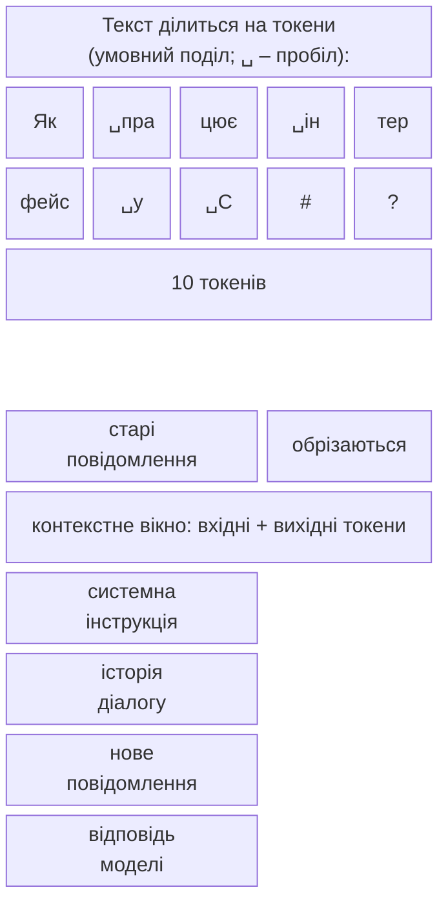
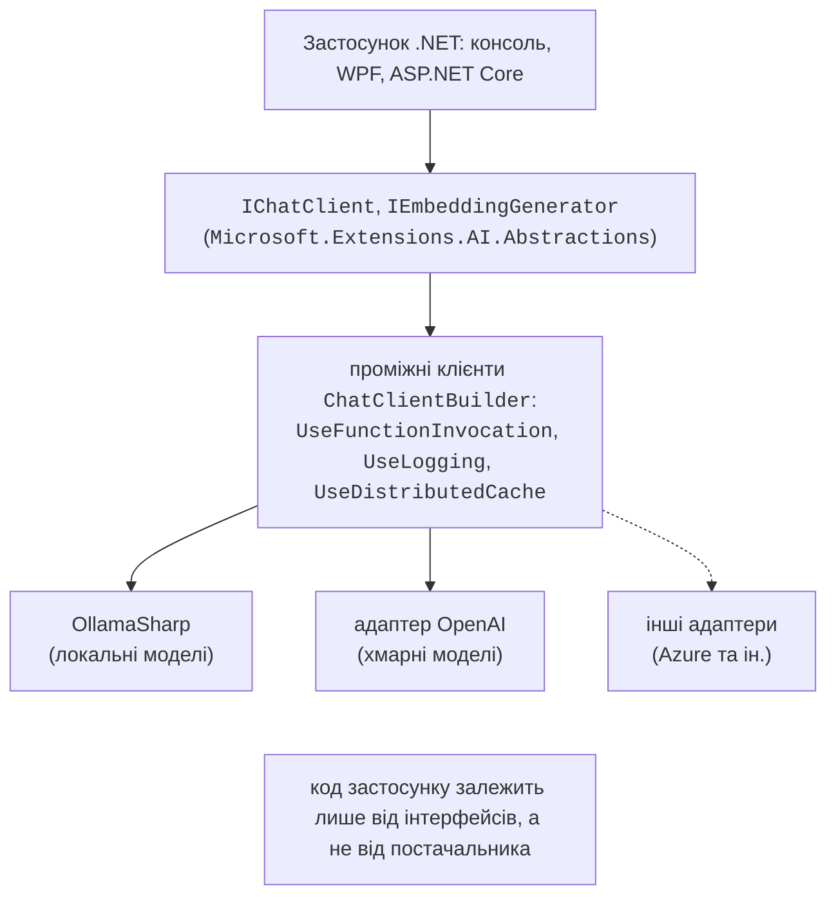
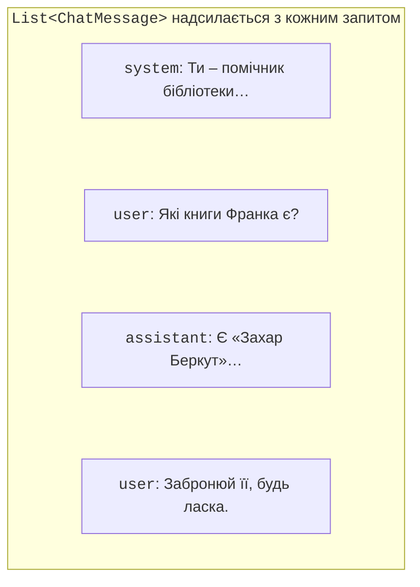

# Мовні моделі та IChatClient

## Великі мовні моделі

**Велика мовна модель** (*large language model*, LLM) – нейронна мережа, навчена на величезному обсязі текстів, яка за вхідним текстом передбачає найімовірніше продовження. Саме так працюють чат-боти: запитання користувача разом з інструкціями подається моделі, а модель крок за кроком генерує відповідь (<https://learn.microsoft.com/dotnet/ai/conceptual/how-genai-and-llms-work>). Текст, який надсилають моделі, називають **промптом** (*prompt*).

### Токени та контекстне вікно

Модель працює не з літерами і не зі словами, а з **токенами** (*tokens*) – частинами слів, цілими короткими словами, розділовими знаками (рис. 16.1). Поділ залежить від конкретної моделі; українські слова зазвичай діляться на більше токенів, ніж англійські, тому той самий зміст українською «коштує» більше токенів (<https://learn.microsoft.com/dotnet/ai/conceptual/understanding-tokens>).



Рис. 16.1. Токени та контекстне вікно моделі {.caption}

**Контекстне вікно** (*context window*) – найбільша кількість токенів, яку модель обробляє за один запит: системна інструкція, уся історія діалогу, нове повідомлення **і** відповідь разом. Модель не «пам’ятає» попередніх запитів: застосунок щоразу надсилає історію заново, а коли вона перестає вміщуватися, найстаріші повідомлення доводиться обрізати. Від кількості токенів залежать також час відповіді й вартість запиту до хмарної моделі.

### Температура, недетермінованість і галюцинації

Модель обирає кожен наступний токен випадково з урахуванням імовірностей. **Температура** (*temperature*) керує цією випадковістю: значення, близьке до 0, дає передбачувані, «сухі» відповіді (витяг даних, класифікація), більше значення – різноманітніші (ідеї, художній текст). Навіть за температури 0 однаковий запит не гарантує однакової відповіді, тому програма не повинна покладатися на точний текст відповіді.

**Галюцинація** (*hallucination*) – впевнена, але вигадана відповідь: неіснуюча книга, метод API чи цитата. Модель не знає фактів після дати навчання і не має доступу до ваших даних. Способи зменшити галюцинації, розглянуті далі: чітка системна інструкція («якщо не знаєш – так і скажи»), передавання потрібних даних у промпті (RAG), виклик функцій застосунку, перевірка відповіді кодом.

### Хмарні та локальні моделі

**Хмарні моделі** (OpenAI, Azure AI Foundry та ін.) найпотужніші, але потребують ключа API, оплати за токени й передавання даних на сервер постачальника. Постачальники обмежують **частоту запитів** (*rate limits*): кількість запитів і токенів за хвилину; перевищення дає відповідь HTTP 429 *Too Many Requests*. **Локальні моделі** виконуються на власному комп’ютері: безкоштовно, без інтернету, дані не залишають комп’ютер, але якість менша, а швидкість залежить від процесора, відеокарти й обсягу пам’яті. У лабораторних роботах використовується локальний сервер **Ollama** (<https://ollama.com>).

## Екосистема AI у .NET

Бібліотеки **Microsoft.Extensions.AI** (MEAI) задають спільні абстракції для роботи з моделями різних постачальників, так само як `ILogger` (тема 6) задає абстракцію журналювання (<https://learn.microsoft.com/dotnet/ai/microsoft-extensions-ai>). Застосунок програмує проти інтерфейсів, а конкретного постачальника підключає **адаптер** (рис. 16.2, табл. 16.1).



Рис. 16.2. Абстракції Microsoft.Extensions.AI {.caption}

Таблиця 16.1. Пакети для роботи з моделями {.caption}

| **Пакет NuGet (версія)** | **Призначення** |
| --- | --- |
| `Microsoft.Extensions.AI.Abstractions` (10.10.0) | інтерфейси `IChatClient`, `IEmbeddingGenerator`, типи повідомлень і вмісту |
| `Microsoft.Extensions.AI` (10.10.0) | виклик функцій, журналювання, кешування, `ChatClientBuilder`, `GetResponseAsync<T>` |
| `OllamaSharp` (5.4.30) | клієнт Ollama, реалізує обидва інтерфейси |
| `Microsoft.Extensions.AI.OpenAI` (10.10.0) | адаптер OpenAI: метод `AsIChatClient()` |
| `CommunityToolkit.VectorData.InMemory` (1.0.1) | векторне сховище в пам’яті |

Раніше Microsoft випускала окремий пакет `Microsoft.Extensions.AI.Ollama`; тепер він застарілий, і документація радить `OllamaSharp`. Для вебзастосунків є шаблон *AI Chat Web App* (пакет шаблонів `Microsoft.Extensions.AI.Templates`, команда `dotnet new aichatweb`) – готовий чат на Blazor із пошуком у власних документах (<https://learn.microsoft.com/dotnet/ai/quickstarts/ai-templates>).

### Встановлення Ollama і моделей

Ollama для Windows 10 22H2 і новіших встановлюють програмою `OllamaSetup.exe` зі сторінки <https://ollama.com/download/windows> (права адміністратора не потрібні). Після встановлення сервер працює у фоні й приймає запити за адресою `http://localhost:11434`, а моделі зберігаються в папці `.ollama` профілю користувача (<https://docs.ollama.com/windows>). Моделі завантажують командою `ollama pull` (рис. 16.3, табл. 16.2):

```powershell
ollama pull qwen3:4b-instruct
ollama pull embeddinggemma
ollama list
ollama run qwen3:4b-instruct "Привіт! Хто ти?"
```

Таблиця 16.2. Локальні моделі для лабораторних робіт {.caption}

| **Модель** | **Розмір** | **Призначення** |
| --- | --- | --- |
| `qwen3:4b-instruct` | 2,5 ГБ | чат, виклик функцій; вікно 256 тис. токенів; понад 100 мов |
| `embeddinggemma` | 622 МБ | векторні подання (768 чисел), понад 100 мов |
| `gemma3:4b` | 3,3 ГБ | чат із зображеннями |
| `llama3.2:3b` | 2,0 ГБ | чат для слабших комп’ютерів; українська не входить до офіційно підтримуваних мов |


Рис. 16.3. Завантаження локальних моделей {.caption}

Модель під час роботи завантажується в оперативну пам’ять або пам’ять відеокарти, тому потрібен запас пам’яті, не менший за розмір моделі; з відеокартою відповідь генерується значно швидше, ніж на процесорі. Каталог моделей з розмірами й можливостями (*tools*, *vision*, *embedding*) – <https://ollama.com/library>.

## Інтерфейс `IChatClient`

Інтерфейс `IChatClient` (<https://learn.microsoft.com/dotnet/ai/ichatclient>) має два основні методи:

- `GetResponseAsync` – повертає повну відповідь;
- `GetStreamingResponseAsync` – повертає відповідь частинами.

Найпростіший запит:

```cs
using Microsoft.Extensions.AI;
using OllamaSharp;

IChatClient client = new OllamaApiClient(
    new Uri("http://localhost:11434"), "qwen3:4b-instruct");

ChatResponse response = await client.GetResponseAsync(
    "Поясни одним реченням, що таке інтерфейс у C#.");
Console.WriteLine(response.Text);
```

### Повідомлення та ролі

Запит – це список повідомлень `ChatMessage`, кожне з яких має **роль** `ChatRole` (рис. 16.4):

- `ChatRole.System` – **системна інструкція**: роль помічника, мова, стиль, обмеження. Її задає програміст, а не користувач;
- `ChatRole.User` – повідомлення користувача;
- `ChatRole.Assistant` – попередні відповіді моделі;
- `ChatRole.Tool` – результати викликаних функцій.



Рис. 16.4. Ролі повідомлень у діалозі {.caption}

Моделі, що працюють через Ollama, та більшість хмарних API **не зберігають стан**: щоб модель «пам’ятала» розмову, застосунок зберігає список `List<ChatMessage>`, додає до нього кожне питання, а метод-розширення `AddMessages` переносить у список повідомлення відповіді (приклад «Консольний чат» нижче).

Параметри запиту задає клас `ChatOptions`: `ModelId` (модель, якщо клієнт створено без неї), `Temperature`, `MaxOutputTokens`, `StopSequences`, `Tools` (функції) тощо. Об’єкт `ChatResponse` містить `Text` (текст останнього повідомлення), `Messages`, `ModelId`, `FinishReason` (`Stop` – модель завершила відповідь, `Length` – досягнуто `MaxOutputTokens`) і `Usage` (`UsageDetails`: `InputTokenCount`, `OutputTokenCount`, `TotalTokenCount`). Не кожен постачальник підтримує всі параметри: непідтримувані зазвичай ігноруються.

### Зображення у запиті

Повідомлення може містити кілька частин вмісту: `TextContent`, `DataContent` (байти з типом MIME: зображення, аудіо, PDF), `UriContent`. Зображення розуміють лише мультимодальні моделі, наприклад `gemma3:4b`: до повідомлення користувача додають `new TextContent("Перелічи товари з чека")` і `new DataContent(bytes, "image/jpeg")`, де `bytes` – вміст файлу фотографії. Розпізнаний текст потрібно перевіряти: модель може помилитися в цифрах так само впевнено, як і в словах.
