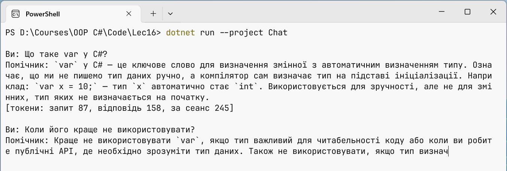

# Потокові та структуровані відповіді

## Потокові відповіді

Генерація довгої відповіді триває секунди або й хвилини. Щоб користувач бачив текст одразу, використовують **потокову відповідь** (*streaming*): метод `GetStreamingResponseAsync` повертає `IAsyncEnumerable<ChatResponseUpdate>`, і кожне оновлення містить кілька нових токенів. Їх перебирають циклом `await foreach` (тема 5), а метод `ToChatResponse` збирає оновлення в одну відповідь для історії та підрахунку токенів (приклад нижче). Третій параметр методу, `CancellationToken`, дозволяє перервати генерацію: у графічному застосунку його скасовує кнопка *Cancel*, і цикл завершується винятком `OperationCanceledException`. Потоковий вивід не можна виконувати разом зі структурованим виводом: JSON має сенс лише повністю.

### Приклад «Консольний чат»

Програма веде діалог з локальною моделлю: системна інструкція задає роль помічника, відповідь виводиться потоком, після кожної відповіді показується кількість токенів, а історія обрізається до 10 останніх повідомлень. Проєкт – консольний застосунок .NET 10 з пакетами `Microsoft.Extensions.AI` і `OllamaSharp` (`dotnet add package OllamaSharp`).

```cs
using Microsoft.Extensions.AI;
using OllamaSharp;

Console.InputEncoding = System.Text.Encoding.UTF8;
Console.OutputEncoding = System.Text.Encoding.UTF8;

const int MaxHistory = 10;   // повідомлень, крім системного

IChatClient client = new OllamaApiClient(
    new Uri("http://localhost:11434"), "qwen3:4b-instruct");

List<ChatMessage> history =
[
    new(ChatRole.System,
        "Ти – помічник студента з програмування на C#. " +
        "Відповідай українською, коротко, 3–5 речень. " +
        "Якщо не знаєш відповіді, так і скажи.")
];
var options = new ChatOptions
{
    Temperature = 0.3f,
    MaxOutputTokens = 500
};
long totalTokens = 0;
```

Головний цикл читає питання до порожнього рядка або команди `/exit`. Якщо сервер Ollama не запущено, `HttpRequestException` не завершує програму: питання видаляється з історії:

```cs
while (true)
{
    Console.Write("\nВи: ");
    string? question = Console.ReadLine();
    if (string.IsNullOrWhiteSpace(question) || question == "/exit")
        break;
    history.Add(new ChatMessage(ChatRole.User, question));

    Console.Write("Помічник: ");
    List<ChatResponseUpdate> updates = [];
    try
    {
        await foreach (ChatResponseUpdate update in
            client.GetStreamingResponseAsync(history, options))
        {
            Console.Write(update.Text);
            updates.Add(update);
        }
    }
    catch (HttpRequestException ex)
    {
        Console.Error.WriteLine($"Немає зв’язку: {ex.Message}");
        history.RemoveAt(history.Count - 1);
        continue;
    }

    ChatResponse response = updates.ToChatResponse();
    history.AddMessages(response);

    UsageDetails? usage = response.Usage;
    totalTokens += usage?.TotalTokenCount ?? 0;
    Console.WriteLine();
    Console.WriteLine($"[токени: запит {usage?.InputTokenCount}, " +
        $"відповідь {usage?.OutputTokenCount}, " +
        $"за сеанс {totalTokens}]");

    // Найстаріші пари «питання – відповідь» видаляються.
    while (history.Count > MaxHistory + 1)
        history.RemoveRange(1, 2);
}
```

Системне повідомлення (індекс 0) ніколи не видаляється, тому модель пам’ятає свою роль навіть у довгій розмові. Друге питання спирається на історію: модель розуміє, що «його» означає `var`. Приблизний вигляд сеансу (рис. 16.5; текст відповіді щоразу інший):

```
Ви: Що таке var у C#?
Помічник: Ключове слово var дозволяє не писати тип локальної
змінної: компілятор визначає його за виразом ініціалізації.
Тип при цьому залишається статичним і не змінюється.
[токени: запит 58, відповідь 41, за сеанс 99]

Ви: Коли його краще не використовувати?
Помічник: Коли тип не очевидний із правої частини, наприклад
var result = Calculate(); – читачеві доведеться шукати тип.
[токени: запит 116, відповідь 32, за сеанс 247]
```



Рис. 16.5. Консольний чат із потоковою відповіддю {.caption}

Лічильник `запит` другого питання більший, бо модель отримала всю історію. Саме так зростає вартість довгих діалогів у хмарних моделях.

## Структурований вивід

Текст відповіді зручний для людини, але не для програми. Метод-розширення `GetResponseAsync<T>` просить модель повернути JSON, що відповідає типу C# `T`: бібліотека будує з типу **JSON-схему**, передає її моделі в `ChatOptions.ResponseFormat` і десеріалізує відповідь (<https://learn.microsoft.com/dotnet/ai/quickstarts/structured-output>). Для `record Ad(string Title, decimal? Price, string City)` модель отримує схему:

```json
{"type":"object","properties":{"title":{"type":"string"},
 "price":{"type":["number","null"]},"city":{"type":"string"}},
 "required":["title","price","city"]}
```

Результат повертає `ChatResponse<T>`: властивість `Result` спричиняє виняток, якщо JSON некоректний, а метод `TryGetResult` просто повертає `false`. Навіть правильний JSON може містити неправдоподібні значення, тому результат завжди перевіряють кодом. Атрибут `[Description]` потрапляє в схему і підказує моделі зміст поля.

### Приклад «Розбір оголошень»

Програма перетворює текстові оголошення на записи `Ad` з категорією, заголовком, ціною та містом і виводить таблицю. Оголошення без змісту відхиляється перевіркою.

```cs
using System.ComponentModel;
using Microsoft.Extensions.AI;
using OllamaSharp;

Console.OutputEncoding = System.Text.Encoding.UTF8;

IChatClient client = new OllamaApiClient(
    new Uri("http://localhost:11434"), "qwen3:4b-instruct");

string[] ads =
[
    "Продам велосипед Trek Marlin 5, рама M, стан добрий. " +
        "4 500 грн, торг. Лондон, Камден.",
    "Здаю однокімнатну квартиру біля метро «Ретіро», " +
        "Мадрид. 9000 на місяць + комунальні.",
    "Терміново!!! Дзвоніть!!!"
];

var options = new ChatOptions { Temperature = 0f };
Console.WriteLine(
    $"{"Категорія",-9} {"Заголовок",-26} {"Ціна",8}  Місто");
```

Для кожного оголошення надсилаються системна інструкція і текст. Інструкція прямо забороняє вигадувати відсутні дані:

```cs
foreach (string text in ads)
{
    List<ChatMessage> messages =
    [
        new(ChatRole.System,
            "Витягни дані з оголошення. Нічого не вигадуй: " +
            "якщо ціни немає, Price = null; якщо місто не вказано, " +
            "City = \"\"."),
        new(ChatRole.User, text)
    ];
    ChatResponse<Ad> response =
        await client.GetResponseAsync<Ad>(messages, options);

    if (!response.TryGetResult(out Ad? ad))
    {
        Console.Error.WriteLine($"Некоректний JSON: {response.Text}");
        continue;
    }
    string? error = Validate(ad);
    if (error is not null)
    {
        Console.Error.WriteLine($"Пропуск «{text}»: {error}");
        continue;
    }
    string price = ad.Price is null ? "–" : $"{ad.Price:N0}";
    Console.WriteLine(
        $"{ad.Category,-9} {ad.Title,-26} {price,8}  {ad.City}");
}

static string? Validate(Ad ad)   // перевірка змісту, а не лише JSON
{
    if (string.IsNullOrWhiteSpace(ad.Title)) return "немає назви";
    if (ad.Price is < 0 or > 10_000_000) return "дивна ціна";
    return null;
}

enum Category { Sale, Rent, Free, Other }

record Ad(
    [property: Description("Короткий заголовок, до 5 слів")]
    string Title,
    Category Category,
    [property: Description("Ціна в гривнях або null")]
    decimal? Price,
    string City);
```

Перелічення `Category` потрапляє в схему як набір допустимих рядків, тож модель не може повернути довільну категорію. Температура 0 робить витяг даних стабільнішим. Очікуваний результат (повідомлення про пропуск виводиться в потік помилок):

```
Категорія Заголовок                      Ціна  Місто
Sale      Велосипед Trek Marlin 5       4 500  Лондон
Rent      Однокімнатна квартира         9 000  Мадрид
Пропуск «Терміново!!! Дзвоніть!!!»: немає назви
```
