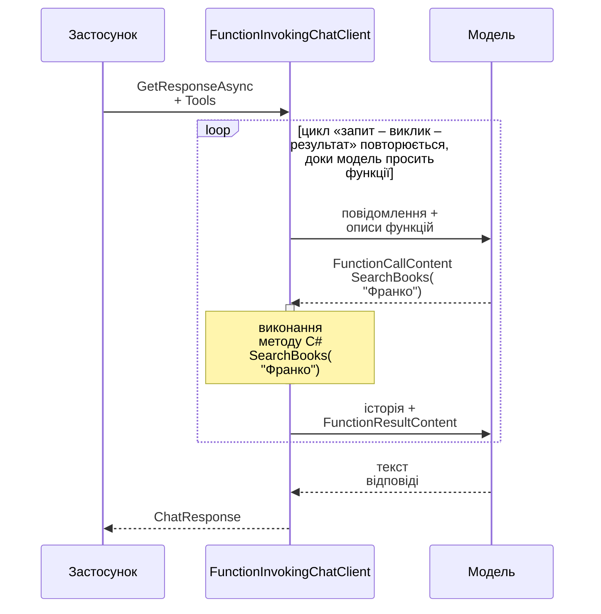
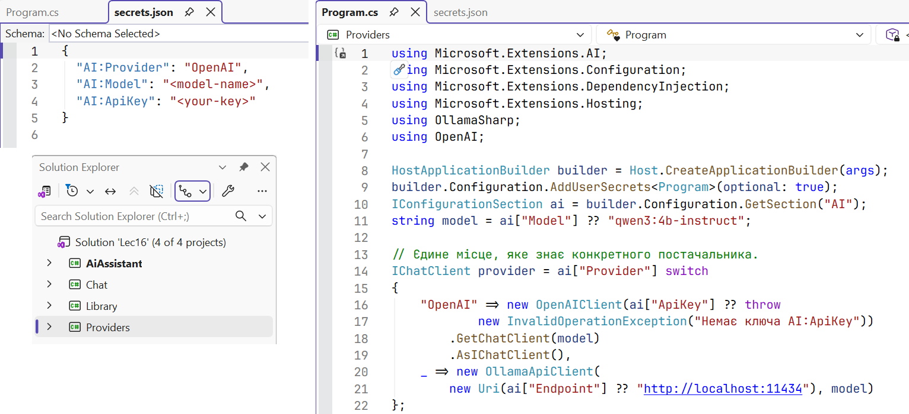

# Виклик функцій і конвеєр клієнтів

## Виклик функцій

Модель не знає, які книги є в бібліотеці, яка зараз погода чи скільки грошей на рахунку. Зате сучасні моделі вміють **викликати функції** (*function calling*, *tool calling*): застосунок описує доступні методи, а модель замість тексту відповідає запитом «виклич `SearchBooks` з аргументом `query = "Франко"`». Застосунок виконує метод і надсилає результат моделі, яка формує остаточну відповідь (рис. 16.6).



Рис. 16.6. Цикл виклику функцій {.caption}

У MEAI метод C# перетворює на інструмент `AIFunctionFactory.Create`: назва, опис з атрибута `[Description]` і JSON-схема параметрів беруться з сигнатури методу. Інструменти передають у `ChatOptions.Tools`, а цикл «запит – виклик – результат – запит» виконує проміжний клієнт `FunctionInvokingChatClient`, який додає `UseFunctionInvocation()` (<https://learn.microsoft.com/dotnet/ai/quickstarts/use-function-calling>). Функції підтримують не всі моделі: на сторінці моделі Ollama має бути позначка *tools*.

Інструменти – це код, який запускає модель, тому до них висувають вимоги безпеки:

- давати лише потрібні дії й лише потрібні дані (принцип найменших привілеїв);
- перевіряти аргументи в методі так само, як введення користувача;
- дії, що змінюють дані (бронювання, оплата, видалення), підтверджує людина. Для цього можна запитати користувача в самому методі або обгорнути функцію в `ApprovalRequiredAIFunction`, і тоді клієнт повертає запит на схвалення замість виклику;
- обмежувати кількість кроків циклу: `MaximumIterationsPerRequest`.

### Приклад «Помічник бібліотеки»

Помічник шукає книги в каталозі (у лабораторній роботі – у базі даних, теми 7–8) і бронює їх після підтвердження читачем. Журнал на рівні `Debug` показує кожен запит до моделі та кожен виклик функції. Крім пакетів попереднього прикладу, потрібен `Microsoft.Extensions.Logging.Console`. Клас інструментів:

```cs
using System.ComponentModel;

public record Book(int Id, string Author, string Title, int Copies);

public class LibraryTools
{
    private readonly List<Book> books =
    [
        new(1, "Іван Франко", "Захар Беркут", 2),
        new(2, "Іван Франко", "Перехресні стежки", 0),
        new(3, "Леся Українка", "Лісова пісня", 3),
        new(4, "Ліна Костенко", "Маруся Чурай", 1)
    ];

    [Description("Шукає книги за частиною прізвища автора або назви")]
    public List<Book> SearchBooks(
        [Description("Прізвище автора або слово з назви")]
        string query)
    {
        return books
            .Where(b => b.Author.Contains(query,
                            StringComparison.OrdinalIgnoreCase)
                     || b.Title.Contains(query,
                            StringComparison.OrdinalIgnoreCase))
            .ToList();
    }

    [Description("Бронює примірник книги за її Id")]
    public string ReserveBook(
        [Description("Id книги з результатів пошуку")] int bookId)
    {
        int index = books.FindIndex(b => b.Id == bookId);
        if (index < 0) return "Книгу не знайдено.";
        Book book = books[index];
        if (book.Copies == 0) return "Вільних примірників немає.";

        // Дія змінює дані, тому її підтверджує людина, а не модель.
        Console.Write($"Забронювати «{book.Title}»? (y/n): ");
        if (Console.ReadLine()?.Trim().ToLower() != "y")
            return "Користувач скасував бронювання.";

        books[index] = book with { Copies = book.Copies - 1 };
        return $"Заброньовано «{book.Title}», залишилось " +
               $"{book.Copies - 1}.";
    }
}
```

Програма будує клієнт із двома проміжними шарами і передає обидва методи як інструменти. Функції створено з методів екземпляра, тому вони мають доступ до його даних:

```cs
using Microsoft.Extensions.AI;
using Microsoft.Extensions.Logging;
using OllamaSharp;

Console.InputEncoding = System.Text.Encoding.UTF8;
Console.OutputEncoding = System.Text.Encoding.UTF8;

using ILoggerFactory loggers = LoggerFactory.Create(b => b
    .AddSimpleConsole(o => o.SingleLine = true)
    .SetMinimumLevel(LogLevel.Debug));

IChatClient client = new ChatClientBuilder(
        new OllamaApiClient(
            new Uri("http://localhost:11434"), "qwen3:4b-instruct"))
    .UseFunctionInvocation(loggers, f =>
        f.MaximumIterationsPerRequest = 5)
    .UseLogging(loggers)
    .Build();

var library = new LibraryTools();
var options = new ChatOptions
{
    Temperature = 0f,
    Tools =
    [
        AIFunctionFactory.Create(library.SearchBooks),
        AIFunctionFactory.Create(library.ReserveBook)
    ]
};
List<ChatMessage> history =
[
    new(ChatRole.System,
        "Ти – помічник бібліотеки. Про книги відповідай лише " +
        "за даними функцій, нічого не вигадуй. " +
        "Відповідай українською.")
];

while (true)
{
    Console.Write("\nЧитач: ");
    string? text = Console.ReadLine();
    if (string.IsNullOrWhiteSpace(text)) break;
    history.Add(new ChatMessage(ChatRole.User, text));

    ChatResponse response =
        await client.GetResponseAsync(history, options);
    history.AddMessages(response);
    Console.WriteLine($"Бібліотека: {response.Text}");
}
```

Журнал першого питання (назви категорій скорочено до `…AI.`): модель двічі отримує запит – до виклику функції і після нього. На рівні `Trace` журнал містить і повний текст повідомлень з аргументами, тож його не вмикають там, де є персональні дані (рис. 16.7):

```
Читач: Які книги Франка є?
dbug: …AI.LoggingChatClient[1723383095] GetResponseAsync invoked.
dbug: …AI.LoggingChatClient[1553703230] GetResponseAsync completed.
dbug: …AI.FunctionInvokingChatClient[807273242] Invoking SearchBooks.
dbug: …AI.FunctionInvokingChatClient[1098781176] SearchBooks
      invocation completed. Duration: 00:00:00.0097365
dbug: …AI.LoggingChatClient[1723383095] GetResponseAsync invoked.
dbug: …AI.LoggingChatClient[1553703230] GetResponseAsync completed.
Бібліотека: У каталозі є дві книги Івана Франка: «Захар Беркут»
(2 примірники) і «Перехресні стежки» (зараз немає в наявності).
```


Рис. 16.7. Журнал виклику функцій {.caption}

## Конвеєр проміжних клієнтів

Клас `ChatClientBuilder` обгортає клієнт постачальника в ланцюжок **проміжних клієнтів** (*middleware*), кожен з яких сам реалізує `IChatClient`. Перший доданий шар – зовнішній: він отримує запит першим, а відповідь – останнім. Це перевірено двома шарами-делегатами `Use(async (messages, options, next, token) => …)`, які виводять повідомлення до і після виклику `next`: порядок виведення – «A: до», «B: до», «B: після», «A: після».

Готові шари (табл. 16.3) підключають методами `Use…`. Порядок має значення: якщо `UseDistributedCache` стоїть перед `UseFunctionInvocation`, кешується вже остаточна відповідь після викликів функцій, і повторне питання не викликає їх знову.

Таблиця 16.3. Проміжні клієнти `ChatClientBuilder` {.caption}

| **Метод** | **Що робить** |
| --- | --- |
| `UseFunctionInvocation` | виконує функції, які просить модель, і повторює запит |
| `UseLogging` | пише в `ILogger` кожен запит і відповідь (тема 6) |
| `UseDistributedCache` | повертає збережену відповідь на такий самий запит з `IDistributedCache` |
| `UseOpenTelemetry` | метрики й трасування за угодами OpenTelemetry для генеративного AI |
| `ConfigureOptions` | задає параметри за замовчуванням, наприклад `ModelId` |
| `Use(…)` | власний шар: делегат або клас, похідний від `DelegatingChatClient` |

### Власний проміжний клієнт

Базовий клас `DelegatingChatClient` передає всі виклики внутрішньому клієнту, тож у похідному класі перевизначають лише потрібне. Клієнт `TokenLimitChatClient` рахує використані токени і не пропускає запити, коли ліміт вичерпано, щоб програма з помилкою в циклі не витратила весь бюджет хмарного постачальника:

```cs
using Microsoft.Extensions.AI;

// Проміжний клієнт: рахує токени й зупиняє запити понад ліміт.
public sealed class TokenLimitChatClient(
    IChatClient inner, long limit) : DelegatingChatClient(inner)
{
    public long UsedTokens { get; private set; }

    public override async Task<ChatResponse> GetResponseAsync(
        IEnumerable<ChatMessage> messages,
        ChatOptions? options = null,
        CancellationToken cancellationToken = default)
    {
        ThrowIfExhausted();
        ChatResponse response = await base.GetResponseAsync(
            messages, options, cancellationToken);
        UsedTokens += response.Usage?.TotalTokenCount ?? 0;
        return response;
    }

    private void ThrowIfExhausted()
    {
        if (UsedTokens >= limit)
            throw new InvalidOperationException(
                $"Ліміт {limit} токенів вичерпано.");
    }
}
```

Метод `GetStreamingResponseAsync` перевизначають так само; у потоковому режимі кількість токенів приходить окремим вмістом `UsageContent`, зазвичай в останньому оновленні.

### Реєстрація в DI та зміна постачальника

У застосунку з Generic Host (тема 6) клієнт реєструють методом `AddChatClient`, а конвеєр будують методами того самого ланцюжка. Постачальника обирає конфігурація: у розділі `AI` вказують `Provider`, `Model` і, для хмарного постачальника, `ApiKey`. Решта коду отримує `IChatClient` через конструктор і не знає, яка модель відповідає:

```cs
using Microsoft.Extensions.AI;
using Microsoft.Extensions.Configuration;
using Microsoft.Extensions.DependencyInjection;
using Microsoft.Extensions.Hosting;
using OllamaSharp;
using OpenAI;

HostApplicationBuilder builder = Host.CreateApplicationBuilder(args);
builder.Configuration.AddUserSecrets<Program>(optional: true);
IConfigurationSection ai = builder.Configuration.GetSection("AI");
string model = ai["Model"] ?? "qwen3:4b-instruct";

// Єдине місце, яке знає конкретного постачальника.
IChatClient provider = ai["Provider"] switch
{
    "OpenAI" => new OpenAIClient(ai["ApiKey"] ?? throw
            new InvalidOperationException("Немає ключа AI:ApiKey"))
        .GetChatClient(model)
        .AsIChatClient(),
    _ => new OllamaApiClient(
        new Uri(ai["Endpoint"] ?? "http://localhost:11434"), model)
};

builder.Services.AddDistributedMemoryCache();
builder.Services.AddChatClient(provider)
    .UseLogging()
    .UseDistributedCache()
    .Use(inner => new TokenLimitChatClient(inner, limit: 20_000));

using IHost host = builder.Build();
IChatClient client = host.Services.GetRequiredService<IChatClient>();
```

Потрібні пакети `Microsoft.Extensions.Hosting`, `Microsoft.Extensions.Caching.Memory` і, для OpenAI, `Microsoft.Extensions.AI.OpenAI` (<https://learn.microsoft.com/dotnet/ai/quickstarts/prompt-model>). Шар журналювання стоїть зовні й фіксує всі запити, зокрема ті, на які відповів кеш, а `TokenLimitChatClient` – найближче до моделі й рахує лише справжні звернення до неї. Перевірка з тестовим клієнтом, який відповідає із затримкою 800 мс, показала: повторне питання «Що таке DI?» отримало відповідь з кешу за кілька мілісекунд, без звернення до моделі.

Сервіс *GitHub Models*, яким раніше користувалися для безкоштовних експериментів із хмарними моделями, повністю закрито 30 липня 2026 року (<https://docs.github.com/github-models>). Хмарні моделі тепер надають OpenAI (<https://platform.openai.com/docs>) та Azure AI Foundry (<https://learn.microsoft.com/azure/ai-foundry/>). Ollama також має сумісну з OpenAI адресу `http://localhost:11434/v1`, тож адаптер OpenAI можна перевірити і з локальною моделлю (<https://docs.ollama.com/api/openai-compatibility>).

### Ключі API в секретах користувача

Ключ API – це пароль, за який постачальник виставляє рахунок. Його **ніколи** не записують у код чи `appsettings.json`: файли потрапляють у Git (тема 1), а ключ із публічного репозиторію знаходять і використовують автоматизовані програми. Під час розробки ключ зберігають у **секретах користувача** (*user secrets*) – файлі `secrets.json` у профілі Windows поза папкою проєкту (<https://learn.microsoft.com/aspnet/core/security/app-secrets>):

```powershell
dotnet user-secrets init
dotnet user-secrets set "AI:Provider" "OpenAI"
dotnet user-secrets set "AI:Model" "<model-name>"
dotnet user-secrets set "AI:ApiKey" "<your-key>"
```

У Visual Studio файл відкриває команда *Manage User Secrets* контекстного меню проєкту (рис. 16.8). На сервері ключ задають змінною середовища `AI__ApiKey` або сховищем секретів хмари.



Рис. 16.8. Ключ API у секретах користувача {.caption}
