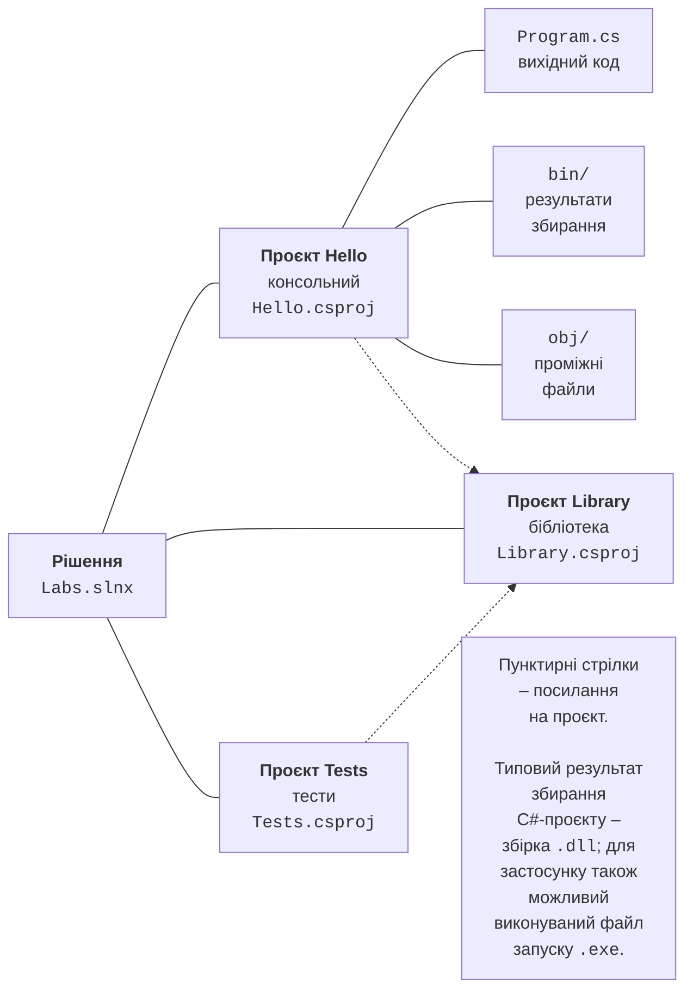

# dotnet CLI і структура програми

## Інструмент командного рядка dotnet CLI

Усі середовища розробки під час збирання та запуску викликають той самий інструмент командного рядка **dotnet CLI**. Його можна використовувати й безпосередньо: у терміналі Windows, Linux і macOS, на сервері без графічного інтерфейсу, у сценаріях автоматизації. Основні команди наведено в табл. 1.4, повний опис – у документації <https://learn.microsoft.com/dotnet/core/tools/>.

Таблиця 1.4. Основні команди dotnet CLI {.caption}

| **Команда** | **Призначення** |
| --- | --- |
| `dotnet --info` | відомості про встановлені SDK та середовища виконання |
| `dotnet new list` | список шаблонів проєктів |
| `dotnet new console -n Hello` | створити консольний проєкт Hello у новій папці |
| `dotnet new sln -n Labs` | створити файл рішення `Labs.slnx` |
| `dotnet sln add Hello` | додати проєкт до рішення |
| `dotnet build` | зібрати проєкт (конфігурація Debug) |
| `dotnet run` | зібрати та запустити проєкт |
| `dotnet run -- a b` | запустити з аргументами командного рядка `a` і `b` |
| `dotnet clean` | видалити результати збирання |
| `dotnet add package Humanizer` | підключити пакет NuGet |
| `dotnet publish -c Release` | підготувати застосунок до поширення |

Приклад створення рішення з одним проєктом і запуску програми (рис. 1.24):

```
mkdir Labs
cd Labs
dotnet new sln -n Labs
dotnet new console -n Hello
dotnet sln add Hello
dotnet run --project Hello
```


Рис. 1.24. Створення та запуск проєкту в терміналі {.caption}

Для невеликих експериментів .NET 10 дозволяє запускати окремий файл `.cs` без створення проєкту. Створіть у будь-якому текстовому редакторі файл `hello.cs` з рядком `Console.WriteLine("Hello!");` і виконайте в терміналі команду `dotnet run hello.cs`. Такі **файлові застосунки** (*file-based apps*) зручні для перевірки окремих прикладів із лекцій (<https://learn.microsoft.com/dotnet/core/sdk/file-based-apps>).

## Проєкти та рішення

**Проєкт** – це набір вихідних файлів і налаштувань, з яких збирається одна збірка: консольна програма, бібліотека або вебзастосунок. **Рішення** (*solution*) об’єднує кілька пов’язаних проєктів, наприклад застосунок, бібліотеку та проєкт тестів (рис. 1.25). Після створення та збирання рішення з попереднього прикладу має таку структуру папок:

```
Labs/
├── Labs.slnx                 файл рішення
└── Hello/                    папка проєкту
    ├── Hello.csproj          файл проєкту
    ├── Program.cs            вихідний код
    ├── bin/Debug/net10.0/    зібрана програма
    │   ├── Hello.dll
    │   └── Hello.exe
    └── obj/                  проміжні файли збирання
```



Рис. 1.25. Структура рішення та проєктів {.caption}

Файл рішення має розширення `.slnx` (у попередніх версіях – `.sln`); у Visual Studio структуру рішення відображає вікно *Solution Explorer*. Файл проєкту `Hello.csproj` записано у форматі XML:

```xml
<Project Sdk="Microsoft.NET.Sdk">
  <PropertyGroup>
    <OutputType>Exe</OutputType>
    <TargetFramework>net10.0</TargetFramework>
    <ImplicitUsings>enable</ImplicitUsings>
    <Nullable>enable</Nullable>
  </PropertyGroup>
</Project>
```

Атрибут `Sdk` вказує набір правил збирання, `OutputType` – тип збірки (`Exe` – запускний файл, `Library` – бібліотека), `TargetFramework` – цільову версію платформи. `ImplicitUsings` вмикає неявне підключення основних просторів імен, а `Nullable` – перевірку посилальних типів, які можуть мати значення `null`. Усі файли `.cs` у папці проєкту включаються до нього автоматично. Папки `bin` і `obj` створюються під час збирання; їх не додають до системи контролю версій і не надсилають викладачеві – вони відтворюються з вихідного коду.

Сторонні бібліотеки підключають як **пакети NuGet** – архіви зі збірками, що публікуються в репозиторії <https://www.nuget.org>. Команда `dotnet add package Humanizer` додає до файлу проєкту посилання на пакет, а під час збирання пакет завантажується автоматично. У Visual Studio пакети підключають через *Project → Manage NuGet Packages…* Докладніше: <https://learn.microsoft.com/nuget/what-is-nuget>.

## Структура програми мовою C#

Сучасний шаблон консольного застосунку містить лише один рядок:

```cs
Console.WriteLine("Hello, World!");
```

Це **оператори верхнього рівня** (*top-level statements*). Під час компіляції вони поміщаються в автоматично створений метод `Main` – **точку входу** програми, з якої починається виконання. Такий запис зручний для невеликих програм; у проєкті оператори верхнього рівня можуть бути лише в одному файлі. Еквівалентна програма з явною структурою виглядає так:

```cs
namespace Hello;

internal class Program
{
    // Точка входу: з методу Main починається виконання.
    static void Main(string[] args)
    {
        Console.WriteLine("Hello, World!");
    }
}
```

Основні елементи програми:

- **простір імен** (`namespace`) групує пов’язані типи та запобігає конфліктам імен; оголошення `namespace Hello;` поширюється на весь файл;
- **клас** `Program` містить метод `Main` – точку входу; модифікатор `internal` робить клас доступним лише в межах збірки;
- метод `Main` статичний, тому викликається без створення об’єкта класу; масив `args` містить аргументи командного рядка, а метод може повертати `int` – код завершення програми;
- директива `using` підключає простір імен, щоб не писати повні імена типів (`System.Console`); завдяки `ImplicitUsings` простори імен `System`, `System.IO`, `System.Linq` та інші підключені неявно;
- кожен оператор закінчується крапкою з комою, а блоки коду беруться у фігурні дужки;
- коментарі записують після `//` до кінця рядка або між `/*` і `*/`; коментарі `///` використовують для документування коду.

Мова C# чутлива до регістру: `Main` і `main` – різні імена. За угодами про іменування типи й методи пишуть у стилі PascalCase (`ReadLine`), а локальні змінні й параметри – у стилі camelCase (`userName`). Повний перелік угод наведено в документації <https://learn.microsoft.com/dotnet/csharp/fundamentals/coding-style/identifier-names>.

### Помилки компіляції

Якщо код порушує правила мови, компілятор не створює збірку, а виводить **помилки компіляції**. Кожна помилка має код, опис, назву файлу й номер рядка. У Visual Studio помилки підкреслюються червоною хвилястою лінією в редакторі та наводяться у вікні *Error List* (*View → Error List*), а подвійне клацання на помилці переводить курсор до потрібного рядка (рис. 1.26). Наприклад, у такому коді є помилки:

```cs
Console.WriteLine("Привіт")
console.WriteLine(name);
```

Компілятор повідомить:

```
error CS1002: ; expected
```

Після додавання крапки з комою з’являться наступні помилки:

```
error CS0103: The name 'console' does not exist in the current context
error CS0103: The name 'name' does not exist in the current context
```

У першому рядку бракувало крапки з комою, у другому ім’я `console` написано з малої літери, а змінну `name` не оголошено. Опис кожної помилки за її кодом можна знайти в документації <https://learn.microsoft.com/dotnet/csharp/language-reference/compiler-messages/>.


Рис. 1.26. Помилки компіляції у вікні *Error List* {.caption}

::: tip Порада
Виправляйте помилки по черзі, починаючи з першої: одна помилка часто спричиняє кілька повідомлень у наступних рядках.
:::
