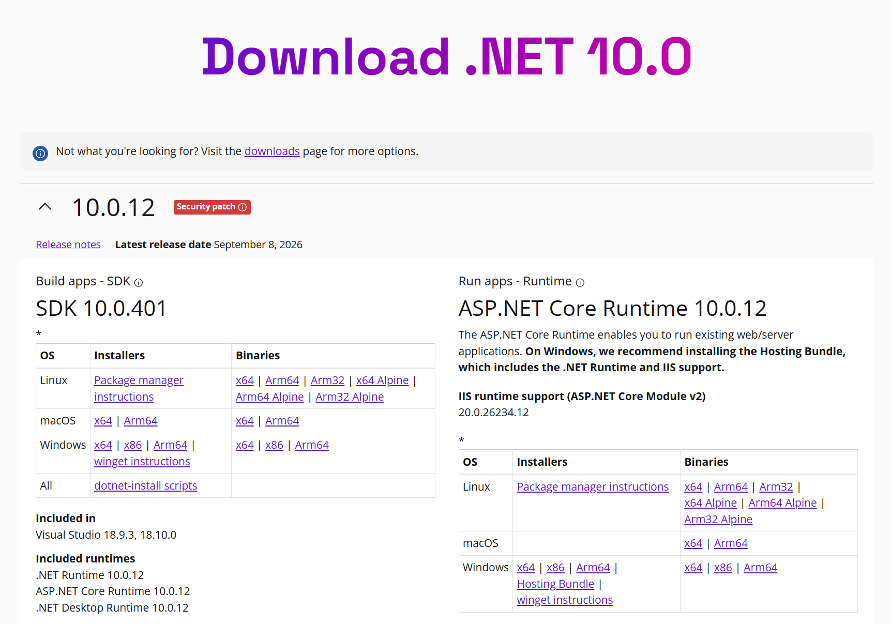
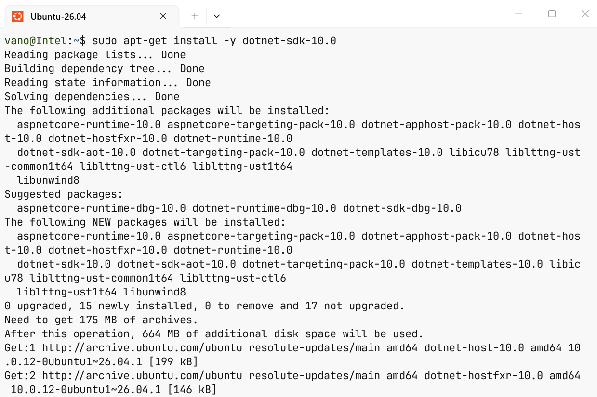
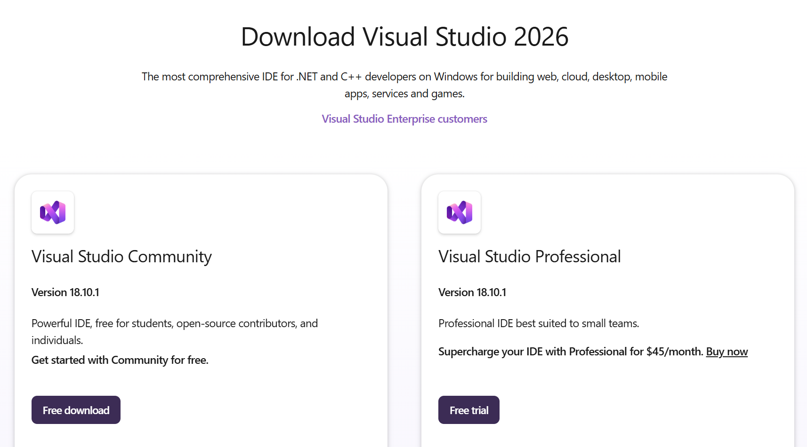
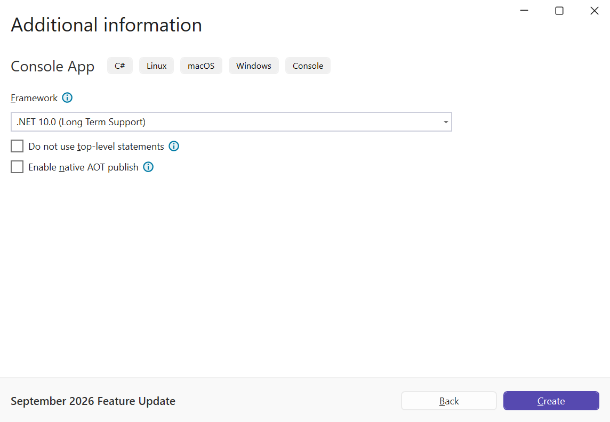
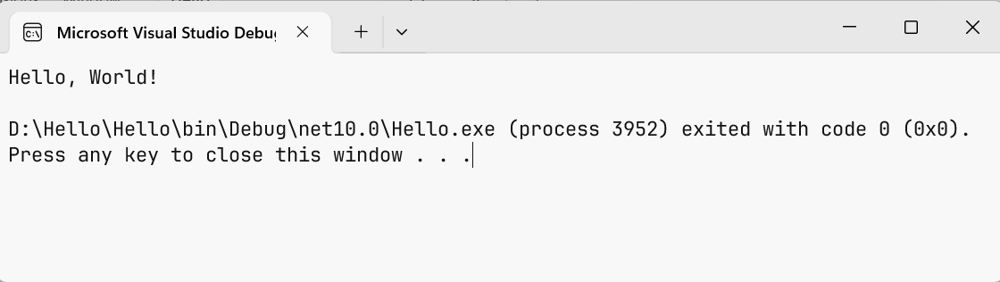
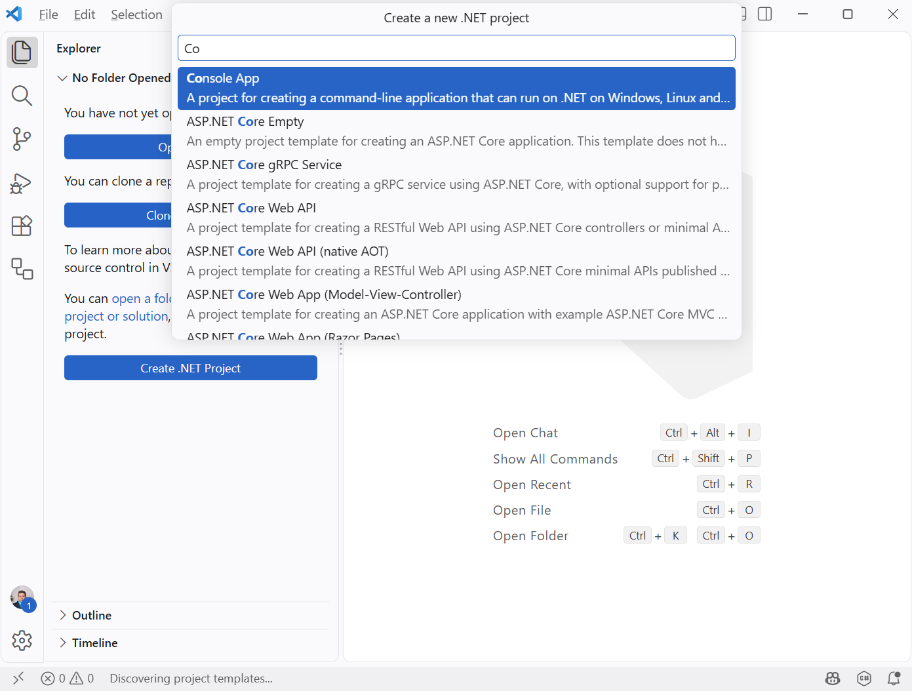
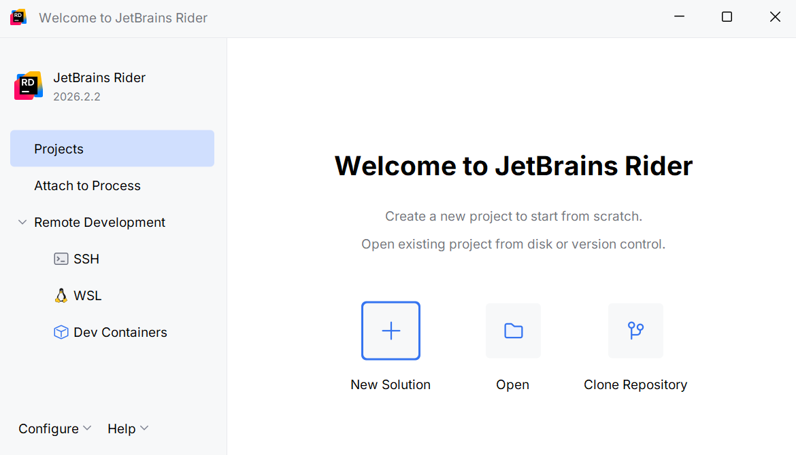

# Встановлення та середовища розробки

## Встановлення .NET SDK

Visual Studio 2026 встановлює .NET SDK автоматично. Окремо встановлювати SDK потрібно для роботи у Visual Studio Code, JetBrains Rider або лише в командному рядку. Інструкції для всіх систем наведено в документації <https://learn.microsoft.com/dotnet/core/install/>.

### Windows

Відкрийте сторінку завантаження <https://dotnet.microsoft.com/download/dotnet/10.0> і в таблиці **SDK 10.0.x** у рядку *Windows* оберіть інсталятор для своєї архітектури – зазвичай *x64*, для комп’ютерів із процесором Snapdragon – *Arm64* (рис. 1.5).



Рис. 1.5. Сторінка завантаження .NET 10 {.caption}

Запустіть завантажений файл `dotnet-sdk-10.0.xxx-win-x64.exe`, натисніть *Install* і підтвердьте запит контролю облікових записів. Після завершення інсталятор покаже повідомлення *Installation was successful* (рис. 1.6).


Рис. 1.6. Завершення встановлення .NET SDK у Windows {.caption}

Інший спосіб – менеджер пакетів **WinGet**, вбудований у Windows 11. Відкрийте термінал (*Start → Terminal*) і виконайте команду:

```
winget install Microsoft.DotNet.SDK.10
```

### Linux

У Linux .NET встановлюють із репозиторію пакетів дистрибутива. В Ubuntu 24.04 і новіших пакет .NET 10 доступний у стандартному репозиторії (рис. 1.7):

```
sudo apt-get update
sudo apt-get install -y dotnet-sdk-10.0
```

У Fedora використовують команду `sudo dnf install dotnet-sdk-10.0`. Команди для інших дистрибутивів наведено в документації <https://learn.microsoft.com/dotnet/core/install/linux>. Якщо пакета немає в репозиторії, SDK можна встановити сценарієм `dotnet-install` (<https://learn.microsoft.com/dotnet/core/tools/dotnet-install-script>).



Рис. 1.7. Встановлення .NET SDK в Ubuntu {.caption}

### macOS

На сторінці завантаження оберіть інсталятор *macOS*: *Arm64* для комп’ютерів з процесорами Apple Silicon або *x64* для комп’ютерів з процесорами Intel. Запустіть файл `.pkg` і дотримуйтеся вказівок майстра встановлення. Докладніше – у документації <https://learn.microsoft.com/dotnet/core/install/macos>.

### Перевірка встановлення

Після встановлення **відкрийте новий** термінал і виконайте команду `dotnet --info`. Вона виводить версію SDK, середовища виконання, операційну систему та архітектуру процесора (рис. 1.8).


Рис. 1.8. Результат команди `dotnet --info` {.caption}

::: tip Порада
Якщо термінал повідомляє, що команда `dotnet` не знайдена, закрийте всі вікна терміналу й відкрийте нове: змінна середовища `PATH` оновлюється лише для нових вікон. Якщо це не допомогло, перезавантажте комп’ютер.
:::

## Середовище розробки Visual Studio 2026

**Microsoft Visual Studio 2026** – повнофункціональне середовище розробки (IDE, *Integrated Development Environment*) для Windows. Воно поєднує редактор коду з підказками IntelliSense, компілятор, налагоджувач, візуальні конструктори інтерфейсу, засоби тестування та профілювання.

Visual Studio має три редакції: **Community**, **Professional** і **Enterprise**. Редакція Community безкоштовна для індивідуальних розробників, навчання в закладах освіти, наукових досліджень і проєктів з відкритим кодом (<https://visualstudio.microsoft.com/vs/community/>). Її можливостей достатньо для всього курсу.

### Системні вимоги

Visual Studio 2026 офіційно підтримує 64-розрядні Windows 11 (зокрема на процесорах Arm64) і Windows Server 2019, 2022, 2025. Потрібні:

- процесор x64 або Arm64, бажано чотири ядра й більше;
- щонайменше 4 ГБ оперативної пам’яті, рекомендовано 16 ГБ;
- 20–50 ГБ вільного місця на диску для типового встановлення, бажано SSD;
- роздільна здатність екрана від 1366 × 768, рекомендовано 1920 × 1080.

Повні вимоги наведено на сторінці <https://learn.microsoft.com/visualstudio/releases/2026/vs-system-requirements>.

### Завантаження та встановлення

1. Відкрийте сторінку <https://visualstudio.microsoft.com/downloads/> і в розділі *Community* натисніть *Free download* (рис. 1.9). Завантажиться невеликий файл `VisualStudioSetup.exe` – програма **Visual Studio Installer**.
2. Запустіть файл і погодьтеся з умовами ліцензії. Installer завантажить потрібні компоненти.
3. На вкладці *Workloads* позначте робоче навантаження (*workload*) *.NET desktop development* (рис. 1.10). Воно містить усе потрібне для консольних і настільних застосунків C#, зокрема .NET 10 SDK. Вебзастосунки згодом можна додати навантаженням *ASP.NET and web development*.
4. На вкладці *Language packs* залиште мову інтерфейсу *English* (рис. 1.11): назви меню в лекціях, документації та більшості навчальних матеріалів наведено англійською.
5. Натисніть *Install* і дочекайтеся завершення. Встановлення триває від 10 до 40 хвилин залежно від швидкості інтернету.



Рис. 1.9. Сторінка завантаження Visual Studio 2026 {.caption}


Рис. 1.10. Вибір робочого навантаження у Visual Studio Installer {.caption}


Рис. 1.11. Вибір мови інтерфейсу у Visual Studio Installer {.caption}

Змінити набір компонентів після встановлення можна будь-коли: *Tools → Get Tools and Features…* у Visual Studio або кнопка *Modify* у Visual Studio Installer.

Під час першого запуску Visual Studio запропонує увійти з обліковим записом Microsoft (цей крок можна пропустити кнопкою *Skip and add accounts later*) та обрати колірну тему. Після цього відкривається стартове вікно (рис. 1.12).


Рис. 1.12. Стартове вікно Visual Studio 2026 {.caption}

### Створення консольного проєкту

1. У стартовому вікні натисніть *Create a new project* (або в меню *File → New → Project…*).
2. У полі пошуку введіть `console`, оберіть шаблон *Console App* з позначкою *C#* і натисніть *Next* (рис. 1.13). Не плутайте його із шаблоном *Console App (.NET Framework)* – він призначений для застарілої платформи.
3. У вікні *Configure your new project* вкажіть назву проєкту (*Project name*), наприклад `Hello`, папку (*Location*) і назву рішення (*Solution name*) (рис. 1.14). Назви задавайте латиницею без пробілів.
4. У вікні *Additional information* оберіть платформу *.NET 10.0 (Long Term Support)* (рис. 1.15). Прапорець *Do not use top-level statements* залиште вимкненим – тоді програма матиме найпростішу структуру. Натисніть *Create*.


Рис. 1.13. Вибір шаблону консольного застосунку {.caption}


Рис. 1.14. Налаштування назви та розташування проєкту {.caption}



Рис. 1.15. Вибір цільової платформи .NET 10 {.caption}

Visual Studio створить рішення з одним проєктом і відкриє файл `Program.cs` (рис. 1.16). Праворуч розташоване вікно *Solution Explorer* зі структурою рішення (якщо його не видно, *View → Solution Explorer*), унизу – вікна *Output* та *Error List*.


Рис. 1.16. Головне вікно Visual Studio з проєктом Hello {.caption}

Щоб запустити програму, натисніть **Ctrl+F5** (*Debug → Start Without Debugging*). Visual Studio збере проєкт і відкриє консольне вікно з результатом (рис. 1.17). Клавіша **F5** (*Debug → Start Debugging*) запускає програму під керуванням налагоджувача.



Рис. 1.17. Результат роботи програми в консольному вікні {.caption}

::: tip Зверніть увагу
Після завершення програми консольне вікно Visual Studio не закривається, доки не натиснути будь-яку клавішу. Якщо запускати файл `Hello.exe` з папки `bin` подвійним клацанням, вікно закриється одразу після виконання програми – у такому разі запускайте програму з терміналу.
:::

Корисні клавіші Visual Studio: **Ctrl+Shift+B** – зібрати рішення; **Ctrl+K, Ctrl+D** – вирівняти код; **Ctrl+.** – виправлення та підказки для виділеного фрагмента; **Ctrl+Space** – список IntelliSense; **F12** – перейти до оголошення. Посібник для початківців: <https://learn.microsoft.com/visualstudio/get-started/csharp/>.

## Visual Studio Code і C# Dev Kit

**Visual Studio Code** – безкоштовний кросплатформний редактор коду для Windows, Linux і macOS. Підтримку C# у ньому забезпечує розширення **C# Dev Kit** від Microsoft: підказки IntelliSense, Solution Explorer, запуск, налагодження і тестування. C# Dev Kit безкоштовне для індивідуальних розробників, навчання та проєктів з відкритим кодом – на тих самих умовах, що й Visual Studio Community; для його активації потрібно увійти з обліковим записом Microsoft.

1. Встановіть .NET SDK (див. вище).
2. Завантажте VS Code зі сторінки <https://code.visualstudio.com/download> і встановіть.
3. Відкрийте панель розширень (**Ctrl+Shift+X**), знайдіть *C# Dev Kit* від Microsoft і натисніть *Install* (рис. 1.18). Разом із ним встановляться розширення *C#* та *.NET Install Tool*. Сторінка розширення: <https://marketplace.visualstudio.com/items?itemName=ms-dotnettools.csdevkit>.
4. Відкрийте палітру команд (**Ctrl+Shift+P**), введіть *.NET: New Project…*, оберіть шаблон *Console App*, папку та назву проєкту (рис. 1.19). Інший спосіб – створити проєкт у терміналі командою `dotnet new console -n Hello` і відкрити папку через *File → Open Folder…*
5. Відкрийте `Program.cs` і натисніть **F5** – програма запуститься, а результат з’явиться на панелі *Debug Console* або в терміналі (рис. 1.20).


Рис. 1.18. Встановлення розширення C# Dev Kit у VS Code {.caption}



Рис. 1.19. Створення проєкту через палітру команд VS Code {.caption}


Рис. 1.20. Запуск консольного проєкту у VS Code {.caption}

Докладніше про роботу з C# у VS Code: <https://code.visualstudio.com/docs/csharp/get-started>.

## JetBrains Rider

**JetBrains Rider** – кросплатформне середовище розробки .NET від компанії JetBrains для Windows, Linux і macOS. Rider безкоштовний для некомерційного використання, зокрема навчання; студенти також можуть отримати безкоштовну освітню ліцензію на всі продукти JetBrains (<https://www.jetbrains.com/community/education/>).

1. Встановіть .NET SDK (див. вище).
2. Завантажте Rider зі сторінки <https://www.jetbrains.com/rider/download/> або встановіть через програму **Toolbox App** (<https://www.jetbrains.com/toolbox-app/>), яка оновлює продукти JetBrains.
3. Під час першого запуску оберіть тип ліцензії: *Non-commercial use* або вхід з обліковим записом JetBrains з освітньою ліцензією. Відкриється вікно привітання (рис. 1.21).
4. Натисніть *New Solution*, оберіть шаблон *Console*, вкажіть назву рішення й проєкту, папку та платформу *net10.0* і натисніть *Create* (рис. 1.22).
5. Запустіть програму кнопкою *Run* на панелі інструментів або клавішами **Ctrl+F5**; результат з’явиться у вікні *Run* (рис. 1.23).



Рис. 1.21. Вікно привітання JetBrains Rider {.caption}


Рис. 1.22. Створення консольного рішення в Rider {.caption}


Рис. 1.23. Запуск консольного проєкту в Rider {.caption}

Документація Rider: <https://www.jetbrains.com/help/rider/>.
