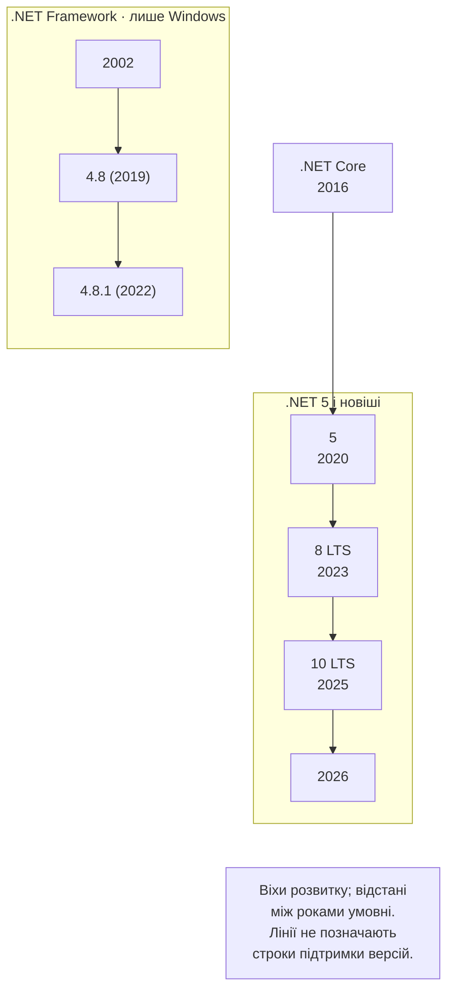
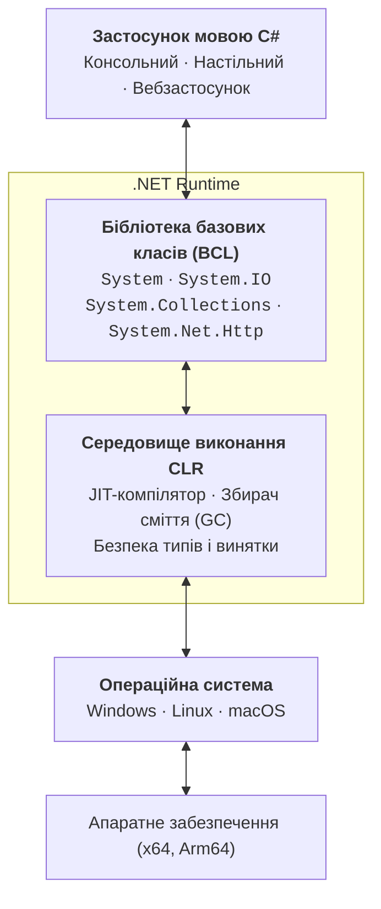
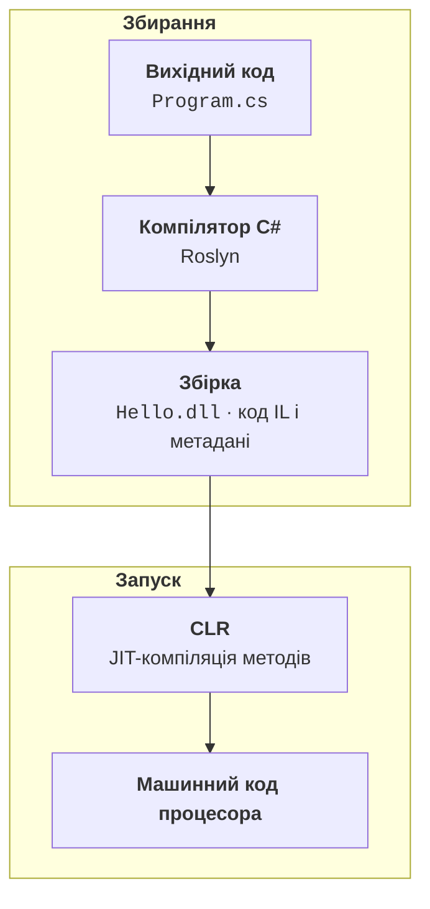
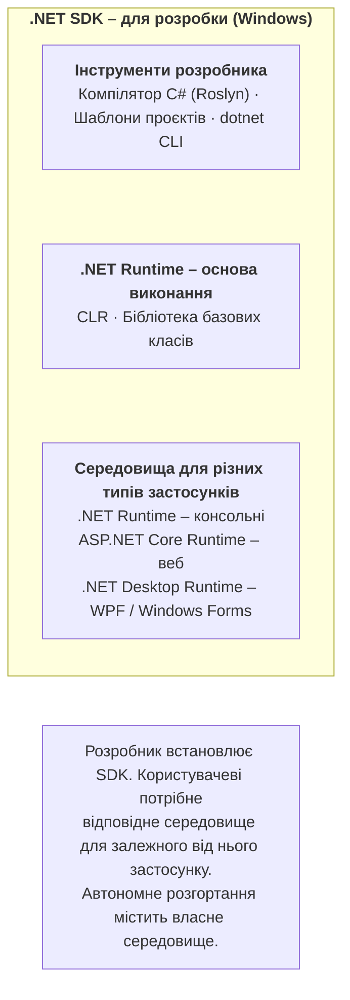

# Мова C# і платформа .NET

## Мова C# і платформа .NET

**.NET** (<https://dotnet.microsoft.com>) – безкоштовна платформа розробки з відкритим кодом від компанії Microsoft. На ній створюють консольні та настільні застосунки, вебсайти й вебсервіси, мобільні застосунки, ігри та хмарні сервіси. Застосунки .NET виконуються в Windows, Linux і macOS, а також на мобільних пристроях Android та iOS.

Платформа .NET – це не лише мова програмування. До неї входять:

- **мови програмування** – C#, F# і Visual Basic;
- **середовище виконання** – програма, яка запускає та контролює роботу застосунку;
- **бібліотеки** – тисячі готових класів для роботи з текстом, файлами, мережею, базами даних;
- **інструменти** – компілятор, інструмент командного рядка `dotnet`, менеджер пакетів NuGet.

**C#** (вимовляється «сі-шарп») – основна мова платформи .NET. Її автор – Андерс Гейлсберг, який раніше створив Turbo Pascal і Delphi. Мову представили у 2000 році, а перша версія вийшла у 2002 році разом із .NET Framework 1.0. C# – сучасна **об’єктно-орієнтована** мова зі **строгою статичною типізацією**: тип кожної змінної відомий під час компіляції, а весь код належить до певного типу – класу, структури, запису чи інтерфейсу. Синтаксис C# схожий на C++ і Java, тому знання C# полегшує вивчення інших мов. Офіційна документація мови розміщена на сайті <https://learn.microsoft.com/dotnet/csharp/>.

Історію платформи можна поділити на три етапи (рис. 1.1):

- **.NET Framework** (з 2002 року) – платформа лише для Windows; версія 4.8.1 випущена у 2022 році, входить до складу Windows і отримує виправлення, але нові можливості до неї не додаються;
- **.NET Core** (2016–2020) – нова кросплатформна реалізація з відкритим кодом для Windows, Linux і macOS;
- **.NET 5 і новіші** (з 2020 року) – єдина платформа, яка продовжує .NET Core. У назві вже немає слова «Core», а номер 4 пропустили, щоб не плутати з .NET Framework 4.x.



Рис. 1.1. Етапи розвитку платформи .NET {.caption}

Нова версія .NET виходить щороку в листопаді разом із новою версією мови C#. Версії бувають двох типів: **LTS** (*Long Term Support*) – тривала підтримка протягом трьох років, і **STS** (*Standard Term Support*) – стандартна підтримка протягом двох років. LTS-версії мають парні номери (.NET 8, .NET 10), STS-версії – непарні. Для навчання та реальних проєктів зазвичай обирають актуальну LTS-версію. Версії, що підтримуються станом на вересень 2026 року, наведено в табл. 1.1.

Таблиця 1.1. Версії .NET, що підтримуються {.caption}

| **Версія** | **Мова** | **Тип** | **Вихід** | **Кінець підтримки** |
| --- | --- | --- | --- | --- |
| .NET 8 | C# 12 | LTS | листопад 2023 | 10 листопада 2026 року |
| .NET 9 | C# 13 | STS | листопад 2024 | 10 листопада 2026 року |
| .NET 10 | C# 14 | LTS | листопад 2025 | 14 листопада 2028 року |

У курсі використовується **.NET 10** і **C# 14**. Наступна версія, .NET 11 (STS), очікується в листопаді 2026 року. Актуальні дати підтримки публікуються на сторінці <https://dotnet.microsoft.com/platform/support/policy/dotnet-core>, а нові можливості .NET 10 описано в документації <https://learn.microsoft.com/dotnet/core/whats-new/dotnet-10/overview>.

Основні напрями застосування .NET:

- консольні утиліти та сервіси;
- настільні застосунки для Windows – Windows Forms і WPF;
- вебзастосунки та вебсервіси – ASP.NET Core, Blazor;
- кросплатформні мобільні й настільні застосунки – .NET MAUI;
- ігри – рушій Unity використовує C# для сценаріїв;
- хмарні сервіси, мікросервіси та застосунки зі штучним інтелектом.

## Підтримувані операційні системи

.NET 10 працює в трьох основних операційних системах (табл. 1.2) на процесорах архітектур **x64** (Intel, AMD), **Arm64** (Apple Silicon, Snapdragon, Raspberry Pi 4 і новіші), а в деяких системах також **x86** та **Arm32**. Кожна версія ОС підтримується, доки її підтримує сам виробник. Повний і актуальний перелік наведено на сторінці <https://github.com/dotnet/core/blob/main/release-notes/10.0/supported-os.md>.

Таблиця 1.2. Операційні системи, які підтримує .NET 10 {.caption}

| **ОС** | **Версії** | **Архітектури** |
| --- | --- | --- |
| Windows | Windows 11 (24H2 і новіші); Windows 10 – лише редакції з довгостроковою підтримкою (Enterprise LTSC, IoT); Windows Server 2012–2025 | x64, x86, Arm64 |
| Linux | Ubuntu 22.04, 24.04, 25.10; Debian 12, 13; Fedora 42–44; Red Hat Enterprise Linux 8–10; CentOS Stream 9, 10; Alpine 3.21–3.23; openSUSE Leap 16.0; SUSE Linux Enterprise 15.7, 16.0 | x64, Arm64, Arm32 |
| macOS | macOS 14 Sonoma, 15 Sequoia, 26 Tahoe | x64, Arm64 |
| Android, iOS | застосунки .NET MAUI: Android 14–16, iOS 18, 26 | Arm64, x64 |

Застосунок, створений в одній ОС, можна запускати в іншій, якщо там встановлене середовище виконання .NET. Проте середовища розробки підтримують не всі системи (табл. 1.3).

Таблиця 1.3. Середовища розробки мовою C# {.caption}

| **Середовище** | **ОС** | **Ліцензія для студентів** |
| --- | --- | --- |
| Visual Studio 2026 | Windows 11, Windows Server | редакція Community – безкоштовно |
| Visual Studio Code + C# Dev Kit | Windows, Linux, macOS | безкоштовно для навчання |
| JetBrains Rider | Windows, Linux, macOS | безкоштовно для некомерційного використання |

## Архітектура платформи .NET

Щоб зрозуміти, як виконується програма, розглянемо основні поняття платформи .NET:

- **CLR** (*Common Language Runtime*) – загальномовне середовище виконання, яке завантажує програму, компілює її проміжний код у машинний, керує пам’яттю, обробляє винятки та забезпечує безпеку типів;
- **IL** (*Intermediate Language*, CIL) – проміжна мова, у яку компілятор перетворює вихідний код C#;
- **JIT-компіляція** (*Just-In-Time*) – перетворення методів із IL у машинний код безпосередньо перед їх першим виконанням;
- **BCL** (*Base Class Library*) – бібліотека базових класів: робота з рядками, колекціями, файлами, мережею тощо;
- **CTS** і **CLS** – загальна система типів та загальна специфікація мов, завдяки яким код, написаний різними мовами .NET, може взаємодіяти;
- **збірка** (*assembly*) – результат компіляції проєкту: файл `.dll` з IL-кодом і метаданими;
- **NuGet** – менеджер пакетів .NET, через який до проєкту підключають сторонні бібліотеки;
- **збирач сміття** (*garbage collector*) – механізм CLR, який автоматично звільняє пам’ять від об’єктів, що більше не використовуються.

Ці компоненти утворюють шари (рис. 1.2): код застосунку звертається до бібліотеки базових класів, вона працює поверх середовища виконання CLR, а CLR – поверх операційної системи. Завдяки цьому той самий код C# працює в різних ОС: відмінності між ними приховують BCL і CLR.



Рис. 1.2. Архітектура платформи .NET {.caption}

Програма мовою C# виконується у два етапи (рис. 1.3). Спочатку компілятор C# (Roslyn) перетворює вихідні файли `.cs` на збірку з кодом проміжною мовою IL. Під час запуску CLR завантажує збірку, а JIT-компілятор перетворює методи на машинний код процесора.



Рис. 1.3. Етапи компіляції та виконання програми .NET {.caption}

Такий підхід має кілька переваг:

- **переносність** – одна збірка з IL-кодом виконується на різних процесорах і операційних системах, де встановлене середовище .NET;
- **взаємодія мов** – C#, F# і Visual Basic компілюються в той самий IL і використовують спільну систему типів CTS, тому бібліотеку, написану однією мовою, можна використовувати в іншій;
- **безпека** – CLR перевіряє коректність типів, контролює межі масивів і не дозволяє звертатися до довільних ділянок пам’яті;
- **оптимізація під конкретну машину** – JIT-компілятор генерує код з урахуванням процесора, на якому виконується програма.

JIT-компіляція методу відбувається під час його першого виклику: згенерований машинний код зберігається в пам’яті й використовується під час наступних викликів. Для прискорення запуску .NET підтримує також попередню компіляцію: **ReadyToRun** і **Native AOT** (*Ahead-Of-Time*), коли застосунок одразу компілюється в машинний код для певної ОС і процесора.

Об’єкти створюються в керованій купі, а збирач сміття періодично знаходить об’єкти, на які більше немає посилань, і звільняє пам’ять. Тому програмісту C#, на відміну від програміста C++, не потрібно явно звільняти пам’ять.

Типи бібліотеки базових класів згруповано в **простори імен**: `System`, `System.IO`, `System.Collections.Generic`, `System.Net.Http` та інші. Крім IL-коду, збірка містить **метадані** (опис усіх типів і їхніх членів) та маніфест із версією збірки та переліком залежностей.

## Пакети .NET SDK і .NET Runtime

Microsoft поширює .NET у двох варіантах (рис. 1.4):

- **.NET Runtime** – середовище виконання: CLR і бібліотеки. Його достатньо, щоб **запускати** готові застосунки. Існує три варіанти: **.NET Runtime** (консольні застосунки), **ASP.NET Core Runtime** (вебзастосунки) і **.NET Desktop Runtime** (настільні застосунки Windows);
- **.NET SDK** (*Software Development Kit*) – набір для **розробки**: середовища виконання, компілятор C#, шаблони проєктів та інструмент командного рядка `dotnet`.

Розробнику потрібен .NET SDK: разом із ним встановлюються й середовища виконання. На одному комп’ютері можуть одночасно працювати кілька версій SDK і Runtime, наприклад .NET 8 і .NET 10: кожен проєкт використовує ту версію, яку вказано в його файлі.



Рис. 1.4. Склад пакетів .NET SDK і .NET Runtime {.caption}

Номер версії SDK складається з трьох частин, наприклад **10.0.401**: 10.0 – версія платформи, 4 – випуск SDK (нові можливості інструментів), 01 – номер виправлення. Середовище виконання має власний номер, наприклад **10.0.12**. Встановлені версії показують команди:

```
dotnet --info            # усі відомості про SDK, середовища та ОС
dotnet --version         # версія SDK, яка використовується
dotnet --list-sdks       # усі встановлені SDK
dotnet --list-runtimes   # усі встановлені середовища виконання
```
