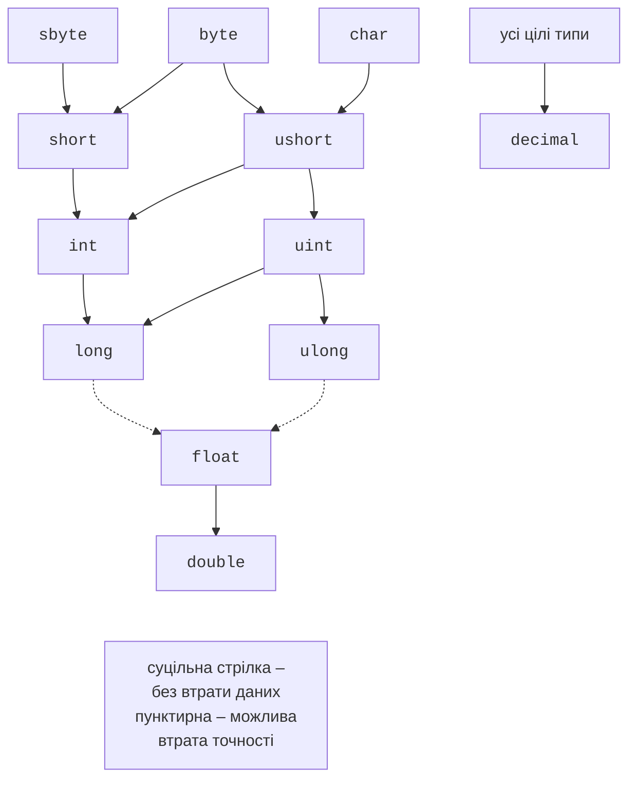
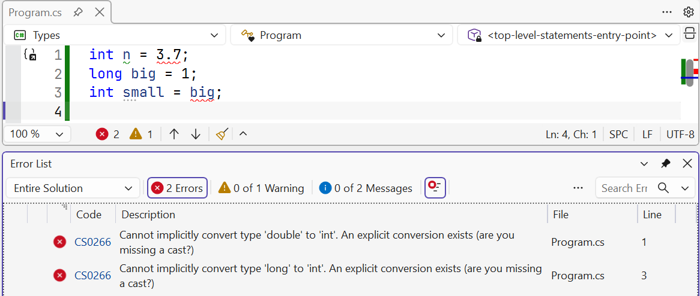
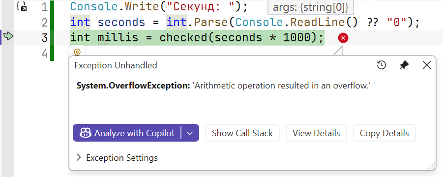

# Перетворення та арифметика

## Перетворення типів

Значення одного типу часто потрібно використати як значення іншого: додати `int` до `double`, записати дробовий результат у ціле, отримати число з рядка. C# має кілька способів перетворення (<https://learn.microsoft.com/dotnet/csharp/language-reference/builtin-types/numeric-conversions>).

### Неявні перетворення

**Неявне перетворення** (*implicit conversion*) виконується автоматично, якщо воно безпечне: значення вихідного типу завжди вміщується в цільовий тип (рис. 2.7). Наприклад, `int` перетворюється на `long` або `double`, а `char` – на `int`:

```cs
int count = 3;
long total = count;          // int → long
double average = count;      // int → double
int code = 'A';              // char → int, 65
```

Перетворення з `long` у `float` чи `double` також неявне, але може втратити точність: великі цілі числа мають більше значущих цифр, ніж вміщує `float`.



Рис. 2.7. Неявні перетворення числових типів {.caption}

### Явні перетворення (приведення типів)

Якщо перетворення може втратити дані, компілятор вимагає **явного перетворення** (*explicit conversion*, *cast*): тип записують у дужках перед значенням. Без нього виникає помилка CS0266 (рис. 2.8):

```cs
double price = 3.99;
int n = price;         // CS0266: Cannot implicitly convert type
                       // 'double' to 'int'
int whole = (int)price;           // 3
int negative = (int)-3.99;        // -3
int big = 300;
byte low = (byte)big;             // 44
```



Рис. 2.8. Помилка неявного перетворення CS0266 {.caption}

Приведення дійсного числа до цілого **відкидає дробову частину** (у бік нуля), а не округлює. Під час приведення цілого до меншого цілого типу відкидаються старші біти: 300 = 256 + 44, тому `(byte)300` дорівнює 44. Програма не повідомляє про таку втрату даних, тому перед приведенням перевіряйте діапазон або використовуйте `checked` (див. нижче).

Літерал `12.5` має тип `double`, тому оголошення `decimal price = 12.5;` і `float f = 1.5;` спричиняють помилку CS0664. Потрібен суфікс: `12.5m`, `1.5f`.

### Перетворення рядків і клас `Convert`

Для перетворення рядка на число використовують методи `Parse` і `TryParse`, а для перетворення між різними типами – клас `Convert` (табл. 2.4).

Таблиця 2.4. Перетворення рядків і чисел {.caption}

| **Вираз** | **Результат** |
| --- | --- |
| `int.Parse("42")` | 42 |
| `int.Parse("12,5")` | виняток `FormatException` |
| `int.TryParse("abc", out int x)` | `false`, `x` дорівнює 0, винятку немає |
| `double.Parse("12,5")` | 12,5 (українські налаштування) |
| `double.Parse("12.5")` | `FormatException` (українські налаштування) |
| `double.Parse("12.5", inv)` | 12,5 за будь-яких налаштувань |
| `12.5.ToString("F2", inv)` | `"12.50"` – рядок із крапкою |
| `Convert.ToInt32(3.5)` | 4 – до найближчого парного |
| `Convert.ToInt32(2.5)` | 2 – до найближчого парного |
| `Convert.ToInt32("ff", 16)` | 255 – з рядка в системі числення |
| `Convert.ToString(10, 2)` | `"1010"` – запис у системі числення |

Зверніть увагу на відмінність: `(int)3.5` відкидає дробову частину (3), а `Convert.ToInt32(3.5)` округлює (4). У таблиці `inv` – це `CultureInfo.InvariantCulture`. Методи `Parse` і `ToString` без параметрів використовують **регіональні налаштування** поточного користувача: в Україні десятковий роздільник – кома. Для файлів, аргументів командного рядка й обміну даними між програмами використовують `CultureInfo.InvariantCulture` (простір імен `System.Globalization`), де роздільник – крапка (<https://learn.microsoft.com/dotnet/standard/base-types/parsing-numeric>).

::: tip Порада
Дані, які вводить користувач, завжди перевіряйте методом `TryParse`: метод `Parse` завершує програму винятком, якщо користувач помилився під час введення.
:::

## Арифметичні операції

**Вираз** (*expression*) – поєднання значень, змінних, викликів методів та **операцій** (*operators*), яке обчислюється до одного значення. Арифметичні операції наведено в табл. 2.5 (<https://learn.microsoft.com/dotnet/csharp/language-reference/operators/arithmetic-operators>).

Таблиця 2.5. Арифметичні операції {.caption}

| **Операція** | **Назва** | **Приклад** | **Результат** |
| --- | --- | --- | --- |
| `+` | додавання | `7 + 2` | 9 |
| `-` | віднімання | `7 - 2` | 5 |
| `*` | множення | `7 * 2` | 14 |
| `/` | ділення цілих чисел | `7 / 2` | 3 |
| `/` | ділення дійсних чисел | `7.0 / 2` | 3,5 |
| `%` | остача від ділення | `7 % 3` | 1 |
| `++`, `--` | інкремент, декремент | `x++` | `x` + 1 |
| `-x` | унарний мінус | `-(2 + 3)` | −5 |

### Цілочисельне ділення та остача

Якщо обидва операнди цілі, операція `/` виконує **цілочисельне ділення**: дробова частина відкидається (у бік нуля). Щоб отримати дробовий результат, хоча б один операнд має бути дійсним:

```cs
int total = 7, parts = 2;
Console.WriteLine(total / parts);             // 3
Console.WriteLine(-total / parts);            // -3
Console.WriteLine((double)total / parts);     // 3,5
Console.WriteLine((double)(total / parts));   // 3
Console.WriteLine(total / parts * 2.0);       // 6
```

У четвертому рядку спочатку виконується цілочисельне ділення (3), а вже потім результат перетворюється на `double`. В останньому рядку операції виконуються зліва направо: `7 / 2` – це 3, і лише потім множення на `2.0`.

Операція `%` повертає **остачу** від ділення; знак остачі збігається зі знаком діленого: `7 % 3` дорівнює 1, `-7 % 3` – −1. Остачу використовують, щоб перевірити подільність (`n % 2 == 0` – число парне), отримати останню цифру (`n % 10`) або розкласти величину на одиниці: 125 хвилин – це `125 / 60` годин і `125 % 60` хвилин.

### Інкремент і декремент

Операція `++` збільшує змінну на 1, `--` – зменшує. У **префіксній** формі (`++x`) результатом виразу є нове значення, у **постфіксній** (`x++`) – старе:

```cs
int x = 5;
int y = x++;     // y = 5, x = 6: спочатку значення, потім збільшення
int z = ++x;     // z = 7, x = 7: спочатку збільшення, потім значення
```

Якщо інкремент записано окремим оператором (`count++;`), обидві форми рівноцінні. Не використовуйте кілька інкрементів однієї змінної в одному виразі: такий код важко читати.

### Складене присвоювання

Запис `x += 5` означає `x = x + 5`; аналогічно працюють `-=`, `*=`, `/=`, `%=`. Складене присвоювання ще й неявно приводить результат до типу змінної:

```cs
byte level = 250;
level += 10;           // компілюється, level = 4 (переповнення)
level = level + 10;    // CS0266: результат byte + int має тип int
```

Арифметичні операції над `byte`, `sbyte`, `short` і `ushort` виконуються в типі `int`, тому сума двох `byte` – це `int`.

### Ділення на нуль

Результат ділення на нуль залежить від типу:

- цілі типи і `decimal` – виняток `DivideByZeroException` (*Attempted to divide by zero*);
- `float` і `double` – нескінченність (`∞`, `-∞`) або `NaN`, без винятку.

## Переповнення цілих чисел

Якщо результат цілочисельної операції не вміщується в тип, виникає **переповнення** (*overflow*). За замовчуванням C# не перевіряє переповнення: старші біти результату відкидаються, і значення «перескакує» на інший кінець діапазону:

```cs
int max = int.MaxValue;
Console.WriteLine(max + 1);       // -2147483648
```

Така поведінка називається **неперевіреним** (*unchecked*) контекстом. Вона швидка, але приховує помилки: сума, обчислена з переповненням, виглядає як звичайне число. Щоб переповнення спричиняло виняток `OverflowException`, використовують **перевірений** контекст – операцію або блок `checked` (рис. 2.9):

```cs
Console.Write("Секунд: ");
int seconds = int.Parse(Console.ReadLine() ?? "0");
int millis = checked(seconds * 1000);   // OverflowException

checked
{
    int total = seconds * 1000 + 500;   // перевіряються всі операції
}
```



Рис. 2.9. Виняток переповнення в перевіреному контексті {.caption}

Перевірку можна увімкнути для всього проєкту властивістю у файлі `.csproj`; тоді окремі місця, де переповнення допустиме, позначають блоком `unchecked`:

```xml
<PropertyGroup>
  <CheckForOverflowUnderflow>true</CheckForOverflowUnderflow>
</PropertyGroup>
```

Вирази з констант компілятор перевіряє завжди: `int x = int.MaxValue + 1;` спричиняє помилку CS0220. Приведення `(int)` дійсного числа, що не вміщується в `int`, дає найближчу межу діапазону: якщо `double huge = 1e10;`, то `(int)huge` дорівнює 2 147 483 647 (<https://learn.microsoft.com/dotnet/csharp/language-reference/statements/checked-and-unchecked>).

Дійсні типи не спричиняють винятку переповнення: `double.MaxValue * 2` дорівнює нескінченності. Тип `decimal`, навпаки, завжди перевіряє переповнення та спричиняє `OverflowException`.
