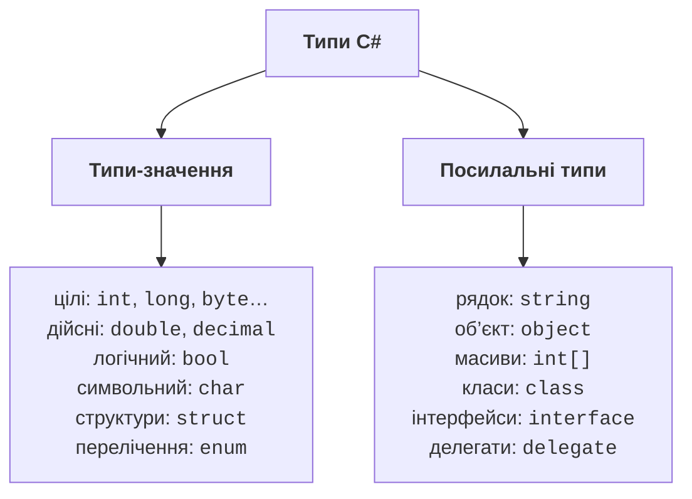
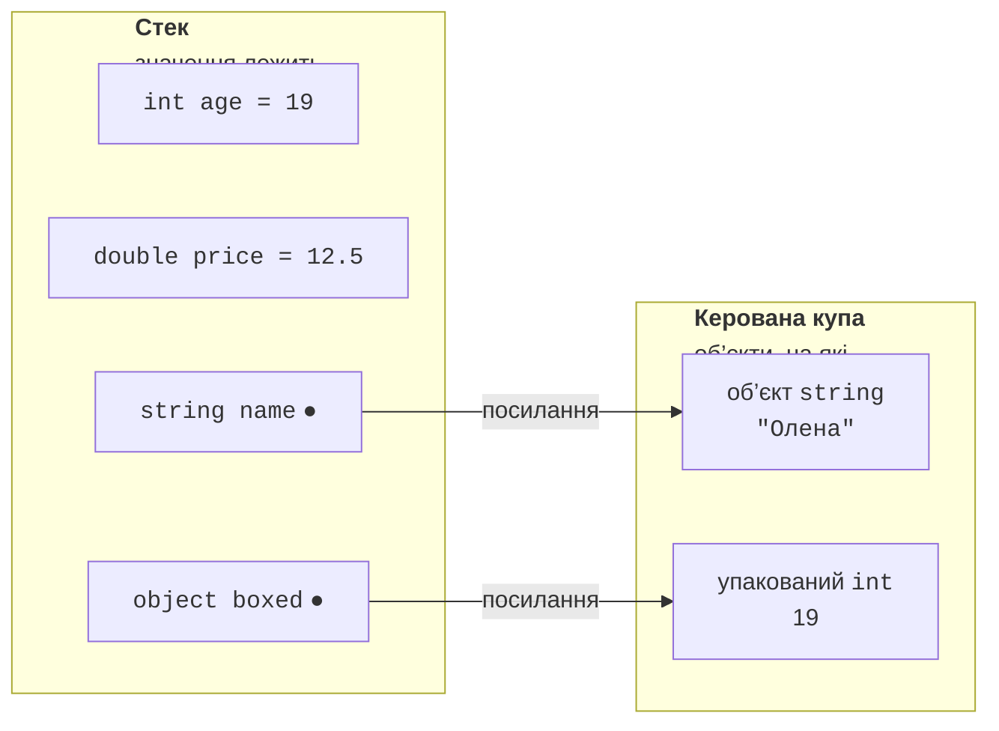
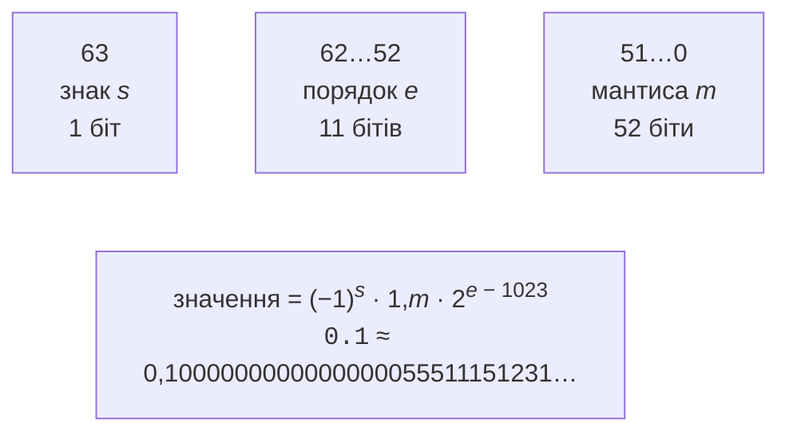

# Система типів і числові типи

## Система типів C#

Програма обробляє **дані**: числа, текст, дати, логічні значення. Кожне значення в C# має **тип** (*type*), який визначає:

- скільки пам’яті займає значення;
- які значення допустимі (діапазон);
- які операції можна виконувати над значенням.

C# – мова зі **строгою статичною типізацією**: тип кожної змінної відомий під час компіляції і не змінюється. Компілятор перевіряє, чи відповідають типи операціям, тому помилку на кшталт «помножити рядок на логічне значення» буде знайдено ще до запуску програми.

Найуживаніші типи вбудовані в мову й мають **ключові слова**: `int`, `double`, `bool`, `string` тощо. Кожне ключове слово є псевдонімом типу платформи .NET із простору імен `System`: `int` – це `System.Int32`, `string` – `System.String`. Записи `int x` і `System.Int32 x` рівноцінні, але прийнято використовувати ключові слова. Усі типи C# прямо або опосередковано походять від типу `object` (`System.Object`). Перелік вбудованих типів наведено в документації <https://learn.microsoft.com/dotnet/csharp/language-reference/builtin-types/built-in-types>.

Типи C# поділяються на дві великі групи (рис. 2.1):

- **типи-значення** (*value types*) – змінна безпосередньо містить значення. До них належать числові типи, `bool`, `char`, структури (`struct`) і перелічення (`enum`);
- **посилальні типи** (*reference types*) – змінна містить **посилання** на об’єкт, розміщений в іншому місці пам’яті. Це `string`, `object`, масиви, класи, інтерфейси та делегати.



Рис. 2.1. Класифікація типів C# {.caption}

### Стек і керована купа

Спрощено пам’ять програми можна уявити як дві області (рис. 2.2):

- **стек** (*stack*) – область для локальних змінних методу. Пам’ять у стеку виділяється та звільняється дуже швидко: коли метод завершується, його змінні зникають;
- **керована купа** (*managed heap*) – область для об’єктів. Об’єкт живе, доки на нього є хоча б одне посилання; непотрібні об’єкти видаляє збирач сміття (<https://learn.microsoft.com/dotnet/standard/garbage-collection/fundamentals>).

Локальна змінна типу-значення зберігає значення прямо в стеку. Локальна змінна посилального типу зберігає в стеку лише посилання, а сам об’єкт розміщується в купі.



Рис. 2.2. Розміщення змінних у стеку та керованій купі {.caption}

Різниця між двома групами типів найпомітніша під час присвоювання. Присвоювання типу-значення **копіює значення**, тому змінні далі незалежні. Присвоювання посилального типу **копіює посилання**, і обидві змінні вказують на той самий об’єкт. Масиви детально розглядаються в темі 4, але вже тут вони добре показують цю різницю:

```cs
int a = 1;
int b = a;                   // копія значення
b = 2;
Console.WriteLine(a);        // 1 – змінна a не змінилася

int[] first = { 1, 2 };
int[] second = first;        // копія посилання
second[0] = 9;
Console.WriteLine(first[0]); // 9 – це той самий масив
```

### Упакування та розпакування

Значення будь-якого типу можна присвоїти змінній типу `object`. Якщо це тип-значення, виконується **упакування** (*boxing*): у купі створюється об’єкт, у який копіюється значення. Зворотна дія – **розпакування** (*unboxing*) – записується як явне приведення і можлива лише до того самого типу:

```cs
int n = 42;
object boxed = n;              // упакування: копія 42 у купі
n = 43;
Console.WriteLine(boxed);      // 42
int m = (int)boxed;            // розпакування
long l = (long)boxed;          // InvalidCastException
```

Останній рядок спричиняє виняток `InvalidCastException`, бо в об’єкті лежить `int`, а не `long`. Упакування відбувається непомітно, наприклад під час передавання числа в параметр типу `object`, і потребує додаткової пам’яті, тому в коді, що виконується дуже часто, його уникають (<https://learn.microsoft.com/dotnet/csharp/programming-guide/types/boxing-and-unboxing>).

## Цілі типи

Цілі типи (*integral numeric types*) зберігають числа без дробової частини. Вони відрізняються розміром і наявністю знака (табл. 2.1). Типи без знака (`byte`, `ushort`, `uint`, `ulong`) не зберігають від’ємних чисел, зате їх максимальне значення вдвічі більше.

Таблиця 2.1. Цілі типи C# {.caption}

| **Тип** | **Тип .NET** | **Байтів** | **Діапазон** |
| --- | --- | --- | --- |
| `sbyte` | `SByte` | 1 | −128…127 |
| `byte` | `Byte` | 1 | 0…255 |
| `short` | `Int16` | 2 | −32 768…32 767 |
| `ushort` | `UInt16` | 2 | 0…65 535 |
| `int` | `Int32` | 4 | −2 147 483 648…2 147 483 647 |
| `uint` | `UInt32` | 4 | 0…4 294 967 295 |
| `long` | `Int64` | 8 | ≈ ±9,22 · 10<sup>18</sup> |
| `ulong` | `UInt64` | 8 | 0…≈ 1,84 · 10<sup>19</sup> |
| `nint`, `nuint` | `IntPtr`, `UIntPtr` | 4 або 8 | залежить від розрядності процесу |

Основний цілий тип – `int`: його використовують, якщо немає причин обрати інший. Тип `long` потрібен для великих значень (кількість мілісекунд, розмір файлу в байтах), `byte` – для байтів даних (компоненти кольору, вміст файлу). Точні межі кожного типу доступні через константи `MinValue` і `MaxValue`: `int.MaxValue` – це 2 147 483 647. Документація: <https://learn.microsoft.com/dotnet/csharp/language-reference/builtin-types/integral-numeric-types>.

**Цілочисельні літерали** можна записувати в десятковій, шістнадцятковій (префікс `0x`) і двійковій (префікс `0b`) системах. Для зручності читання цифри розділяють символом `_`:

```cs
int million = 1_000_000;
int mask = 0xFF;             // 255
int flags = 0b1010_0001;     // 161
long population = 8_100_000_000L;
uint big = 4_000_000_000U;
```

Тип літерала визначається його значенням: це перший із типів `int`, `uint`, `long`, `ulong`, у який вміщується значення. Тому `3_000_000_000` має тип `uint`. Суфікс `L` робить літерал типом `long`, `U` – `uint`, `UL` – `ulong`. Суфікс `l` (мала літера) допустимий, але його легко сплутати з одиницею, тому пишуть велику `L`.

## Дійсні типи

Для чисел із дробовою частиною в C# є три типи (табл. 2.2). Типи `float` і `double` зберігають числа у **двійковому** форматі з плаваючою комою за стандартом IEEE 754, тип `decimal` – у **десятковому** форматі.

Таблиця 2.2. Дійсні типи C# {.caption}

| **Тип** | **Тип .NET** | **Байтів** | **Приблизний діапазон** | **Цифр** |
| --- | --- | --- | --- | --- |
| `float` | `Single` | 4 | ±1,5 · 10<sup>−45</sup>…±3,4 · 10<sup>38</sup> | 6–9 |
| `double` | `Double` | 8 | ±5,0 · 10<sup>−324</sup>…±1,7 · 10<sup>308</sup> | 15–17 |
| `decimal` | `Decimal` | 16 | ±1,0 · 10<sup>−28</sup>…±7,9 · 10<sup>28</sup> | 28–29 |

Літерал із крапкою або експонентою (`12.5`, `1.5e3`) має тип `double`. Для `float` додають суфікс `f` (`12.5f`), для `decimal` – суфікс `m` (`12.5m`). У коді C# десятковий роздільник завжди крапка, незалежно від регіональних налаштувань.

### Похибка двійкових дробів

Число `double` займає 64 біти: знак, порядок і мантиса (рис. 2.3). Більшість десяткових дробів, наприклад 0,1, не можна точно записати у двійковій системі, як 1/3 не можна точно записати десятковим дробом. Тому `double` зберігає найближче двійкове значення, і під час обчислень з’являються невеликі похибки:



Рис. 2.3. Будова числа `double` за стандартом IEEE 754 {.caption}

```cs
double a = 0.1 + 0.2;
Console.WriteLine(a);             // 0,30000000000000004
Console.WriteLine(a == 0.3);      // False
decimal m = 0.1m + 0.2m;
Console.WriteLine(m);             // 0,3
```

Похибку добре видно у вікні *Watch* налагоджувача Visual Studio (рис. 2.4). Налагоджувач показує значення з крапкою, бо не залежить від регіональних налаштувань.


Рис. 2.4. Похибка дійсних чисел у вікні *Watch* {.caption}

Висновки для практики:

- **не порівнюйте** числа `double` операцією `==`; перевіряйте, що різниця менша за допуск: `Math.Abs(a - 0.3) < 1e-9`;
- для **грошових сум** використовуйте `decimal`: він точно зберігає десяткові дроби до 28 знаків;
- для **наукових і інженерних** обчислень (фізика, геометрія, графіка) використовуйте `double`: він набагато швидший за `decimal` і має більший діапазон; `float` обирають, коли потрібно заощадити пам’ять (наприклад, у графіці).

### Нескінченність і NaN

Цілочисельне ділення на нуль спричиняє виняток `DivideByZeroException`. Дійсні типи `float` і `double` натомість мають спеціальні значення: **нескінченність** і **NaN** (*Not a Number* – «не число»):

```cs
double zero = 0;
Console.WriteLine(1 / zero);        // ∞
Console.WriteLine(-1 / zero);       // -∞
Console.WriteLine(zero / zero);     // NaN
Console.WriteLine(double.NaN == double.NaN);    // False
Console.WriteLine(double.IsNaN(zero / zero));   // True
```

Значення NaN не дорівнює жодному числу, навіть самому собі, тому перевіряють його лише методом `double.IsNaN`. Для нескінченності є методи `double.IsInfinity`, `double.IsPositiveInfinity`. Тип `decimal` таких значень не має: ділення на нуль і вихід за діапазон спричиняють винятки. Документація: <https://learn.microsoft.com/dotnet/csharp/language-reference/builtin-types/floating-point-numeric-types>.
