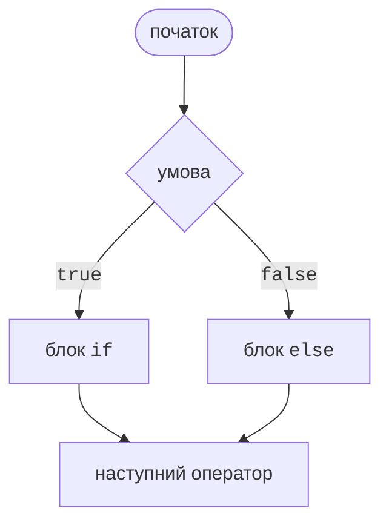

# Блоки та умовний оператор

## Блок коду та область видимості

**Блок** (*block*) – послідовність операторів у фігурних дужках `{ }`. Блок можна записати там, де мова дозволяє один оператор, тому саме блоки утворюють тіло розгалуження або циклу.

Змінна, оголошена всередині блоку, **видима** лише в ньому: від місця оголошення до закривальної дужки. Після виходу з блоку ім’я недоступне (помилка CS0103), а у вкладеному блоці не можна оголосити змінну з тим самим ім’ям, що й у зовнішньому (помилка CS0136):

```cs
int total = 0;
{
    int bonus = 5;        // видима лише в цьому блоці
    total += bonus;
}
Console.WriteLine(total); // 5
// Console.WriteLine(bonus);  – помилка CS0103
```

У C# прийнято стиль **Allman**: кожна фігурна дужка стоїть на окремому рядку, а вміст блоку зсунуто на 4 пробіли. Visual Studio форматує код автоматично (**Ctrl+K, Ctrl+D**). Фігурні дужки ставлять навіть навколо одного оператора: це запобігає помилкам під час додавання нових рядків (<https://learn.microsoft.com/dotnet/csharp/fundamentals/coding-style/coding-conventions>).

## Умовний оператор `if`

Оператор `if` виконує блок, якщо **умова** – вираз типу `bool` – дорівнює `true`. Необов’язкова частина `else` виконується, якщо умова дорівнює `false` (рис. 3.1):

```cs
int temperature = -3;

if (temperature < 0)
{
    Console.WriteLine("Мороз, одягніться тепліше.");
}
else
{
    Console.WriteLine("Температура вище нуля.");
}
```



Рис. 3.1. Блок-схема розгалуження `if`/`else` {.caption}

Умова в C# завжди має тип `bool`: запис `if (count)` для цілого `count` спричиняє помилку CS0029, а присвоювання `if (x = 5)` замість порівняння `if (x == 5)` компілятор теж не пропустить. Складні умови будують логічними операціями `&&`, `||` і `!` (тема 2) (<https://learn.microsoft.com/dotnet/csharp/language-reference/statements/selection-statements>).

### Ланцюжок `else if` і вкладені умови

Якщо варіантів більше двох, умови перевіряють ланцюжком `else if`. Умови перевіряються по черзі, і виконується лише блок **першої** істинної умови, тому порядок умов важливий:

```cs
double bmi = 23.4;
string category;

if (bmi < 18.5)
{
    category = "недостатня маса";
}
else if (bmi < 25)
{
    category = "норма";
}
else if (bmi < 30)
{
    category = "надмірна маса";
}
else
{
    category = "ожиріння";
}
Console.WriteLine(category);   // норма
```

Друга умова `bmi < 25` не перевіряє `bmi >= 18.5`: якби індекс був меншим, спрацювала б перша умова. Компілятор також бачить, що змінній `category` значення присвоєно в кожній гілці; якщо прибрати останню частину `else`, використання змінної спричинить помилку CS0165.

Оператор `if` можна вкладати в інший `if`. Глибоке вкладення важко читати, тому часто використовують **ранній вихід**: спочатку перевіряють помилкові випадки й завершують роботу оператором `return`, а основна логіка залишається без відступів:

```cs
Console.Write("Вік: ");
if (!int.TryParse(Console.ReadLine(), out int age))
{
    Console.WriteLine("Потрібне ціле число.");
    return;
}
if (age < 0 || age > 150)
{
    Console.WriteLine("Некоректний вік.");
    return;
}
Console.WriteLine(age >= 18 ? "Повнолітній" : "Неповнолітній");
```

::: tip Типова помилка
Крапка з комою після умови `if (x > 0);` утворює **порожній оператор**: блок у фігурних дужках після неї виконується завжди. Компілятор попереджає про це повідомленням CS0642 *Possible mistaken empty statement*.
:::

## Тернарна операція `?:`

**Умовна (тернарна) операція** `умова ? вираз1 : вираз2` повертає `вираз1`, якщо умова істинна, інакше – `вираз2`. На відміну від `if`, це **вираз**: він має значення, яке можна присвоїти, передати в метод або вставити в інтерпольований рядок:

```cs
int n = 7;
string parity = n % 2 == 0 ? "парне" : "непарне";
int abs = n >= 0 ? n : -n;
Console.WriteLine($"{n} – {parity}, модуль {abs}");
Console.WriteLine($"Знайдено {n} файл{(n == 1 ? "" : "ів")}");
```

Обидва вирази мають бути одного типу або зводитися до спільного типу. В інтерпольованому рядку тернарну операцію беруть у дужки, бо двокрапка там відокремлює формат. Тернарна операція зручна для простого вибору з двох значень; вкладені `?:` читаються погано – у таких випадках краще використати `if` або вираз `switch`.
