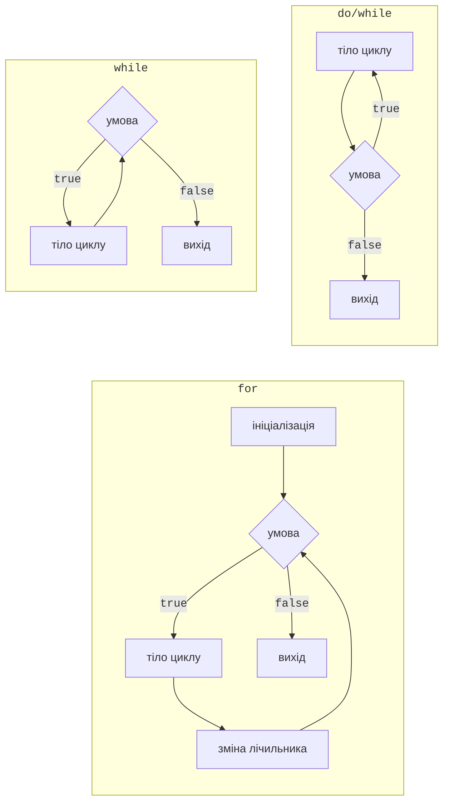
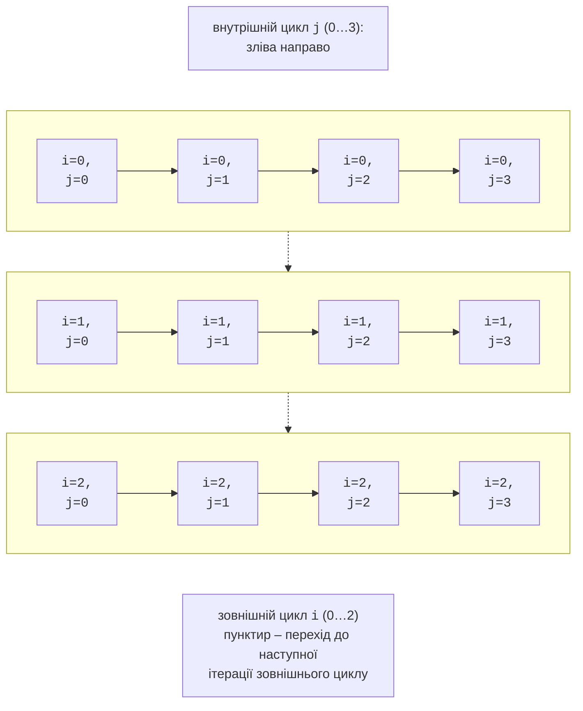

# Цикли

## Цикли `while` і `do`/`while`

**Цикл** (*loop*) повторює **тіло** – оператор або блок – доки виконується умова. Одне виконання тіла називається **ітерацією**. У C# є чотири цикли: `while`, `do`/`while`, `for` і `foreach`. Порівняння перших трьох показано на рис. 3.5 (<https://learn.microsoft.com/dotnet/csharp/language-reference/statements/iteration-statements>).



Рис. 3.5. Блок-схеми циклів `while`, `do`/`while` і `for` {.caption}

### Цикл `while`

Цикл `while` (цикл із **передумовою**) перевіряє умову **перед** кожною ітерацією. Якщо умова з самого початку хибна, тіло не виконається жодного разу. Цикл `while` обирають, коли кількість повторень наперед невідома, наприклад під час зчитування даних до порожнього рядка:

```cs
int number = 1_234_567;
int digits = 0;
int sum = 0;

while (number > 0)
{
    sum += number % 10;   // остання цифра
    number /= 10;         // відкинути останню цифру
    digits++;
}
Console.WriteLine($"Цифр: {digits}, сума цифр: {sum}");
```

Результат: `Цифр: 7, сума цифр: 28`. Тіло циклу **мусить змінювати** щось, від чого залежить умова, інакше цикл стане **нескінченним**. Свідомо нескінченний цикл записують як `while (true)` і виходять з нього оператором `break` або `return` (див. далі). Програму, що зациклилася, зупиняють клавішами **Ctrl+C** у консолі або **Shift+F5** у Visual Studio.

### Цикл `do`/`while`

Цикл `do`/`while` (цикл із **післяумовою**) спочатку виконує тіло, а потім перевіряє умову, тому тіло виконується **щонайменше один раз**. Такий цикл природний для меню та повторного запиту даних: спочатку потрібно запитати, а вже потім перевірити відповідь. Після умови обов’язкова крапка з комою:

```cs
int level;
do
{
    Console.Write("Рівень складності (1–3): ");
}
while (!int.TryParse(Console.ReadLine(), out level)
       || level is < 1 or > 3);

Console.WriteLine($"Обрано рівень {level}");
```

## Цикл `for`

Цикл `for` зручний, коли відома кількість повторень або є лічильник. У заголовку через крапку з комою записують три частини: **ініціалізацію** (виконується один раз), **умову** (перевіряється перед кожною ітерацією) і **ітератор** (виконується після кожної ітерації):

```cs
for (int i = 1; i <= 5; i++)
{
    Console.Write($"{i * i} ");      // 1 4 9 16 25
}
Console.WriteLine();

for (int i = 10; i > 0; i -= 3)
{
    Console.Write($"{i} ");          // 10 7 4 1
}
Console.WriteLine();

for (int left = 0, right = 9; left < right; left++, right--)
{
    Console.Write($"{left}-{right} "); // 0-9 1-8 2-7 3-6 4-5
}
Console.WriteLine();
```

Змінна, оголошена в заголовку `for`, видима лише в циклі. Будь-яку частину заголовка можна пропустити: `for (;;)` означає нескінченний цикл. Кожен цикл `for` можна переписати як `while`, але `for` збирає всю інформацію про лічильник в одному рядку, тому його легше читати.

### Вкладені цикли

Цикл може містити інший цикл. Для кожної ітерації **зовнішнього** циклу **внутрішній** виконується повністю (рис. 3.6). Якщо зовнішній цикл робить *n* ітерацій, а внутрішній – *m*, тіло внутрішнього циклу виконується *n* · *m* разів. Вкладені цикли використовують для таблиць, прямокутних візерунків, перебору пар значень:



Рис. 3.6. Порядок виконання вкладених циклів {.caption}

```cs
for (int row = 1; row <= 4; row++)
{
    for (int col = 1; col <= row; col++)
    {
        Console.Write('*');
    }
    Console.WriteLine();
}
```

Програма виводить трикутник: у першому рядку одна зірочка, у четвертому – чотири. Внутрішній лічильник залежить від зовнішнього (`col <= row`), тому кількість ітерацій внутрішнього циклу збільшується з кожним рядком.

### Покрокове виконання циклу

Щоб зрозуміти, як змінюються змінні в циклі, виконайте його покроково в налагоджувачі: встановіть точку зупинки (**F9**) усередині тіла, запустіть програму клавішею **F5** і натискайте **F10** (*Step Over*). Вікно *Autos* або *Locals* показує поточні значення, а значення, змінені на останньому кроці, виділено червоним (рис. 3.7). Натискання **F5** продовжує виконання до наступного потрапляння на точку зупинки, тобто до наступної ітерації (<https://learn.microsoft.com/visualstudio/debugger/navigating-through-code-with-the-debugger>).


Рис. 3.7. Покрокове виконання циклу `for` у налагоджувачі {.caption}

## Цикл `foreach`

Цикл `foreach` перебирає елементи **колекції**: символи рядка, елементи масиву, аргументи командного рядка. Лічильник не потрібен: на кожній ітерації змінна отримує наступний елемент:

```cs
string text = "Об’єктно-орієнтоване програмування";
int vowels = 0;

foreach (char ch in text)
{
    if ("аеєиіїоуюяАЕЄИІЇОУЮЯ".Contains(ch))
    {
        vowels++;
    }
}
Console.WriteLine($"Голосних: {vowels}");   // Голосних: 14
```

Змінна `foreach` доступна лише для читання: присвоїти їй значення не можна (помилка CS1656). Аргументи командного рядка перебирають так само: `foreach (string arg in args)`. Масиви та колекції детально розглядаються в темах 4 і 13.
