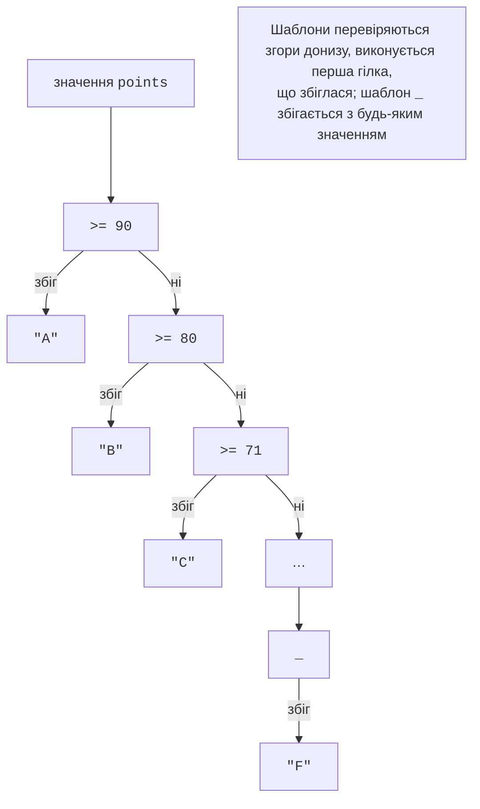

# switch і шаблони

## Оператор `switch`

Оператор `switch` обирає одну з кількох гілок за значенням виразу. Кожна гілка (*switch section*) починається однією або кількома мітками `case` і закінчується оператором, який виходить з неї, найчастіше `break`. Мітка `default` обробляє всі інші значення:

```cs
int day = 6;

switch (day)
{
    case 1:
    case 2:
    case 3:
    case 4:
    case 5:
        Console.WriteLine("Робочий день");
        break;
    case 6:
    case 7:
        Console.WriteLine("Вихідний");
        break;
    default:
        Console.WriteLine("Немає такого дня тижня");
        break;
}
```

Кілька міток поспіль (`case 6:` `case 7:`) ведуть до одного блоку. На відміну від C і C++, у C# виконання **не може «провалитися»** з однієї непорожньої гілки в наступну: якщо забути `break`, компілятор повідомить про помилку CS0163 *Control cannot fall through from one case label to another*. Щоб свідомо перейти до іншої гілки, використовують `goto case 7;`, але такий код важче читати. Гілку можна завершити також операторами `return`, `continue` (у циклі) або `throw`.

Вираз `switch` може мати тип `int`, `char`, `string`, `bool`, перелічення, а з шаблонами (див. далі) – будь-який тип. Для рядків порівняння чутливе до регістру: `"Q"` і `"q"` – різні значення.

## Шаблони

**Зіставлення зі шаблоном** (*pattern matching*) перевіряє, чи має значення певну форму. Шаблони використовують в операції `is`, у мітках `case` і у виразі `switch` (<https://learn.microsoft.com/dotnet/csharp/language-reference/operators/patterns>). Основні шаблони наведено в табл. 3.1.

Таблиця 3.1. Основні шаблони C# {.caption}

| **Шаблон** | **Що перевіряє** | **Приклад** |
| --- | --- | --- |
| константний | рівність константі | `0`, `"q"`, `null` |
| реляційний | порівняння з константою | `< 0`, `>= 90` |
| логічний `and` | обидва шаблони збігаються | `>= 1 and <= 12` |
| логічний `or` | хоча б один шаблон збігається | `6 or 7` |
| логічний `not` | шаблон не збігається | `not null` |
| у дужках | групування шаблонів | `not (< 0 or > 100)` |
| відкидання `_` | будь-яке значення (у виразі `switch`) | `_` |
| оголошення | тип і нова змінна | `int n` |

### Операція `is`

Операція `вираз is шаблон` повертає `true`, якщо значення відповідає шаблону. Разом із логічними шаблонами вона дає короткі й зрозумілі умови, у яких змінна записується лише один раз:

```cs
int month = 7;
char c = 'k';
string? name = null;

bool isSummer = month is 6 or 7 or 8;             // True
bool valid = month is >= 1 and <= 12;             // True
bool isLetter = c is (>= 'a' and <= 'z')
                  or (>= 'A' and <= 'Z');         // True
bool hasName = name is not null;                  // False
Console.WriteLine($"{isSummer} {valid} {isLetter} {hasName}");
```

Запис `month is 6 or 7 or 8` рівнозначний `month == 6 || month == 7 || month == 8`. Шаблон `not null` є рекомендованим способом перевірки на `null`.

### Шаблони в операторі `switch` і умова `when`

У мітці `case` можна записати шаблон, а після нього – додаткову умову `when`. Гілки перевіряються згори донизу, і виконується перша, що збіглася:

```cs
int score = 87;
bool isRetake = true;

switch (score)
{
    case < 0 or > 100:
        Console.WriteLine("Некоректна кількість балів");
        break;
    case >= 50 when isRetake:
        Console.WriteLine("Перескладання зараховано");
        break;
    case >= 50:
        Console.WriteLine("Зараховано");
        break;
    default:
        Console.WriteLine("Не зараховано");
        break;
}
```

## Вираз `switch`

**Вираз** `switch` (*switch expression*) обирає **значення** за шаблоном. Він записується коротше за оператор: значення перед ключовим словом `switch`, гілки `шаблон => результат` через кому, без `case` і `break` (<https://learn.microsoft.com/dotnet/csharp/language-reference/operators/switch-expression>):

```cs
int points = 76;

string ects = points switch
{
    >= 90 => "A",
    >= 80 => "B",
    >= 71 => "C",
    >= 61 => "D",
    >= 50 => "E",
    >= 30 => "FX",
    _ => "F",
};
Console.WriteLine(ects);    // C
```

Гілки перевіряються по черзі (рис. 3.2), тому шаблон `>= 80` не потребує умови `< 90`. Шаблон відкидання `_` збігається з будь-яким значенням і завжди стоїть останнім. Якщо шаблон ніколи не може спрацювати, бо його вже охоплюють попередні гілки, компілятор повідомляє про помилку CS8510.



Рис. 3.2. Порядок перевірки шаблонів у виразі `switch` {.caption}

Оператор `switch`, у кожній гілці якого лише присвоюється значення, Visual Studio пропонує перетворити на вираз: встановіть курсор на слово `switch`, натисніть **Ctrl+.** і оберіть *Convert switch statement to expression* (рис. 3.3).


Рис. 3.3. Перетворення оператора `switch` на вираз `switch` {.caption}

Вираз `switch` має бути **вичерпним** (*exhaustive*): для кожного можливого значення має знайтися гілка. Якщо компілятор знаходить значення без гілки, він видає попередження CS8509 і наводить приклад такого значення (рис. 3.4). Під час виконання таке значення спричинить виняток `SwitchExpressionException`. Тому до числових і рядкових виразів майже завжди додають гілку `_`.


Рис. 3.4. Попередження про невичерпний вираз `switch` {.caption}

Результати гілок мають зводитися до одного типу, а гілки можна групувати логічними шаблонами:

```cs
int month = 4;
int year = 2028;
bool isLeap = (year % 4 == 0 && year % 100 != 0) || year % 400 == 0;

int days = month switch
{
    2 => isLeap ? 29 : 28,
    4 or 6 or 9 or 11 => 30,
    >= 1 and <= 12 => 31,
    _ => 0,
};
Console.WriteLine(days);    // 30
```
