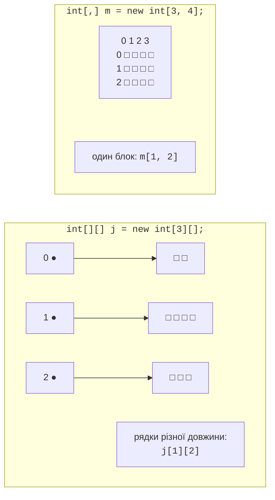
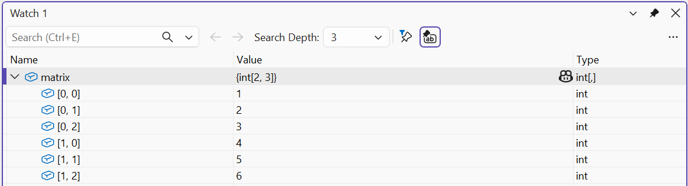

# Клас Array і багатовимірні масиви

## Клас `Array`

Статичний клас `Array` містить методи для роботи з масивами будь-якого типу (табл. 4.1, <https://learn.microsoft.com/dotnet/api/system.array>).

Таблиця 4.1. Основні методи роботи з масивами {.caption}

| **Метод** | **Призначення** |
| --- | --- |
| `Array.Sort(a)` | сортує масив за зростанням (змінює сам масив) |
| `Array.Reverse(a)` | змінює порядок елементів на протилежний |
| `Array.IndexOf(a, x)` | індекс першого елемента, що дорівнює `x`, або −1 |
| `Array.LastIndexOf(a, x)` | індекс останнього такого елемента або −1 |
| `Array.BinarySearch(a, x)` | швидкий пошук у **відсортованому** масиві; від’ємне значення, якщо елемента немає |
| `Array.Fill(a, x)` | заповнює всі елементи значенням `x` |
| `Array.Resize(ref a, n)` | створює новий масив довжини `n` і копіює елементи |
| `Array.Exists(a, x => x < 0)` | чи є елемент, що задовольняє умову |
| `Array.Copy(src, dst, n)` | копіює `n` елементів з одного масиву в інший |
| `a.Contains(x)` | чи містить масив значення `x` |

```cs
int[] data = [42, 7, 19, 7, 88, 3];

Array.Sort(data);
Console.WriteLine(string.Join(" ", data));        // 3 7 7 19 42 88
Console.WriteLine(Array.BinarySearch(data, 42));  // 4
Console.WriteLine(Array.IndexOf(data, 7));        // 1
Console.WriteLine(Array.Exists(data, x => x > 50)); // True

Array.Resize(ref data, 8);                  // додати 2 місця
Console.WriteLine(string.Join(" ", data));  // 3 7 7 19 42 88 0 0
Array.Fill(data, -1);
Console.WriteLine(string.Join(" ", data));  // -1 -1 … -1
```

Метод `Array.Resize` не змінює довжину наявного масиву, а створює новий і записує посилання на нього в змінну (тому параметр позначено `ref`, тема 5). Умову в `Array.Exists` задано **лямбда-виразом** `x => x > 50`: «для елемента `x` перевірити `x > 50`» (детально – тема 14). Якщо кількість елементів заздалегідь невідома й часто змінюється, замість масиву використовують список `List<T>` (тема 13).

## Прямокутні та зубчасті масиви

**Прямокутний** (багатовимірний) масив `int[,]` зберігає таблицю з однаковою кількістю елементів у кожному рядку: матрицю, ігрове поле, розклад. Кількість елементів у вимірі повертає метод `GetLength(n)`, а загальну кількість елементів – `Length`:

```cs
int[,] matrix =
{
    { 1, 2, 3 },
    { 4, 5, 6 },
};
int rows = matrix.GetLength(0);     // 2
int cols = matrix.GetLength(1);     // 3

for (int i = 0; i < rows; i++)
{
    for (int j = 0; j < cols; j++)
    {
        Console.Write($"{matrix[i, j] * 10,4}");
    }
    Console.WriteLine();
}
Console.WriteLine($"Елементів: {matrix.Length}");   // 6
```

**Зубчастий** масив (*jagged array*) `int[][]` – це масив масивів: кожен рядок є окремим одновимірним масивом і може мати власну довжину. Рядки створюють окремо (рис. 4.4):

```cs
int[][] jagged = new int[3][];
jagged[0] = [1, 2];
jagged[1] = [3, 4, 5, 6];
jagged[2] = [7, 8, 9];

for (int i = 0; i < jagged.Length; i++)
{
    Console.WriteLine($"Рядок {i}: {string.Join(" ", jagged[i])}");
}
Console.WriteLine(jagged[1][2]);    // 5
```



Рис. 4.4. Прямокутний і зубчастий масиви {.caption}

Порівняння двох видів масивів:

- прямокутний масив: один об’єкт, звернення `m[i, j]`, розміри `GetLength(0)` і `GetLength(1)`, до рядка як до окремого масиву звернутися не можна;
- зубчастий масив: масив посилань на рядки, звернення `j[i][k]`, кількість рядків `j.Length`, довжина рядка `j[i].Length`; рядок можна передати в метод, замінити або відсортувати окремо. До створення рядків елементи `j[i]` дорівнюють `null`.

У налагоджувачі елементи прямокутного масиву показуються з двома індексами `[0, 0]`, `[0, 1]`, … (рис. 4.5).



Рис. 4.5. Двовимірний масив у вікні *Watch* {.caption}
