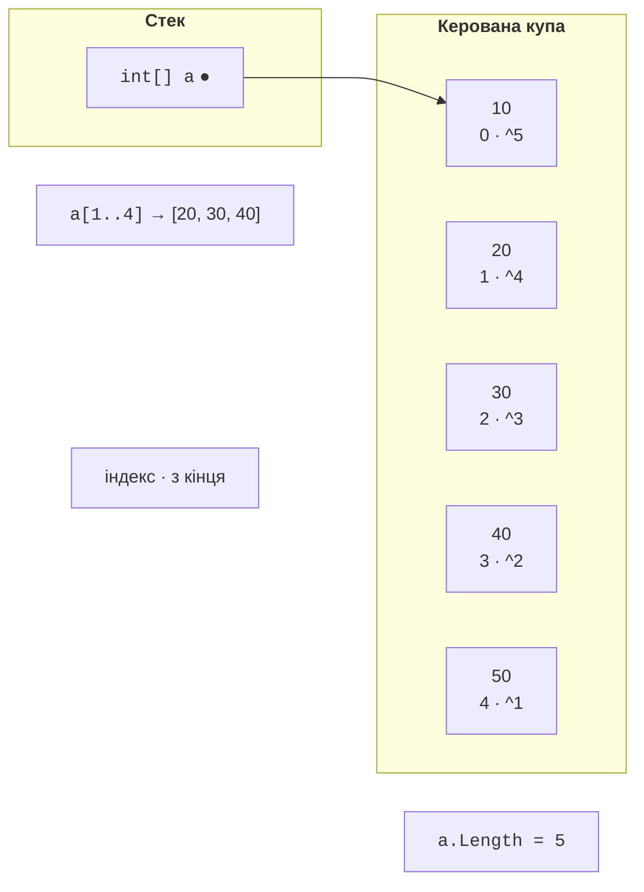
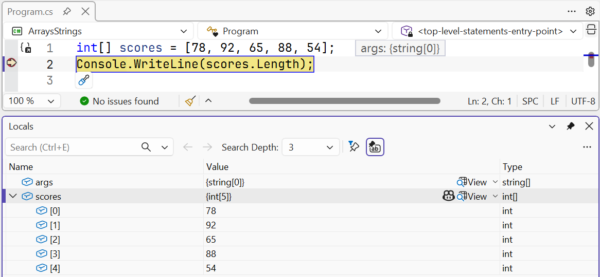
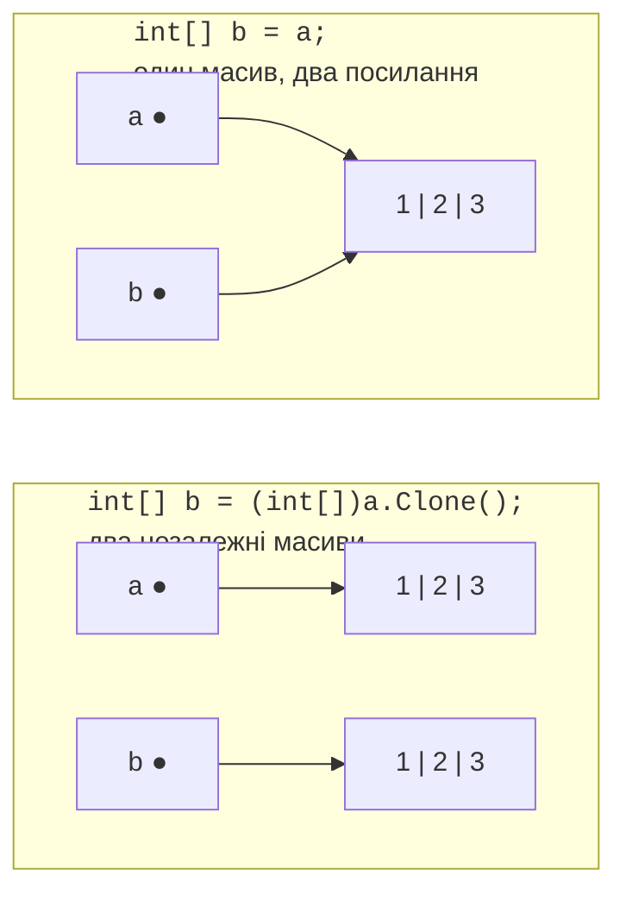

# Одновимірні масиви

## Одновимірні масиви

**Масив** (*array*) – упорядкований набір елементів **одного типу** фіксованої довжини. До кожного елемента звертаються за **індексом** – номером, який починається з нуля. Масиви зручні, коли потрібно зберігати й однаково обробляти багато значень: оцінки групи, виміри температури, пікселі зображення (<https://learn.microsoft.com/dotnet/csharp/language-reference/builtin-types/arrays>).

Тип масиву записують як тип елемента з квадратними дужками: `int[]`, `double[]`, `string[]`. Масив створюють операцією `new` із зазначенням довжини або одразу заповнюють значеннями. Основний сучасний спосіб – **вираз колекції** (*collection expression*) у квадратних дужках (<https://learn.microsoft.com/dotnet/csharp/language-reference/operators/collection-expressions>):

```cs
int[] scores = new int[5];                 // 5 нулів
string[] days = ["Пн", "Вт", "Ср", "Чт", "Пт"];
double[] prices = [12.5, 7.99, 105];
int[] empty = [];                          // порожній масив

// Старіші форми, які трапляються в наявному коді:
int[] old1 = { 1, 2, 3 };
int[] old2 = new int[] { 1, 2, 3 };
var old3 = new[] { 1.5, 2.5 };             // double[]
```

Під час створення `new int[5]` усі елементи отримують **значення за замовчуванням** свого типу: `0` для чисел, `false` для `bool`, `'\0'` для `char`, `null` для рядків та інших посилальних типів. Довжину масиву після створення змінити не можна, а дізнатися її можна властивістю `Length`.

Масив – **посилальний тип**: змінна зберігає посилання на об’єкт масиву в керованій купі (рис. 4.1). Навіть масив цілих чисел, елементи якого є типами-значеннями, сам розміщується в купі.



Рис. 4.1. Масив у пам’яті, індекси та діапазон {.caption}

## Доступ до елементів

Елемент масиву читають і змінюють за індексом у квадратних дужках: `scores[0]` – перший елемент, `scores[scores.Length - 1]` – останній. Звернення за індексом поза межами `0…Length − 1` спричиняє виняток `IndexOutOfRangeException`: C# завжди перевіряє межі масиву.

**Індекс з кінця** записують операцією `^`: `a[^1]` – останній елемент, `a[^2]` – передостанній. **Діапазон** `a[start..end]` створює **новий масив** з елементів від `start` включно до `end` не включно; будь-яку межу можна пропустити:

```cs
int[] a = [10, 20, 30, 40, 50];

Console.WriteLine(a[0]);                       // 10
Console.WriteLine(a[^1]);                      // 50
Console.WriteLine(string.Join(" ", a[1..4]));  // 20 30 40
Console.WriteLine(string.Join(" ", a[..2]));   // 10 20
Console.WriteLine(string.Join(" ", a[^2..]));  // 40 50
a[2] = 35;
Console.WriteLine(string.Join(" ", a));        // 10 20 35 40 50
```

Метод `string.Join(separator, array)` об’єднує елементи в рядок через роздільник: його зручно використовувати для виведення масиву. Запис `Console.WriteLine(a)` виведе лише назву типу `System.Int32[]`.

Значення елементів масиву зручно переглядати в налагоджувачі: у вікні *Locals* масив розгортається в перелік елементів `[0]`, `[1]`, … (рис. 4.2).



Рис. 4.2. Масив у вікні *Locals* {.caption}

## Обхід і копіювання масивів

Масив обходять циклом `for`, якщо потрібен індекс (змінити елемент, порівняти сусідні елементи), або циклом `foreach`, якщо потрібні лише значення:

```cs
double[] temps = [-2.5, 0.8, 3.1, -0.4, 5.6];

for (int i = 0; i < temps.Length; i++)
{
    temps[i] = Math.Round(temps[i]);      // змінити елемент
}

int frosty = 0;
foreach (double t in temps)
{
    if (t < 0)
    {
        frosty++;
    }
}
Console.WriteLine($"{string.Join("; ", temps)}, морозних: {frosty}");
```

Результат: `-2; 1; 3; -0; 6, морозних: 1`. Округлення −0,4 дає «від’ємний нуль», який виводиться як `-0`, але не менший за нуль.

Оскільки масив – посилальний тип, присвоювання `b = a` **не копіює** елементи: обидві змінні посилаються на той самий масив, і зміна через `b` видна через `a`. Щоб отримати незалежну копію, використовують метод `Clone`, діапазон `a[..]`, метод `Array.Copy` або `CopyTo` (рис. 4.3):

```cs
int[] a = [1, 2, 3];
int[] same = a;                 // те саме посилання
int[] copy = (int[])a.Clone();  // новий масив
int[] part = new int[5];
Array.Copy(a, 0, part, 2, 3);   // з a[0] у part[2], 3 елементи

same[0] = 100;
Console.WriteLine(a[0]);                     // 100
Console.WriteLine(copy[0]);                  // 1
Console.WriteLine(string.Join(" ", part));   // 0 0 1 2 3
Console.WriteLine(a == copy);                // False
```



Рис. 4.3. Копіювання посилання та копіювання масиву {.caption}

Операція `==` для масивів порівнює **посилання**, а не вміст: два масиви з однаковими елементами не рівні. Методи `Clone` і `Array.Copy` створюють **поверхневу копію**: для масиву рядків чи об’єктів копіюються посилання на ті самі об’єкти.
