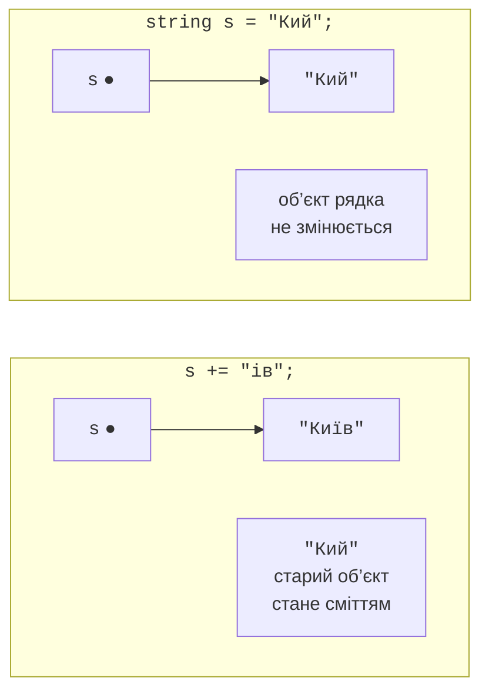
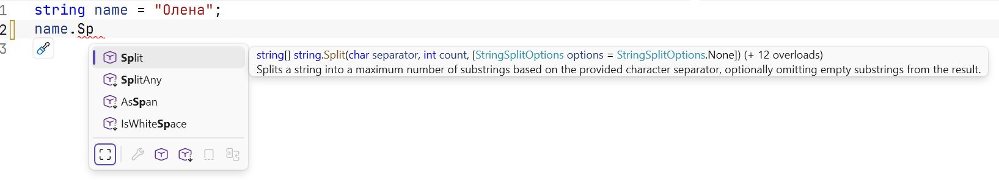
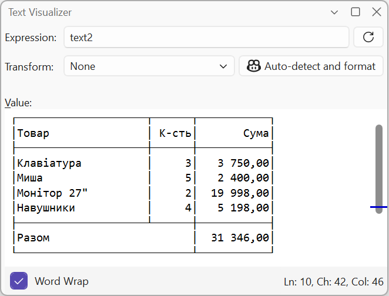

# Рядки та форматування

## Рядки

Тип `string` (`System.String`) зберігає текст як послідовність символів `char` у кодуванні UTF-16 (<https://learn.microsoft.com/dotnet/csharp/programming-guide/strings/>). Основні властивості рядків:

- **довжина**: властивість `Length` – кількість символів `char`;
- **індексатор**: `s[i]` повертає символ, `s[^1]` – останній символ, `s[1..4]` – підрядок;
- **незмінність** (*immutability*): символ рядка не можна змінити (`s[0] = 'A'` не компілюється), а будь-яка операція, що «змінює» рядок, створює новий рядок (рис. 4.6);
- **порівняння**: `==` порівнює вміст рядків, а не посилання.



Рис. 4.6. Незмінність рядків {.caption}

Для аналізу символів використовують статичні методи `char`: `char.IsDigit`, `char.IsLetter`, `char.IsLetterOrDigit`, `char.IsWhiteSpace`, `char.IsUpper`, `char.ToUpper`:

```cs
string code = "Ab-12 ї";
int letters = 0, digits = 0, spaces = 0;

foreach (char c in code)
{
    if (char.IsLetter(c)) letters++;
    else if (char.IsDigit(c)) digits++;
    else if (char.IsWhiteSpace(c)) spaces++;
}
Console.WriteLine(
    $"Літер {letters}, цифр {digits}, пробілів {spaces}");
Console.WriteLine($"{code[0]} {code[^1]} {code[3..5]}");  // A ї 12
```

Результат першого рядка: `Літер 3, цифр 2, пробілів 1`. У прикладі для стислості тіло кожної гілки записано в тому самому рядку без дужок; у програмах краще ставити дужки завжди.

### Порівняння рядків

Операція `==` і метод `Equals` порівнюють рядки **посимвольно з урахуванням регістру**. Для інших правил порівняння передають параметр `StringComparison` (<https://learn.microsoft.com/dotnet/standard/base-types/best-practices-strings>):

- `Ordinal` – за кодами символів, найшвидший і передбачуваний; для ідентифікаторів, ключів, імен файлів;
- `OrdinalIgnoreCase` – за кодами без урахування регістру; для команд і логінів;
- `CurrentCulture`, `CurrentCultureIgnoreCase` – за правилами мови користувача; для сортування й виведення тексту людям.

```cs
string city = "Київ";
Console.WriteLine(city == "київ");                  // False
Console.WriteLine(string.Equals(city, "КИЇВ",
    StringComparison.OrdinalIgnoreCase));           // True
Console.WriteLine(city.StartsWith("ки",
    StringComparison.CurrentCultureIgnoreCase));    // True
Console.WriteLine(string.Compare("ґанок", "гора",
    StringComparison.CurrentCulture));              // 1
```

Метод `string.Compare` повертає від’ємне число, нуль або додатне число, якщо перший рядок відповідно менший, рівний або більший за другий. За українськими правилами «ґ» іде після «г», тому `"ґанок"` більший за `"гора"`.

## Методи рядків

Жоден метод рядка не змінює рядок: кожен повертає **новий** рядок або результат пошуку, тому результат потрібно зберегти в змінній. Основні методи наведено в табл. 4.2, а їх перелік з описом показує IntelliSense після крапки (рис. 4.7).

Таблиця 4.2. Основні методи рядків {.caption}

| **Метод** | **Приклад і результат** |
| --- | --- |
| `Length` | `"Київ".Length` – 4 |
| `ToUpper`, `ToLower` | `"Київ".ToUpper()` – `"КИЇВ"` |
| `Trim`, `TrimStart`, `TrimEnd` | `" а б ".Trim()` – `"а б"` |
| `Contains` | `"програма".Contains("грам")` – `true` |
| `StartsWith`, `EndsWith` | `"report.pdf".EndsWith(".pdf")` – `true` |
| `IndexOf`, `LastIndexOf` | `"a-b-c".IndexOf('-')` – 1, якщо немає – −1 |
| `Substring` | `"програма".Substring(3, 4)` – `"грам"` |
| `Replace` | `"1,5".Replace(',', '.')` – `"1.5"` |
| `Insert`, `Remove` | `"abc".Insert(1, "X")` – `"aXbc"`, `"abcd".Remove(1, 2)` – `"ad"` |
| `PadLeft`, `PadRight` | `"7".PadLeft(3, '0')` – `"007"` |
| `Split` | `"a;b;;c".Split(';')` – `["a", "b", "", "c"]` |
| `string.Join` | `string.Join("-", ["a", "b"])` – `"a-b"` |
| `string.IsNullOrWhiteSpace` | `true` для `null`, `""` і рядка з пробілів |



Рис. 4.7. Методи рядка в списку IntelliSense {.caption}

### Розбиття та об’єднання рядків

Метод `Split` розбиває рядок на масив частин за одним або кількома роздільниками. Параметр `StringSplitOptions.RemoveEmptyEntries` відкидає порожні частини (наприклад, між двома пробілами поспіль), а `TrimEntries` – обрізає пробіли навколо частин:

```cs
string line = "  12, 7,,  -3 , 40 ";
string[] parts = line.Split(',',
    StringSplitOptions.RemoveEmptyEntries
    | StringSplitOptions.TrimEntries);
Console.WriteLine(parts.Length);                  // 4

int sum = 0;
foreach (string p in parts)
{
    sum += int.Parse(p);
}
Console.WriteLine($"{string.Join(" + ", parts)} = {sum}");
```

Результат: `12 + 7 + -3 + 40 = 56`. Такий розбір рядка з числами трапляється в задачах дуже часто; для даних від користувача замість `int.Parse` використовують `int.TryParse`.

### Пошук і вилучення частин

```cs
string email = "olena.koval@knu.edu.ua";
int at = email.IndexOf('@');

if (at > 0)
{
    string user = email[..at];                 // до @
    string domain = email[(at + 1)..];         // після @
    Console.WriteLine($"{user} | {domain}");
    Console.WriteLine(domain.EndsWith(".ua"));  // True
    Console.WriteLine(user.Replace('.', ' ').ToUpper());
}
```

Результат: `olena.koval | knu.edu.ua`, `True` і `OLENA KOVAL`. Діапазон `email[..at]` рівнозначний `email.Substring(0, at)`.

## Рядкові літерали та форматування

C# має кілька видів рядкових літералів:

- **звичайний** `"C:\\Temp\\data.txt"` – керувальні послідовності `\n`, `\t`, `\"`, `\\`;
- **дослівний** (*verbatim*) `@"C:\Temp\data.txt"` – зворотна скісна риска не має спеціального значення, лапки записують подвоєними `""`; зручний для шляхів до файлів;
- **інтерпольований** `$"Сума: {total:N2}"` – вирази у фігурних дужках із шириною поля та форматом (тема 1); можна поєднувати з `@`: `$@"{folder}\{file}"`;
- **сирий** (*raw string literal*) `"""…"""` – текст між потрійними лапками записується без змін, разом із лапками й зворотними скісними рисками, а спільний відступ рядків відкидається (<https://learn.microsoft.com/dotnet/csharp/language-reference/tokens/raw-string>).

```cs
string name = "Олена";
int score = 92;
string json = $$"""
    {
      "student": "{{name}}",
      "score": {{score}}
    }
    """;
Console.WriteLine(json);
```

У сирому інтерпольованому рядку з двома знаками `$$` вирази записують у подвійних фігурних дужках <code v-pre>&#123;&#123;…}}</code>, тому одинарні фігурні дужки JSON залишаються звичайним текстом. Програма виводить JSON-об’єкт без відступу, який мав вихідний код:

```
{
  "student": "Олена",
  "score": 92
}
```

Багаторядкові рядки зручно переглядати в налагоджувачі: наведіть курсор на змінну, натисніть значок лупи й оберіть *Text Visualizer* (рис. 4.8).



Рис. 4.8. Перегляд рядка в *Text Visualizer* {.caption}
