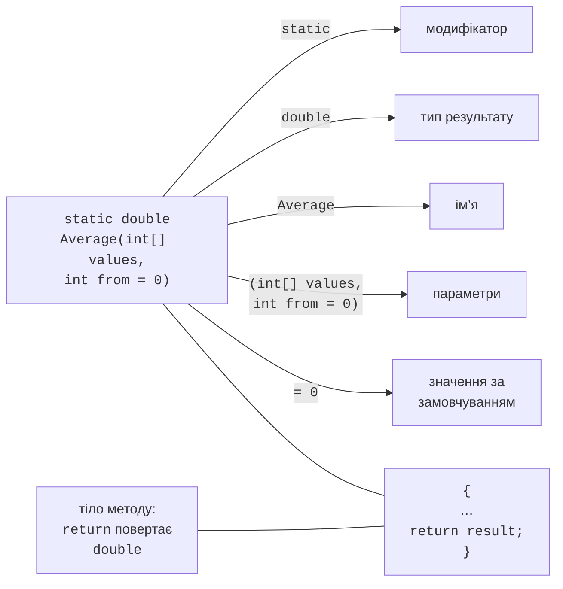

# Оголошення методів

## Навіщо потрібні методи

**Метод** (*method*) – іменований блок коду, який виконує певну задачу і може бути викликаний з різних місць програми. Досі ми користувалися готовими методами: `Console.WriteLine`, `int.TryParse`, `Math.Round`. Власні методи дозволяють:

- **розбити** велику задачу на менші, зрозумілі частини (**декомпозиція**);
- **не повторювати** код: однакову дію записують один раз і викликають багато разів;
- **назвати** дію: виклик `ReadInt("Вік: ", 0, 120)` пояснює свій зміст краще, ніж десять рядків циклу;
- **перевіряти** й **налагоджувати** кожну частину окремо.

Добрий метод виконує **одну задачу**, має назву-дієслово, що цю задачу описує, і вміщується на екрані. Якщо метод доводиться описувати словами «і… і…», його варто розділити (<https://learn.microsoft.com/dotnet/csharp/programming-guide/classes-and-structs/methods>).

Visual Studio вміє виділяти метод автоматично: виділіть фрагмент коду, натисніть **Ctrl+.** і оберіть *Extract method*. Середовище створить метод, передасть у нього потрібні змінні як параметри й запропонує ввести назву (рис. 5.1).


Рис. 5.1. Виділення методу командою *Extract method* {.caption}

## Оголошення методу

Оголошення методу складається із **заголовка** та **тіла** (рис. 5.2): модифікаторів (наприклад, `static`), **типу результату**, **імені**, списку **параметрів** у дужках і тіла у фігурних дужках. Якщо метод нічого не повертає, типом результату є `void`. Оператор `return` завершує метод і, якщо тип результату не `void`, повертає значення цього типу. Ім’я разом зі списком типів параметрів називається **сигнатурою** методу.



Рис. 5.2. Складові оголошення методу {.caption}

```cs
Console.WriteLine(Average([4, 5, 3]));      // 4
Console.WriteLine(Average([4, 5, 3], 1));   // 4
PrintLine('=', 20);

// Середнє значення елементів, починаючи з індексу from.
static double Average(int[] values, int from = 0)
{
    double sum = 0;
    for (int i = from; i < values.Length; i++)
    {
        sum += values[i];
    }
    return sum / (values.Length - from);
}

// Виводить рядок із count однакових символів.
static void PrintLine(char symbol, int count)
{
    Console.WriteLine(new string(symbol, count));
}
```

Значення, які передають під час виклику, називаються **аргументами**, а змінні в заголовку методу – **параметрами**. Компілятор перевіряє кількість і типи аргументів: виклик `Average("abc")` не скомпілюється. Метод із типом результату, відмінним від `void`, мусить повертати значення на кожному шляху виконання, інакше виникає помилка CS0161 *not all code paths return a value*.

### Локальні функції та методи класу

У програмі з операторами верхнього рівня методи оголошують **після** основного коду: це **локальні функції** (*local functions*) згенерованого методу `Main` (<https://learn.microsoft.com/dotnet/csharp/programming-guide/classes-and-structs/local-functions>). Модифікатор `static` забороняє локальній функції використовувати змінні основної програми: усі дані вона отримує через параметри. Так метод стає незалежним і зрозумілим, тому в курсі локальні функції оголошуються як `static`.

Та сама програма з явним класом `Program` містить методи класу:

```cs
namespace Methods;

internal class Program
{
    static void Main()
    {
        Console.WriteLine(Square(12));   // 144
    }

    static int Square(int x) => x * x;
}
```

Між двома формами є важлива відмінність: локальні функції **не можна перевантажувати** (оголосити дві функції з однаковим ім’ям – помилка CS0128). Методи з однаковими іменами оголошують у класі. Невеликий статичний клас можна розмістити в тому самому файлі після операторів верхнього рівня, як у прикладі «Статистика масиву» наприкінці лекції; модифікатор `public` робить метод доступним поза класом (детально – теми 7 і 8).

## Методи-вирази та іменування

Якщо тіло методу складається з одного виразу, метод записують коротко, через `=>` (*expression-bodied member*). Результат виразу є результатом методу:

```cs
Console.WriteLine(IsEven(10));             // True
Console.WriteLine(Hypotenuse(3, 4));       // 5
Greet("Олена");                            // Привіт, Олена!

static bool IsEven(int n) => n % 2 == 0;
static double Hypotenuse(double a, double b) =>
    Math.Sqrt(a * a + b * b);
static void Greet(string name) =>
    Console.WriteLine($"Привіт, {name}!");
```

За угодами .NET імена методів записують у стилі PascalCase і починають з **дієслова**: `Calculate`, `ReadInt`, `PrintReport`. Методи, які повертають `bool`, часто починаються з `Is`, `Has`, `Can` (`IsEven`, `HasErrors`), а методи, що не спричиняють винятку в разі невдачі, – з `Try` (`TryParse`). Параметри записують у стилі camelCase.
