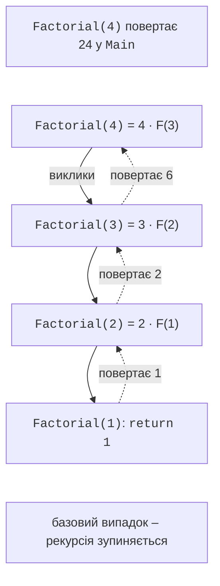
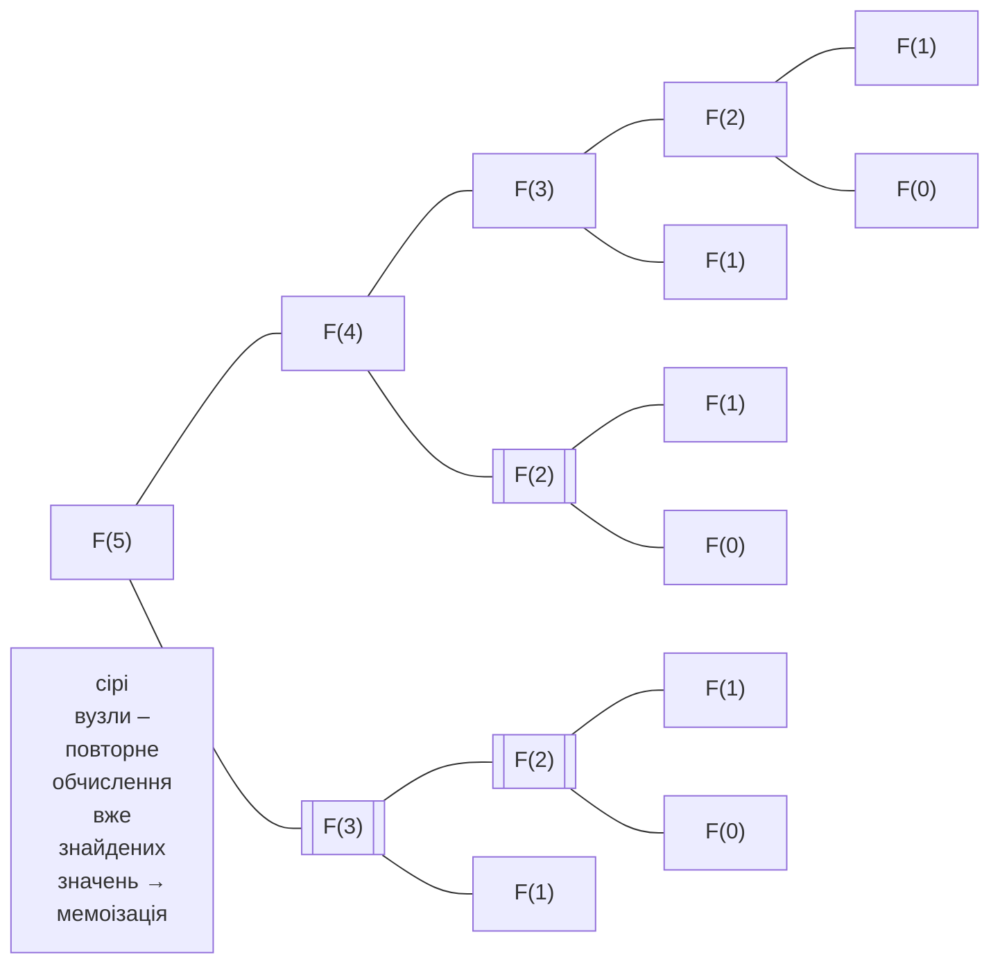

# Перевантаження та рекурсія

## Перевантаження методів

**Перевантаження** (*overloading*) – оголошення в одному класі кількох методів з однаковим ім’ям, але різними **сигнатурами**: кількістю, типами або модифікаторами (`ref`, `out`) параметрів. Тип результату в сигнатуру не входить, тому методи, які відрізняються лише ним, перевантажити не можна. Перевантаження дозволяє називати однакові дії для різних даних одним ім’ям: `Math.Round(double)`, `Math.Round(decimal)`, `Math.Round(double, int)`.

Під час виклику компілятор обирає **найкращий** варіант: спочатку шукає точну відповідність типів аргументів, потім варіант, що потребує найменш «віддалених» неявних перетворень. Якщо два варіанти однаково придатні, виникає помилка неоднозначності CS0121:

```cs
Console.WriteLine(Describe.Value(5));       // int: 5
Console.WriteLine(Describe.Value(5L));      // long: 5
Console.WriteLine(Describe.Value(5.0));     // double: 5
Console.WriteLine(Describe.Value('A'));     // int: 65
Console.WriteLine(Describe.Value("5"));     // string: 5

static class Describe
{
    public static string Value(int x) => $"int: {x}";
    public static string Value(long x) => $"long: {x}";
    public static string Value(double x) => $"double: {x}";
    public static string Value(string x) => $"string: {x}";
}
```

Для `'A'` точного варіанта немає, і компілятор обирає `int`, бо перетворення `char` → `int` найкраще серед можливих. Якби в класі були лише методи `F(decimal)` і `F(double)`, виклик `F(5)` спричинив би помилку CS0121: `int` однаково добре перетворюється на обидва типи.

Перелік перевантажень методу та опис параметрів показує підказка *Parameter Info*, яка з’являється після відкривальної дужки виклику; стрілками в підказці перемикають варіанти (рис. 5.4).


Рис. 5.4. Підказка з варіантами перевантаженого методу {.caption}

**Перевантаження чи необов’язкові параметри?** Якщо варіанти відрізняються лише кількома значеннями за замовчуванням, використовують необов’язкові параметри: один метод замість кількох. Якщо ж варіанти приймають дані **різних типів** і по-різному їх обробляють, використовують перевантаження.

## Повернення кількох значень

Метод повертає одне значення, але інколи потрібно отримати кілька результатів. Є два способи: параметри `out` і **кортеж** (*tuple*) – групу значень у дужках, яку можна повернути як один результат (кортежі детально розглядаються в темі 11):

```cs
int[] values = [4, -1, 7, 2];

MinMaxOut(values, out int min, out int max);
Console.WriteLine($"out: {min}..{max}");         // out: -1..7

var (low, high) = MinMaxTuple(values);
Console.WriteLine($"кортеж: {low}..{high}");     // кортеж: -1..7

static void MinMaxOut(int[] a, out int min, out int max)
{
    (min, max) = MinMaxTuple(a);
}

static (int Min, int Max) MinMaxTuple(int[] a)
{
    int min = a[0], max = a[0];
    foreach (int x in a)
    {
        min = Math.Min(min, x);
        max = Math.Max(max, x);
    }
    return (min, max);
}
```

Кортеж зручніший, коли всі результати рівноправні; параметр `out` природний у шаблоні `TryXxx`, де метод повертає ознаку успіху, а результат передає через параметр.

## Рекурсія

**Рекурсія** (*recursion*) – виклик методом самого себе. Рекурсивний метод розв’язує задачу, зводячи її до **меншої** задачі того самого виду. Кожен рекурсивний метод повинен мати:

- **базовий випадок** – умову, за якої результат відомий без рекурсивного виклику;
- **рекурсивний крок** – виклик для меншої задачі, який гарантовано наближається до базового випадку.

```cs
Console.WriteLine(Factorial(5));      // 120
Console.WriteLine(Gcd(1071, 462));    // 21
Console.WriteLine(Power(2, 10));      // 1024

// n! = n · (n - 1)!, 0! = 1
static long Factorial(int n) => n <= 1 ? 1 : n * Factorial(n - 1);

// Алгоритм Евкліда: НСД(a, b) = НСД(b, a % b), НСД(a, 0) = a.
static int Gcd(int a, int b) => b == 0 ? a : Gcd(b, a % b);

// Швидке піднесення до степеня: x^n = (x^(n/2))^2.
static long Power(long x, int n)
{
    if (n == 0)
    {
        return 1;
    }
    long half = Power(x, n / 2);
    return n % 2 == 0 ? half * half : half * half * x;
}
```

### Стек викликів

Під час кожного виклику методу CLR створює у **стеку викликів** (*call stack*) **кадр** із параметрами й локальними змінними цього виклику. Рекурсивний метод має в стеку стільки кадрів, яка глибина рекурсії: `Factorial(4)` викликає `Factorial(3)`, той – `Factorial(2)` і так до базового випадку, а потім результати повертаються у зворотному порядку (рис. 5.5).



Рис. 5.5. Стек викликів рекурсивного методу `Factorial(4)` {.caption}

Стек викликів можна переглянути в налагоджувачі: встановіть точку зупинки на базовому випадку, запустіть програму (**F5**) і відкрийте вікно *Debug → Windows → Call Stack*. У ньому видно всі кадри `Factorial` із значеннями параметрів, а внизу – метод `Main` (рис. 5.6).


Рис. 5.6. Вікно *Call Stack* під час рекурсії {.caption}

### Переповнення стеку

Розмір стеку обмежений (зазвичай 1 МБ для основного потоку). Якщо рекурсія не має базового випадку або надто глибока, стек переповнюється, і програма **аварійно завершується**: виняток `StackOverflowException` перехопити неможливо. Метод без базового випадку

```cs
static int Depth(int n) => Depth(n + 1);
```

завершує програму повідомленням `Stack overflow.` і переліком кадрів, що повторюються. Тому рекурсію використовують для задач із невеликою глибиною (десятки – тисячі рівнів): обхід дерев, перебір варіантів, «розділяй і володарюй». Лінійні задачі на зразок суми масиву чи факторіала простіше й надійніше розв’язувати циклом.

### Мемоізація

Деякі рекурсивні алгоритми багаторазово обчислюють ті самі значення. Метод `Fib(n) = Fib(n - 1`

1. Fib(n - 2)` для `Fib(5)` обчислює `Fib(3)` двічі, а `Fib(2)`~– тричі (@fig-met-fib); кількіст`

викликів зростає експоненційно, і `Fib(40)` потребує понад 331 мільйон викликів. **Мемоізація** (*memoization*) – збереження вже обчислених результатів, наприклад у масиві: перед обчисленням метод перевіряє, чи результат уже відомий. Приклад «Числа Фібоначчі» порівнює три підходи.



Рис. 5.7. Дерево рекурсивних викликів `Fib(5)` {.caption}

## XML-коментарі

Перед методом можна записати **документаційний коментар** з трьома скісними рисками `///` у форматі XML. Visual Studio створює його шаблон, якщо набрати `///` над оголошенням методу. Опис показується в підказках IntelliSense під час виклику методу (рис. 5.8) і може бути перетворений на документацію (<https://learn.microsoft.com/dotnet/csharp/language-reference/xmldoc/>):

```cs
Console.WriteLine(Bmi(70, 1.75).ToString("F1"));   // 22,9

/// <summary>
/// Обчислює індекс маси тіла.
/// </summary>
/// <param name="mass">Маса, кг.</param>
/// <param name="height">Зріст, м.</param>
/// <returns>Індекс маси тіла, кг/м².</returns>
static double Bmi(double mass, double height) =>
    mass / (height * height);
```

Основні теги: `<summary>` – короткий опис, `<param name="…">` – опис параметра, `<returns>` – опис результату, `<exception>` – винятки, які може спричинити метод.


Рис. 5.8. XML-коментар у підказці *Quick Info* {.caption}
