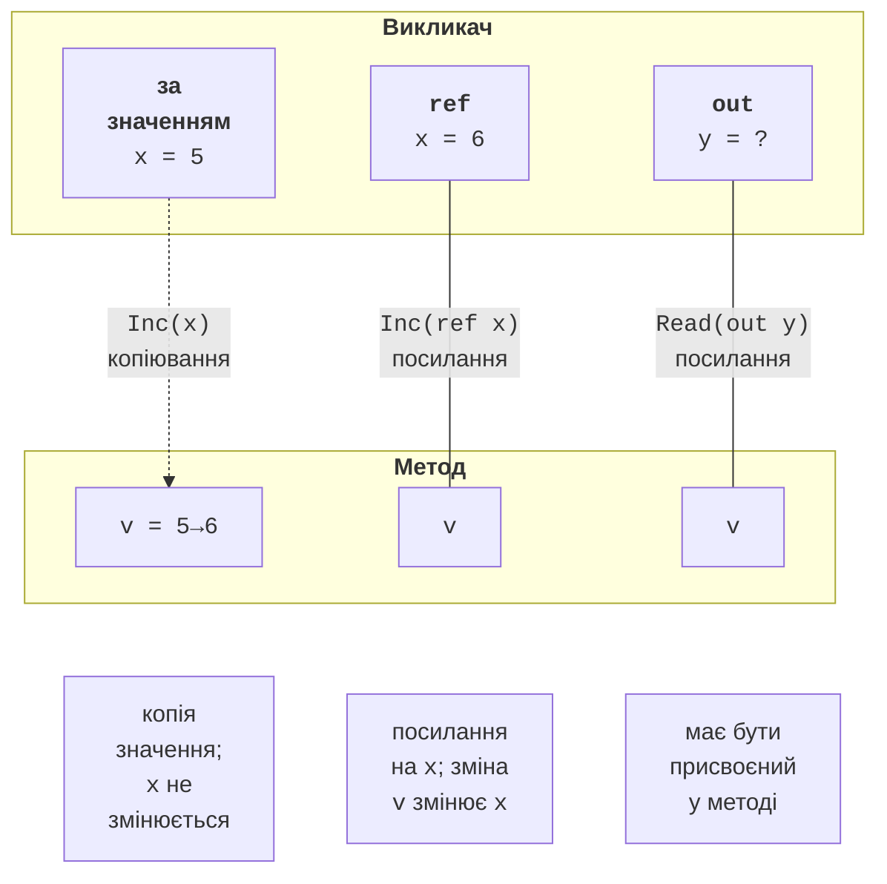

# Передавання параметрів

## Передавання параметрів за значенням

За замовчуванням аргументи передаються **за значенням**: параметр отримує **копію** значення аргументу (<https://learn.microsoft.com/dotnet/csharp/language-reference/keywords/method-parameters>). Для типів-значень це означає, що зміна параметра не впливає на змінну викликача. Для посилальних типів копіюється **посилання**, тому метод може змінити сам об’єкт, наприклад елементи масиву, але не може змусити змінну викликача посилатися на інший об’єкт:

```cs
int n = 5;
Increment(n);
Console.WriteLine(n);                       // 5 – копія змінилася

int[] data = [1, 2, 3];
ChangeArray(data);
Console.WriteLine(string.Join(" ", data));  // 100 2 3

static void Increment(int x) => x++;

static void ChangeArray(int[] array)
{
    array[0] = 100;     // змінює спільний масив
    array = [7, 7, 7];  // змінює лише локальну копію посилання
}
```

## Параметри `ref`, `out`, `in`

Модифікатори параметрів змінюють спосіб передавання (рис. 5.3):

- `ref` – параметр є **посиланням** на змінну викликача: зміна параметра змінює цю змінну. Змінна має бути ініціалізована до виклику, а модифікатор записують і в оголошенні, і під час виклику;
- `out` – вихідний параметр: метод **зобов’язаний** присвоїти йому значення (інакше помилка CS0177), а змінну викликача можна не ініціалізувати й навіть оголосити просто у виклику (`out int value`). Так працює шаблон `TryParse`;
- `in` – параметр передається за посиланням **лише для читання**: змінити його в методі не можна (помилка CS8331). Використовується для великих структур, щоб не копіювати їх. Близький модифікатор `ref readonly` також передає параметр лише для читання, але вимагає, щоб аргументом була змінна.



Рис. 5.3. Передавання параметрів за значенням, `ref` і `out` {.caption}

```cs
int count = 10;
AddBonus(ref count, 5);
Console.WriteLine(count);                          // 15

if (TryParsePercent("45%", out int percent))
{
    Console.WriteLine($"Відсоток: {percent}");     // 45
}
Console.WriteLine(TryParsePercent("abc", out _));  // False

static void AddBonus(ref int value, int bonus) => value += bonus;

// Розбирає рядок виду "45%"; false, якщо формат неправильний.
static bool TryParsePercent(string text, out int result)
{
    result = 0;
    return text.EndsWith('%')
        && int.TryParse(text[..^1], out result)
        && result is >= 0 and <= 100;
}
```

Символ `_` замість імені змінної (*discard*) означає, що вихідне значення не потрібне. Параметри `ref` і `out` роблять код менш очевидним, тому їх використовують, лише коли вони справді потрібні: для обміну значень змінних, шаблону `TryXxx` або повернення кількох результатів.

## Необов’язкові параметри та іменовані аргументи

Параметру можна задати **значення за замовчуванням**; тоді аргумент для нього під час виклику можна пропустити. Необов’язкові параметри записують **після** обов’язкових (помилка CS1737). Значення за замовчуванням має бути константою: числом, рядком, `null` або `default` (<https://learn.microsoft.com/dotnet/csharp/programming-guide/classes-and-structs/named-and-optional-arguments>).

**Іменований аргумент** записують як `ім’я: значення`. Іменовані аргументи роблять виклик зрозумілішим і дозволяють пропустити частину необов’язкових параметрів або змінити порядок аргументів:

```cs
PrintPrice(1299.5m);
PrintPrice(1299.5m, "USD");
PrintPrice(1299.5m, decimals: 0);
PrintPrice(currency: "EUR", decimals: 1, amount: 49.99m);

static void PrintPrice(decimal amount, string currency = "грн",
    int decimals = 2)
{
    string format = "N" + decimals;
    Console.WriteLine($"{amount.ToString(format)} {currency}");
}
```

Результат: `1 299,50 грн`, `1 299,50 USD`, `1 300 грн`, `50,0 EUR`. Іменовані аргументи особливо корисні для логічних параметрів: виклик `Format(date, withWeekday: true)` зрозуміліший за `Format(date, true)`.

## Параметри `params`

Модифікатор `params` дозволяє передавати **змінну кількість** аргументів: компілятор сам збирає їх у масив. Параметр `params` має бути останнім у списку. Метод можна викликати з окремими аргументами, з масивом або взагалі без аргументів:

```cs
Console.WriteLine(Max(3, 9, 4));        // 9
Console.WriteLine(Max(12, [5, 8]));     // 12
Console.WriteLine(Sum(1, 2, 3, 4));     // 10
Console.WriteLine(Sum());               // 0

static int Max(int first, params int[] others)
{
    int max = first;
    foreach (int value in others)
    {
        max = Math.Max(max, value);
    }
    return max;
}

// C# 13: params для колекцій без створення масиву.
static int Sum(params ReadOnlySpan<int> values)
{
    int sum = 0;
    foreach (int value in values)
    {
        sum += value;
    }
    return sum;
}
```

Метод `Max` має обов’язковий перший параметр, тому виклик без аргументів неможливий, і перевіряти порожній масив не потрібно. Замість окремих аргументів можна передати масив: `Max(12, [5, 8])`. Починаючи з C# 13, `params` можна застосувати не лише до масиву, а й до інших колекцій, зокрема `ReadOnlySpan<T>` і `List<T>`: варіант зі `ReadOnlySpan<int>` не створює масив у купі під час кожного виклику. На першому курсі достатньо форми `params T[]`. Так влаштовані знайомі методи `string.Join` і `Console.WriteLine` з форматним рядком.
