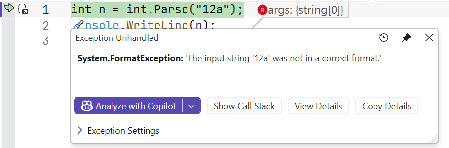
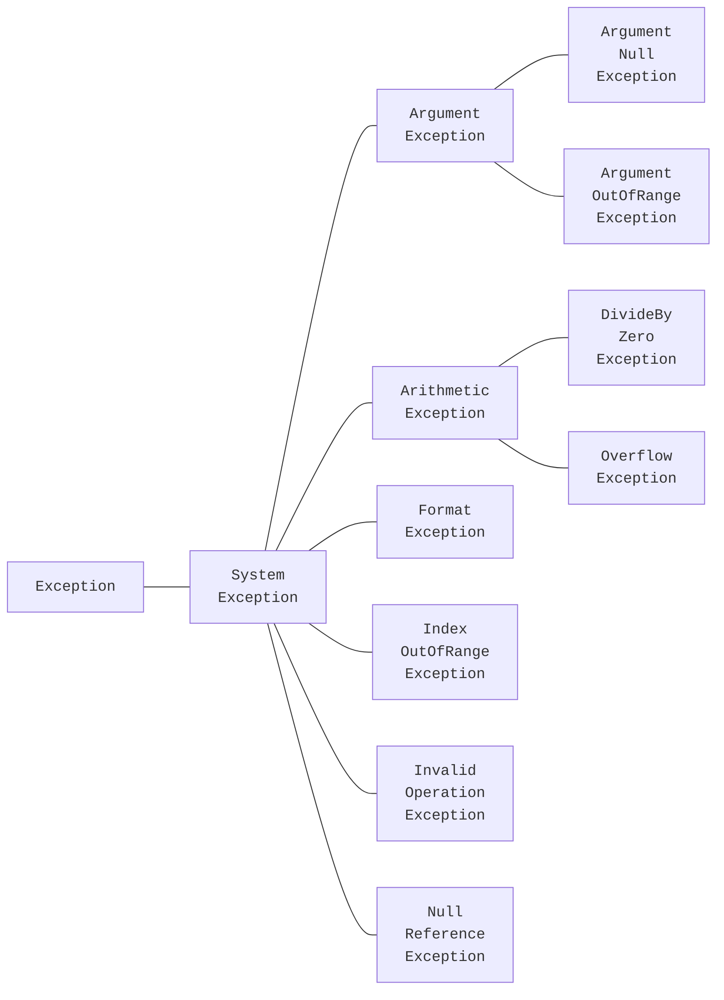
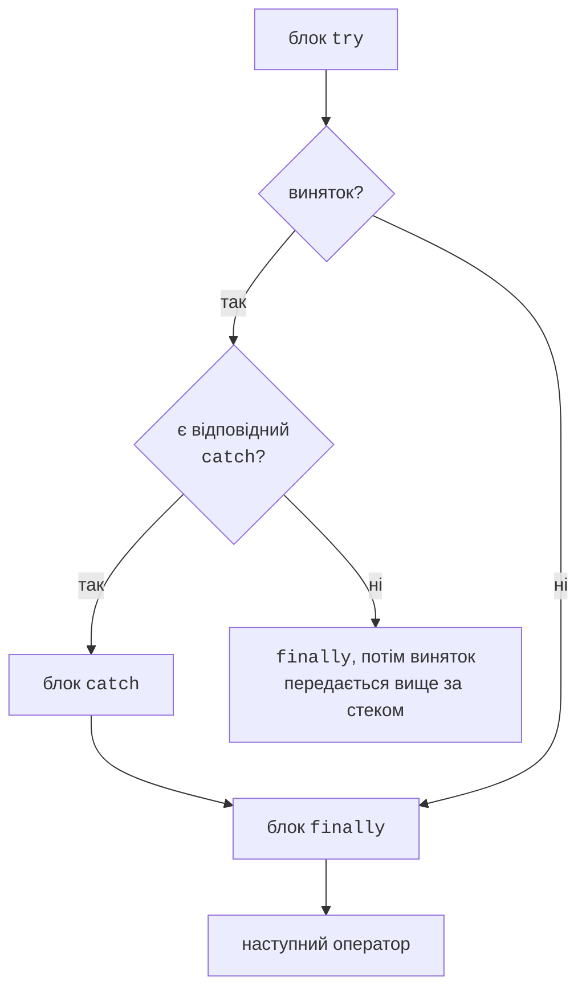

# Debug.Assert і обробка винятків

## Класи `Debug`: `WriteLine` і `Assert`

Клас `System.Diagnostics.Debug` містить методи для діагностики, які працюють лише в конфігурації **Debug**: у конфігурації Release компілятор повністю видаляє їх виклики.

- `Debug.WriteLine(message)` – виводить повідомлення у вікно *Output* Visual Studio (не в консоль) (рис. 6.5);
- `Debug.Assert(condition, message)` – перевіряє **інваріант** – умову, яка за правильної роботи програми має бути істинною завжди. Якщо умова хибна, під налагоджувачем програма зупиняється, а без нього консольний застосунок аварійно завершується повідомленням `Assertion failed.`

```cs
using System.Diagnostics;

int[] data = [4, 8, 15];
int sum = 0;
foreach (int x in data)
{
    sum += x;
    Debug.WriteLine($"x = {x}, sum = {sum}");
}
Debug.Assert(sum >= 0, "Сума невід’ємних чисел від’ємна");
Console.WriteLine(sum);                        // 27
```

`Debug.Assert` перевіряє помилки **програміста**, а не користувача: некоректне введення перевіряють звичайними умовами або винятками, які працюють і в Release.


Рис. 6.5. Повідомлення `Debug.WriteLine` у вікні *Output* {.caption}

## Винятки

**Виняток** (*exception*) – об’єкт, який повідомляє про помилку під час виконання (<https://learn.microsoft.com/dotnet/csharp/fundamentals/exceptions/>). Коли метод не може виконати свою роботу, він **генерує** (*throws*) виняток: виконання методу припиняється, і CLR шукає код, який **перехопить** (*catch*) виняток. Якщо такого коду немає, програма завершується з повідомленням про **необроблений виняток**. У налагоджувачі Visual Studio зупиняється на рядку, де виник виняток, і показує вікно *Exception Helper* (рис. 6.6).



Рис. 6.6. Необроблений виняток у налагоджувачі {.caption}

Усі винятки є об’єктами класів, що походять від `System.Exception`. Стандартні винятки .NET утворюють ієрархію (рис. 6.7), а найпоширеніші з них наведено в табл. 6.2.



Рис. 6.7. Ієрархія стандартних винятків .NET {.caption}

Таблиця 6.2. Поширені стандартні винятки {.caption}

| **Виняток** | **Коли виникає (приклад)** |
| --- | --- |
| `FormatException` | рядок не відповідає формату: `int.Parse("12a")` |
| `IndexOutOfRangeException` | індекс поза межами масиву: `a[a.Length]` |
| `NullReferenceException` | звернення до члена через `null`: `s.Length`, де `s == null` |
| `DivideByZeroException` | цілочисельне ділення або `decimal` на нуль |
| `OverflowException` | переповнення в `checked`, `Convert.ToByte("300")`, `int.MinValue / -1` |
| `ArgumentException` | некоректний аргумент методу |
| `ArgumentNullException` | аргумент дорівнює `null`, хоча не повинен |
| `ArgumentOutOfRangeException` | аргумент поза допустимим діапазоном |
| `InvalidOperationException` | операція неможлива в поточному стані: максимум порожньої послідовності |

Кожен виняток має властивості `Message` (опис помилки), `StackTrace` (стек викликів у момент виникнення), `InnerException` (виняток, що спричинив поточний) і метод `GetType()`, який повертає його тип.

## Оператор `try`/`catch`/`finally`

Код, у якому може виникнути виняток, розміщують у блоці `try`, а обробку – в одному або кількох блоках `catch` (<https://learn.microsoft.com/dotnet/csharp/language-reference/statements/exception-handling-statements>). Блок `catch` із зазначеним типом перехоплює винятки цього типу **та його нащадків**. Блоки `catch` перевіряються по черзі, тому їх записують **від конкретних до загальних**: `catch (Exception)` перед `catch (FormatException)` зробив би другий блок недосяжним (помилка CS0160).

Блок `finally` виконується **завжди**: після успішного `try`, після обробки винятку в `catch` і навіть тоді, коли виняток не перехоплено й він передається далі (рис. 6.8). У ньому звільняють ресурси: закривають файли, відновлюють стан.



Рис. 6.8. Порядок виконання `try`/`catch`/`finally` {.caption}

```cs
string[] inputs = ["42", "abc", "99999999999"];

foreach (string text in inputs)
{
    try
    {
        int value = int.Parse(text);
        Console.WriteLine($"{text}: {value * 2}");
    }
    catch (FormatException)
    {
        Console.WriteLine($"{text}: не число");
    }
    catch (OverflowException ex)
    {
        Console.WriteLine($"{text}: {ex.Message}");
    }
    finally
    {
        Console.WriteLine("  перевірку завершено");
    }
}
```

Результат:

```
42: 84
  перевірку завершено
abc: не число
  перевірку завершено
99999999999: Value was either too large or too small for an Int32.
  перевірку завершено
```

Змінна `ex` у `catch` потрібна лише тоді, коли використовуються властивості винятку; якщо тип достатній для обробки, її не записують.

### Фільтри винятків `when`

Після `catch` можна записати умову `when`: блок перехопить виняток, лише якщо умова істинна. Фільтр дозволяє по-різному обробляти винятки одного типу або перехопити кілька типів одним блоком:

```cs
int[] values = [10, 20, 30];
string[] requests = ["1", "7", "x"];

foreach (string request in requests)
{
    try
    {
        Console.WriteLine(values[int.Parse(request)]);
    }
    catch (Exception ex) when (ex is FormatException
                                 or IndexOutOfRangeException)
    {
        Console.WriteLine($"Запит «{request}»: {ex.GetType().Name}");
    }
}
```

Результат: `20`, `Запит «7»: IndexOutOfRangeException`, `Запит «x»: FormatException`. Винятки інших типів цей блок не перехопить.
