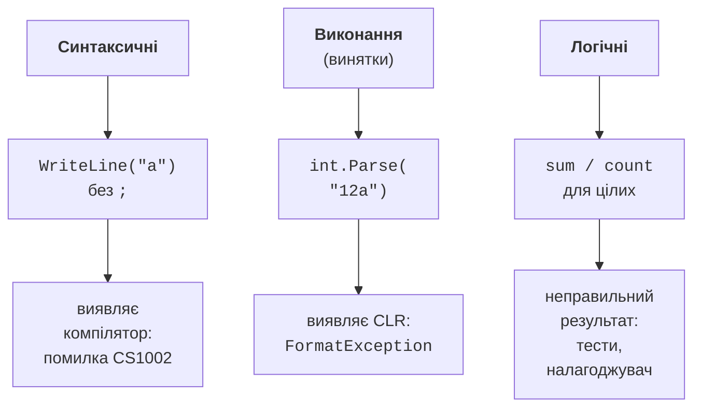

# Помилки та налагоджувач

## Види помилок

Помилки в програмах поділяють на три види (рис. 6.1):

- **синтаксичні помилки** (помилки компіляції) – порушення правил мови: пропущена крапка з комою, неоголошена змінна, невідповідність типів. Їх знаходить компілятор, і програма не запуститься, доки їх не виправлено. До цієї групи близькі **попередження** (*warnings*) і повідомлення **аналізаторів коду**: програма збирається, але код, імовірно, містить помилку (наприклад, CS8602 про можливе значення `null`);
- **помилки виконання** – ситуації, у яких програма не може продовжити роботу: некоректне введення, ділення цілого на нуль, звернення за межі масиву. У .NET вони проявляються як **винятки**;
- **логічні помилки** – програма працює без повідомлень, але дає неправильний результат: неправильна формула, умова `<` замість `<=`, цілочисельне ділення. Їх знаходять тестуванням і налагодженням.

Рис. 6.1. Види помилок і способи їх виявлення {.caption}

Логічні помилки найнебезпечніші: програма не повідомляє про них. Саме для їх пошуку призначений **налагоджувач** (*debugger*).

## Налагоджувач Visual Studio

Налагоджувач дозволяє зупинити програму в потрібному місці, виконувати її по одному оператору й переглядати значення змінних (<https://learn.microsoft.com/visualstudio/debugger/debugger-feature-tour>). Основні дії наведено в табл. 6.1.

Таблиця 6.1. Команди покрокового налагодження {.caption}

| **Клавіші** | **Команда** | **Дія** |
| --- | --- | --- |
| **F9** | *Toggle Breakpoint* | встановити або прибрати точку зупинки в поточному рядку |
| **F5** | *Start Debugging* / *Continue* | запустити з налагодженням або продовжити до наступної точки зупинки |
| **F10** | *Step Over* | виконати рядок; виклики методів виконуються повністю |
| **F11** | *Step Into* | виконати рядок, заходячи всередину викликаного методу |
| **Shift+F11** | *Step Out* | виконати метод до кінця й повернутися до місця виклику |
| **Ctrl+F10** | *Run To Cursor* | виконати програму до рядка з курсором |
| **Ctrl+Shift+F10** | *Set Next Statement* | зробити наступним інший рядок (перетягнути жовту стрілку) |
| **Shift+F5** | *Stop Debugging* | зупинити налагодження |
| **Ctrl+Shift+F5** | *Restart* | перезапустити програму |

**Точка зупинки** (*breakpoint*) – позначка рядка, перед виконанням якого програма зупиняється. Її встановлюють клацанням на полі ліворуч від номера рядка або клавішею **F9**; рядок позначається червоною крапкою. Коли програма зупинилася, жовта стрілка показує рядок, який буде виконано **наступним**, а на панелі *Debug* з’являються кнопки покрокового виконання (рис. 6.2).

Рис. 6.2. Панель налагодження та зупинка на точці зупинки {.caption}

Типовий порядок пошуку логічної помилки:

1. Визначити, **який результат неправильний** і за яких вхідних даних.
2. Встановити точку зупинки перед місцем, де цей результат обчислюється.
3. Запустити програму (**F5**) і виконувати її покроково (**F10**, **F11**), порівнюючи значення змінних з очікуваними, обчисленими вручну.
4. Знайти перший рядок, після якого значення стало неправильним, – там і помилка.

## Вікна налагоджувача

Під час зупинки стан програми показують кілька вікон (*Debug → Windows*):

- *Locals* – усі локальні змінні поточного методу;
- *Autos* – змінні, використані в поточному й попередньому рядках;
- *Watch* – вирази, які ви додали самі (`sum / values.Length`, `values[i] > max`); значення оновлюються після кожного кроку;
- *Call Stack* – ланцюжок викликів методів, який привів до поточного рядка (тема 5);
- *Immediate* – вікно, у якому можна обчислити вираз або викликати метод під час зупинки (рис. 6.3).

Значення змінної показує й підказка **DataTip**, якщо навести курсор на змінну в редакторі. У вікнах *Locals*, *Watch* і в DataTip значення можна **змінити** (подвійне клацання): це дозволяє перевірити, чи виправить помилку інше значення, без перезапуску програми.

Рис. 6.3. Обчислення виразів у вікні *Immediate* {.caption}

## Умовні точки зупинки та tracepoints

Якщо помилка виникає, наприклад, лише на 57-й ітерації циклу, зупинятися на кожній ітерації незручно. У налаштуваннях точки зупинки (клацання правою кнопкою на червоній крапці → *Conditions…*) можна задати (<https://learn.microsoft.com/visualstudio/debugger/using-breakpoints>):

- **умову** (*Conditional Expression*) – вираз C#, наприклад `i == 57` або `sum > 1000`; програма зупиниться, лише коли він істинний;
- **лічильник звернень** (*Hit Count*) – зупинка, наприклад, на кожному десятому проходженні;
- **дію** (*Actions*) – вивести повідомлення у вікно *Output*, наприклад `i = {i}, sum = {sum}`. Якщо залишити позначку *Continue code execution*, точка зупинки стає **tracepoint**: програма не зупиняється, а лише записує значення (рис. 6.4).

Рис. 6.4. Налаштування умовної точки зупинки {.caption}

Функція **Hot Reload** (кнопка з полум’ям на панелі інструментів або **Alt+F10**) застосовує зміни коду до запущеної програми без перезапуску. Вона підтримує більшість змін усередині тіла методів, тому виправлену формулу можна перевірити одразу під час налагодження.
