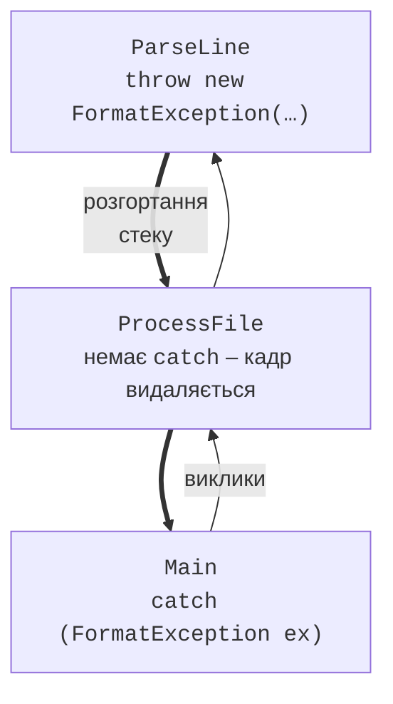

# Генерування винятків і стратегія

## Генерування винятків

Власний метод повідомляє про помилку оператором `throw` з об’єктом винятку. Найчастіше метод перевіряє свої аргументи: некоректні дані від викликача – це помилка, яку метод не може виправити сам. Для типових перевірок .NET містить статичні методи-помічники (<https://learn.microsoft.com/dotnet/standard/exceptions/best-practices-for-exceptions>):

```cs
Console.WriteLine(Discount(1200m, 10));        // 1080

try
{
    Console.WriteLine(Discount(850m, 150));
}
catch (ArgumentOutOfRangeException ex)
{
    Console.WriteLine($"{ex.ParamName}: {ex.ActualValue}");
}

static decimal Discount(decimal price, int percent)
{
    ArgumentOutOfRangeException.ThrowIfNegative(price);
    ArgumentOutOfRangeException.ThrowIfNegative(percent);
    ArgumentOutOfRangeException.ThrowIfGreaterThan(percent, 100);
    return Math.Round(price * (100 - percent) / 100, 2);
}
```

Результат: `1080` і `percent: 150`. Помічники самі формують повідомлення й записують ім’я параметра (`ParamName`) і його значення. Інші помічники: `ArgumentNullException.ThrowIfNull(arg)`, `ArgumentException.ThrowIfNullOrWhiteSpace(text)`, `ArgumentOutOfRangeException.ThrowIfZero(n)`. Виняток можна створити й явно: `throw new InvalidOperationException("Недостатньо коштів");`.

**Вирази `throw`** дозволяють генерувати виняток усередині виразу, наприклад в операціях `??` і `?:`:

```cs
string? input = "Олена";
string name = input ?? throw new ArgumentNullException(nameof(input));
Console.WriteLine(name);
```

Операція `nameof` повертає ім’я змінної як рядок і не ламається під час перейменування змінної.

### Повторне генерування: `throw;` проти `throw ex;`

Інколи виняток перехоплюють лише для того, щоб щось записати в журнал, а потім передати далі. Для цього в блоці `catch` пишуть `throw;` без аргументу: виняток передається **без змін**, зі збереженим стеком викликів. Запис `throw ex;` генерує той самий об’єкт заново й **втрачає** інформацію про місце, де виняток виник спочатку. Якщо потрібно замінити виняток зрозумілішим, оригінал передають як `InnerException`: `throw new FormatException("Рядок 3 некоректний", ex);`.

## Необроблені винятки та коди завершення

Якщо виняток не перехоплено жодним `catch`, він проходить через усі методи стеку викликів (**розгортання стеку**, *stack unwinding*) (рис. 6.9). Кожен метод, у якому немає відповідного `catch`, завершується, а блоки `finally` виконуються.



Рис. 6.9. Поширення винятку стеком викликів {.caption}

Якщо виняток дійшов до верхнього рівня програми, CLR виводить у потік помилок текст винятку зі стеком викликів і завершує процес із кодом `-532462766` (`0xE0434352`) (рис. 6.10):

```
Unhandled exception. System.InvalidOperationException:
Файл налаштувань не знайдено
   at Program.<Main>$(String[] args) in C:\Labs\Demo\Program.cs:line 2
```


Рис. 6.10. Необроблений виняток у терміналі {.caption}

**Код завершення** (*exit code*) повідомляє операційній системі та сценаріям автоматизації, чи успішно завершилася програма: 0 – успіх, інше значення – помилка. Його задають оператором `return` з методу `Main` типу `int` або властивістю `Environment.ExitCode`. Повідомлення про помилки виводять не в `Console.Out`, а в потік помилок `Console.Error`: тоді їх можна відокремити від результатів (`dotnet run > result.txt` записує у файл лише звичайне виведення).

```cs
if (args.Length == 0)
{
    Console.Error.WriteLine("Використання: Demo <файл>");
    return 2;
}
Console.WriteLine($"Обробка {args[0]}...");
return 0;
```

У PowerShell код завершення останньої програми показує змінна `$LASTEXITCODE`.

## Коли використовувати винятки

Винятки призначені для **виняткових** ситуацій, які метод не може обробити сам. Кілька правил:

- **очікувані** ситуації перевіряйте без винятків: користувач часто помиляється під час введення, тому використовуйте `int.TryParse`, а не `try`/`catch` навколо `int.Parse`; перед діленням перевіряйте дільник;
- **не залишайте порожній** `catch { }`: він приховує помилку, і програма продовжує працювати з неправильними даними;
- **не перехоплюйте** `Exception` там, де не знаєте, як обробити помилку: перехоплюйте конкретні типи, а загальний обробник залишайте на верхньому рівні програми;
- перехоплюйте виняток **там, де можна щось зробити**: повторити введення, пропустити рядок, повідомити користувача;
- генеруйте винятки **найточнішого** типу з повідомленням, яке пояснює причину.

### Власні класи винятків

Якщо стандартні типи не описують помилку предметної області, створюють власний клас винятку. Запис `: Exception` означає, що новий клас **успадковує** клас `Exception` (наслідування детально розглядається в темі 9); конструктор передає повідомлення базовому класу:

```cs
decimal balance = 500m;
try
{
    Withdraw(ref balance, 800m);
}
catch (InsufficientFundsException ex)
{
    Console.WriteLine($"{ex.Message} Бракує: {ex.Shortage:N2} грн");
}

static void Withdraw(ref decimal balance, decimal amount)
{
    if (amount > balance)
    {
        throw new InsufficientFundsException(amount - balance);
    }
    balance -= amount;
}

class InsufficientFundsException(decimal shortage)
    : Exception("Недостатньо коштів на рахунку.")
{
    public decimal Shortage { get; } = shortage;
}
```

Результат: `Недостатньо коштів на рахунку. Бракує: 300,00 грн`. Назва класу винятку за угодою закінчується словом `Exception`.

Вікно *Exception Settings* (*Debug → Windows → Exception Settings*, **Ctrl+Alt+E**) дозволяє налаштувати, на яких винятках налагоджувач зупиняється **одразу під час генерування**, навіть якщо далі їх перехопить `catch` (рис. 6.11). Це допомагає знайти місце, де виник виняток, який програма обробляє мовчки (<https://learn.microsoft.com/visualstudio/debugger/managing-exceptions-with-the-debugger>).


Рис. 6.11. Вікно *Exception Settings* {.caption}
