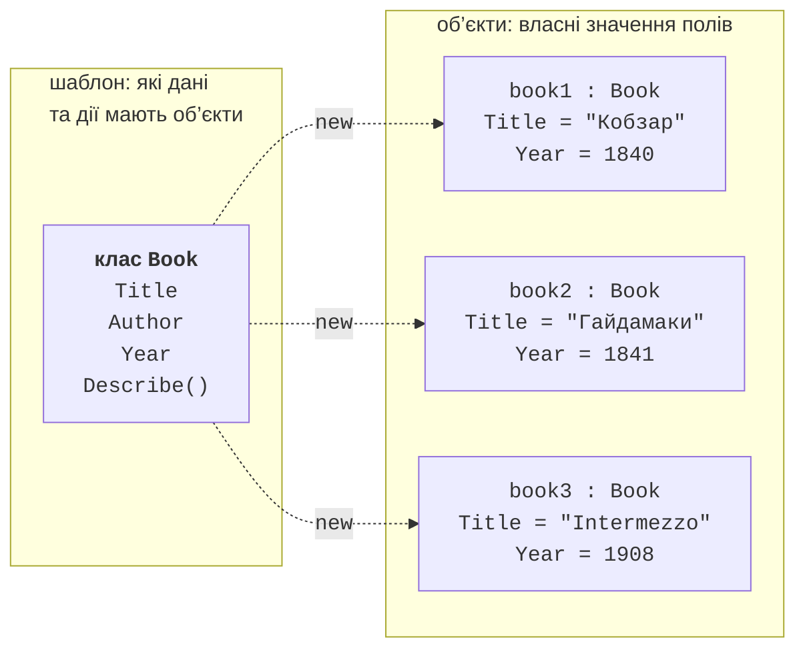
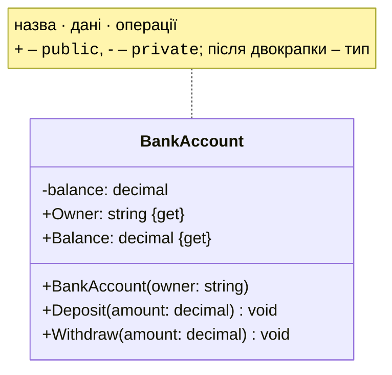
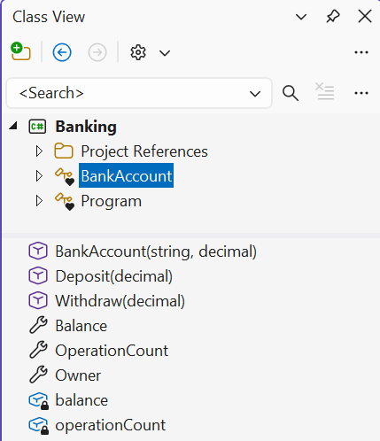
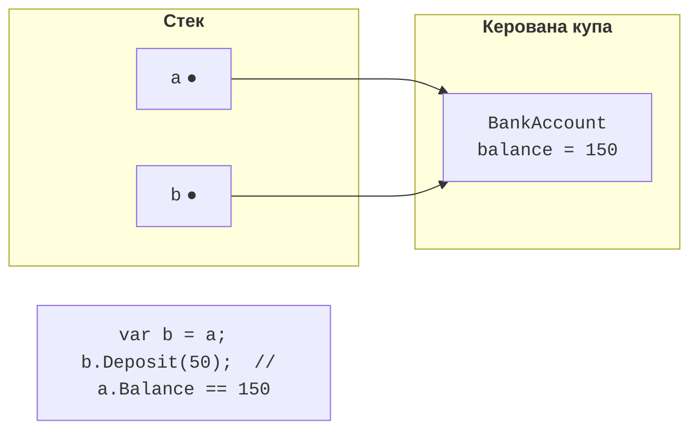

# Класи, об’єкти та поля

## Об’єктно-орієнтований підхід

У попередніх темах дані й дії над ними існували окремо: масиви цін, кількостей і назв товарів обробляли окремі методи. Коли програма зростає, такий **процедурний** стиль ускладнюється: легко передати в метод не той масив або забути оновити один із паралельних масивів.

**Об’єктно-орієнтоване програмування** (ООП, *object-oriented programming*) об’єднує дані та дії над ними в **об’єкти**. Об’єкт має:

- **стан** – значення його даних: баланс рахунку, назва й ціна товару;
- **поведінку** – дії, які він виконує: поповнити рахунок, обчислити вартість;
- **ідентичність** – кожен об’єкт є окремою сутністю, навіть якщо його стан збігається зі станом іншого.

**Клас** (*class*) – опис (шаблон) об’єктів одного виду: які дані вони зберігають і що вміють робити. Об’єкт, створений за класом, називається **екземпляром** (*instance*) класу. Один клас описує багато об’єктів з різним станом (рис. 7.1) (<https://learn.microsoft.com/dotnet/csharp/fundamentals/object-oriented/objects>).



Рис. 7.1. Клас і його об’єкти {.caption}

Класи моделюють поняття предметної області: `Student`, `BankAccount`, `Order`. Добре спроєктований клас відповідає за одне поняття й сам стежить за коректністю свого стану: наприклад, рахунок не дозволяє зняти більше, ніж на ньому є.

## Оголошення класу

Клас оголошують ключовим словом `class`; у фігурних дужках записують його **члени**: поля, властивості, конструктори й методи (<https://learn.microsoft.com/dotnet/csharp/fundamentals/types/classes>). Структуру класу зручно зображати **UML-діаграмою класу**: прямокутником із трьома секціями – назва, дані, операції (рис. 7.2).



Рис. 7.2. Позначення класу на UML-діаграмі {.caption}

У невеликих прикладах класи оголошують у файлі `Program.cs` після операторів верхнього рівня. У реальних проєктах **кожен клас розміщують в окремому файлі** з назвою класу: `BankAccount.cs`. У Visual Studio файл класу додають командою *Project → Add Class…* або з контекстного меню проєкту у *Solution Explorer* (рис. 7.3). Новий файл отримує простір імен проєкту:

```cs
namespace Banking;

public class BankAccount
{
    // члени класу
}
```


Рис. 7.3. Додавання класу до проєкту {.caption}

Усі класи проєкту та їх члени показує вікно *Class View* (*View → Class View*, **Ctrl+Shift+C**) (рис. 7.4).



Рис. 7.4. Члени класу у вікні *Class View* {.caption}

## Створення об’єктів і посилальна семантика

Об’єкт створюють операцією `new`, яка виділяє пам’ять у керованій купі, викликає конструктор і повертає **посилання** на об’єкт. Якщо тип змінної вже вказано, після `new` тип можна не повторювати (`new()` з типом цілі):

```cs
BankAccount first = new BankAccount("Олена", 100m);
var second = new BankAccount("Петро", 0m);
BankAccount third = new("Ірина", 250m);
```

Клас – **посилальний тип**: змінна зберігає посилання, а не сам об’єкт. Присвоювання `b = a` копіює посилання, і обидві змінні вказують на **той самий** об’єкт: зміна через одну змінну видна через іншу (рис. 7.5). Операція `==` для класів за замовчуванням порівнює **посилання**: два різні об’єкти з однаковим станом не рівні.



Рис. 7.5. Дві змінні посилаються на один об’єкт {.caption}

Змінна класу може мати значення `null` – «не посилається ні на що». Звернення до члена через `null` спричиняє виняток `NullReferenceException`. Щоб уникнути цього, змінні, які можуть бути `null`, позначають `?` і перевіряють: операція **умовного доступу** `?.` повертає `null`, якщо об’єкт дорівнює `null`, а в іншому разі звертається до члена (<https://learn.microsoft.com/dotnet/csharp/nullable-references>):

```cs
string? name = args.Length > 0 ? args[0] : null;

int? length = name?.Length;          // null, якщо name == null
int safeLength = name?.Length ?? 0;  // 0 замість null
Console.WriteLine($"{length} {safeLength}");

if (name is not null)
{
    Console.WriteLine(name.ToUpper());
}
```

Компілятор попереджає (CS8602), якщо змінну з можливим значенням `null` використано без перевірки (рис. 7.6).


Рис. 7.6. Попередження про можливе значення `null` {.caption}

## Поля, методи та `this`

**Поле** (*field*) – змінна, оголошена в класі. Кожен об’єкт має власну копію полів екземпляра: вони й утворюють його стан. **Метод екземпляра** працює з полями того об’єкта, для якого його викликано. Усередині методу ключове слово `this` посилається на поточний об’єкт; його записують, коли ім’я параметра збігається з ім’ям поля (`this.hours = hours;`).

Доступ до членів класу задають **модифікатори доступу**. У цій темі використовуються два:

- `public` – член доступний будь-якому коду: це **інтерфейс** класу, яким користуються інші частини програми;
- `private` – член доступний лише всередині класу; поля зазвичай роблять приватними, щоб стан об’єкта можна було змінити лише методами класу, які перевіряють коректність.

Якщо модифікатор не вказано, члени класу є `private`. Модифікатор `readonly` у полі дозволяє присвоїти значення лише під час оголошення або в конструкторі. Детально модифікатори доступу та інкапсуляція розглядаються в темі 8.

```cs
var counter = new Counter();
counter.Increment();
counter.Increment(5);
Console.WriteLine(counter.Value);    // 6

class Counter
{
    private int value;               // стан об’єкта

    public int Value => value;

    public void Increment(int step = 1)
    {
        ArgumentOutOfRangeException.ThrowIfNegativeOrZero(step);
        value += step;               // те саме, що this.value += step
    }
}
```

Спроба звернутися до приватного поля ззовні (`counter.value = 100;`) спричиняє помилку CS0122: змінити стан можна лише через метод `Increment`, який перевіряє крок.
