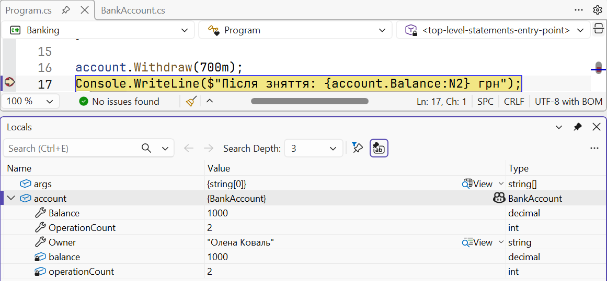

# Ініціалізатори, ToString і угоди

## Ініціалізатори об’єктів

**Ініціалізатор об’єкта** (*object initializer*) задає значення доступних властивостей одразу після створення об’єкта, у фігурних дужках: `new Book { Title = "Кобзар", Year = 1840 }`. Порядок виконання: спочатку конструктор, потім присвоєння з ініціалізатора в записаному порядку. Ініціалізатор можна поєднувати з конструктором із параметрами: `new Time(8) { … }`. Лише в ініціалізаторі (або конструкторі) можна задати властивості `init`, і лише там перевіряється наявність властивостей `required`.

## Метод `ToString` і перегляд об’єктів

Метод `ToString()` є в кожного об’єкта: його викликають `Console.WriteLine(obj)` та інтерпольовані рядки. За замовчуванням він повертає повну назву типу (`Book`), що малоінформативно. Клас може надати власну версію методу з ключовим словом `override` (детально – тема 9):

```cs
var book = new Book { Title = "Кобзар", Year = 1840 };
Console.WriteLine(book);              // «Кобзар» (1840)

class Book
{
    public string Title { get; init; } = "";
    public int Year { get; init; }

    public override string ToString() => $"«{Title}» ({Year})";
}
```

Налагоджувач також використовує `ToString` для короткого опису об’єкта. У вікні *Locals* об’єкт розгортається в перелік властивостей і полів (рис. 7.9). Автоматично створені поля властивостей мають імена на зразок `<Title>k__BackingField`; звичайне подання *Locals* може їх приховувати.



Рис. 7.9. Стан об’єкта у вікні *Locals* {.caption}

## Життєвий цикл об’єкта

Об’єкт живе в керованій купі, доки на нього є хоча б одне посилання зі змінних, полів інших об’єктів або елементів масивів. Коли посилань не залишилося, об’єкт стає недосяжним, і **збирач сміття** (*garbage collector*) рано чи пізно звільнить його пам’ять. Тому в C#, на відміну від C++, немає оператора `delete`: програміст не звільняє пам’ять вручну, і помилки на зразок звернення до вже звільненого об’єкта неможливі. Коли саме спрацює збирач сміття, заздалегідь невідомо; ресурси на зразок відкритих файлів звільняють явно (тема 16).

## Угоди іменування

- Класи, властивості, методи та публічні члени – PascalCase: `BankAccount`, `TotalMinutes`, `Deposit`; назва класу – іменник, назва методу – дієслово.
- Приватні поля – camelCase: `balance`; часто з префіксом підкреслення: `_balance`. В одному проєкті дотримуються одного стилю.
- Параметри та локальні змінні – camelCase.
- Один публічний клас – один файл із тією самою назвою.
