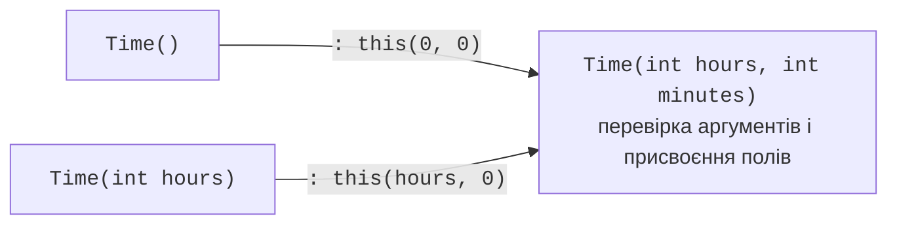

# Властивості та конструктори

## Властивості

**Властивість** (*property*) – член класу, який виглядає для користувача як поле, але має методи доступу `get` (читання) і `set` (запис). Властивості дозволяють перевіряти значення, обчислювати їх та обмежувати запис (<https://learn.microsoft.com/dotnet/csharp/programming-guide/classes-and-structs/properties>).

### Повна форма властивості

Повна форма використовує приватне **поле, що зберігає значення** (*backing field*). У методі `set` нове значення доступне через ключове слово `value`:

```cs
var product = new Item();
product.Price = 199.99m;
Console.WriteLine(product.Price);          // 199,99

try
{
    product.Price = -5m;
}
catch (ArgumentOutOfRangeException ex)
{
    Console.WriteLine(ex.ParamName);       // value
}

class Item
{
    private decimal price;

    public decimal Price
    {
        get => price;
        set
        {
            ArgumentOutOfRangeException.ThrowIfNegative(value);
            price = value;
        }
    }
}
```

Перевірка в `set` гарантує, що об’єкт ніколи не отримає некоректну ціну. Для властивостей помічник `ThrowIfNegative` записує в `ParamName` ім’я `value`.

### Автовластивості

Якщо перевірка не потрібна, властивість записують коротко: компілятор сам створює приховане поле. Методи доступу можуть мати власні модифікатори та варіанти:

```cs
// читання й запис
public string Title { get; set; } = "";
// лише читання: присвоїти можна в конструкторі
public string Isbn { get; }
// запис лише під час створення об’єкта
public int Year { get; init; }
// запис лише всередині класу
public decimal Balance { get; private set; }
// обов’язкова в ініціалізаторі об’єкта
public required string Name { get; init; }
```

- `init` – значення можна задати лише під час створення об’єкта: у конструкторі або ініціалізаторі об’єкта; пізніше змінити його не можна (помилка CS8852);
- `required` – властивість обов’язково має бути задана в ініціалізаторі об’єкта, інакше помилка компіляції CS9035. Так гарантують, що об’єкт не буде створено без важливих даних;
- значення за замовчуванням задають після `=` (`= "";`), щоб рядкова властивість не мала значення `null`.

### Обчислювані властивості

**Обчислювана** властивість не зберігає значення, а обчислює його щоразу з інших даних. Її записують як метод-вираз: `public double Area => Width * Height;`. Такі властивості не можуть «розійтися» з даними, від яких залежать.

### Ключове слово `field`

У C# 14 з’явилося ключове слово `field`: у методах доступу автовластивості воно позначає автоматично створене поле. Це дозволяє додати перевірку, не оголошуючи поле вручну (<https://learn.microsoft.com/dotnet/csharp/whats-new/csharp-14>):

```cs
public string Name
{
    get;
    set => field = string.IsNullOrWhiteSpace(value)
        ? throw new ArgumentException("Назва не може бути порожньою.")
        : value.Trim();
}
```

Повна форма з явним полем залишається основною в курсі: вона працює в усіх версіях мови й наочно показує, де зберігається стан. Форму з `field` використовують як коротшу альтернативу.

## Конструктори

**Конструктор** (*constructor*) – спеціальний метод, який викликається операцією `new` і приводить новий об’єкт у коректний початковий стан. Ім’я конструктора збігається з ім’ям класу, тип результату не вказується (<https://learn.microsoft.com/dotnet/csharp/programming-guide/classes-and-structs/constructors>).

- Якщо в класі немає жодного конструктора, компілятор створює **конструктор за замовчуванням** без параметрів, який залишає поля зі значеннями за замовчуванням.
- Щойно оголошено хоча б один конструктор, конструктор без параметрів автоматично не створюється.
- Конструктори можна **перевантажувати**: різні способи створити об’єкт.
- Конструктор перевіряє аргументи й генерує виняток, якщо об’єкт неможливо створити коректним.

Щоб не повторювати перевірки в кожному перевантаженні, конструктори з меншою кількістю параметрів викликають основний конструктор через **ланцюжок** `: this(…)` (рис. 7.7). Спочатку виконується викликаний конструктор, потім – тіло поточного.



Рис. 7.7. Ланцюжок конструкторів {.caption}

```cs
public Time(int hours, int minutes) { /* перевірка й присвоєння */ }
public Time(int hours) : this(hours, 0) { }
public Time() : this(0, 0) { }
```

Visual Studio генерує конструктор з обраних полів і властивостей: встановіть курсор у класі, натисніть **Ctrl+.** і оберіть *Generate constructor…* (рис. 7.8).


Рис. 7.8. Генерування конструктора з властивостей {.caption}

### Первинні конструктори

**Первинний конструктор** (*primary constructor*, C# 12) записують параметрами одразу після імені класу: `class Sensor(string location, Temperature temperature)`. Параметри доступні в усьому тілі класу: у властивостях, методах та ініціалізаторах. Особливості:

- параметри первинного конструктора **не є полями** й **не є властивостями**: до них не можна звернутися ззовні чи через `this` (`this.location` – помилка CS1061);
- щоб зробити значення доступним ззовні, його присвоюють властивості: `public string Location { get; } = location;`;
- параметри не перевіряються автоматично; перевірку записують в ініціалізаторі властивості або в іншому конструкторі, який мусить викликати первинний через `: this(…)`.

Первинні конструктори зручні для невеликих класів, які просто зберігають передані значення. Якщо потрібні складні перевірки, використовують звичайний конструктор.
