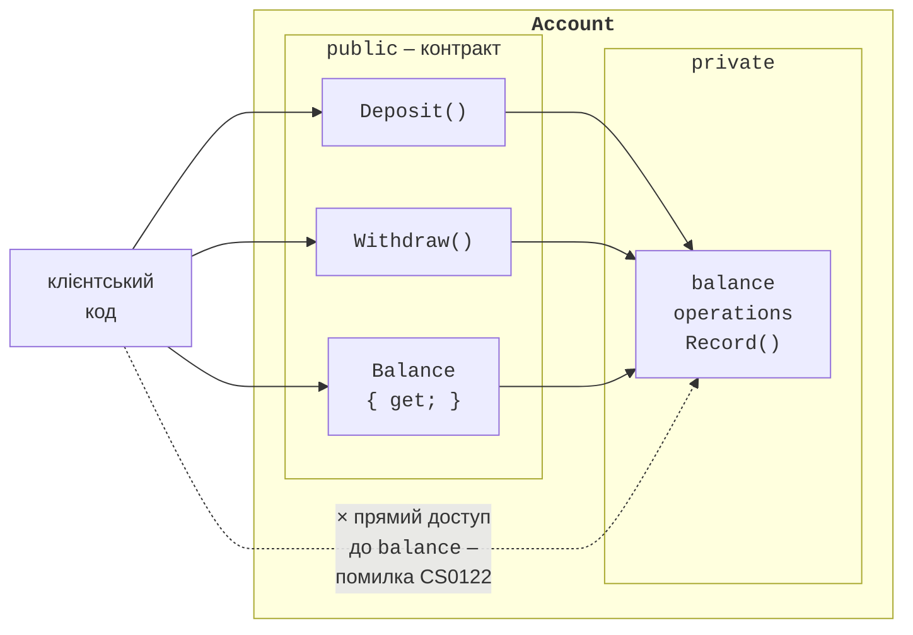
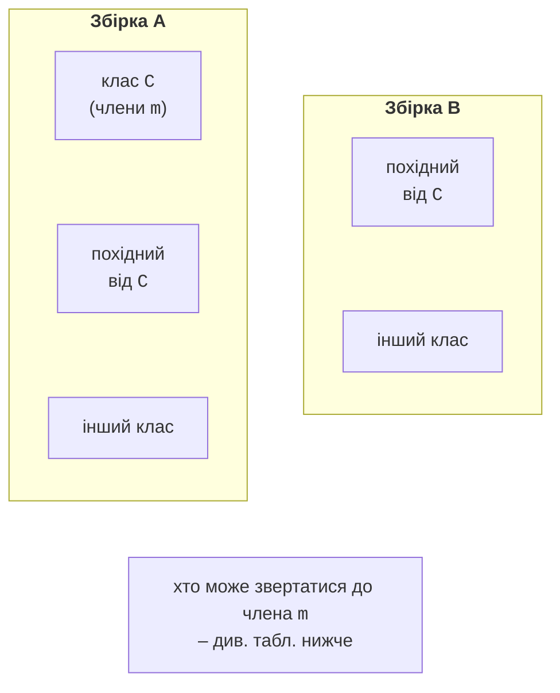
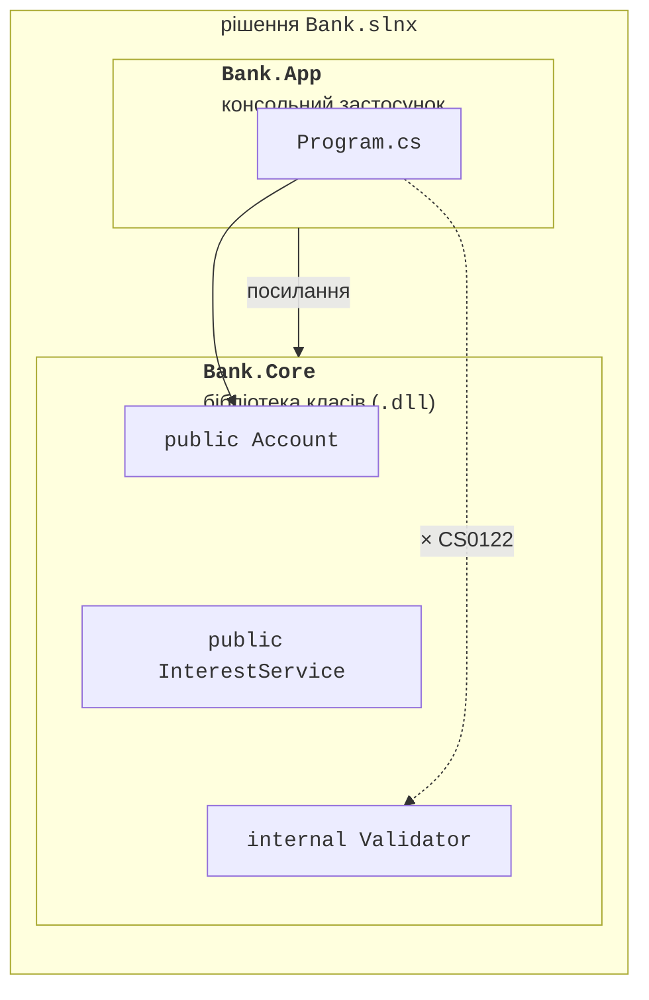
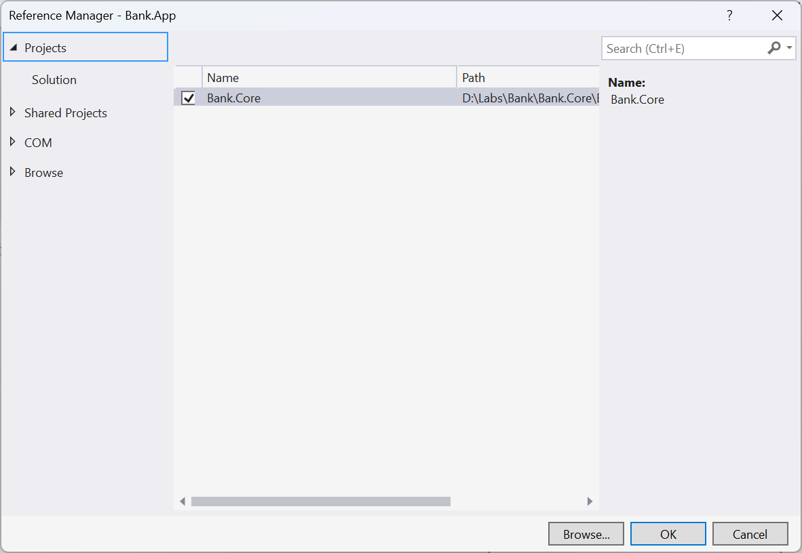
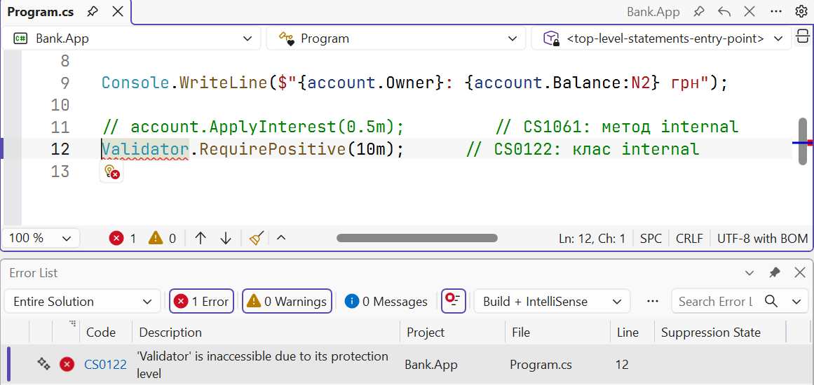

# Інкапсуляція та модифікатори доступу

## Інкапсуляція

**Інкапсуляція** (*encapsulation*) – один з основних принципів ООП: клас **приховує** свій внутрішній стан і деталі реалізації, а назовні надає лише **публічний контракт** – набір методів і властивостей, через які з об’єктом можна працювати (рис. 8.1).



Рис. 8.1. Інкапсуляція: публічний контракт і прихований стан {.caption}

Інкапсуляція потрібна, щоб об’єкт завжди перебував у коректному стані. Умова, яка має виконуватися для кожного об’єкта класу протягом усього його життя, називається **інваріантом класу**: «баланс рахунку не від’ємний», «кінець події не раніше за початок», «кількість товару не перевищує місткість складу». Якщо поле `balance` публічне, будь-який рядок програми може записати −1000, і інваріант буде порушено. Якщо поле приватне, змінити баланс можна лише методами `Deposit` і `Withdraw`, які перевіряють умову, – порушення стає **неможливим**.

Інші переваги інкапсуляції:

- **свобода змін**: внутрішню реалізацію (масив замість кількох полів, інший спосіб обчислення) можна змінити, не змінюючи код, який використовує клас;
- **простота використання**: користувачеві класу не потрібно знати, як він влаштований;
- **локалізація помилок**: якщо стан некоректний, помилку шукають лише в методах самого класу.

Тому **поля роблять приватними**, а доступ до даних надають через властивості й методи.

## Модифікатори доступу

Модифікатори доступу визначають, звідки можна звертатися до типу або члена типу (<https://learn.microsoft.com/dotnet/csharp/programming-guide/classes-and-structs/access-modifiers>). Області доступу показано на рис. 8.2 і в табл. 8.1.



Рис. 8.2. Області видимості: клас, похідні класи та збірки {.caption}

Таблиця 8.1. Доступ до члена `m` класу `C` залежно від модифікатора {.caption}

| **Модифікатор** | **Сам клас** | **Похідний, A** | **Інший, A** | **Похідний, B** | **Інший, B** |
| --- | --- | --- | --- | --- | --- |
| `public` | так | так | так | так | так |
| `protected internal` | так | так | так | так | ні |
| `internal` | так | так | так | ні | ні |
| `protected` | так | так | ні | так | ні |
| `private protected` | так | так | ні | ні | ні |
| `private` | так | ні | ні | ні | ні |

- `public` – доступ без обмежень;
- `private` – лише всередині класу;
- `internal` – у межах **збірки** (проєкту);
- `protected` – у класі та його **похідних** класах, навіть з іншої збірки;
- `protected internal` – у межах збірки **або** в похідних класах;
- `private protected` – у похідних класах **тієї самої** збірки.

Три варіанти з `protected` стосуються наслідування й детально розглядаються в темі 9. Окремо існує модифікатор `file` для типів (C# 11): тип видимий лише у файлі, де його оголошено.

**Доступ за замовчуванням.** Якщо модифікатор не вказано, то **члени** класу (поля, методи, властивості, вкладені типи) є `private`, а **типи** верхнього рівня (класи, не вкладені в інші класи) – `internal`. Член не може бути доступнішим за свій тип: `public`-метод `internal`-класу фактично доступний лише в межах збірки. Спроба звернутися до недоступного члена спричиняє помилку CS0122 *is inaccessible due to its protection level*.

## Збірка як межа доступу

**Збірка** (*assembly*) – результат компіляції одного проєкту: файл `.dll` або `.exe` (тема 1). Модифікатор `internal` дозволяє класам однієї збірки співпрацювати, приховуючи допоміжні типи від інших збірок. Це стає важливим, коли програма складається з кількох проєктів: наприклад, **бібліотеки класів** (*class library*) з логікою предметної області та консольного застосунку, який її використовує (рис. 8.3). Така структура дозволяє використовувати ту саму бібліотеку в різних застосунках і в проєкті модульних тестів (тема 18) (<https://learn.microsoft.com/dotnet/core/tutorials/library-with-visual-studio>).



Рис. 8.3. Рішення з консольним застосунком і бібліотекою класів {.caption}

Рішення з двох проєктів створюють у Visual Studio: клацання правою кнопкою на рішенні в *Solution Explorer* → *Add → New Project…* → шаблон *Class Library* (рис. 8.4), а потім клацання правою кнопкою на консольному проєкті → *Add → Project Reference…* і позначка бібліотеки (рис. 8.5). Ті самі дії в dotnet CLI:

```
dotnet new sln -n Bank
dotnet new classlib -n Bank.Core
dotnet new console -n Bank.App
dotnet sln add Bank.Core Bank.App
dotnet add Bank.App reference Bank.Core
dotnet run --project Bank.App
```


Рис. 8.4. Створення проєкту бібліотеки класів {.caption}



Рис. 8.5. Додавання посилання на проєкт {.caption}

Посилання записується у файл консольного проєкту елементом `ProjectReference`:

```xml
<ItemGroup>
  <ProjectReference Include="..\Bank.Core\Bank.Core.csproj" />
</ItemGroup>
```

Якщо в консольному проєкті звернутися до `internal`-класу бібліотеки, компілятор повідомить про помилку CS0122 (рис. 8.6).



Рис. 8.6. Помилка доступу до `internal`-класу {.caption}
