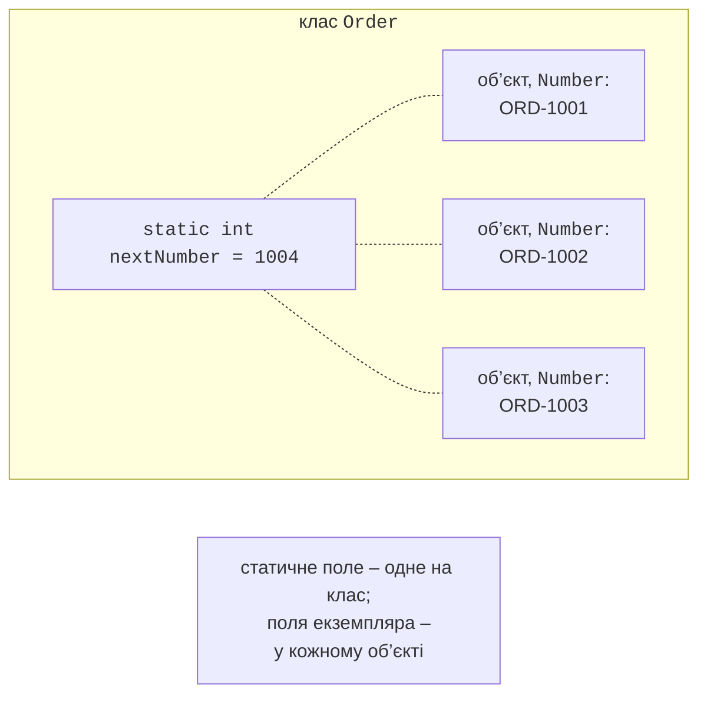
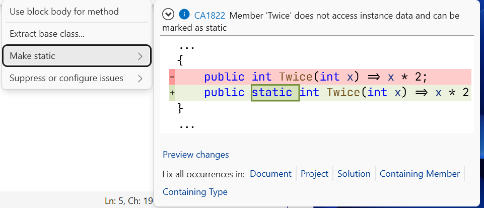

# Статичні члени та простори імен

## Статичні члени

**Статичний** член (модифікатор `static`) належить **класу**, а не окремому об’єкту (<https://learn.microsoft.com/dotnet/csharp/programming-guide/classes-and-structs/static-classes-and-static-class-members>):

- **статичне поле** існує в **одному** екземплярі для всього класу, незалежно від кількості об’єктів (рис. 8.7). Його використовують для лічильників створених об’єктів, генераторів номерів, спільних налаштувань;
- **статичний метод** викликають через ім’я класу (`Math.Sqrt(2)`, `int.Parse(text)`); він не має доступу до `this` і до полів екземпляра, бо не пов’язаний з жодним об’єктом (помилка CS0120, якщо звернутися до члена екземпляра);
- **статична властивість** дає доступ до статичних даних: `DateTime.Now`, `Order.CreatedCount`.



Рис. 8.7. Статичне поле та поля екземплярів {.caption}

Метод, який не використовує жодних даних об’єкта, варто зробити статичним: це показує, що він не змінює стан. Visual Studio підказує таку можливість (рис. 8.8).



Рис. 8.8. Пропозиція зробити метод статичним {.caption}

### Статичний конструктор

**Статичний конструктор** (`static ClassName() { … }`) ініціалізує статичні поля. Він не має модифікаторів доступу й параметрів, викликається автоматично **один раз** перед першим створенням об’єкта або першим зверненням до статичного члена, і його не можна викликати явно (<https://learn.microsoft.com/dotnet/csharp/programming-guide/classes-and-structs/static-constructors>). Порядок: спочатку ініціалізатори статичних полів, потім тіло статичного конструктора, і лише потім – звичайний конструктор першого об’єкта. Якщо статичний конструктор генерує виняток, клас стає непридатним до кінця роботи програми, тому складної логіки в ньому уникають.

### Статичні класи та `using static`

**Статичний клас** (`static class`) містить лише статичні члени; створити його об’єкт неможливо. Так оформлюють набори допоміжних функцій, не пов’язаних зі станом: `Math`, `Console`, `Convert`, власні класи перевірок і перетворень. Директива `using static` дозволяє викликати статичні члени без імені класу:

```cs
using static System.Math;

Console.WriteLine(Sqrt(Pow(3, 2) + Pow(4, 2)));   // 5
Console.WriteLine(Round(PI, 3));                  // 3,142
```

Статичні класи зручні, але їх не варто використовувати для даних, які змінюються: **глобальний змінний стан** (статичні поля, які змінюють різні частини програми) ускладнює розуміння та тестування коду.

## Фабричні методи та закриті конструктори

Якщо об’єкт можна створити кількома способами з параметрами **однакових типів** (температура в °C, °F або K – усе `double`), перевантаження конструкторів неможливе. Тоді конструктор роблять `private`, а об’єкти створюють **статичними фабричними методами** зі зрозумілими назвами: `Temperature.FromCelsius(36.6)`, `TimeSpan.FromMinutes(90)`. Фабричний метод також може повернути вже наявний об’єкт або повідомити про невдачу без винятку за шаблоном `TryCreate` чи `TryParse`. Приклад такого класу наведено в лабораторній роботі.

## Простори імен та організація проєкту

**Простір імен** (`namespace`) групує пов’язані типи й запобігає конфліктам імен. За угодою простір імен збігається з назвою проєкту та структурою папок: клас у файлі `Bank.Core/Models/Account.cs` має простір імен `Bank.Core.Models`. Типи з іншого простору імен підключають директивою `using` або повним ім’ям.

Рекомендації щодо організації коду:

- один публічний тип – один файл з тією самою назвою;
- класи предметної області – у бібліотеці класів, введення-виведення – у застосунку;
- `internal` для допоміжних типів, які не є частиною контракту бібліотеки.

Модифікатор `partial` дозволяє розділити оголошення одного класу на кілька файлів (`partial class Report`). Його використовують переважно для коду, частину якого генерують інструменти (конструктори форм, генератори коду), і не використовують, щоб «сховати» надто великий клас – такий клас краще розділити на кілька.
