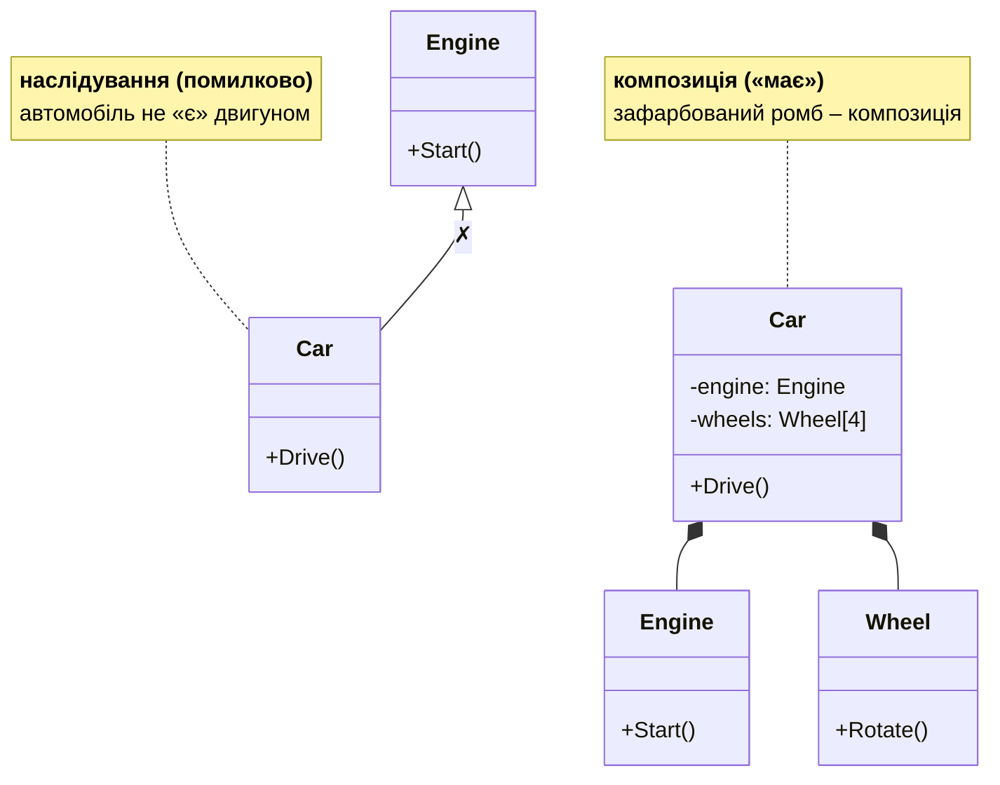

# Приведення, sealed і композиція

## Приведення типів

Присвоєння об’єкта похідного класу змінній базового типу – **приведення вгору** (*upcasting*) – завжди безпечне й виконується неявно. **Приведення вниз** (*downcasting*) до похідного типу потребує перевірки, бо об’єкт може мати інший тип:

- `(Circle)shape` – явне приведення; якщо об’єкт не `Circle`, виникає `InvalidCastException`;
- `shape is Circle` – перевірка типу (`true` також для нащадків `Circle`);
- `shape is Circle c` – **шаблон типу**: перевірка й оголошення змінної `c` одночасно;
- `shape as Circle` – приведення, яке повертає `null` замість винятку;
- **шаблон властивостей** `shape is Rect { Width: > 1 } r` – тип і умови на властивості.

Вираз `switch` за типами дозволяє обрати дію залежно від фактичного типу:

```cs
string info = shape switch
{
    Circle c => $"круг, r = {c.Radius}",
    Rect { Width: var w, Height: var h } when w == h =>
        $"квадрат {w}",
    Rect r => $"прямокутник {r.Width} × {r.Height}",
    null => "немає фігури",
    _ => shape.GetType().Name,
};
```

**Віртуальний метод чи `switch` за типами?** Якщо нові **типи** додаються часто, краще віртуальний метод: новий клас приносить свою реалізацію, і наявний код не змінюється. Якщо часто додаються нові **операції** над фіксованим набором типів, які неможливо змінити, зручніший `switch`. У більшості програм курсу перевагу віддають віртуальним методам.

## Запечатані класи та методи

Модифікатор `sealed` забороняє наслідування класу (помилка CS0509 для спроби наслідувати) або подальше перевизначення методу (`public sealed override string Speak()`) (<https://learn.microsoft.com/dotnet/csharp/language-reference/keywords/sealed>). Класи запечатують, коли їх поведінку не призначено змінювати: наприклад, `string` запечатаний, щоб будь-який рядок гарантовано був незмінним і коректно працював у словниках. Запечатаний клас також трохи ефективніший, бо виклики його методів не потребують пізнього зв’язування. Якщо клас не проєктувався для наслідування, корисно позначати його `sealed`.

## Власні класи винятків

Власний виняток – клас, похідний від `Exception` (тема 6). За рекомендаціями .NET назва закінчується на `Exception`, а клас містить три стандартні конструктори: без параметрів, з повідомленням і з повідомленням та внутрішнім винятком (<https://learn.microsoft.com/dotnet/standard/exceptions/how-to-create-user-defined-exceptions>). Додаткові дані про помилку зберігають у властивостях, як `Shortage` у прикладі «Рахунки та власний виняток». Ієрархія винятків дозволяє перехоплювати групи помилок: блок `catch` для типу `BankException` перехопить усі винятки, похідні від нього.

## Композиція проти наслідування

**Композиція** (*composition*) – об’єкт містить інші об’єкти як поля й використовує їх: автомобіль **має** двигун і колеса (відношення **«має»**, *has-a*). Наслідування ж створює тісний зв’язок: похідний клас залежить від деталей реалізації базового, і зміна базового класу може непомітно зламати похідні (**проблема крихкого базового класу**). Тому поширене правило: **надавайте перевагу композиції**, а наслідування використовуйте, лише коли справді є відношення «є» й потрібен поліморфізм (рис. 9.9).



Рис. 9.9. Наслідування та композиція {.caption}

На UML-діаграмах класів використовують такі відношення:

- **узагальнення** (наслідування) – суцільна лінія з порожнім трикутником;
- **асоціація** – суцільна лінія: класи пов’язані (студент відвідує курс);
- **агрегація** – лінія з порожнім ромбом біля цілого: частини можуть існувати окремо (кафедра та викладачі);
- **композиція** – лінія із зафарбованим ромбом біля цілого: частини не існують без цілого (замовлення та його рядки).
